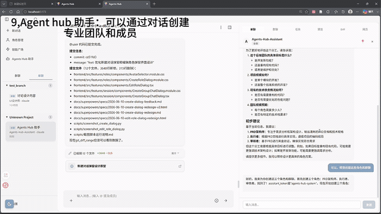
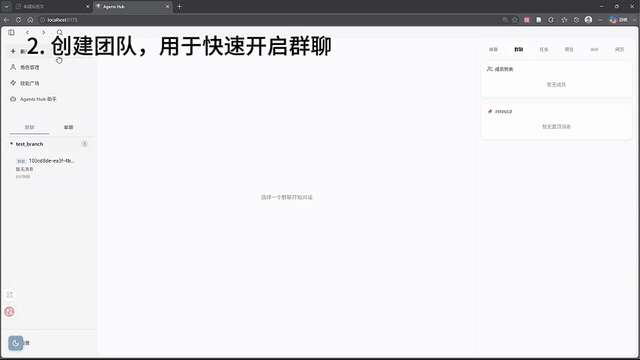
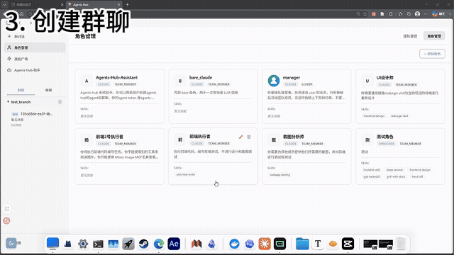
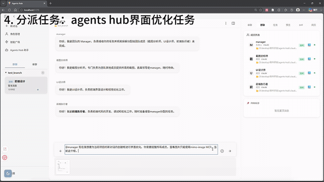
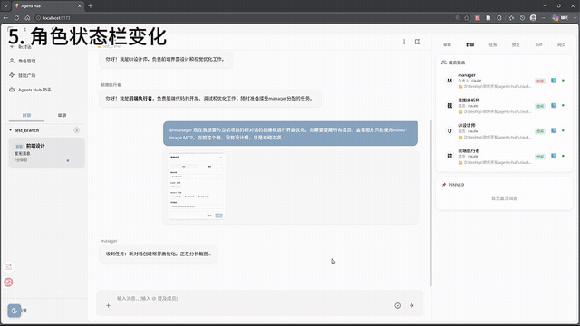
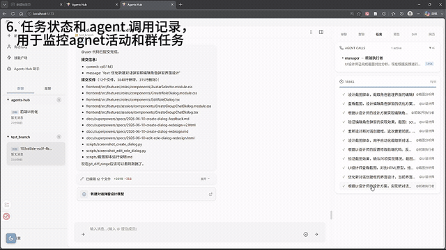
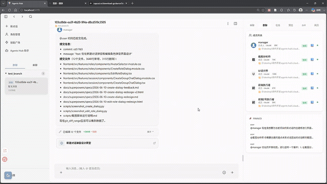
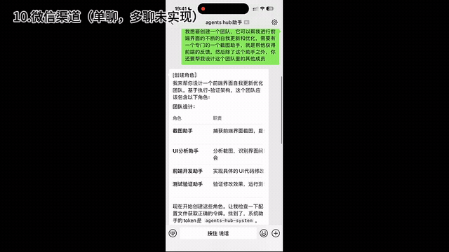

# Agents Hub

> AI 全栈挑战赛项目 —— 多 Agent IM 聊天协作平台

Agents Hub 是一个以 Claude Code / Codex / OpenCode 为基础的多 Agent 聊天协作平台。通过 IM 聊天的方式与多个 AI Agent 交互，实现代码开发、预览、部署等任务。

## 架构概览

<div align="center">

```
┌─────────────────────────────────────────────────────┐
│                   前端 (React + Electron)            │
└─────────────────────┬───────────────────────────────┘
                      │ WebSocket
                      ↓
┌─────────────────────────────────────────────────────┐
│              FastAPI + WebSocket                     │
└─────────────────────┬───────────────────────────────┘
                      │
┌─────────────────────────────────────────────────────┐
│                 agents-hub 中间层                     │
│  ┌─────────────────────────────────────────────────┐│
│  │ MCP Server  ← 暴露 tools 给 Agent 平台          ││
│  └─────────────────────┬───────────────────────────┘│
│                        ↓                            │
│  ┌─────────────────────────────────────────────────┐│
│  │ Core: 消息路由 / 群聊编排 / 上下文管理           ││
│  └─────────────────────┬───────────────────────────┘│
│                        ↓                            │
│  ┌─────────────────────────────────────────────────┐│
│  │ Agent Bridge: Claude Code / Codex / OpenCode    ││
│  └─────────────────────────────────────────────────┘│
└─────────────────────────────────────────────────────┘
```

</div>

## 功能特性

<div align="center">



</div>

### 角色管理

- 支持创建 **OpenCode、Codex、Claude Code** 三种平台的角色
- 支持编辑角色的头像、技能和工具（工具编辑仅 Claude Code 支持）

### 团队

- 创建团队用于快速启动群聊，预设成员组合

<div align="center">



</div>

### 群聊协作

- **Manager 调度**：Manager 自动拆解任务，分派给 Worker 执行
- **状态显示**：实时展示每个 Agent 的执行状态
- **Docker 隔离**：支持为每个 Agent 开启独立的 Docker 隔离环境
- **消息置顶**：支持 PIM/PIN 群消息置顶
- **产物预览**：支持预览网页、文档、代码 diff

<div align="center">







</div>

### 单聊模式

支持与群聊中的 Agent 单独聊天，或创建全新的 Agent。三种单聊模式：

| 模式 | 说明 | 状态 |
|------|------|------|
| **全新创建** | 创建独立 Agent 进行对话 | ✅ 已实现 |
| **Fork** | 基于群聊中某 Agent 的对话上下文继续 | ✅ 已实现 |
| **Continue** | Agent 遇到疑问时暂停并申请单聊，或用户主动发起单聊请求，用于需求澄清、设计澄清 | 🚧 未实现 |

<div align="center">


</div>

### 其他功能

- 通过聊天创建成员和群聊
- 微信单聊支持（群聊暂未实现）

<div align="center">



</div>

## 下一步计划：编排机制更新，与专业agent培养

### Agent 生命周期 Hook

提供 `before agent call` 和 `finish agent call` 两个 Hook 点，支持自动化流程编排：

| Hook | 触发时机 | 典型用途 |
|------|---------|---------|
| `before_agent_call` | Agent 被调用前 | 自动上下文压缩、注入系统提示词、权限校验 |
| `finish_agent_call` | Agent 执行完成后 | 自动审查输出、产物归档、触发后续流程 |

### 桌面端配置

支持通过桌面端（Electron）进行可视化配置，包括 Agent 参数、Hook 规则、团队模板等。

### 提示词优化

加强 Agent 约束机制，通过结构化提示词规范 Agent 行为边界、输出格式和协作协议。

### 记忆助手与专业化Agent体系

多Agent team的核心优势在于**专业性**，而专业性需要**记忆积累**。目标是让Agent每次不会从0开始。

#### 记忆助手（跨群聊）

活跃于各个群聊，收集信息，产出两个记忆库：

| 收集内容 | 说明 |
|---------|------|
| AI犯过的错误 | 用于规则编写 |
| 用户的偏好、设计理念、审美 | 用于AI自主决策 |
| 用户的决策 | 记录用户决策依据 |
| AI做得不对的地方 | 用户认为AI决策有误的情况 |
| 专业知识积累 | 领域知识沉淀 |

**产出两个记忆库**：
- **AI犯错记忆库**：用于规则编写
- **用户决策记忆库**：用于AI自主决策

**Skill读写分离**：
- 写入端：`ai-mistake-recorder`、`write-decisions`
- 读取端：`write-project-rules`、`ai-decision-making`

#### 三个特殊AI

| AI角色 | 职责 |
|--------|------|
| **记忆助手** | 跨群收集数据，产出两个记忆库 |
| **规则编写助手** | 依据AI犯错记录 + 项目架构，搭配架构师设计规则（独立的专业化agent） |
| **用户决策记忆库** | 供Manager做决策时参考 |

#### Manager的额外Skill

| Skill | 用途 |
|-------|------|
| `progress-tracker` | 长期任务追踪、用户想法记录 |
| `parallel-worktree` | 任务排序，区分并行/串行，建立多个Work Tree分配给子agent |

#### 学习小组

| Skill | 用途 |
|-------|------|
| `knowledge-research` | 知识查询 |
| `knowledge-learning` | 学习 |

#### Agent Hook：上下文压缩机制

| Skill | 用途 |
|-------|------|
| `hand-off` | 交接（显式总结当前上下文） |
| `hand-on` | 接手（从交接文档恢复上下文） |

全局指令可让所有agent进行任务交接。交接对象是自己，因为agent无法通过CLI工具进行compact，只能通过显式交接实现上下文压缩。

#### 完整链路

```
新项目启动
    ↓
架构Agent + 规则编写Agent → 搭建框架 + 建立初始规则
    ↓
开发过程
    ↓
┌───────────────────────────────────────────────────────┐
│  AI犯错 → ai-mistake-recorder → AI犯错记忆库          │
│              ↓                                        │
│        write-project-rules → 更新CLAUDE.md（闭环）     │
│                                                       │
│  用户决策 → ai-decision-making → 用户决策记忆库        │
│              ↓                                        │
│        write-decisions → 记录决策文档                  │
└───────────────────────────────────────────────────────┘
    ↓
Manager做决策时 ← 参考用户决策记忆库
    ↓
任务执行：progress-tracker收集 → parallel-worktree并行执行
    ↓
上下文压缩：hand-off / hand-on
```

## 应用场景

### Agent 训练室

多个 Agent 通过知识搜索和讨论来互相约束，共同完成 Agent 配置：

- 设定提示词模板和执行边界
- 注入专业知识库
- 多 Agent 协作验证配置合理性

### 知识调研团队

- **知识调研**：负责知识调研、生成教学大纲等内容
- **教学执行**：基于大纲完成教学任务

### 强制性多 Agent Loop

设计一个代码级强制约束的多 Agent 循环架构，替代自由度较高的 Manager 调度：

- Manager 只负责处理任务报错和初始 Loop 建立
- 通过代码强制约束的 Loop 驱动任务完成
- 比单独的 Manager 协调安排更可靠、更可预测

## 技术栈

| 层 | 技术 |
|----|------|
| 前端 | React + TypeScript + Electron |
| 后端 | Python + FastAPI + WebSocket |
| Agent 通信 | MCP (Model Context Protocol) |
| Agent 平台 | Claude Code、Codex、OpenCode |

## 快速开始

```bash
# 安装依赖
pip install -e ".[dev]"
cd frontend && npm install

# 启动后端
start-backend.ps1

# 启动前端
cd frontend && npm run dev
```

## License

MIT
