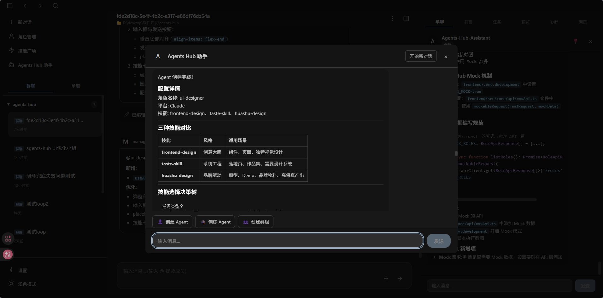
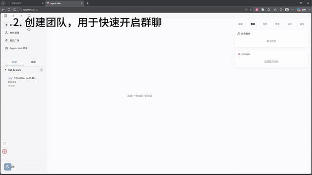
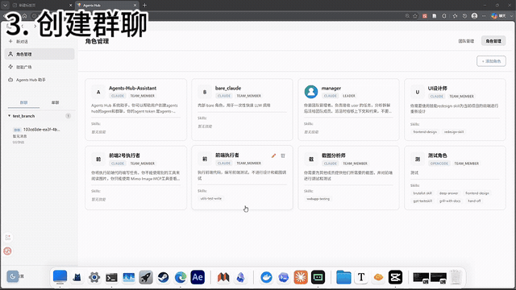
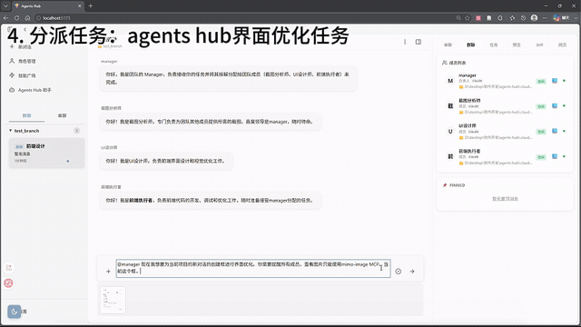
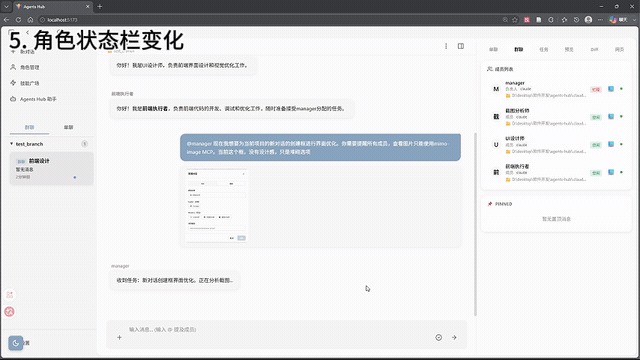
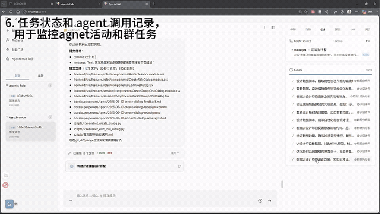
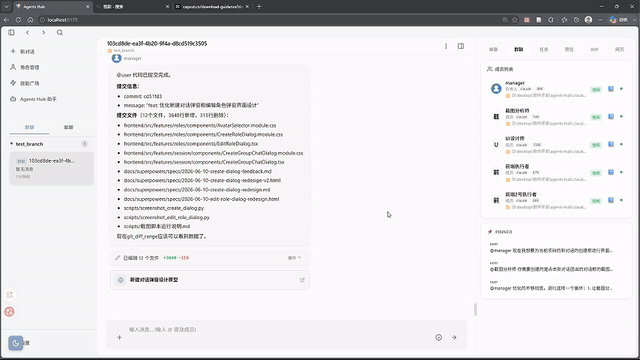
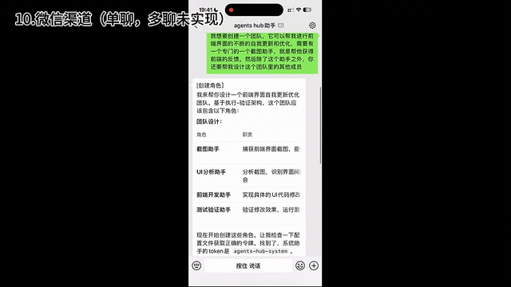

# Agents Hub

> AI 全栈挑战赛项目 —— 多 Agent IM 聊天协作平台

Agents Hub 是一个以 Claude Code / Codex / OpenCode 为基础的多 Agent 聊天协作平台。通过 IM 聊天的方式与多个 AI Agent 交互，实现代码开发、预览、部署等任务。

## 架构概览

<div align="center">

```
┌─────────────────────────────────────────────────────┐
│                   前端 (React + Electron)            │
└─────────────────────┬───────────────────────────────┘
                      │ WebSocket
                      ↓
┌─────────────────────────────────────────────────────┐
│              FastAPI + WebSocket                     │
└─────────────────────┬───────────────────────────────┘
                      │
┌─────────────────────────────────────────────────────┐
│                 agents-hub 中间层                     │
│  ┌─────────────────────────────────────────────────┐│
│  │ MCP Server  ← 暴露 tools 给 Agent 平台          ││
│  └─────────────────────┬───────────────────────────┘│
│                        ↓                            │
│  ┌─────────────────────────────────────────────────┐│
│  │ Core: 消息路由 / 群聊编排 / 上下文管理           ││
│  └─────────────────────┬───────────────────────────┘│
│                        ↓                            │
│  ┌─────────────────────────────────────────────────┐│
│  │ Agent Bridge: Claude Code / Codex / OpenCode    ││
│  └─────────────────────────────────────────────────┘│
└─────────────────────────────────────────────────────┘
```

</div>

## 功能特性

<div align="center">



</div>

### 角色管理

- 支持创建 **OpenCode、Codex、Claude Code** 三种平台的角色
- 支持编辑角色的头像、技能和工具（工具编辑仅 Claude Code 支持）

### 团队

- 创建团队用于快速启动群聊，预设成员组合

<div align="center">



</div>

### 群聊协作

- **Manager 调度**：Manager 自动拆解任务，分派给 Worker 执行
- **状态显示**：实时展示每个 Agent 的执行状态
- **Docker 隔离**：支持为每个 Agent 开启独立的 Docker 隔离环境
- **消息置顶**：支持 PIM/PIN 群消息置顶
- **产物预览**：支持预览网页、文档、代码 diff
- **群聊生命周期控制**：支持停止、启动、重置群聊，随时掌控协作节奏
- **上下文压缩**：支持手动压缩群聊上下文，降低 token 消耗
- **Agent Session 查看**：查看任意 Agent 的 session 内容，掌握 Agent 的具体动向
- **群聊 Fork / 删除**：Fork 群聊保留上下文继续新方向，或删除不再需要的群聊
- **Agent 循环（Loop）**：Manager 帮助用户创建多 Agent 循环执行流程，通过代码级约束驱动任务自动完成

<div align="center">







</div>

### 单聊模式

支持与群聊中的 Agent 单独聊天，或创建全新的 Agent。三种单聊模式：

| 模式 | 说明 | 状态 |
|------|------|------|
| **全新创建** | 创建独立 Agent 进行对话 | ✅ 已实现 |
| **Fork** | 基于群聊中某 Agent 的对话上下文继续 | ✅ 已实现 |
| **Continue** | Agent 遇到疑问时暂停并申请单聊，或用户主动发起单聊请求，用于需求澄清、设计澄清 | 🚧 未实现 |

<div align="center">


</div>

### Agents Hub 助手

- **Agent Trainer**：为每个 Agent 进行专属训练优化。通过搜索领域最佳实践，为 Agent 创建元规则（思考方式、行为准则）和领域知识库，支持通用领域和项目专用两种训练模式。详见 `template/skills/agent-trainer/`

### 其他功能

- 通过聊天创建成员和群聊
- 微信单聊支持（群聊暂未实现）

<div align="center">



</div>


## 技术栈

| 层 | 技术 |
|----|------|
| 前端 | React + TypeScript + Electron |
| 后端 | Python + FastAPI + WebSocket |
| Agent 通信 | MCP (Model Context Protocol) |
| Agent 平台 | Claude Code、Codex、OpenCode |

## 快速开始

```bash
# 安装依赖
pip install -e ".[dev]"
cd frontend && npm install

# 启动后端
start-backend.ps1

# 启动前端
cd frontend && npm run dev
```

## License

MIT
