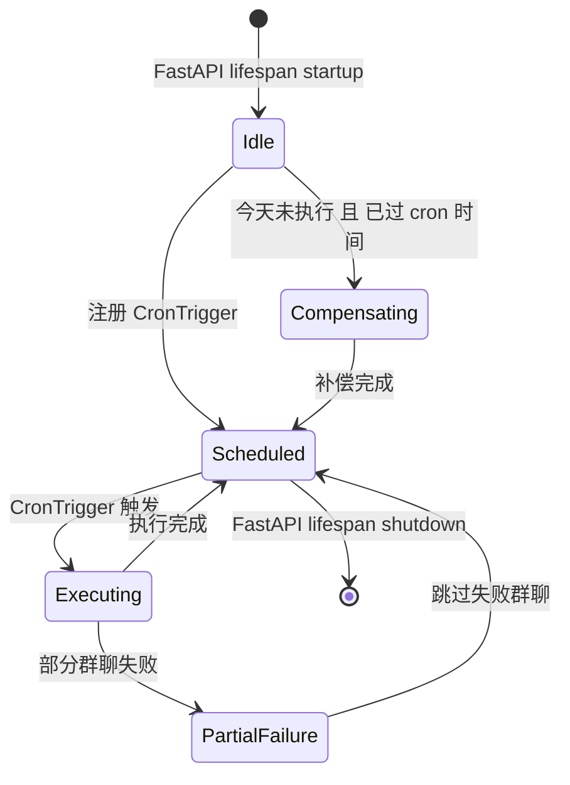

## 版本

| 版本 | 更新内容 |
| ---- | -------- |
| 1.0 | 创建 flow 初稿 |

# 数据流：Scheduler 生命周期

**Flow 对象**：Scheduler（定时记忆助手调度系统）
**对应 Spec**：`docs/specs/2026-06-24-scheduler.md`

## Scheduler 数据结构

```python
@dataclass
class SchedulerService:
    # 核心组件
    _scheduler: AsyncIOScheduler      # APScheduler 实例
    _state_manager: StateManager      # 状态文件管理器
    _memory_task: MemoryTask          # 记忆任务执行器
    _running: bool                    # 运行状态标志（防重入）

    # 异步任务引用
    _compensation_task: asyncio.Task | None  # 补偿任务引用
```

```python
@dataclass
class StateManager:
    # 文件路径
    _schedule_state_path: Path   # .schedule_state.json
    _memory_index_path: Path     # memory/index.json
    _result_path: Path           # memory/result.json
```

```python
@dataclass
class MemoryTask:
    # 执行记忆收集的组件
    # 通过 agent_platform_client.execute 直接执行记忆助手 Agent
```

**关键字段说明**：
- `SchedulerService._running`：防止补偿任务和定时任务重入的状态标志
- `SchedulerService._compensation_task`：补偿任务的 asyncio.Task 引用，通过 `add_done_callback` 监控异常
- `StateManager._schedule_state_path`：调度状态持久化路径，记录最后一次执行时间

## 与其他数据流的耦合

### Scheduler ↔ Config

**Config 配置字段**：
- `memory_task_cron_hour`：记忆任务执行小时（0-23，默认 10）
- `memory_task_cron_minute`：记忆任务执行分钟（0-59，默认 0）
- `memory_path`：记忆文件存储路径
- `default_memory_assistant_name`：记忆助手角色名
- `assistant_token`：系统助手统一 token

**耦合关系**：

| Scheduler 操作 | Config 影响 | 触发位置 |
|---------------|------------|---------|
| 读取 cron 时间 | `config.memory_task_cron_time` | `SchedulerService.start()` |
| 读取记忆路径 | `config.memory_path` | `StateManager.__init__()` |
| 验证记忆助手身份 | `config.default_memory_assistant_name` | `get_memory_context()` |

### Scheduler ↔ GroupChatManager

**耦合关系**：

| Scheduler 操作 | GroupChatManager 影响 | 触发位置 |
|---------------|---------------------|---------|
| 获取活跃群聊列表 | `group_chat_manager.get_active_group_chats()` | `SchedulerService._execute_memory_task()` |
| Token 验证 | `group_chat_manager.resolve_token()` | `get_memory_context()` |

### Scheduler ↔ Agent Platform Client

**耦合关系**：

| Scheduler 操作 | Agent Platform 影响 | 触发位置 |
|---------------|-------------------|---------|
| 执行记忆助手 | `agent_platform_client.execute()` | `MemoryTask.execute()` |

<key_function last_update="2026-06-24T10:00:00+08:00">
- agents_hub/scheduler/scheduler_service.py
  - scheduler_service.SchedulerService.start:29
  - scheduler_service.SchedulerService.shutdown:44
  - scheduler_service.SchedulerService._execute_memory_task:60
  - scheduler_service.SchedulerService._run_compensation:88
- agents_hub/scheduler/state_manager.py
  - state_manager.StateManager.load_schedule_state:18
  - state_manager.StateManager.save_schedule_state:25
  - state_manager.StateManager.should_execute_today:46
  - state_manager.StateManager.append_results:55
- agents_hub/scheduler/task/memory_task.py
  - memory_task.MemoryTask.execute:15
- agents_hub/mcp/server.py
  - server.get_memory_context:1464
- agents_hub/api/app.py
  - app.lifespan:启动时调用 scheduler_service.start()
</key_function>

## 流程概览



## 数据流节点

**业务场景说明**：
1. **启动与补偿**：服务启动 → 检查今天是否已执行 → 若未执行则补偿
2. **定时执行**：CronTrigger 触发 → 遍历群聊 → 执行记忆收集 → 更新状态
3. **记忆助手执行**：记忆助手 Agent 调用 `get_memory_context` → 获取上下文 → 生成记忆文件

## 链路 1：启动与补偿

1. `SchedulerService.start()`
   启动调度器，幂等操作
   状态: 未启动 → 已启动 | 持久化: ❌ | 跨模块: ❌
   步骤: 检查 _running 标志 → 加载调度状态 → 判断是否需要补偿 → 注册 CronTrigger

2. `StateManager.should_execute_today()`
   判断今天是否需要执行记忆任务
   状态: ❌ | 持久化: ✅ 读取 .schedule_state.json | 跨模块: ❌
   步骤: 读取 memory_task 字段 → 提取日期部分 → 与今天比较 → 返回 True/False

3. `SchedulerService._run_compensation()`
   补偿执行：已过 cron 时间但今天未执行时触发
   状态: ❌ | 持久化: ❌ | 跨模块: ❌
   步骤: 创建 asyncio.Task → 保存引用到 _compensation_task → 添加 done_callback 监控异常

## 链路 2：定时执行

1. `SchedulerService._execute_memory_task()`
   执行记忆更新任务（核心链路）
   状态: _running: False → True → False | 持久化: ✅ | 跨模块: scheduler → agent_bridge
   步骤: 检查重入 → 加载 memory_index → 遍历群聊 → 对每个群聊执行记忆收集 → 批量追加结果 → 更新状态

2. `MemoryTask.execute(group_chat_id, last_updated)`
   执行单个群聊的记忆更新
   状态: ❌ | 持久化: ❌ | 跨模块: scheduler → agent_bridge
   步骤: 获取记忆助手 RoleConfig → 构建 prompt → 调用 agent_platform_client.execute → 返回结果文本

3. `StateManager.append_results(results)`
   批量追加执行结果到 result.json
   状态: ❌ | 持久化: ✅ 写入 result.json | 跨模块: ❌
   步骤: 读取现有结果 → 合并新结果 → 保留最近 10 条 → 写入文件

## 链路 3：记忆助手 MCP 工具调用

1. `get_memory_context(agent_token, group_chat_id, last_updated)`
   记忆助手获取群聊上下文数据
   状态: ❌ | 持久化: ✅ 读取 history.jsonl | 跨模块: mcp → core
   步骤: 验证 token → 校验 group_chat_id 归属 → 校验记忆助手角色 → 读取历史总结 → 获取新消息 → 拼接返回

## 异常与清理

**单群聊失败处理**：
- 单群聊执行失败时，记录错误到结果列表，跳过该群聊继续处理下一个
- 所有群聊处理完毕后，批量写入 `result.json`
- 只有全部群聊处理完毕后，才更新 `.schedule_state.json`

**补偿任务异常监控**：
- `_compensation_task` 通过 `add_done_callback` 注册 `_on_task_done`
- `_on_task_done` 检查任务异常状态，记录 ERROR 日志

**`_write_json` 错误处理**：
- OSError 不做静默捕获，让异常自然传播（符合 CLAUDE.md 错误处理分层规则）

## 反常设计说明

无当前已知的反常设计。

## 相关文档

### Spec 文档
- **Scheduler Spec**：`docs/specs/2026-06-24-scheduler.md` - 调度系统完整规格
- **Config Spec**：`docs/specs/2026-06-06-config.md` - 配置项定义（含 memory_task_cron_hour/minute）

### 架构文档
- **ARCHITECTURE.md**：`docs/ARCHITECTURE.md` - 系统顶层架构

### 架构约束
- **architecture.md**：`.scratch/memory-assistant-scheduler/architecture.md` - 调度系统架构约束文件
