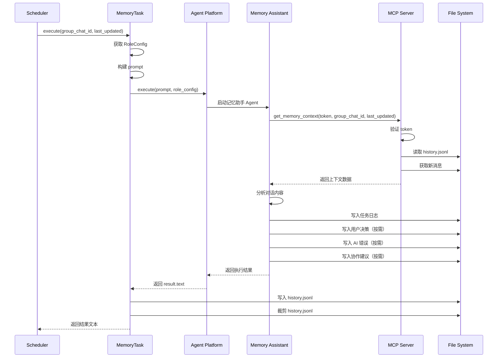

## 版本

| 版本 | 更新内容 |
| ---- | -------- |
| 1.0 | 创建 flow 初稿 |

# 数据流：Memory Assistant 生命周期

**Flow 对象**：Memory Assistant（记忆助手 Agent）
**对应 Spec**：`docs/specs/2026-06-26-memory-assistant.md`

## Memory Assistant 数据结构

```python
@dataclass
class MemoryTask:
    # 执行记忆收集的组件
    _role_manager: RoleManager  # 角色配置管理器
```

```python
@dataclass
class MemoryContext:
    # get_memory_context 返回的上下文数据
    group_chat_id: str        # 群聊 ID
    last_updated: str         # 上次更新时间
    history_summary: str      # 历史总结内容
    new_messages: str         # 新消息内容
    context: str              # 拼接后的完整上下文
```

**关键字段说明**：
- `MemoryContext.history_summary`：从 history.jsonl 最后一行读取的历史总结，用于提供上下文连续性
- `MemoryContext.new_messages`：上次更新后的新消息，通过 `get_group_chat_messages` 获取
- `MemoryContext.context`：拼接后的完整上下文，直接作为记忆助手的输入

## 与其他数据流的耦合

### Memory Assistant ↔ Scheduler

**耦合关系**：

| Scheduler 操作 | Memory Assistant 影响 | 触发位置 |
|---------------|---------------------|---------|
| 调用 `MemoryTask.execute()` | 启动记忆收集任务 | `scheduler_service._execute_memory_task()` |
| 传入 `group_chat_id` 和 `last_updated` | 确定处理范围 | `memory_task.execute()` |
| 读取返回的 `result.text` | 获取执行结果 | `scheduler_service._execute_memory_task()` |

### Memory Assistant ↔ MCP Server

**耦合关系**：

| Memory Assistant 操作 | MCP Server 影响 | 触发位置 |
|---------------------|----------------|---------|
| 调用 `get_memory_context()` | 获取群聊上下文 | 记忆助手 Agent 执行过程中 |
| 传入 `agent_token` | 验证身份 | `server._verify_memory_token()` |
| 传入 `group_chat_id` 和 `last_updated` | 获取对应数据 | `server.get_memory_context()` |

### Memory Assistant ↔ Config

**Config 配置字段**：
- `config.default_memory_assistant_name`：记忆助手角色名
- `config.memory_assistant_token`：记忆助手专用 token
- `config.data_path`：系统数据路径
- `config.decision_path`：用户决策数据路径
- `config.history_jsonl_path`：history.jsonl 文件路径

**耦合关系**：

| Memory Assistant 操作 | Config 影响 | 触发位置 |
|---------------------|------------|---------|
| 读取角色名 | `config.default_memory_assistant_name` | `MemoryTask.execute()` |
| 验证 token | `config.memory_assistant_token` | `get_memory_context()` |
| 写入 history.jsonl | `config.history_jsonl_path` | `MemoryTask.execute()` |
| 写入用户决策 | `config.decision_path` | Agent 自主行为（由 prompt 指导） |

<key_function last_update="2026-06-26T18:23:55+08:00">
- agents_hub/scheduler/task/memory_task.py
  - memory_task.MemoryTask.execute:100
  - memory_task.append_to_history:22
  - memory_task.trim_history_jsonl:56
  - memory_task._build_memory_prompt:76
- agents_hub/mcp/server.py
  - server.get_memory_context:1469
  - server._verify_memory_token:125
- agents_hub/roles/prompt_file.py
  - prompt_file.build_system_file_content:489
</key_function>

## 流程概览



## 数据流节点

**业务场景说明**：
1. **任务执行**：Scheduler 触发 → MemoryTask 执行 → 记忆助手 Agent 运行
2. **上下文获取**：记忆助手调用 MCP 工具 → 获取历史总结和新消息
3. **记忆生成**：分析对话 → 按 4 个维度判断 → 写入对应文件
4. **结果持久化**：执行结果写入 history.jsonl → 裁剪保留 1000 条

## 链路 1：任务执行

1. `MemoryTask.execute(group_chat_id, last_updated)`
   执行单个群聊的记忆更新
   状态: ❌ | 持久化: ✅ 写入 history.jsonl | 跨模块: scheduler → agent_bridge
   步骤: 获取记忆助手 RoleConfig → 构建 prompt → 调用 agent_platform_client.execute → 写入 history.jsonl → 裁剪 history.jsonl → 返回结果文本

2. `_build_memory_prompt(group_chat_id, last_updated)`
   构建记忆助手的 prompt
   状态: ❌ | 持久化: ❌ | 跨模块: ❌
   步骤: 拼接任务描述 → 附加 agent token → 返回 prompt 字符串

## 链路 2：上下文获取

1. `get_memory_context(agent_token, group_chat_id, last_updated)`
   记忆助手获取群聊上下文数据
   状态: ❌ | 持久化: ✅ 读取 history.jsonl | 跨模块: mcp → core
   步骤: 验证 memory_assistant_token → 读取历史总结 → 获取新消息 → 拼接返回

2. `_verify_memory_token(agent_token)`
   验证记忆助手身份令牌
   状态: ❌ | 持久化: ❌ | 跨模块: ❌
   步骤: 比对 config.memory_assistant_token → 返回 True/False

## 链路 3：记忆生成

记忆助手 Agent 执行过程（由 Agent 自主完成）：

1. **分析对话内容**
   读取 MCP 返回的 context，识别有价值的知识点

2. **按维度判断**
   对每个维度独立判断是否需要写入：
   - 任务日志：每次都写
   - 用户决策：存在难以逆转的选择时写入
   - AI 错误：Agent 被纠正或犯错时写入
   - 协作建议：存在协作方式改进时写入

3. **写入文件**
   判断为需要写入 → 读取 knowledge-base 编写规范 → 生成结构化文档

## 链路 4：结果持久化

1. `append_to_history(group_chat_id, summary, history_path)`
   追加总结到 history.jsonl
   状态: ❌ | 持久化: ✅ 写入 history.jsonl | 跨模块: ❌
   步骤: 构建记录（group_chat_id, timestamp, summary） → 追加到文件

2. `trim_history_jsonl(history_path, max_lines)`
   裁剪 history.jsonl，保留最近 1000 条记录
   状态: ❌ | 持久化: ✅ 裁剪 history.jsonl | 跨模块: ❌
   步骤: 读取所有行 → 判断是否超过上限 → 裁剪最旧的记录 → 写回文件

## 异常与清理

**Token 验证失败**：
- 返回错误响应 `{"error": {"code": "INVALID_TOKEN", "message": "..."}}`
- 记忆助手收到错误后停止执行

**history.jsonl 读取失败**：
- 记录 WARNING 日志
- 返回空的 `history_summary`，继续执行

**history.jsonl 写入失败**：
- 记录 ERROR 日志
- 不影响当前执行结果，但下次执行将丢失历史上下文

**记忆助手执行失败**：
- `MemoryTask.execute()` 内部捕获异常
- 返回错误描述文本，不抛出异常
- Scheduler 记录错误到 result.json，继续处理下一个群聊

## 反常设计说明

### history.jsonl 只读取最后一行

**设计意图**：history.jsonl 应该保留完整的历史总结链
**当前实现**：`get_memory_context()` 只读取最后一行作为历史总结
**为什么是反常的**：如果 history.jsonl 包含多条记录，只读取最后一行会丢失之前的总结内容
**影响范围**：记忆助手无法获取完整的历史上下文，可能导致重复总结或遗漏
**相关位置**：`agents_hub/mcp/server.py:1506-1514`

## 相关文档

### Spec 文档
- **Memory Assistant Spec**：`docs/specs/2026-06-26-memory-assistant.md` - 记忆助手职责规格
- **Scheduler Spec**：`docs/specs/2026-06-24-scheduler.md` - 定时调度系统规格
- **Config Spec**：`docs/specs/2026-06-06-config.md` - 配置项定义

### 架构文档
- **ARCHITECTURE.md**：`docs/ARCHITECTURE.md` - 系统顶层架构

### 架构约束
- **architecture.md**：`.scratch/memory-assistant-scheduler/architecture.md` - 调度系统架构约束文件
