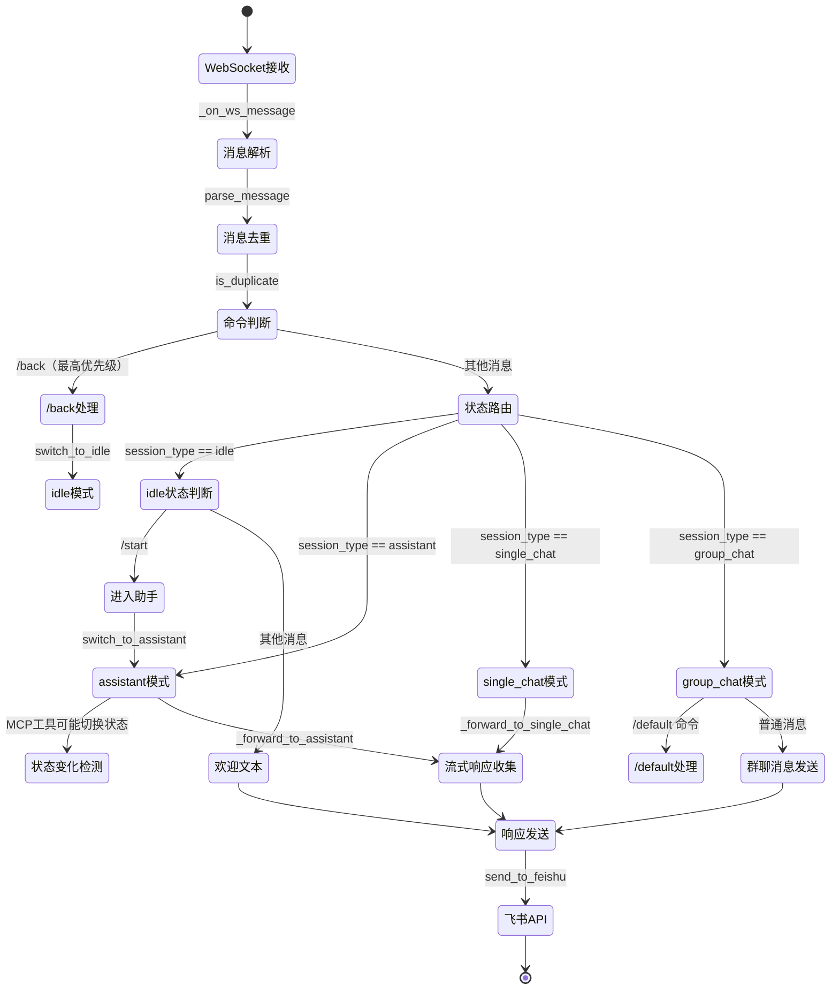

## 版本

| 版本 | 更新内容 |
| ---- | -------- |
| 1.1 | 更新为新命令系统，移除已删除函数引用，添加助手模式流程 |
| 1.0 | 初始版本 |

# 数据流：飞书消息生命周期

**Flow 对象**：飞书消息（Feishu Message Event）
**对应 Spec**：[飞书 Channel Spec](../specs/2026-06-27-feishu-channel.md)

## 核心设计：一对一绑定

每个飞书群（chat_id）通过 FeishuSessionManager 绑定到一个 Agent Hub 会话：
- **绑定关系**：1 个飞书群 ↔ 1 个 Agent Hub 会话（单聊或群聊）
- **消息流向**：飞书消息 → 转发到绑定的 Agent Hub 会话 → 响应回同步到飞书群
- **绑定持久化**：`/back` 返回 idle 不清空绑定，绑定新会话时才覆盖

## 飞书消息数据结构

```python
# 飞书事件（从 WebSocket 接收）
event: dict
  message: dict
    message_id: str      # 消息唯一 ID
    chat_id: str         # 飞书群 ID（oc_xxx）
    content: str         # 消息内容（JSON 字符串，如 {"text": "hello"}）
    message_type: str    # 消息类型（text/image/...）
    sender: dict
      sender_id: dict
        user_id: str     # 发送者用户 ID
      sender_type: str   # 发送者类型（user/app）
    mentions: list[dict] # @提及列表
      key: str           # 占位符（如 @_user_1）
      id: dict
        user_id: str     # 被提及者 ID
      name: str          # 被提及者名称

# 解析后的消息（parse_message 输出）
parsed_message: dict
  message_id: str
  chat_id: str
  content: str           # 纯文本内容（已从 JSON 提取）
  msg_type: str
  sender_id: str
  sender_type: str
  mentions: list[dict]   # 简化后的 mention 列表

# 会话状态（FeishuSessionState）- 飞书群与 Agent Hub 会话的绑定关系
session_state: dict
  feishu_chat_id: str    # 飞书群 ID（绑定关系的飞书侧）
  session_type: str      # 绑定类型：idle/assistant/single_chat/group_chat
  session_id: str        # 绑定的 Agent Hub 会话 ID
                         #   - assistant: 默认 agent 名称
                         #   - single_chat: agent 名称
                         #   - group_chat: Agent Hub 群聊 ID
  session_name: str      # 显示名称（群聊名称或 agent 名称）
  single_chat_id: str    # Agent Hub 单聊会话 ID（assistant 和 single_chat 模式使用）
  last_message_id: int   # 群聊模式增量同步游标（避免重复推送到飞书）
  last_sync_at: str      # 最后同步时间
  created_at: str        # 创建时间
  default_agent: str     # 群聊默认对话 Agent（仅群聊模式使用）
  single_chat_history: list[dict]  # 单聊历史记录（最多50条）
```

**关键字段说明**：
- `session_type`：决定绑定类型和消息路由目标
- `session_id`：绑定的 Agent Hub 会话标识，与 session_type 配合使用
- `single_chat_id`：assistant 和 single_chat 模式复用，避免重复创建单聊会话
- `last_message_id`：群聊模式增量同步的游标，避免重复推送到飞书
- `default_agent`：群聊模式下默认接收消息的 Agent（由 /default 命令设置）
- `single_chat_history`：单聊历史记录，支持查看和恢复之前的对话

## 与其他数据流的耦合

### 飞书消息 ↔ 单聊会话（一对一绑定）

**单聊会话状态字段**：SingleChat（由 single_chat_manager 管理）

**绑定关系**：1 个飞书群 ↔ 1 个 Agent Hub 单聊会话

**消息同步方向**：
- 飞书→单聊：用户在飞书发消息 → 转发到绑定的单聊会话
- 单聊→飞书：单聊会话的流式响应 → 收集后一次性发送到飞书

**耦合关系**：

| 飞书消息事件 | 单聊会话影响 | 触发位置 |
|-------------|-------------|---------|
| 用户进入 assistant 模式 | 创建或复用单聊会话（与默认 agent） | commander._forward_to_assistant |
| 助手调用 create_single_chat MCP | 创建单聊会话（与指定 agent） | service.FeishuSessionService.create_single_chat |
| 用户发送消息（assistant/single_chat） | 调用 send_message_stream，收集响应 | commander._collect_stream_response |

**说明**：飞书 Channel 通过 single_chat_manager 与单聊模块交互，单聊会话的生命周期由 single_chat_manager 管理。助手模式下，助手 Agent 通过 MCP 工具（feishu_session_service）完成会话切换。

### 飞书消息 ↔ 群聊会话（一对一绑定）

**群聊会话状态字段**：GroupChat（由 group_chat_manager 管理）

**绑定关系**：1 个飞书群 ↔ 1 个 Agent Hub 群聊

**消息同步方向**：
- 飞书→群聊：用户在飞书发消息 → 转发到绑定的群聊
- 群聊→飞书：群聊的新消息 → 通过广播机制增量同步到飞书

**耦合关系**：

| 飞书消息事件 | 群聊会话影响 | 触发位置 |
|-------------|-------------|---------|
| 助手调用 bind_to_group_chat MCP | 加载群聊并获取成员 | service.FeishuSessionService.bind_to_group_chat |
| 用户发送消息（group_chat） | 调用 send_message_and_wait | commander._forward_to_group_chat |
| 群聊有新消息（广播） | 增量同步到飞书（检查 last_message_id） | channel._on_broadcast |

**说明**：群聊模式下，飞书消息通过 GroupChatService 发送到群聊，群聊的新消息通过广播机制同步回飞书。同步使用 last_message_id 做增量检查，避免重复推送。助手模式下，助手 Agent 通过 MCP 工具（feishu_session_service）完成群聊绑定。

<key_function last_update="2026-06-28T09:38:27+08:00">
- agents_hub/channels/feishu/channel.py
  - channel.FeishuChannel.on_message:239
  - channel.FeishuChannel.send_to_feishu:321
  - channel.FeishuChannel._on_broadcast:369
- agents_hub/channels/feishu/commander.py
  - commander.FeishuCommander.handle:46
  - commander.FeishuCommander._enter_assistant_mode:100
  - commander.FeishuCommander._forward_to_assistant:139
  - commander.FeishuCommander._forward_to_single_chat:174
  - commander.FeishuCommander._forward_to_group_chat:182
  - commander.FeishuCommander._collect_stream_response:226
- agents_hub/channels/feishu/service.py
  - service.FeishuSessionService.bind_to_group_chat:31
  - service.FeishuSessionService.bind_to_single_chat:59
  - service.FeishuSessionService.create_single_chat:87
- agents_hub/channels/feishu/session.py
  - session.FeishuSessionManager.get_or_create_state:119
  - session.FeishuSessionManager.get_state:153
  - session.FeishuSessionManager.iter_states:148
  - session.FeishuSessionManager.switch_to_idle:165
  - session.FeishuSessionManager.switch_to_group_chat:179
  - session.FeishuSessionManager.switch_to_single_chat:202
  - session.FeishuSessionManager.switch_to_assistant:220
  - session.FeishuSessionManager.update_sync_state:255
  - session.FeishuSessionManager.add_single_chat_history:268
  - session.FeishuSessionManager.save:315
- agents_hub/channels/feishu/message.py
  - message.parse_message:14
  - message.parse_agent_name:64
  - message.parse_mentions:89
  - message.MessageDeduplicator.is_duplicate:119
- agents_hub/channels/feishu/client.py
  - client.FeishuClient.connect:52
  - client.FeishuClient.send_message:160
</key_function>

## 流程概览



## 数据流节点

**业务场景说明**：
- **链路 1**：用户发送命令消息（/start, /back, /default）→ 命令处理 → 状态切换
- **链路 2**：用户发送普通消息 → 根据 session_type 路由到 assistant/single_chat/group_chat
- **链路 3**：群聊新消息广播 → 增量同步到飞书群

## 链路 1：命令消息处理

1. channel.FeishuChannel._on_ws_message()
   飞书 WebSocket 回调，提取消息和发送者信息
   状态: ❌ | 持久化: ❌ | 跨模块: ❌
   步骤: 提取 message/sender 字段 → 解析 content JSON → 构造标准化事件字典

2. channel.FeishuChannel.on_message()
   消息入口：解析、去重、命令判断
   状态: ❌ | 持久化: ❌ | 跨模块: ❌
   步骤: parse_message 解析 → is_duplicate 去重 → parse_mentions 替换占位符 → 判断是否以 / 开头

3. commander.FeishuCommander.handle()
   消息路由：根据 session_type 和命令分发
   状态: ❌ | 持久化: ❌ | 跨模块: ❌
   步骤: /back 最高优先级 → get_or_create_state → 根据 session_type 路由

4. **分支节点**：命令类型
   - `/back`（任意状态）→ switch_to_idle → 返回"已返回命令面板"
   - `/start`（idle 状态）→ switch_to_assistant → 返回"已进入助手模式"
   - `/default <agent>`（group_chat 状态）→ 设置默认 agent
   - 其他消息（idle 状态）→ 返回欢迎文本

5. commander.FeishuCommander._enter_assistant_mode()
   进入助手模式：切换状态 → 保存
   状态: idle→assistant | 持久化: ✅ | 跨模块: ❌
   步骤: 检查是否已在助手模式 → switch_to_assistant → save

6. channel.FeishuChannel.send_to_feishu()
   发送响应到飞书
   状态: ❌ | 持久化: ❌ | 跨模块: channels→飞书API
   步骤: 格式化消息（添加 agent 名称前缀）→ 转 JSON → client.send_message

## 链路 2：普通消息处理（会话路由）

1. channel.FeishuChannel.on_message()
   消息入口：解析、去重、路由判断
   状态: ❌ | 持久化: ❌ | 跨模块: ❌
   步骤: parse_message → is_duplicate → parse_mentions → parse_agent_name → 判断非命令

2. commander.FeishuCommander.handle()
   消息路由：根据 session_type 分发
   状态: ❌ | 持久化: ❌ | 跨模块: ❌
   步骤: get_or_create_state → 判断 session_type → 路由到对应处理器

3. **分支节点**：session_type
   - `idle` → 返回欢迎文本（提示 /start）
   - `assistant` → _forward_to_assistant（注入 feishu_chat_id 前缀）
   - `single_chat` → _forward_to_single_chat
   - `group_chat` → _forward_to_group_chat

4. commander.FeishuCommander._forward_to_assistant()
   转发到助手：注入 feishu_chat_id 前缀 → 确保单聊存在 → 发送消息 → 检测状态变化
   状态: ❌ | 持久化: ✅（首次创建时） | 跨模块: channels→api
   步骤: 注入 `[feishu_chat_id:oc_xxx]` 前缀 → 检查 single_chat_id → 不存在则创建单聊 → _collect_stream_response → 检测状态是否改变

5. commander.FeishuCommander._collect_stream_response()
   收集流式响应：遍历 SSE 事件，拼接文本
   状态: ❌ | 持久化: ❌ | 跨模块: channels→api
   步骤: single_chat_manager.send_message_stream → 遍历事件 → 提取 text_delta → 拼接结果

6. commander.FeishuCommander._forward_to_group_chat()
   转发到群聊：加载群聊 → 发送消息并等待
   状态: ❌ | 持久化: ❌ | 跨模块: channels→core
   步骤: group_chat_manager.load_group_chat → 获取成员 → group_chat_service.send_message_and_wait

7. channel.FeishuChannel.send_to_feishu()
   发送响应到飞书
   状态: ❌ | 持久化: ❌ | 跨模块: channels→飞书API
   步骤: 格式化消息 → 转 JSON → client.send_message

## 链路 3：群聊消息广播同步

1. channel.FeishuChannel._on_broadcast()
   广播回调：过滤有消息的广播
   状态: ❌ | 持久化: ❌ | 跨模块: realtime→channels
   步骤: 过滤空消息 → 遍历所有 session 状态 → 匹配 group_chat 类型和 group_chat_id

2. **分支节点**：增量同步检查
   - message.id <= state.last_message_id → 跳过（已同步）
   - message.id > state.last_message_id → 继续同步

3. channel.FeishuChannel.send_to_feishu()
   推送消息到飞书群
   状态: ❌ | 持久化: ❌ | 跨模块: channels→飞书API
   步骤: 格式化消息（agent 名称 + 内容）→ 转 JSON → client.send_message

4. session.FeishuSessionManager.update_sync_state()
   更新同步状态
   状态: ❌ | 持久化: ✅ | 跨模块: ❌
   步骤: 更新 last_message_id → 更新 last_sync_at → save 持久化

## 异常与清理

### WebSocket 连接异常

**处理方式**：lark SDK 的 WebSocket 客户端支持 auto_reconnect=True，断线后自动重连。

**异常类型**：FeishuConnectionError

### 消息发送失败

**处理方式**：异常向上抛出，由调用方处理。飞书 API 错误码 99991663 表示认证失败，抛出 FeishuAuthError。

**异常类型**：FeishuAPIError, FeishuAuthError

### 单聊会话不存在

**处理方式**：_forward_to_single_chat 中检查 single_chat_id，如果为空返回错误提示。

**提示文本**："单聊会话不存在，请重新使用 /start 进入助手模式"

## 反常设计说明

### lark SDK 全局 loop 替换

**设计意图**：lark SDK 的 WebSocket 客户端在模块加载时获取全局 event loop（`loop = asyncio.get_event_loop()`），后续固定使用该 loop。

**当前实现**：在后台线程中创建新的 event loop，并替换 lark_oapi.ws.client 模块中的全局 loop 变量。

**为什么是反常的**：直接修改第三方库的模块级全局变量，依赖 SDK 内部实现细节。

**影响范围**：如果 lark SDK 更新内部实现，此 hack 可能失效。

**相关位置**：`agents_hub/channels/feishu/client.py:115-121`

### assistant 和 single_chat 复用 single_chat_id

**设计意图**：assistant 模式和 single_chat 模式应该是独立的会话。

**当前实现**：assistant 模式复用 single_chat_id 字段，切换到 assistant 时不清空 single_chat_id。

**为什么是反常的**：字段名 single_chat_id 在 assistant 模式下也有含义，但语义不清晰。

**影响范围**：功能正常，但代码理解成本增加。

**相关位置**：`agents_hub/channels/feishu/session.py:153-164`

### 命令消息也经过 parse_agent_name

**设计意图**：命令消息（以 / 开头）应该直接交给 commander 处理，不需要解析 agent_name。

**当前实现**：on_message 中先判断是否为命令（以 / 开头），如果是则直接交给 commander 并 return；parse_agent_name 只在非命令消息时调用。

**为什么是反常的**：当前实现是正确的，命令优先级高于 agent_name 解析。这里记录是为了说明设计意图。

**影响范围**：无负面影响。

**相关位置**：`agents_hub/channels/feishu/channel.py:195-219`

## 相关文档

### Spec 文档
- **飞书 Channel Spec**：`docs/specs/2026-06-27-feishu-channel.md` - 飞书模块的完整规格
- **单聊模块 Spec**：`docs/specs/2026-06-08-single-chat.md` - 单聊会话的创建和管理
- **群聊 API Spec**：`docs/specs/2026-06-03-group-chat-api.md` - 群聊生命周期管理

### 架构文档
- **架构地图**：`docs/ARCHITECTURE.md` - 系统整体架构

### ADR
- 无
