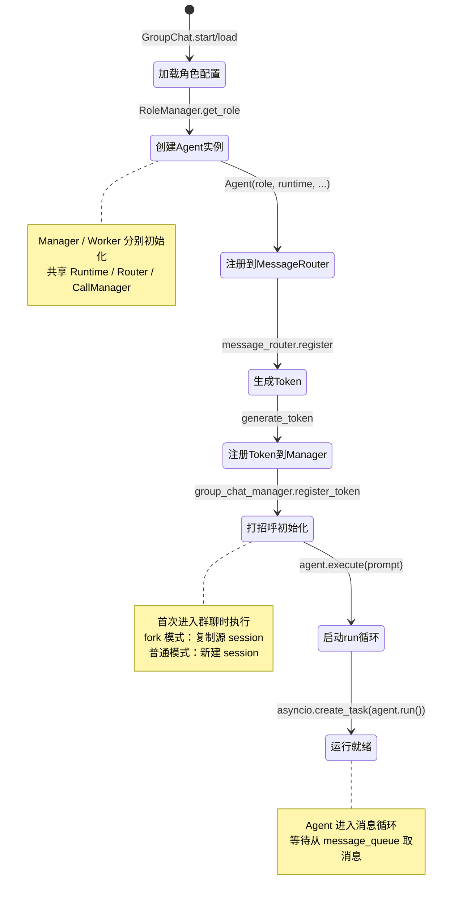

# 数据流：Agent 初始化与注册

**Flow 对象**：Agent（从角色配置到运行就绪）

**对应 Spec**：
- `docs/specs/2026-05-31-core-agent-orchestration.md`
- `docs/specs/2026-05-24-agents-role.md`

## Agent 数据结构

```python
# Agent 实例字段
name: str                           # Agent 名称，来自 RoleConfig
role_type: RoleType                  # 角色类型（LEADER/TEAM_MEMBER/SYSTEM）
role_config: RoleConfig              # 角色配置（名称、平台、工作目录等）
message_queue: asyncio.Queue         # 私有消息队列
agent_token: str                     # 身份令牌（从 runtime 获取）
agent_cwd: str                       # 工作目录（从 runtime 获取）

# 依赖组件
runtime: GroupChatRuntime            # 群聊上下文
agent_context: AgentContext          # 个人上下文（增量加载）
message_router: MessageRouter        # 消息路由器引用
agent_call_manager: AgentCallManager # 调用管理器引用
task_manager: TaskManager            # 任务管理器引用

# 运行状态
_run: bool                           # 运行标志（控制 run() 循环）
```

**关键字段说明**：
- `agent_token`：MCP 工具调用身份凭证，由 GroupChat 生成并注册到 GroupChatManager
- `message_queue`：私有队列，MessageRouter 投递消息的唯一入口
- `_run`：控制消息循环生命周期，False 时退出 run() 循环

## 与其他数据流的耦合

### Agent ↔ AgentMemberInfo（Runtime 状态）

**AgentMemberInfo 状态字段**（在 `GroupChatRuntime.state.agent_member_infos` 中）：
- `token: str`：Agent 身份令牌
- `cwd: str`：工作目录
- `status: str`：运行状态（idle/busy/stopped/error）
- `main_session: str | None`：主会话 ID
- `context_usage: int`：上下文使用量（K tokens）

**耦合关系**：

| Agent 初始化阶段 | AgentMemberInfo 变化 | 触发位置 |
|----------------|-------------------|---------|
| Agent 实例创建 | 无影响（实例在内存中） | `GroupChat._init_agents()` |
| Token 生成 | token 字段被赋值 | `GroupChat._ensure_tokens()` |
| 打招呼初始化 | main_session 被赋值 | `GroupChat._initialize_new_members()` |
| run() 启动 | status: None → idle | `GroupChat._start_agent_tasks()` |

**说明**：
- Agent 是内存对象，AgentMemberInfo 是持久化状态
- Agent 通过 `runtime.get_agent_member_info(name)` 访问自己的状态
- Token、session_id 等关键数据存储在 AgentMemberInfo 中

### Agent ↔ MessageRouter（消息路由）

**注册关系**：

| 动作 | MessageRouter 影响 | 触发位置 |
|------|------------------|---------|
| 注册 Agent | `_agents_queue[name] = queue` | `GroupChat._register_agents_to_router()` |
| 注销 Agent | 从 `_agents_queue` 删除 | `GroupChat.stop_member()` |

**说明**：
- MessageRouter 维护 `name → queue` 映射
- 注册后，其他 Agent 可通过 `send_message(send_to=name)` 投递消息
- 注销后，投递到该 Agent 的消息会抛出 AgentNotFoundError

<key_function last_update="2026-06-25T19:37:43+08:00">
- agents_hub/core/orchestration/group_chat.py
  - GroupChat._init_agents:278
  - GroupChat._register_agents_to_router:324
  - GroupChat._ensure_tokens:1809
  - GroupChat._initialize_new_members:846
  - GroupChat._initialize_single_member:829
  - GroupChat._start_agent_tasks:260
  - GroupChat.add_member:356
- agents_hub/core/orchestration/group_chat_manager.py
  - GroupChatManager.register_token:182
- agents_hub/core/agent/base_agent.py
  - Agent.__init__:47
  - Agent.run:1080
- agents_hub/core/agent/manager.py
  - Manager.__init__:52
- agents_hub/core/agent/worker.py
  - Worker.__init__:51
- agents_hub/core/foundation/token.py
  - generate_token:15
</key_function>

## 流程概览



## 数据流节点

**两条主要链路**：
```
链路 1: start() 首次创建群聊 → 初始化所有成员 → 生成 token → 打招呼 → 启动 run()
链路 2: load() 加载已有群聊 → 恢复所有成员 → 恢复 token → 激活时补初始化 → 启动 run()
```

## 链路 1：首次创建群聊（start）

```
1. GroupChat.start()
   启动群聊（首次创建），包含完整初始化流程
   状态: 无 → 群聊激活 | 持久化: ✅ metadata | 跨模块: ❌ core 内
   步骤: 加载上下文 → 初始化 agents → 确保 tokens → 初始化新成员 → 启动任务

2. GroupChat._init_agents()
   加载角色配置并创建 Manager/Worker 实例
   状态: 无 → Agent 实例创建 | 持久化: ❌ | 跨模块: core → roles
   步骤: RoleManager.get_role(manager_name) → Manager(role, runtime, ...)
         遍历 team_members_name → RoleManager.get_role(worker_name) → Worker(role, runtime, ...)
         调用 _register_agents_to_router()

3. GroupChat._register_agents_to_router()
   注册所有 Agent 到 MessageRouter，建立消息投递通道
   状态: 无 → 可接收消息 | 持久化: ❌ | 跨模块: ❌ core 内
   步骤: message_router.register(manager.name, manager.message_queue)
         遍历 workers → message_router.register(worker.name, worker.message_queue)
         message_router.register("user", asyncio.Queue())  # 注册伪 Agent

4. GroupChat._ensure_tokens()
   为所有 Agent 生成或恢复 token，并注册到 GroupChatManager 索引
   状态: 无 → token 生成 | 持久化: ✅ agent_member.json | 跨模块: ❌ core 内
   步骤: 获取 manager_info → generate_token() → manager_info.token = token
         group_chat_manager.register_token(token, manager.name, group_chat_id)
         遍历 workers → 同样操作
         runtime.save_agent_members()

5. GroupChat._initialize_new_members()
   检查哪些成员没有 session_id，对这些成员执行打招呼初始化
   状态: 无 session → 有 session | 持久化: ✅ agent_member.json + messages.jsonl | 跨模块: core → agent_bridge
   步骤: 检查 manager/workers 的 main_session 是否为 None
         并发执行所有新成员的 start_conversation()
         每个成员: 构造打招呼 prompt → agent.execute(prompt) → 获取 session_id
         保存结果: runtime.update_agent_session(result) + runtime.add_message(result)

6. GroupChat._initialize_single_member()
   单个新成员打招呼（add_member 时使用）
   状态: 无 session → 有 session | 持久化: ✅ | 跨模块: core → agent_bridge
   步骤: 构造 prompt（Leader: 介绍团队 / Worker: 介绍直属领导）
         agent.execute(prompt) → 保存 session 和消息

7. GroupChat._start_agent_tasks()
   启动所有 Agent 的 run() 消息循环
   状态: 无 task → 运行中 | 持久化: ❌ | 跨模块: ❌ core 内
   步骤: asyncio.create_task(manager.run()) → 保存到 manager_task
         遍历 workers → asyncio.create_task(worker.run()) → 保存到 worker_tasks
         启动 agent_call_manager.start_cleanup()
         启动 _heartbeat_loop()

8. Agent.run()
   Agent 消息循环主入口，从 message_queue 取消息并处理
   状态: 等待消息 | 持久化: ❌ | 跨模块: ❌ core 内
   步骤: while _run: msg = await message_queue.get()
         跳过哨兵消息（call_id="__STOP__"）
         render_for_llm(msg) → _process_message(msg, prompt)
         如果 TASK 未闭环: 追加系统提醒
```

## 链路 2：加载已有群聊（load + activate）

```
1. GroupChat.load()
   加载已有群聊（不启动 agent），只读操作
   状态: 无 → 群聊加载 | 持久化: ❌ | 跨模块: ❌ core 内
   步骤: 加载上下文 → 初始化 agents → 确保 tokens
         不设置 _activated，等待 activate()

2. GroupChat._init_agents()
   同链路 1，创建 Agent 实例并注册到 MessageRouter
   状态: 无 → Agent 实例创建 | 持久化: ❌ | 跨模块: core → roles

3. GroupChat._ensure_tokens()
   同链路 1，但使用已有 token（从 agent_member.json 恢复）
   状态: 恢复 token | 持久化: ❌（token 已存在）| 跨模块: ❌ core 内
   步骤: 获取 manager_info.token（已有值）→ 注册到 GroupChatManager
         遍历 workers → 同样操作

4. GroupChat.activate()
   激活群聊，启动 agent.run() 任务
   状态: 加载 → 激活 | 持久化: ❌ | 跨模块: ❌ core 内
   步骤: _register_agents_to_router()（防止对象重建后注册丢失）
         _initialize_new_members()（如果有无 session 的成员）
         _start_agent_tasks()

5. GroupChat._start_agent_tasks()
   同链路 1，启动所有 Agent 的 run() 循环
```

## 动态添加成员

```
1. GroupChat.add_member()
   增量添加单个成员（热重载安全）
   状态: 无 → 成员添加 | 持久化: ✅ agent_member.json | 跨模块: core → roles
   步骤: RoleManager.get_role(role_name) → 创建 Worker 实例
         message_router.register(role_name, worker.message_queue)
         workers[role_name] = worker
         runtime.get_or_create_agent_member_info(role_name) → 生成 token
         group_chat_manager.register_token(token, role_name, group_chat_id)
         runtime.save_agent_members()
         如果群聊已激活: asyncio.create_task(worker.run())
         _initialize_single_member(worker)
```

## Token 生命周期

**生成**：
- 时机：GroupChat.start() / load() / add_member()
- 位置：GroupChat._ensure_tokens() / add_member()
- 格式：`tok_<32位hex>`（由 `generate_token()` 生成）

**注册**：
- 索引：GroupChatManager._tokens[token] = (agent_name, group_chat_id)
- 用途：MCP 工具调用时通过 `resolve_token(token)` 解析身份

**注入**：
- 方式：通过 runtime 信息注入到 work_root/CLAUDE.md 的 `<AGENT_RUNTIME_START/>` 标记内
- 时机：每次 `_process_message()` 前（通过 `build_user_prompt()` 调用 `markdown_injector`）

**注销**：
- 时机：GroupChat.cleanup() / stop_member()
- 位置：GroupChatManager.unregister_tokens(group_chat_id)

## 反常设计说明

### Manager 初始化独立于 team_members_name

**设计意图**：Team.team_members_name 包含所有成员（Manager + Workers）的完整列表。

**当前实现**：
- Manager 由 `config.default_manager_name` 硬编码加载，与 `team_members_name` 无关
- Workers 遍历 `team_members_name`，跳过与 `default_manager_name` 同名的成员

**为什么是反常的**：
- Spec 说 `team_members_name` 包含 Manager + Workers，但实际 Manager 的加载完全独立
- 如果 `team_members_name` 不包含 Manager 名称，Manager 仍会被创建
- 如果 `team_members_name` 包含 Manager 名称，会被跳过（不会重复创建）

**影响范围**：
- 不影响正常功能（Manager 始终被创建）
- 影响语义理解（`team_members_name` 的完整性无法保证）

**相关位置**：
- GroupChat._init_agents() `agents_hub/core/orchestration/group_chat.py:205`
- Spec 说明：`docs/specs/2026-05-31-core-agent-orchestration.md` §Team 定义

### fork_from_sessions 的混合语义

**设计意图**：fork 模式用于从已有 session 复制上下文创建新群聊。

**当前实现**：
- fork_from_sessions 存储在 GroupChat 构造函数参数中，但不持久化
- 只在 `_initialize_new_members()` 中使用一次
- Claude: 使用 `--fork-session --resume` CLI 参数
- Codex: 文件系统复制 session 文件
- OpenCode: 不支持 fork，降级为普通初始化

**为什么是反常的**：
- fork_from_sessions 只在首次初始化时有效，load() 后重新 activate() 不会使用
- 参数在 GroupChat 对象中保留，但实际只使用一次

**影响范围**：
- 不影响功能（fork 按预期工作）
- 影响可维护性（参数生命周期不清晰）

**相关位置**：
- GroupChat._initialize_new_members() `agents_hub/core/orchestration/group_chat.py:358`

## 相关文档

### Spec 文档
- **Core Agent & Orchestration**：`docs/specs/2026-05-31-core-agent-orchestration.md`
  - Agent 执行模型、角色模型、GroupChat 生命周期、MCP 工具入口
- **Roles 角色配置模块**：`docs/specs/2026-05-24-agents-role.md`
  - 角色 CRUD、配置数据结构、Skill 管理

### 架构文档
- **Core 架构概览**：`docs/specs/2026-05-31-core-overview.md`
  - Core 层级划分（foundation/communication/context/agent/orchestration）

### ADR
- **多 Agent 消息架构**：`docs/ADR/0005-multi-agent-message-architecture.md`
  - MessageRouter + 私有队列的点对点路由方案
- **Agent Token 身份模型**：`docs/ADR/0007-agent-token-identity-model.md`
  - MCP Tool 调用者身份校验逻辑、Token 生命周期和注入方式
- **Prompt 架构重构**：`docs/ADR/0013-prompt-architecture-refactor.md`
  - runtime 信息从 system prompt 移到 user message，CLAUDE/AGENTS.md 在 role 创建时写入
