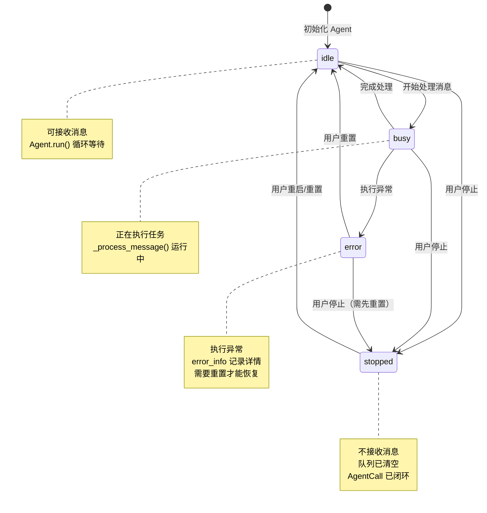

# 数据流：Agent 状态生命周期

**Flow 对象**：Agent 状态（`AgentMemberInfo.status`）

**对应 Spec**：docs/specs/2026-06-05-message-flow-and-persistence.md、docs/specs/2026-05-31-core-context.md

## Agent 状态数据结构

```python
@dataclass
class AgentMemberInfo:
    """Agent 的会话信息"""
    
    main_session: str | None = None              # 主会话 ID
    btw_session: list[str] = field(default_factory=list)  # by the way session 列表
    context_state: AgentContextState = field(default_factory=AgentContextState)  # 上下文加载状态
    token: str = ""                              # Agent 的 token，用于 MCP 工具身份验证
    cwd: str = ""                                # CLI 命令启动的工作目录路径
    use_docker: bool = False                     # 是否使用 Docker 沙箱执行
    status: str = "idle"                         # Agent 状态：idle/busy/stopped/error
    context_usage: int = 0                       # 上下文使用量（input_tokens/1000 取整）
    error_info: dict[str, Any] | None = None     # 错误信息：{"type": "...", "message": "...", "exit_code": ..., "stderr": "..."}
```

**关键字段说明**：
- `status`：核心状态字段，控制 Agent 是否能接收和处理消息
  - `idle`：空闲，可以接收和处理消息
  - `busy`：处理中，正在执行任务（理论上仍可接收新消息到队列）
  - `stopped`：已停止，不能接收新消息，现有任务被清理
  - `error`：错误状态，Agent 执行出现异常，需要重置或重启
- `error_info`：仅在 status = "error" 时有值，记录错误详情供前端展示
- `status` 与 `AgentCall.status` 强耦合：Agent 开始处理消息时变 busy，完成后回到 idle

## 与其他数据流的耦合

### Agent 状态 ↔ AgentCall 状态

**AgentCall 状态字段**（`AgentCall.status`）：
- `PENDING`：消息在队列中等待处理
- `RUNNING`：Agent 正在处理消息
- `COMPLETED`：Agent 完成任务
- `FAILED`：执行失败或被中断
- `TIMEOUT`：执行超时

**耦合关系**：

| Agent 状态变化 | AgentCall 状态影响 | 触发位置 |
|---------------|------------------|---------|
| * → idle（初始化） | 无 AgentCall | `GroupChat._initialize_new_members()` |
| idle → busy | PENDING → RUNNING | `Agent.run()` 取出消息，调用 `_sync_status("busy")` |
| busy → idle（正常完成） | RUNNING → COMPLETED | `Agent.run()` finally 块调用 `_sync_status("idle")` |
| busy → error（异常） | RUNNING → FAILED | `Agent._set_error_status()` |
| * → stopped（用户操作） | PENDING/RUNNING → FAILED | `GroupChat.stop_member()` |
| stopped → idle（重启） | 无影响（队列已清空） | `GroupChat.start_member()` |
| stopped → idle（重置） | 无影响（队列已清空） | `GroupChat.reset_member()` |

**说明**：
- Agent 状态是整体状态，一个 Agent 同时只有一个状态值
- AgentCall 状态是调用级别，一个 Agent 可能同时有多个 PENDING 的 AgentCall 在队列中
- Agent 从队列取出消息开始处理时：Agent.status = "busy"，AgentCall.status = RUNNING
- 处理完成后：Agent.status = "idle"，AgentCall.status = COMPLETED/FAILED
- 用户停止 Agent 时：Agent.status = "stopped"，所有未完成的 AgentCall 都被标记为 FAILED

<key_function last_update="2026-06-23T05:41:09+08:00">
- agents_hub/api/routes/group_chat.py
  - group_chat.stop_member:406
  - group_chat.start_member:423
  - group_chat.reset_member:439
- agents_hub/api/services/group_chat_service.py
  - group_chat_service.GroupChatService.stop_member:819
  - group_chat_service.GroupChatService.start_member:854
  - group_chat_service.GroupChatService.reset_member:890
- agents_hub/core/orchestration/group_chat.py
  - group_chat.GroupChat._initialize_single_member:829
  - group_chat.GroupChat._initialize_new_members:846
  - group_chat.GroupChat._cleanup_agent_queue:1143
  - group_chat.GroupChat.stop_member:1237
  - group_chat.GroupChat.start_member:1371
  - group_chat.GroupChat.reset_member:1452
- agents_hub/core/agent/base_agent.py
  - base_agent.Agent._sync_status:653
  - base_agent.Agent._set_error_status:683
  - base_agent.Agent.run:1000
</key_function>

## 流程概览



## 数据流节点

**四条主要链路**：
```
链路 1: Agent 初始化 → idle 状态
链路 2: Agent 处理消息 → busy → idle（正常流程）
链路 3: Agent 异常 → error 状态
链路 4: 用户操作 Agent → stopped/idle（停止/重启/重置）
```

## 链路 1：Agent 初始化

```
1. GroupChat._initialize_new_members()
   检查哪些成员没有 session_id，对这些成员执行初始化
   状态: 无→idle | 持久化: ✅ | 跨模块: ❌ core 内
   步骤: 检查成员 session → 调用 _initialize_single_member()

2. GroupChat._initialize_single_member()
   向 Agent 发送打招呼消息，创建首个 session
   状态: idle 不变 | 持久化: ✅ | 跨模块: ❌ core 内
   步骤: 构造打招呼 prompt → agent.execute() → 保存结果到群聊历史
```

## 链路 2：Agent 处理消息（正常流程）

```
1. Agent.run()
   从消息队列取出消息开始处理，更新状态为 busy
   状态: idle→busy | 持久化: ✅ | 跨模块: ❌ core 内
   步骤: 取出消息 → _sync_status("busy") → _process_message()

2. Agent._sync_status()
   同步 Agent 状态到 AgentMemberInfo，防止 stopped/error 被覆盖
   状态: *→指定状态 | 持久化: ✅ | 跨模块: ❌ core 内
   步骤: 检查当前状态 → 更新 agent_member_info.status → 保存

3. Agent._process_message()
   调用 LLM 执行任务，AgentCall 状态 PENDING→RUNNING
   状态: busy 不变 | 持久化: ✅ | 跨模块: ❌ core 内
   步骤: 更新 AgentCall.status = RUNNING → 调用 LLM → 返回结果

4. Agent.run()
   完成处理，finally 块中恢复状态为 idle
   状态: busy→idle | 持久化: ✅ | 跨模块: ❌ core 内
   步骤: _sync_status("idle") → 继续下一条消息
```

## 链路 3：Agent 异常处理

```
1. Agent.run() [异常捕获]
   执行过程中捕获异常，调用 _set_error_status()
   状态: busy→error | 持久化: ✅ | 跨模块: ❌ core 内
   步骤: 捕获异常 → _set_error_status(exc)

2. Agent._set_error_status()
   设置 Agent 为 error 状态，记录错误信息到 error_info
   状态: *→error | 持久化: ✅ | 跨模块: ❌ core 内
   步骤: 构造 error_info → agent_member_info.status = "error" → 保存
```

## 链路 4：用户操作 Agent

### 4.1 停止 Agent

```
1. group_chat_api.stop_member()
   前端调用 API 停止 Agent
   状态: 无影响 | 持久化: ❌ | 跨模块: frontend→api
   步骤: POST /group-chats/{id}/members/{name}/stop

2. GroupChatService.stop_member()
   API 层，加载群聊并调用 core 层停止逻辑
   状态: 无影响 | 持久化: ❌ | 跨模块: api→core
   步骤: 加载群聊 → group_chat.stop_member()

3. GroupChat.stop_member()
   停止 Agent，更新状态为 stopped
   状态: *→stopped | 持久化: ✅ | 跨模块: ❌ core 内
   步骤: agent_info.status = "stopped" → 保存

4. GroupChat._stop_agent_process()
   立即终止正在运行的 CLI 进程
   状态: stopped 不变 | 持久化: ❌ | 跨模块: ❌ core 内
   步骤: 终止进程 → 清理资源

5. Agent.stop()
   发送哨兵消息到队列，设置 _run = False
   状态: stopped 不变 | 持久化: ❌ | 跨模块: ❌ core 内
   步骤: 发送 __STOP__ 消息 → 停止 run() 循环

6. GroupChat._cleanup_agent_queue()
   清空队列，闭环所有未完成的 AgentCall
   状态: stopped 不变 | 持久化: ✅ | 跨模块: ❌ core 内
   步骤: 获取未完成 AgentCall → 标记 FAILED → 通知调用方 → 清空队列
```

### 4.2 重启 Agent

```
1. GroupChatService.start_member()
   API 层，加载群聊并调用 core 层重启逻辑
   状态: 无影响 | 持久化: ❌ | 跨模块: api→core
   步骤: 加载群聊 → group_chat.start_member()

2. GroupChat.start_member()
   重启 stopped 状态的 Agent
   状态: stopped→idle | 持久化: ✅ | 跨模块: ❌ core 内
   步骤: 检查状态 = stopped → agent._run = True → 创建 run() 任务 → agent_info.status = "idle" → 保存
```

### 4.3 重置 Agent

```
1. GroupChatService.reset_member()
   API 层，加载群聊并调用 core 层重置逻辑
   状态: 无影响 | 持久化: ❌ | 跨模块: api→core
   步骤: 加载群聊 → group_chat.reset_member()

2. GroupChat.reset_member()
   重置 Agent（清空上下文并重新初始化）
   状态: *→stopped→idle | 持久化: ✅ | 跨模块: ❌ core 内
   步骤: 如果未停止先 stop_member() → 清空 session → 清空队列 → 重置 context_usage = 0

3. GroupChat._initialize_single_member()
   重新初始化 Agent（打招呼）
   状态: idle 不变 | 持久化: ✅ | 跨模块: ❌ core 内
   步骤: 构造打招呼 prompt → agent.execute() → 保存结果

4. GroupChat.reset_member() [继续]
   创建 run() 任务，更新状态为 idle
   状态: idle 不变 | 持久化: ✅ | 跨模块: ❌ core 内
   步骤: 创建 run() 任务 → agent_info.status = "idle" → 保存
```

## 相关文档

### Spec 文档
- **消息流转与持久化规格**：`docs/specs/2026-06-05-message-flow-and-persistence.md`
  - 定义消息传递路径和 Agent 停止清理流程
- **Core Context**：`docs/specs/2026-05-31-core-context.md`
  - AgentMemberInfo 数据结构定义

### 架构文档
- **Core 架构概览**：`docs/specs/2026-05-31-core-overview.md`
  - Core 层级划分（foundation/communication/context/agent/orchestration）
- **Core Agent & Orchestration**：`docs/specs/2026-05-31-core-agent-orchestration.md`
  - Agent 执行逻辑和 GroupChat 编排机制

### ADR
- **多 Agent 消息架构**：`docs/ADR/0005-multi-agent-message-architecture.md`
  - MessageRouter + 私有队列的点对点路由方案
- **MCP 工具取消方案**：`docs/ADR/2026-06-16-mcp-tools-to-direct-output.md`
  - 取消 complete_task 和 report_progress，改为直接输出
