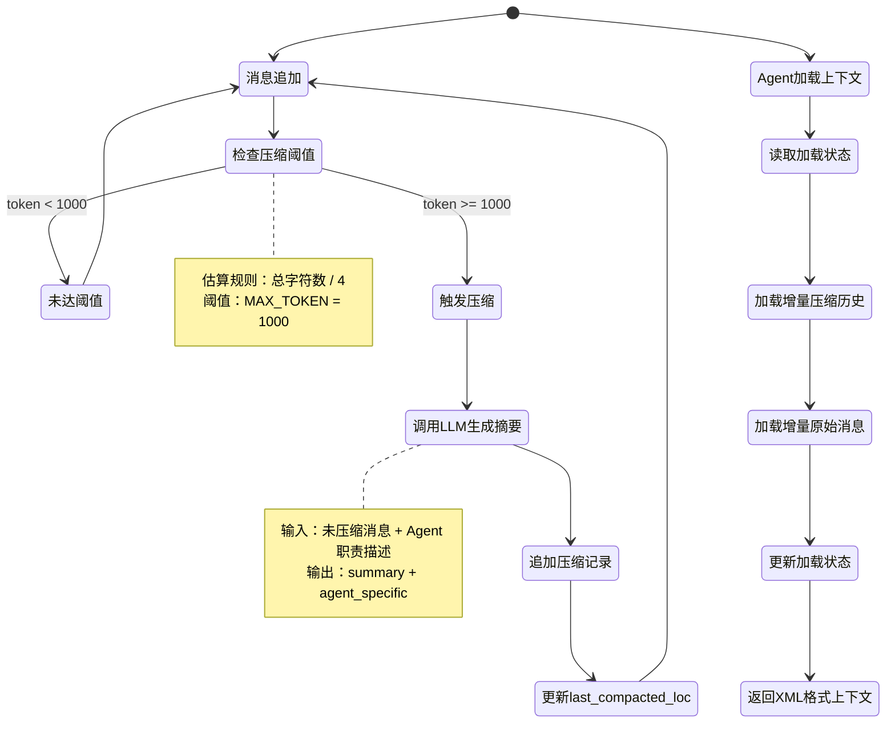

# 数据流：Context 压缩与增量加载

**Flow 对象**：Context（压缩历史消息、Agent 增量加载上下文）

**对应 Spec**：`docs/specs/2026-05-31-core-context.md`

## Context 数据结构

### GroupChatSession

```python
@dataclass
class GroupChatSession:
    # 基本信息
    group_chat_id: str                          # 群聊唯一标识
    name: str                                   # 会话名称
    created_at: datetime                        # 创建时间
    updated_at: datetime                        # 更新时间
    
    # 消息历史
    messages: list[dict]                        # 消息列表，每条包含 id, agent_name, content, timestamp, platform
    next_message_id: int                        # 下一个可用的消息 id
    
    # 压缩状态
    last_compacted_loc: int                     # 上一次压缩的位置（消息列表索引）
```

**关键字段说明**：
- `messages`：持久化/展示格式（ChatMessage），与通信层的 AgentMessage 格式不同
- `last_compacted_loc`：压缩位置，`messages[last_compacted_loc:]` 即为未压缩消息
- `next_message_id`：消息 ID 自增序列，用于前端定位和更新

### AgentContextState

```python
@dataclass
class AgentContextState:
    last_loaded_compact_index: int = 0      # 已加载到第几条压缩历史
    last_loaded_message_index: int = 0      # 已加载到第几条原始消息
```

**关键字段说明**：
- `last_loaded_compact_index`：增量加载的游标，指向压缩历史数组
- `last_loaded_message_index`：增量加载的游标，指向原始消息数组
- 两个游标独立推进，支持压缩历史和原始消息的独立增量加载

### CompactHistory 记录格式

```jsonl
{
  "create_at": "2026-06-18T10:30:00+08:00",
  "content": {
    "summary": "整体对话的1-2句话总结",
    "agent1": "与 agent1 相关的2-3句话关键信息",
    "agent2": "与 agent2 相关的2-3句话关键信息"
  }
}
```

**关键字段说明**：
- `summary`：所有 Agent 共享的整体对话摘要
- `{agent_name}`：为每个 Agent 提取与其职责相关的关键信息
- JSONL 格式，每次压缩追加一行

## 与其他数据流的耦合

### Context ↔ Agent 提示词渲染

**Agent 提示词结构**：
```
<runtime>...</runtime>
<group_chat_history>...</group_chat_history>
<recent_messages>...</recent_messages>
<incoming_message>...</incoming_message>
```

**耦合关系**：

| Context 状态变化 | Agent 提示词影响 | 触发位置 |
|------------------|-----------------|---------|
| 新消息追加 → messages | LEADER 的 `<recent_messages>` 增加新消息 | `AgentContext.get_context()` |
| 压缩触发 → compact_history 新增记录 | 所有 Agent 的 `<group_chat_history>` 增加新摘要 | `GroupChatRuntime.compact_messages()` |
| 压缩完成 → last_compacted_loc 推进 | 后续压缩从新位置开始 | `GroupChatRuntime.append_compact_record_and_mark_compacted()` |
| Agent 加载上下文 → context_state 推进 | 下次加载只返回增量内容 | `AgentContext._update_agent_context_state()` |

**说明**：
- AgentContext 是 Agent 和 GroupChatRuntime 的桥梁
- Agent 通过 `agent_context.build_user_prompt()` 获取完整提示词
- `build_user_prompt()` 内部调用 `get_context()` 获取增量上下文
- 只有 LEADER 角色才加载 `<recent_messages>`，其他角色只加载压缩历史

<key_function last_update="2026-06-21T17:23:54+08:00">
- agents_hub/core/context/agent_context.py
  - AgentContext.get_context:38
  - AgentContext.build_user_prompt:180
  - AgentContext._build_compact_history_xml:94
  - AgentContext._get_filtered_messages:136
  - AgentContext._update_agent_context_state:161
- agents_hub/core/context/group_chat_runtime.py
  - GroupChatRuntime.compact_messages:494
  - GroupChatRuntime.append_compact_record_and_mark_compacted:381
- agents_hub/core/context/group_chat_session.py
  - GroupChatSession.get_uncompact_messages:92
- agents_hub/core/orchestration/group_chat.py
  - GroupChat.compact_history:912
- agents_hub/core/agent/base_agent.py
  - Agent._process_message:265
</key_function>

## 流程概览



## 数据流节点

**两条主要链路**：
```
链路 1: 压缩流程 - 消息追加 → 检查阈值 → 调用 LLM → 追加压缩记录 → 更新位置
链路 2: 加载流程 - Agent 处理消息 → 读取加载状态 → 增量加载 → 更新加载状态 → 渲染提示词
```

## 链路 1：压缩流程

```
1. GroupChatSession.add_message()
   Agent 执行完成后追加消息到历史
   状态: messages 追加 | 持久化: ✅ | 跨模块: ❌
   步骤: 构建消息字典 → 追加到 messages → next_message_id 自增

2. GroupChat.compact_history()
   手动触发或定期触发压缩流程
   状态: 无 | 持久化: ❌ | 跨模块: orchestration→context
   步骤: 收集 Agent 信息（名称+职责） → 调用 Runtime 压缩方法

3. GroupChatRuntime.compact_messages()
   检查阈值并执行压缩
   状态: 无 | 持久化: ❌ | 跨模块: ❌
   步骤: 获取未压缩消息 → 估算 token 数量 → 判断是否达到阈值 → 构建压缩 prompt → 调用 LLM → 解析 JSON 响应

   触发条件分支:
   - token < MAX_TOKEN (1000) → 跳过压缩，直接返回
   - token >= MAX_TOKEN → 继续压缩流程

4. bare_claude_call()
   调用 LLM 生成压缩摘要
   状态: 无 | 持久化: ❌ | 跨模块: context→agent_bridge
   步骤: 发送压缩 prompt（包含消息历史+Agent 职责） → LLM 返回 JSON（summary + agent_specific）

5. GroupChatRuntime.append_compact_record_and_mark_compacted()
   追加压缩记录并标记压缩位置
   状态: compact_history 追加，last_compacted_loc 推进 | 持久化: ✅ | 跨模块: ❌
   步骤: 构建压缩记录 → 追加到 compact_history → 更新 last_compacted_loc = len(messages) → 保存两个文件
```

## 链路 2：增量加载流程

```
1. Agent._process_message()
   Agent 开始处理消息，构建完整提示词
   状态: 无 | 持久化: ❌ | 跨模块: ❌
   步骤: 判断会话类型 → MAIN 会话调用 build_user_prompt()

2. AgentContext.build_user_prompt()
   构建完整的 user message
   状态: 无 | 持久化: ❌ | 跨模块: ❌
   步骤: 构建 runtime XML → 调用 get_context() 获取历史上下文 → 渲染 incoming_message → 拼接三部分

3. AgentContext.get_context()
   获取 Agent 的增量上下文
   状态: context_state 推进 | 持久化: ✅ | 跨模块: ❌
   步骤: 读取 Agent 加载状态 → 加载增量压缩历史 → 加载增量原始消息 → 更新加载状态

   角色类型分支:
   - RoleType.LEADER → 加载压缩历史 + 原始消息（过滤后）
   - 其他角色 → 只加载压缩历史

4. AgentContext._build_compact_history_xml()
   构建压缩历史的 XML 片段
   状态: 无 | 持久化: ❌ | 跨模块: ❌
   步骤: 切片新压缩历史 → 提取 summary 和 agent_specific → 格式化为 XML（编号列表）

5. AgentContext._get_filtered_messages()
   获取过滤后的群聊消息（仅 LEADER）
   状态: 无 | 持久化: ❌ | 跨模块: ❌
   步骤: 切片新消息 → 过滤自己发送的消息 → 过滤 @ 自己的消息

   过滤规则:
   - 排除 agent_name == self.agent_name
   - 排除 content 包含 @{self.agent_name}（词边界匹配）

6. AgentContext._update_agent_context_state()
   更新 agent 的上下文加载状态
   状态: last_loaded_compact_index 和 last_loaded_message_index 推进 | 持久化: ✅ | 跨模块: ❌
   步骤: 获取 AgentMemberInfo → 更新两个 index → 调用 Runtime 保存
```

## 异常与清理

```
1. GroupChatRuntime.compact_messages() [LLM 调用失败]
   压缩过程中 LLM 调用失败
   状态: 无变化 | 持久化: ❌ | 跨模块: ❌
   步骤: 捕获异常 → 记录 ERROR 日志 → 抛出 CompactionError

2. GroupChatRuntime.compact_messages() [JSON 解析失败]
   LLM 返回的 JSON 格式错误
   状态: 无变化 | 持久化: ❌ | 跨模块: ❌
   步骤: 尝试直接解析 → 失败则正则提取 JSON → 仍失败则记录 ERROR 日志 → 抛出 CompactionError

3. AgentContext.get_context() [GroupChatSession 未加载]
   Runtime 未加载 session 时调用
   状态: 无变化 | 持久化: ❌ | 跨模块: ❌
   步骤: 检查 session 是否为 None → 记录 ERROR 日志 → 抛出 StateError
```

## 反常设计说明

### messages 过滤规则的不一致性

**设计意图**：LEADER 加载 `<recent_messages>` 时应该过滤掉"不需要看的消息"，避免重复或冗余信息。

**当前实现**：
- 过滤规则 1：排除自己发送的消息（`agent_name == self.agent_name`）
- 过滤规则 2：排除 @ 自己的消息（`content 包含 @{self.agent_name}`）

**为什么是反常的**：
- 规则 2 的语义与规则 1 相反：@ 自己的消息恰恰是**需要看的消息**（别人主动喊你），但代码却将其过滤掉
- Spec 中未定义过滤规则，代码实现的过滤逻辑与常识不符

**影响范围**：
- LEADER 可能会漏掉其他 Agent @ 自己的重要消息
- 仅影响 `<recent_messages>` 部分，`<group_chat_history>` 的压缩历史不受影响

**相关位置**：
- `AgentContext._get_filtered_messages()` agents_hub/core/context/agent_context.py:136

### 压缩阈值的粗略估算

**设计意图**：避免未压缩消息的 token 数过大，影响 Agent 提示词长度。

**当前实现**：
- 估算规则：`total_chars / 4`（4 个字符 ≈ 1 token）
- 阈值：MAX_TOKEN = 1000

**为什么是反常的**：
- 估算规则过于粗略，中文和英文的 token 比例不同
- 没有考虑 XML 标签和格式化开销
- 阈值 1000 是硬编码，未根据实际场景调优

**影响范围**：
- 可能导致压缩触发过早或过晚
- 不影响功能正确性，只影响性能和用户体验

**相关位置**：
- `GroupChatRuntime.compact_messages()` agents_hub/core/context/group_chat_runtime.py:493

## 相关文档

### Spec 文档
- **Core Context 层规格**：`docs/specs/2026-05-31-core-context.md` - 定义 context 层的职责、数据结构和技术契约
- **Core Foundation 层规格**：`docs/specs/2026-05-31-core-foundation.md` - 定义 MAX_TOKEN、Tag、wrap_xml 等基础设施

### 架构文档
- **Core 架构概览**：`docs/specs/2026-05-31-core-overview.md` - Core 层级划分和依赖关系
- **Core Agent & Orchestration**：`docs/specs/2026-05-31-core-agent-orchestration.md` - Agent 如何使用 AgentContext 渲染提示词

### ADR
- **上下文压缩策略**：（待补充 ADR） - 压缩阈值选择、LLM 调用成本、压缩粒度的权衡
