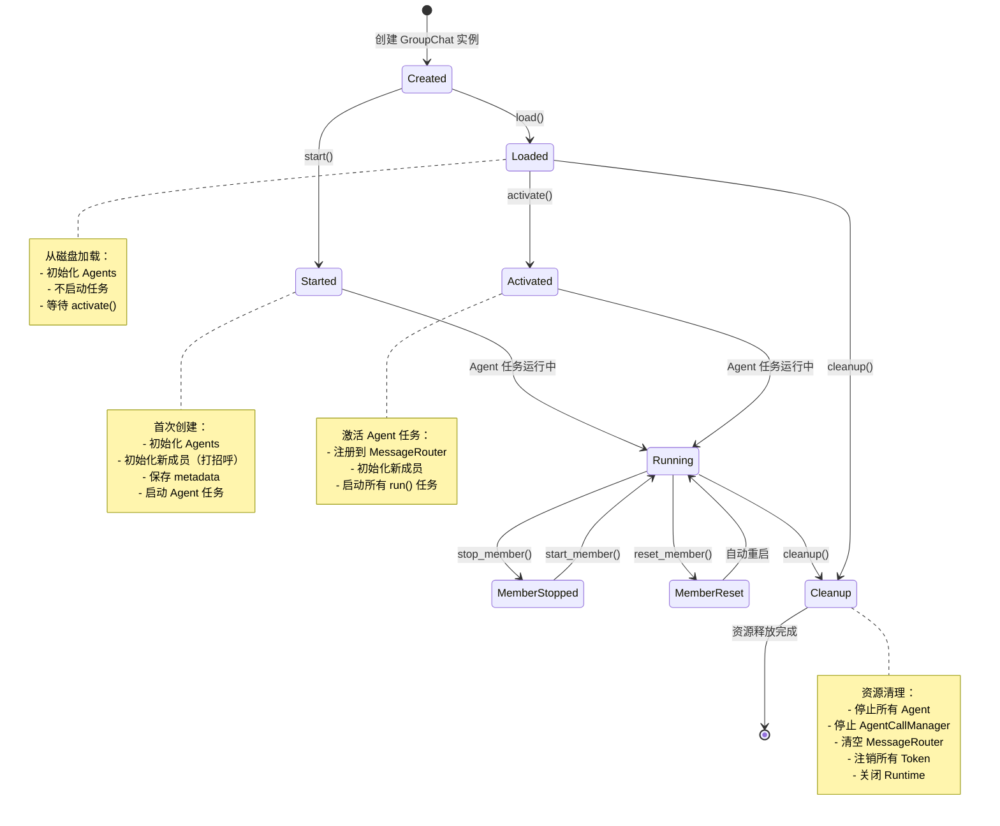

# 数据流：GroupChat 生命周期

**Flow 对象**：GroupChat

**对应 Spec**：
- `docs/specs/2026-05-31-core-agent-orchestration.md`
- `docs/specs/2026-06-03-group-chat-api.md`

## GroupChat 数据结构

```python
class GroupChat:
    # 基本信息
    group_chat_id: str                           # 群聊唯一标识（UUID）
    group_chat_name: str                         # 群聊显示名称
    team_members_name: list[str]                 # 团队成员角色名列表
    group_type: GroupChatType                    # 编排模式（MANAGER_ORCHESTRATE / SEQUENCE_EXECUTE）
    
    # Agent 实例
    manager: Manager | None                      # Manager 实例
    workers: dict[str, Worker]                   # Worker 实例字典（角色名 -> Worker）
    
    # 异步任务
    manager_task: asyncio.Task | None            # Manager.run() 任务
    worker_tasks: dict[str, asyncio.Task]        # Worker.run() 任务字典（角色名 -> Task）
    
    # 依赖组件（按依赖顺序初始化）
    runtime: GroupChatRuntime                    # 群聊运行时 Facade（持有 State 和 Repository）
    message_router: MessageRouter                # 消息路由器
    agent_call_manager: AgentCallManager         # Agent 调用管理器
    task_manager: TaskManager                    # 任务管理器

    # Heartbeat 定时任务
    _heartbeat_task: asyncio.Task | None         # Heartbeat 定时任务句柄（由 _start_agent_tasks 启动）
    _heartbeat_interval: int                     # Heartbeat 间隔（秒），默认 1200（20 分钟）

    # 状态标记
    _activated: bool                             # 是否已激活（Agent.run() 任务是否在运行）
    
    # Fork 配置（可选）
    fork_from_sessions: dict[str, str] | None    # Fork 模式：agent_name → source_session_id
```

**关键字段说明**：
- `_activated`：核心状态字段，标记群聊是否已激活（Agent 任务是否在运行）。影响 activate() 幂等性和 is_active 查询结果
- `group_type`：编排模式，仅作为 metadata 持久化，不影响 GroupChat 的生命周期行为（创建、激活、停止、删除流程两种模式完全一致）
- `runtime`：群聊运行时 Facade，提供群聊上下文状态的统一访问接口（消息历史、成员会话、元数据）
- `manager` / `workers`：Agent 实例，每个实例持有私有消息队列和 agent_token
- `manager_task` / `worker_tasks`：Agent.run() 的异步任务句柄，用于生命周期管理（停止、取消）

## 与其他数据流的耦合

### GroupChat ↔ Agent 状态

**Agent 状态字段**（`AgentMemberInfo.status`）：
- `idle`：空闲，等待消息
- `busy`：处理中
- `stopped`：已停止
- `error`：错误状态

**耦合关系**：

| GroupChat 状态变化 | Agent 状态影响 | 触发位置 |
|------------------|--------------|---------|
| 无 → 创建（start） | 所有 Agent: 无 → idle（初始化） | `GroupChat.start()` → `_init_agents()` |
| load → activate | 所有 Agent: 无影响（状态保留） | `GroupChat.activate()` |
| 运行中 → stop_member | 单个 Agent: * → stopped | `GroupChat.stop_member()` |
| 运行中 → start_member | 单个 Agent: stopped → idle | `GroupChat.start_member()` |
| 运行中 → reset_member | 单个 Agent: * → stopped → idle（重置） | `GroupChat.reset_member()` |
| 任意 → cleanup | 所有 Agent: * → （资源释放） | `GroupChat.cleanup()` |

**说明**：
- GroupChat 是 Agent 的生命周期管理者，负责创建、启动、停止 Agent
- Agent 状态存储在 `runtime.state.agent_member_infos` 中，由 GroupChat 协调更新
- Agent.run() 任务由 GroupChat 启动和管理，Task 句柄存储在 `manager_task` 和 `worker_tasks`

### GroupChat ↔ GroupChatManager

**GroupChatManager 职责**：全局单例，管理所有 GroupChat 实例和 Token 索引

**耦合关系**：

| GroupChat 生命周期 | GroupChatManager 操作 | 触发位置 |
|------------------|---------------------|---------|
| 创建 → start 完成 | 注册群聊 + 注册所有 Agent Token | `GroupChatService.create_group_chat()` |
| 磁盘 → load 完成 | 注册群聊 + 注册所有 Agent Token | `GroupChatManager.load_group_chat_from_disk()` |
| 删除（keep_data=false） | 注销群聊 + 注销所有 Token + 删除磁盘数据 | `GroupChatService.delete_group_chat()` |
| 删除（keep_data=true） | 注销群聊 + 注销所有 Token（保留磁盘） | `GroupChatService.delete_group_chat()` |

**说明**：
- GroupChatManager 持有 `_group_chats` 字典（group_chat_id → GroupChat）
- Token 索引（`_tokens`）用于 MCP 工具的身份验证：token → (agent_name, group_chat_id)
- 注销群聊时自动调用 `GroupChat.cleanup()` 清理所有资源

<key_function last_update="2026-06-23T05:41:09+08:00">
- agents_hub/api/services/group_chat_service.py
  - group_chat_service.GroupChatService.create_group_chat:81
  - group_chat_service.GroupChatService.load_group_chat:186
  - group_chat_service.GroupChatService.delete_group_chat:226
- agents_hub/core/orchestration/group_chat_manager.py
  - group_chat_manager.GroupChatManager.register:61
  - group_chat_manager.GroupChatManager.load_group_chat:100
  - group_chat_manager.GroupChatManager.load_group_chat_from_disk:300
  - group_chat_manager.GroupChatManager.activate_group_chat:137
  - group_chat_manager.GroupChatManager.unregister:153
  - group_chat_manager.GroupChatManager.register_token:182
  - group_chat_manager.GroupChatManager.unregister_tokens:196
- agents_hub/core/orchestration/group_chat.py
  - group_chat.GroupChat.start:161
  - group_chat.GroupChat.load:209
  - group_chat.GroupChat.activate:235
  - group_chat.GroupChat._start_agent_tasks:260
  - group_chat.GroupChat._init_agents:278
  - group_chat.GroupChat._initialize_new_members:846
  - group_chat.GroupChat._ensure_tokens:1646
  - group_chat.GroupChat._heartbeat_loop:1685
  - group_chat.GroupChat.add_member:356
  - group_chat.GroupChat.stop_member:1237
  - group_chat.GroupChat.start_member:1371
  - group_chat.GroupChat.reset_member:1452
  - group_chat.GroupChat.cleanup:1559
  - group_chat.GroupChat._cleanup_agent_queue:1143
  - group_chat.GroupChat._stop_agent_process:1342
</key_function>

## 流程概览



## 数据流节点

**核心链路**：
```
链路 1: API 创建群聊 → start() → 注册到 Manager → Agent 运行
链路 2: API 加载群聊 → load() → 注册到 Manager → activate() → Agent 运行
链路 3: API 删除群聊 → unregister() → cleanup() → 清理磁盘（可选）
链路 4: 成员管理 → stop/start/reset_member() → Agent 状态变化
```

## 链路 1：创建群聊（首次启动）

```
1. GroupChatService.create_group_chat()
   业务编排层，验证参数并创建 GroupChat 实例
   状态: 无→Created | 持久化: ❌ | 跨模块: api→core
   步骤: 验证 team_members 非空 → 验证 roles 存在 → 校验项目路径 → 创建 GroupChat 实例

2. GroupChat.start()
   启动群聊，完整初始化所有 Agent 并立即启动任务
   状态: Created→Started | 持久化: ✅ | 跨模块: ❌ core 内
   步骤: 加载上下文数据 → 初始化 agents → 确保 tokens → 初始化新成员 → 保存 metadata → 启动 agent 任务

3. GroupChat._init_agents()
   初始化 Manager 和 Workers，注册到 MessageRouter
   状态: 无变化 | 持久化: ❌ | 跨模块: ❌ core 内
   步骤: 创建 Manager 实例 → 创建所有 Worker 实例 → 注册到 MessageRouter（包括 user 伪 Agent）

4. GroupChat._ensure_tokens()
   确保所有 Agent 都有 token 并注册到 GroupChatManager
   状态: 无变化 | 持久化: ✅ | 跨模块: ❌ core 内
   步骤: 为每个 Agent 生成或恢复 token → 注册到 GroupChatManager.register_token() → 保存到 agent_member.json

5. GroupChat._initialize_new_members()
   初始化新成员（第一次进入群聊的成员执行打招呼）
   状态: 无变化 | 持久化: ✅ | 跨模块: ❌ core 内
   步骤: 检查哪些成员无 session_id → 并发执行所有新成员初始化 → 保存 session 和消息

6. GroupChat._start_agent_tasks()
   启动所有 Agent 的 run() 任务和事件循环
   状态: Started→Running（_activated=True） | 持久化: ❌ | 跨模块: ❌ core 内
   步骤: 创建 Manager 任务 → 创建所有 Worker 任务 → 启动 AgentCallManager 清理循环 → 启动 heartbeat 循环

7. GroupChatService.create_group_chat() [续]
   注册到 GroupChatManager 并返回 GroupChatInfo
   状态: 无变化 | 持久化: ❌ | 跨模块: core→api
   步骤: 调用 GroupChatManager.register() → 构造并返回 GroupChatInfo
```

## 链路 2：加载已有群聊

```
1. GroupChatService.load_group_chat()
   加载群聊（从内存或磁盘）
   状态: 无→Loading | 持久化: ❌ | 跨模块: api→core
   步骤: 调用 GroupChatManager.load_group_chat()

2. GroupChatManager.load_group_chat()
   优先从内存加载，不存在时从磁盘加载
   状态: Loading | 持久化: ❌ | 跨模块: ❌ core 内
   步骤: 检查内存是否存在 → 内存命中直接返回 → 内存未命中调用 load_group_chat_from_disk()

3. GroupChatManager.load_group_chat_from_disk()
   从磁盘加载 GroupChat 到内存
   状态: 无→Loaded | 持久化: ❌（读取） | 跨模块: ❌ core 内
   步骤: 扫描磁盘找到 project_path → 读取 metadata 验证 → 读取 agent_member 获取成员列表 → 创建 GroupChat 实例 → 调用 load()

4. GroupChat.load()
   加载已有群聊（不启动 Agent 任务）
   状态: 无→Loaded | 持久化: ✅（_ensure_tokens 保存 agent_member.json） | 跨模块: ❌ core 内
   步骤: 加载上下文数据 → 初始化 agents → 确保 tokens（新 token 时保存） → 不设置 _activated（等待 activate）

5. GroupChatManager.load_group_chat_from_disk() [续]
   注册到 GroupChatManager
   状态: Loaded | 持久化: ❌ | 跨模块: ❌ core 内
   步骤: 调用 register() 注册群聊

6. GroupChat.activate()
   激活群聊：启动所有 Agent 的 run() 任务（在发送消息时触发）
   状态: Loaded→Activated | 持久化: ✅（间接，_initialize_new_members 保存 session 和消息） | 跨模块: ❌ core 内
   步骤: 幂等性检查 → 确保 agents 注册到 MessageRouter → 初始化新成员 → 启动 agent 任务
```

## 链路 3：删除群聊

```
1. GroupChatService.delete_group_chat()
   删除群聊（内存 + 磁盘可选）
   状态: Running/Loaded→Deleting | 持久化: ✅（可选） | 跨模块: api→core
   步骤: 读取 project_path（用于磁盘删除） → 调用 GroupChatManager.unregister() → 删除磁盘数据（如果 keep_data=false）

2. GroupChatManager.unregister()
   注销 GroupChat，确保资源安全释放
   状态: Deleting→Cleanup | 持久化: ❌ | 跨模块: ❌ core 内
   步骤: 获取 GroupChat 实例 → 调用 cleanup() → 从 _group_chats 删除 → 注销所有 token

3. GroupChat.cleanup()
   清理所有资源，确保安全退出
   状态: Cleanup→Deleted | 持久化: ❌ | 跨模块: ❌ core 内
   步骤: 停止所有 Agent → 停止 heartbeat → 等待任务完成（超时强制取消） → 停止 AgentCallManager → 清空 MessageRouter → 关闭 Runtime → 注销 tokens → 清空引用

4. GroupChatService.delete_group_chat() [续]
   删除磁盘数据（如果 keep_data=false）
   状态: Deleted | 持久化: ✅（删除） | 跨模块: ❌ api 内
   步骤: 删除群聊目录（teams/{project}/{group_chat_id}/）
```

## 链路 4：成员生命周期管理

### 停止成员

```
1. GroupChat.stop_member()
   停止单个 Agent 的运行
   状态: *→stopped | 持久化: ✅ | 跨模块: ❌ core 内
   步骤: 查找 Agent → 更新状态为 stopped 并保存 → 终止 CLI 进程 → 停止 run() 循环 → 强制取消任务 → 清空队列并闭环 AgentCall → 注销 MessageRouter

2. GroupChat._stop_agent_process()
   终止 Agent 正在运行的 CLI 进程
   状态: 无变化 | 持久化: ❌ | 跨模块: core→agent_bridge
   步骤: 获取 session_id → 调用 agent_platform_client.stop_session()

3. GroupChat._cleanup_agent_queue()
   清空 Agent 的消息队列，并闭环所有未完成的 AgentCall
   状态: PENDING/RUNNING→FAILED | 持久化: ✅ | 跨模块: ❌ core 内
   步骤: 获取未完成 AgentCall → 标记为 FAILED → 通知调用方（Agent 调用方发 NOTIFICATION，user 调用方写群聊历史） → 清空队列
```

### 启动成员

```
1. GroupChat.start_member()
   重新启动已停止的 Agent
   状态: stopped→idle | 持久化: ✅ | 跨模块: ❌ core 内
   步骤: 查找 Agent → 验证状态为 stopped → 重置 _run 标志 → 创建新任务 → 重新注册到 MessageRouter → 更新状态为 idle
```

### 重置成员

```
1. GroupChat.reset_member()
   重置 Agent（清空上下文并重新初始化）
   状态: *→stopped→idle | 持久化: ✅ | 跨模块: ❌ core 内
   步骤: 查找 Agent → 如果运行中先停止 → 清空 session → 清空队列 → 重置 context_usage → 重新初始化（打招呼） → 自动启动 → 更新状态为 idle
```

### 添加成员

```
1. GroupChat.add_member()
   增量添加单个成员（热重载安全）
   状态: 无→idle | 持久化: ✅ | 跨模块: ❌ core 内
   步骤: 验证角色存在 → 幂等检查 → 创建 Worker → 注册到 MessageRouter → 生成并注册 token → 启动任务（如果群聊已激活） → 初始化新成员
```

## 异常与清理

```
1. GroupChat.cleanup() [超时处理]
   等待任务完成时超时，强制取消所有任务
   状态: 任意→Deleted | 持久化: ❌ | 跨模块: ❌ core 内
   步骤: 等待任务自然退出（超时 10 秒） → 超时则强制取消所有任务 → 继续清理其他资源

2. GroupChat._cleanup_agent_queue() [闭环失败]
   向已停止的 Agent 发送完成通知失败
   状态: 无变化 | 持久化: ❌ | 跨模块: ❌ core 内
   步骤: 捕获异常 → 记录警告日志 → 继续清理其他 AgentCall（不阻断流程）

3. GroupChatService.delete_group_chat() [磁盘删除失败]
   删除群聊目录时权限错误或 IO 错误
   状态: 无变化 | 持久化: ❌（部分） | 跨模块: ❌ api 内
   步骤: 捕获 PermissionError/OSError → 抛出 ExternalServiceError
```

## 反常设计说明

### fork_from_sessions 字段实际未使用

**设计意图**：支持 Fork 群聊功能，从已有群聊复制会话状态创建新群聊。

**当前实现**：
- `__init__` 中接受 `fork_from_sessions` 参数
- `_initialize_new_members` 中有 fork 逻辑处理（Codex 会复制会话文件，Claude 使用 --fork-session）
- 但 API 层的 `create_group_chat` 和 `load_group_chat_from_disk` 都不传递此参数，始终为 None

**为什么是反常的**：
- 字段存在且有完整实现逻辑，但实际调用路径中从未使用
- Fork 功能已实现但未对外暴露（API 层未提供 fork 端点调用）

**影响范围**：
- 不影响正常功能（fork 逻辑被跳过）
- Fork 功能存在但需要前端和 API 层支持才能启用

**相关位置**：
- `GroupChat.__init__()` agents_hub/core/orchestration/group_chat.py:49
- `GroupChat._initialize_new_members()` agents_hub/core/orchestration/group_chat.py:358

### _activated 与 is_active 的语义差异

**设计意图**：`_activated` 表示 Agent 任务是否在运行，`is_active` 是 API 对外暴露的状态。

**当前实现**：
- `_activated` 是 GroupChat 的内部标记（bool）
- `is_active` 由 `GroupChatManager.is_active_group()` 查询，实际就是返回 `group_chat._activated`
- 两者完全等价，没有任何业务差异

**为什么是反常的**：
- 引入了两个等价概念，增加理解成本
- `is_active` 方法名暗示是更高层的业务状态，但实现上只是透传 `_activated`

**影响范围**：
- 不影响功能（两者同步）
- 影响代码理解（需要跟踪两个字段）

**相关位置**：
- `GroupChat._activated` agents_hub/core/orchestration/group_chat.py:86
- `GroupChatManager.is_active_group()` agents_hub/core/orchestration/group_chat_manager.py:78

## 相关文档

### Spec 文档
- **Core Agent & Orchestration**：`docs/specs/2026-05-31-core-agent-orchestration.md`
  - Agent 执行模型、角色模型、GroupChat 生命周期
- **Group Chat API 模块**：`docs/specs/2026-06-03-group-chat-api.md`
  - RESTful 接口定义、创建/查询/删除端点

### 架构文档
- **Core 架构概览**：`docs/specs/2026-05-31-core-overview.md`
  - Core 层级划分（foundation/communication/context/agent/orchestration）

### ADR
- **Agent Token 身份模型**：`docs/ADR/0007-agent-token-identity-model.md`
  - Token 生命周期和注入方式、GroupChatManager 的 token 索引管理
- **Core Runtime SSOT 选择**：`docs/ADR/0009-core-runtime-ssot-choice.md`
  - 引入 GroupChatRuntime 和 GroupChatRuntimeState、运行态以内存为 SSOT
- **GroupChatContext 中间层移除**：`docs/ADR/2026-06-16-context-layer-removal.md`
  - 从 "GroupChat → Context → Runtime" 演进到 "GroupChat → Runtime"
- **实时边界**：`docs/ADR/0008-realtime-boundary.md`
  - 群聊状态变化时的前端刷新通知机制
