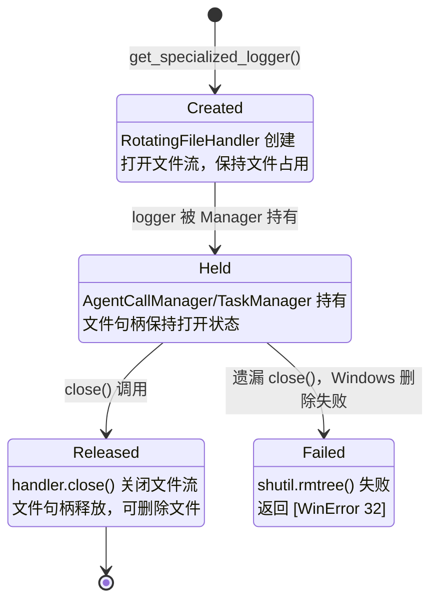

## 版本

| 版本 | 更新内容 |
| ---- | -------- |
| 1.0 | 初始版本，记录 logger 文件句柄生命周期和资源清理问题修复 |

# 数据流：Logger 文件句柄生命周期

**Flow 对象**：Logger FileHandler（RotatingFileHandler）
**对应 Spec**：无（基础设施层，未单独定义 spec）

## Logger FileHandler 数据结构

```
# RotatingFileHandler 状态
handler: RotatingFileHandler  # 文件句柄实例
  - stream: IO  # 底层文件流（保持文件打开状态）
  - baseFilename: str  # 日志文件路径
  - mode: str  # 文件打开模式（默认 'a'）
  - encoding: str  # 文件编码（默认 'utf-8'）

# Logger 持有关系
logger: logging.Logger
  - handlers: list[Handler]  # handler 列表（可持有多个文件句柄）
  - name: str  # logger 名称（格式：{manager_type}.{group_chat_id}）
```

**关键字段说明**：
- `stream`：底层文件流，保持文件打开状态直到 handler.close() 被调用。在 Windows 上，打开的文件无法被删除
- `handlers`：logger 可持有多个 handler，必须遍历关闭所有 handler 才能释放文件句柄

## 与其他数据流的耦合

### Logger FileHandler ↔ GroupChat 生命周期

**GroupChat 状态**：active → cleanup → deleted

**耦合关系**：

| Logger FileHandler 状态变化 | GroupChat 影响 | 触发位置 |
|---------------------------|---------------|---------|
| 创建（logger 初始化） | GroupChat 持有 AgentCallManager 和 TaskManager，两者各持有专用 logger | AgentCallManager.__init__:47, TaskManager.__init__:40 |
| 释放（handler.close()） | 释放文件句柄，允许删除群聊目录 | AgentCallManager.close(), TaskManager.close() |
| 未释放（遗漏） | Windows 上 shutil.rmtree() 失败，返回 502 错误 | group_chat_service.py:259 |

**说明**：GroupChat 在 cleanup 时必须关闭所有 logger handler，否则在 Windows 上无法删除群聊目录。AgentCallManager 持有 `agent_calls.log`，TaskManager 持有 `tasks.log`。

<key_function last_update="2026-06-19T09:30:00+08:00">
- agents_hub/utils/logger.py
  - logger.get_specialized_logger:136
- agents_hub/core/communication/agent_call_manager.py
  - agent_call_manager.AgentCallManager.__init__:21
  - agent_call_manager.AgentCallManager.close:506
- agents_hub/core/communication/task_manager.py
  - task_manager.TaskManager.__init__:28
  - task_manager.TaskManager.close:323
- agents_hub/core/orchestration/group_chat.py
  - group_chat.GroupChat.cleanup:1027
- agents_hub/api/services/group_chat_service.py
  - group_chat_service.GroupChatService.delete_group_chat:230
</key_function>

## 流程概览



## 数据流节点

**业务场景说明**：
1. **链路 1**：Logger 创建（GroupChat 初始化时）
2. **链路 2**：Logger 释放（GroupChat 正常清理时）
3. **链路 3**：Logger 释放遗漏（导致文件删除失败）

## 链路 1：Logger 创建

1. GroupChat.__init__()
   创建 GroupChat 实例，初始化 AgentCallManager 和 TaskManager
   状态: 无→创建 | 持久化: ❌ | 跨模块: orchestration→communication
   步骤: 创建 AgentCallManager → 创建 TaskManager → 两者各自创建专用 logger

2. AgentCallManager.__init__()
   创建专用 logger，写入 agent_calls.log
   状态: 无→创建 | 持久化: ✅（打开文件） | 跨模块: communication→utils
   步骤: 计算日志目录 → 调用 get_specialized_logger → 创建 RotatingFileHandler

3. TaskManager.__init__()
   创建专用 logger，写入 tasks.log
   状态: 无→创建 | 持久化: ✅（打开文件） | 跨模块: communication→utils
   步骤: 计算日志目录 → 调用 get_specialized_logger → 创建 RotatingFileHandler

4. get_specialized_logger()
   创建 RotatingFileHandler 并添加到 logger
   状态: 无→创建 | 持久化: ✅（打开文件） | 跨模块: ❌
   步骤: 获取 logger 实例 → 检查是否已有 handler → 创建 RotatingFileHandler → 添加到 logger

## 链路 2：Logger 正常释放

1. GroupChatService.delete_group_chat()
   接收删除请求，调用 GroupChatManager.unregister()
   状态: active→cleanup | 持久化: ❌ | 跨模块: api→orchestration
   步骤: 获取 project_path → 调用 unregister → 删除磁盘数据

2. GroupChatManager.unregister()
   调用 GroupChat.cleanup() 清理资源
   状态: registered→unregistered | 持久化: ❌ | 跨模块: ❌
   步骤: 调用 cleanup → 从注册表删除 → 清理 tokens

3. GroupChat.cleanup()
   协调所有组件清理资源，包括关闭 logger
   状态: active→cleaned | 持久化: ❌ | 跨模块: orchestration→communication
   步骤: 停止 Agent → 停止 heartbeat → 等待任务完成 → 关闭 AgentCallManager → 关闭 TaskManager → 清空 MessageRouter → 关闭 Runtime

4. AgentCallManager.close()
   关闭 logger 所有 handler，释放文件句柄
   状态: held→released | 持久化: ✅（关闭文件） | 跨模块: ❌
   步骤: 遍历 logger.handlers → 调用 handler.close() → 移除 handler

5. TaskManager.close()
   关闭 logger 所有 handler，释放文件句柄
   状态: held→released | 持久化: ✅（关闭文件） | 跨模块: ❌
   步骤: 遍历 logger.handlers → 调用 handler.close() → 移除 handler

## 链路 3：Logger 释放遗漏（已修复）

1. GroupChat.cleanup()（修复前）
   未关闭 AgentCallManager 和 TaskManager 的 logger
   状态: active→incomplete | 持久化: ❌ | 跨模块: ❌
   步骤: 停止 Agent → 等待任务完成 → 清空引用（遗漏 logger 关闭）

2. shutil.rmtree()（失败）
   尝试删除群聊目录，因文件被占用而失败
   状态: 删除中→失败 | 持久化: ❌ | 跨模块: ❌
   步骤: 遍历目录 → 删除文件 → [WinError 32] 文件被占用

## 异常与清理

**异常场景**：Windows 上文件被占用时删除失败

**处理方式**：
- 修复前：抛出 ExternalServiceError，返回 502 Bad Gateway
- 修复后：在 cleanup 中显式关闭所有 logger handler，确保文件句柄释放

**清理顺序**（重要）：
1. 停止所有 Agent（停止写入）
2. 等待任务完成（确保无并发写入）
3. 关闭 AgentCallManager（释放 agent_calls.log）
4. 关闭 TaskManager（释放 tasks.log）
5. 删除磁盘数据（此时文件句柄已释放）

## 反常设计说明

### Logger 文件句柄管理

**设计意图**：Logger 应在 GroupChat 生命周期结束时自动关闭，释放文件句柄
**当前实现**：需要显式调用 close() 方法关闭 logger handler
**为什么是反常的**：Python 的 logging 模块不提供自动关闭机制，必须手动管理。这与大多数资源管理的 RAII 模式不同
**影响范围**：在 Windows 上导致文件删除失败，返回 502 错误
**相关位置**：`agents_hub/utils/logger.py:190`（RotatingFileHandler 创建）

### get_specialized_logger 幂等性

**设计意图**：相同名称的 logger 应返回同一实例，避免重复创建 handler
**当前实现**：检查 `if logger.handlers: return logger`，但不检查 handler 是否指向正确文件
**为什么是反常的**：如果 logger 名称冲突但日志文件不同，会返回错误的 logger 实例
**影响范围**：理论上可能导致日志写入错误文件，但当前命名规则（含 group_chat_id）避免了冲突
**相关位置**：`agents_hub/utils/logger.py:181`

## 相关文档

### Spec 文档
- 无（基础设施层，未单独定义 spec）

### 架构文档
- **架构地图**：`docs/ARCHITECTURE.md` - 系统整体架构

### ADR
- 无

### 上下文反馈
- **群聊文件锁修复反馈**：`docs/context_feedback/2026-06-19-group-chat-file-lock-fix.md` - 记录了问题发现和修复过程
