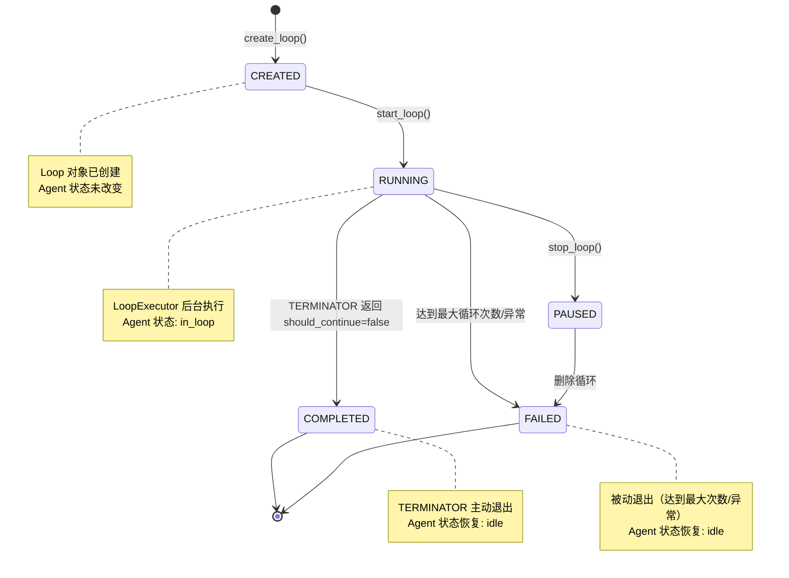

## 版本

| 版本 | 更新内容 |
| ---- | -------- |
| 1.0 | 创建 Loop Flow 初稿 |
| 1.1 | 添加内存管理策略说明 |

# 数据流：Loop 生命周期

**Flow 对象**：Loop
**对应 Spec**：`docs/specs/2026-06-21-loop.md`

## Loop 数据结构

```python
@dataclass
class Loop:
    # 基本信息
    loop_id: str                    # 循环唯一标识（UUID）
    group_chat_id: str              # 所属群聊 ID
    nodes: list[LoopNode]           # 节点列表
    initial_task: str               # 初始任务描述

    # 状态跟踪
    status: str                     # "created"/"running"/"paused"/"completed"/"failed"
    max_iterations: int             # 最大循环次数
    current_iteration: int          # 当前循环轮次（从 1 开始）
    current_node_index: int         # 当前节点索引

    # 时间信息
    created_at: datetime            # 创建时间
    updated_at: datetime            # 最后更新时间

    # 错误信息
    error_message: str | None       # 仅 FAILED 状态时有值
```

**关键字段说明**：
- `status`：核心状态流转字段，决定循环的当前阶段和可执行操作
- `current_iteration`：记录当前执行到第几轮，与 `max_iterations` 配合判断是否退出
- `current_node_index`：指向 `nodes` 列表中的当前位置，实现环形调度
- `nodes`：节点列表，至少 2 个节点，有且仅有 1 个 TERMINATOR

## 与其他数据流的耦合

### Loop ↔ Agent 状态

**Agent 状态字段**（`AgentMemberInfo.status`）：
- `idle`：空闲，可接收任务
- `in_loop`：正在参与循环
- `busy`：处理中
- `stopped`：已停止
- `error`：错误状态

**耦合关系**：

| Loop 状态变化 | Agent 状态影响 | 触发位置 |
|--------------|--------------|---------|
| CREATED → RUNNING | Agent.status: idle → in_loop | `GroupChat.create_and_start_loop()` |
| RUNNING → COMPLETED | Agent.status: in_loop → idle | `LoopExecutor._cleanup()` |
| RUNNING → FAILED | Agent.status: in_loop → idle | `LoopExecutor._cleanup()` |
| RUNNING → PAUSED | Agent.status: in_loop → idle | `GroupChat.stop_loop()` |
| PAUSED → RUNNING | Agent.status: idle → in_loop | **未实现**（当前无 resume 方法） |

**说明**：
- Agent 进入 `in_loop` 状态后，只接收同一循环的消息或 Manager 的控制信号
- 循环结束后，Agent 状态自动恢复为 `idle`
- Agent 的 `current_loop_id` 字段记录当前所在的循环 ID
- `stop_loop()` 的 Agent 恢复机制：先调用 `stop_member()` 再调用 `start_member()`，最后手动设置 status 为 "idle"（stop-then-start 模式）

<key_function last_update="2026-06-22T20:27:51+08:00">
- agents_hub/core/agent/base_agent.py
  - base_agent.Agent._should_accept_message:104
  - base_agent.Agent.set_loop_completion_queue:100
  - base_agent.Agent._notify_message_completion:969
</key_function>

### Loop ↔ AgentCall

**AgentCall 状态字段**：
- `pending`：等待处理
- `running`：处理中
- `completed`：已完成
- `failed`：失败

**耦合关系**：

| Loop 操作 | AgentCall 影响 | 触发位置 |
|----------|--------------|---------|
| 发送节点消息 | 创建新的 AgentCall（message_type=LOOP_MESSAGE） | `LoopExecutor._send_to_node()` |
| 节点完成 | AgentCall 状态变为 completed | `Agent._process_message()` |
| 重试节点 | 复用同一个 call_id | `LoopExecutor._execute_node_with_retry()` |
| 循环结束 | 未完成的 AgentCall 标记为 failed | `LoopExecutor._cleanup()` |

**说明**：
- 循环内部消息使用 `MessageType.LOOP_MESSAGE`，不自动保存到群聊历史
- LoopExecutor 通过 `_save_loop_result()` 手动保存最终结果到群聊历史

<key_function last_update="2026-06-21T10:00:00+08:00">
- agents_hub/core/orchestration/loop_executor.py
  - loop_executor.LoopExecutor._send_to_node:550
  - loop_executor.LoopExecutor._save_loop_result:794
  - loop_executor.LoopExecutor._execute_node_with_retry:707
</key_function>

### Loop ↔ GroupChat

**GroupChat 相关字段**：
- `active_loops`：活跃循环字典（loop_id → LoopExecutor）
- `_loop_tasks`：循环后台任务字典（loop_id → asyncio.Task）
- `_loop_queues`：循环完成队列字典（loop_id → asyncio.Queue）

**LoopManager 相关字段**：
- `_loops`：内存缓存字典（loop_id → Loop），实现单 Loop 保持策略

**耦合关系**：

| Loop 操作 | GroupChat 影响 | LoopManager 内存影响 | 触发位置 |
|----------|--------------|---------------------|---------|
| 创建循环 | LoopManager 创建 Loop 对象 | 清空 `_loops`，加载新 Loop | `GroupChat.create_loop()` |
| 启动循环 | 注册到 active_loops、_loop_tasks、_loop_queues | 懒加载（如不在内存），清空其他 Loop | `GroupChat.create_and_start_loop()` |
| 停止循环 | 从 active_loops 等字典中移除 | 保留在 `_loops`（PAUSED 需要查询） | `GroupChat.stop_loop()` |
| 循环结束 | 触发 `_on_loop_task_done` 回调清理 | 保留在 `_loops`（COMPLETED/FAILED 需要查询） | `LoopExecutor.run()` |
| 删除循环 | 无影响 | 从 `_loops` 移除，写墓碑记录 | `GroupChat.delete_loop()` |

**内存管理说明**：
- LoopManager 初始化时 `_loops = {}`，不自动加载历史
- `create_loop()` 和 `start_loop()` 时清空其他 Loop，保持单 Loop 在内存
- COMPLETED/FAILED/PAUSED 状态保留在内存，方便查询状态
- `list_loops()` 直接读取 JSONL，不依赖内存

<key_function last_update="2026-06-21T10:00:00+08:00">
- agents_hub/core/orchestration/group_chat.py
  - group_chat.GroupChat.create_loop:380
  - group_chat.GroupChat.create_and_start_loop:424
  - group_chat.GroupChat.stop_loop:557
  - group_chat.GroupChat._on_loop_task_done:514
</key_function>

## 流程概览



## 数据流节点

**主要链路**：
```
链路 1: 创建循环 → 启动循环 → 执行节点 → 节点完成 → 检查退出 → 下一个节点 → ...
链路 2: 手动停止循环 → 发送终止信号 → 取消后台任务 → 恢复 Agent 状态
链路 3: 循环结束 → 清理资源 → 持久化最终状态
链路 4: 内存管理 → 清空旧 Loop → 懒加载 → 保持单 Loop
```

## 链路 4：内存管理（新增）

```
1. LoopManager.__init__()
   初始化循环管理器
   内存: _loops = {} | 持久化: ❌ | 跨模块: ❌
   步骤: 不调用 _load_from_persistence()，保持空字典

2. LoopManager.create_loop()
   创建新循环时清空所有旧 Loop
   内存: 清空 _loops → 加载新 Loop | 持久化: ✅ | 跨模块: ❌
   步骤: 
   - 获取并发锁
   - 清空 _loops.clear()（清理所有旧 Loop）
   - 转换节点对象 → 校验 → 构造 Loop
   - _loops[loop_id] = loop（加载新 Loop）
   - 持久化到 JSONL

3. GroupChat.create_and_start_loop()
   启动循环时懒加载并清空其他
   内存: 懒加载目标 Loop → 清空其他 | 持久化: ✅ | 跨模块: ❌
   步骤:
   - 调用 loop_manager.get_loop(loop_id)
   - 如果不在内存，触发懒加载（从 JSONL 读取）
   - 清空其他 Loop（保持单 Loop）
   - 更新状态为 RUNNING

4. LoopManager.get_loop()（内部方法）
   查询 Loop，不在内存时抛出异常
   内存: 查询 _loops | 持久化: ❌ | 跨模块: ❌
   步骤: 
   - 检查 loop_id in _loops
   - 在内存：直接返回
   - 不在内存：抛出 LoopNotFoundError

5. LoopManager.get_loop_with_lazy_load()（需新增）
   查询 Loop，支持懒加载
   内存: 查询 _loops，不在则从 JSONL 加载 | 持久化: ❌读取 | 跨模块: ❌
   步骤:
   - 检查 loop_id in _loops
   - 在内存：直接返回
   - 不在内存：从 JSONL 加载 → 加入 _loops → 返回

6. LoopManager.list_loops()（需新增）
   查询所有历史 Loop
   内存: 不依赖 _loops | 持久化: ❌读取 | 跨模块: ❌
   步骤:
   - 读取 JSONL 文件
   - 解析所有 Loop 记录（跳过墓碑）
   - 添加 in_memory 标记（检查 loop_id in _loops）
   - 返回摘要信息

7. Loop 完成后
   保留在内存（COMPLETED/FAILED）
   内存: 保留在 _loops | 持久化: ✅ | 跨模块: ❌
   步骤:
   - LoopExecutor._cleanup() 更新状态
   - 持久化到 JSONL
   - 保留在 _loops 中（不移除）

8. LoopManager.delete_loop()
   删除循环
   内存: 从 _loops 移除 | 持久化: ✅墓碑 | 跨模块: ❌
   步骤:
   - 校验状态（不能是 RUNNING）
   - del _loops[loop_id]
   - 写入墓碑记录到 JSONL
```

## 链路 1：创建并启动循环

```
1. mcp.server.create_loop()
   Manager 调用 MCP 工具创建循环定义
   状态: 无→CREATED | 持久化: ✅ | 跨模块: mcp→core
   步骤: 校验参数 → 创建 Loop 对象 → 持久化到 loops.jsonl

2. GroupChat.create_loop()
   群聊层创建循环，委托给 LoopManager
   状态: CREATED 不变 | 持久化: ✅ | 跨模块: ❌ core 内
   步骤: 调用 LoopManager.create_loop() → 返回 Loop 对象

3. LoopManager.create_loop()
   循环管理器执行创建逻辑
   状态: 无→CREATED | 持久化: ✅ | 跨模块: ❌ core 内
   步骤: 获取并发锁 → 转换节点对象 → 校验 → 构造 Loop → 保存

4. mcp.server.start_loop()
   Manager 调用 MCP 工具启动循环
   状态: CREATED→RUNNING | 持久化: ✅ | 跨模块: mcp→core
   步骤: 校验状态 → 创建完成队列 → 注入 Agent → 启动后台任务

5. GroupChat.create_and_start_loop()
   群聊层启动循环，创建 LoopExecutor
   状态: CREATED→RUNNING | 持久化: ✅ | 跨模块: ❌ core 内
   步骤: 验证状态 → 创建 completion_queue → 设置 Agent 状态 → 注册系统身份 → 创建 LoopExecutor → 启动后台任务

6. LoopExecutor.run()
   循环执行器主循环
   状态: RUNNING 不变 | 持久化: ✅ | 跨模块: ❌ core 内
   步骤: 发送初始任务 → 等待完成通知 → 处理完成 → 检查退出 → 下一个节点
```

## 链路 2：执行节点

```
1. LoopExecutor._send_to_node()
   发送消息给指定节点的 Agent
   状态: RUNNING 不变 | 持久化: ❌ | 跨模块: ❌ core 内
   步骤: 构造循环上下文 → 创建 AgentCall → 发送到 Agent 队列

2. LoopExecutor._build_loop_context()
   构造循环专用上下文
   状态: 无变化 | 持久化: ❌ | 跨模块: ❌ core 内
   步骤: 拼接 LOOP_NODE_ROLE → LOOP_OUTPUT_SCHEMA → PREVIOUS_NODE_OUTPUT → LOOP_TERMINATION_CHECK（仅 TERMINATOR）

3. Agent._process_message()
   Agent 处理循环消息
   状态: Agent.status: in_loop 不变 | 持久化: ❌ | 跨模块: ❌ core 内
   步骤: 从队列取出消息 → 使用 msg.content 作为上下文 → 调用 LLM 执行 → 投递完成通知

4. Agent._notify_message_completion()
   Agent 向 completion_queue 投递完成事件
   状态: 无变化 | 持久化: ❌ | 跨模块: ❌ core 内
   步骤: 构造完成通知 → 投递到 completion_queue

5. LoopExecutor._handle_node_completion()
   处理节点完成通知
   状态: 可能更新 current_iteration/current_node_index | 持久化: ✅ | 跨模块: ❌ core 内
   步骤: 验证通知 → 校验输出 → 保存结果 → 检查退出 → 推进节点 → 发送下一个节点
```

## 链路 3：输出校验和重试

```
1. LoopExecutor._validate_node_output()
   校验节点输出格式
   状态: 无变化 | 持久化: ❌ | 跨模块: ❌ core 内
   步骤: 按节点类型分发校验 → 普通节点校验字段 → TERMINATOR 节点校验字段+决策标签

2. LoopExecutor._validate_schema_fields()
   校验必需字段是否存在
   状态: 无变化 | 持久化: ❌ | 跨模块: ❌ core 内
   步骤: 遍历 output_schema_fields → 字符串匹配检查

3. LoopExecutor._validate_terminator_output()
   校验 TERMINATOR 节点的决策标签
   状态: 无变化 | 持久化: ❌ | 跨模块: ❌ core 内
   步骤: 校验业务字段 → 正则解析 loop_decision → 提取 should_continue 值

4. LoopExecutor._execute_node_with_retry()
   校验失败时触发重试
   状态: 无变化 | 持久化: ❌ | 跨模块: ❌ core 内
   步骤: 构造错误提示 → 复用 call_id → 重新发送消息 → 等待完成
```

## 链路 4：检查退出条件

```
1. LoopExecutor._check_exit_condition()
   检查循环是否应该退出
   状态: 可能变为 COMPLETED 或 FAILED | 持久化: ✅ | 跨模块: ❌ core 内
   步骤: 检查 TERMINATOR 的 should_continue 标志 → 检查是否达到最大循环次数

2. LoopExecutor._advance_to_next_node()
   推进到下一个节点（环形调度）
   状态: current_node_index 更新 | 持久化: ✅ | 跨模块: ❌ core 内
   步骤: 计算下一个节点索引 → 如果回到第一个节点则 current_iteration + 1
```

## 链路 5：停止循环

```
1. mcp.server.stop_loop()
   Manager 调用 MCP 工具停止循环
   状态: RUNNING→PAUSED | 持久化: ✅ | 跨模块: mcp→core
   步骤: 校验状态 → 调用 GroupChat.stop_loop()

2. GroupChat.stop_loop()
   群聊层停止循环
   状态: RUNNING→PAUSED | 持久化: ✅ | 跨模块: ❌ core 内
   步骤: 验证状态 → 发送终止信号到 completion_queue → 取消后台任务 → 恢复 Agent 状态 → 更新状态

3. LoopExecutor 收到终止信号
   循环执行器处理终止
   状态: 退出主循环 | 持久化: ❌ | 跨模块: ❌ core 内
   步骤: 从 completion_queue 收到终止信号 → 退出 while 循环
```

## 链路 6：循环结束和清理

```
1. LoopExecutor._cleanup()
   清理循环资源
   状态: Agent 状态恢复为 idle | 持久化: ✅ | 跨模块: ❌ core 内
   步骤: 恢复 Agent 状态 → 清除 completion_queue 引用 → 持久化最终状态

2. GroupChat._on_loop_task_done()
   群聊层清理循环注册信息
   状态: 无变化 | 持久化: ❌ | 跨模块: ❌ core 内
   步骤: 注销 "loop" 系统身份 → 清理 active_loops → 清理 _loop_tasks → 清理 _loop_queues
```

## 异常与清理

```
1. LoopExecutor._emergency_stop()
   执行异常时紧急停止循环
   状态: RUNNING→FAILED | 持久化: ✅ | 跨模块: ❌ core 内
   步骤: 设置错误信息 → 调用 _cleanup()

2. LoopExecutor._handle_node_timeout()
   节点执行超时处理
   状态: 可能变为 FAILED | 持久化: ✅ | 跨模块: ❌ core 内
   步骤: 检查 Agent 状态 → 区分 CLI 执行失败和节点执行超时 → 调用 _emergency_stop()
```

## 反常设计说明

### 达到最大循环次数标记为 FAILED

**设计意图**：当循环达到最大次数时，应该标记为任务未完成（FAILED），以便 Manager 知道需要干预。

**当前实现**：
- `current_iteration > max_iterations` 时，状态设为 FAILED
- `error_message` 设为 "达到最大循环次数"

**为什么是反常的**：
- 用户可能期望"达到最大循环次数"是一种正常结束（COMPLETED）
- 当前设计将"TERMINATOR 主动退出"和"达到最大次数退出"区分为 COMPLETED 和 FAILED
- 这可能导致用户困惑，因为循环确实执行了所有轮次

**影响范围**：
- 不影响循环的实际执行逻辑
- 影响状态语义的理解（FAILED 通常意味着"出错"，而不是"正常结束"）
- Manager 需要检查 `error_message` 才能区分"真正失败"和"达到最大次数"

**相关位置**：
- `LoopExecutor._check_exit_condition()` agents_hub/core/orchestration/loop_executor.py:629

### has_agent_response 字段在循环消息中的处理

**设计意图**：TASK 调用应该通过显式 MCP 工具回复闭环后才能进入 COMPLETED 状态。

**当前实现**：
- 循环消息使用 `MessageType.LOOP_MESSAGE`，不走标准的 TASK 闭环流程
- Agent 处理完循环消息后，直接投递完成通知到 `completion_queue`
- `has_agent_response` 字段在循环消息中不被使用

**为什么是反常的**：
- 字段名暗示 "Agent 是否已通过显式工具回复"，但在循环消息中完全不使用
- 循环消息绕过了标准的 TASK 闭环机制

**影响范围**：
- 不影响循环的正常执行
- 影响对消息闭环机制的理解

**相关位置**：
- `Agent._notify_message_completion()` agents_hub/core/agent/base_agent.py:969

### PAUSED → RUNNING 状态转换未实现

**设计意图**：`LoopManager._VALID_TRANSITIONS` 允许 PAUSED → RUNNING 状态转换，设计上应该支持恢复已暂停的循环。

**当前实现**：
- `LoopManager._VALID_TRANSITIONS` 字典中定义了 PAUSED → RUNNING 的转换
- 但 `GroupChat.create_and_start_loop()` 方法检查 `loop.status != LoopStatus.CREATED.value` 时会抛出 `LoopStateError`
- 当前没有任何方法可以触发 PAUSED → RUNNING 的转换

**为什么是反常的**：
- 状态机定义了 PAUSED → RUNNING 的转换路径
- 但实际代码中没有实现 resume 功能
- `stop_loop()` 后循环无法恢复，只能删除重建

**影响范围**：
- `stop_loop()` 后循环永久停留在 PAUSED 状态
- 用户需要删除循环并重新创建，而不是恢复

**相关位置**：
- `LoopManager._VALID_TRANSITIONS` agents_hub/core/orchestration/loop_manager.py:60
- `GroupChat.create_and_start_loop()` agents_hub/core/orchestration/group_chat.py:449

## 相关文档

### Spec 文档
- **Loop 循环执行**：`docs/specs/2026-06-21-loop.md` - Loop 功能的完整规格定义

### 架构文档
- **Core 架构概览**：`docs/specs/2026-05-31-core-overview.md` - Core 层级划分
- **Core Agent & Orchestration**：`docs/specs/2026-05-31-core-agent-orchestration.md` - Agent 执行逻辑、GroupChat 编排机制

### ADR
- **多 Agent 消息架构**：`docs/ADR/0005-multi-agent-message-architecture.md` - MessageRouter + 私有队列的点对点路由方案
- **Agent Token 身份模型**：`docs/ADR/0007-agent-token-identity-model.md` - MCP Tool 调用者身份校验逻辑
