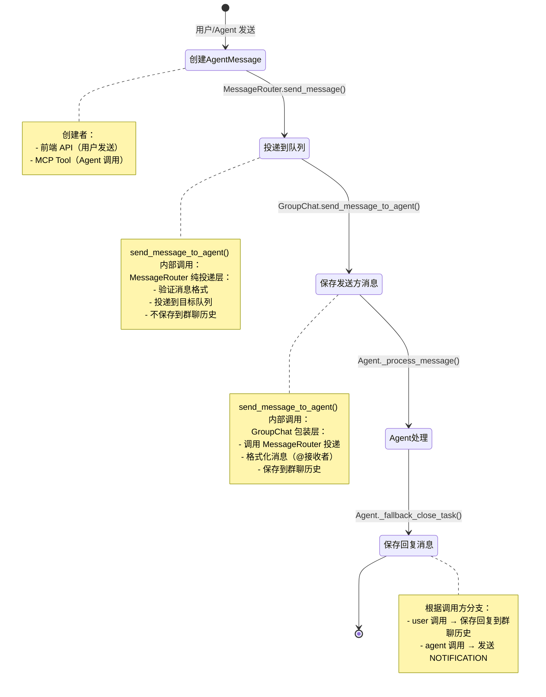

# 数据流：Message 生命周期

**Flow 对象**：Message（从用户/Agent 发出到保存到群聊历史）

**对应 Spec**：docs/specs/2026-06-05-message-flow-and-persistence.md

## Message 数据结构

### AgentMessage（通信层消息）

```python
@dataclass
class AgentMessage:
    # 基本信息
    call_id: str                        # 调用唯一标识（关联 AgentCall）
    content: str                        # 消息内容
    send_from: str                      # 发送者（user 或 agent 名称）
    send_to: str                        # 接收者（agent 名称）
    
    # 消息类型
    session_type: SessionType           # MAIN（群聊）/ BTW（单聊）
    message_type: MessageType           # TASK（需回复）/ NOTIFICATION（通知）
    
    # 元数据
    timestamp: datetime                 # 创建时间
    files: list[dict] | None           # 上传文件列表
```

**关键字段说明**：
- `call_id`：与 AgentCall 一一对应，用于追踪消息处理状态
- `message_type`：决定 Agent 是否需要回复闭环（TASK 需要，NOTIFICATION 不需要）
- `send_from`：决定完成后的分支逻辑（user → 写入群聊历史，agent → 发送 NOTIFICATION）
- `files`：附件信息，会传递到 AgentResult 中保存到群聊历史

### AgentResult（持久化层消息）

```python
@dataclass
class AgentResult:
    # 基本信息
    text: str                           # 完整文本内容
    agent_name: str                     # Agent 名称
    timestamp: str                      # 时间戳（ISO 格式）
    
    # 平台信息
    platform: AgentPlatform             # CLAUDE / CODEX / OPENCODE
    role_type: RoleType                 # MANAGER / TEAM_MEMBER / SYSTEM
    
    # 执行结果
    session_id: str                     # 会话 ID
    usage: Usage | None                 # Token 使用统计
    cwd: str | None                     # Agent 工作目录
    
    # 文件变更
    modified_files: list[FileMetadata] | None  # 修改的文件列表元数据
    git_diff_range: str | None                 # Git diff 范围
    
    # 权限和预览
    permission_request: dict | None     # 权限请求数据
    web_preview: dict | None           # 网页预览数据 {"url": "...", "title": "..."}
    files: list[dict] | None           # 上传文件列表
    
    # Git 快照（用于文件变更兜底捕获）
    git_head_before: str | None         # Git HEAD（执行前）
    status_before: dict[str, str] | None  # 执行前的工作区状态
```

**关键字段说明**：
- `text`：保存到群聊历史的消息内容，已通过 `render_for_chat()` 格式化（包含 `@接收者` 前缀）
- `platform` 和 `role_type`：用于前端展示不同的消息样式
- `modified_files` 和 `git_diff_range`：用于前端展示文件变更 Diff 视图
- `web_preview`：用于前端展示网页预览
- `files`：从 AgentMessage 传递过来的附件信息

## 与其他数据流的耦合

### Message ↔ AgentCall

**AgentCall 状态字段**：
- `PENDING`：已创建，等待 Agent 处理
- `RUNNING`：Agent 正在处理
- `COMPLETED`：处理完成
- `FAILED`：处理失败
- `TIMEOUT`：超时

**耦合关系**：

| Message 生命周期 | AgentCall 状态变化 | 触发位置 |
|-----------------|------------------|---------|
| 创建 AgentMessage | 无 → PENDING | `AgentCallManager.create_call()` |
| Agent 开始处理 | PENDING → RUNNING | `Agent._process_message()` 开始处理 |
| Agent 完成任务 | RUNNING → COMPLETED | `Agent._fallback_close_task()` 闭环 |
| Agent 处理异常 | RUNNING → FAILED | `Agent._process_message()` 异常处理 |
| 保存到群聊历史 | COMPLETED 不变 | `GroupChatRuntime.add_message()` |

**说明**：
- 每条 AgentMessage 对应一个 AgentCall，通过 `call_id` 关联
- AgentMessage 负责消息投递，AgentCall 负责状态追踪
- Message 的生命周期从创建到保存，AgentCall 的状态从 PENDING 到终态（COMPLETED/FAILED）
- 保存到群聊历史时，AgentCall 已经是终态，不再变化

### Message ↔ GroupChatSession

**GroupChatSession 字段**：
- `messages: list[dict]`：群聊历史消息列表
- `last_compacted_loc: int`：上次压缩位置

**耦合关系**：

| Message 操作 | GroupChatSession 影响 | 触发位置 |
|-------------|---------------------|---------|
| 保存发送方消息 | messages 追加一条 | `GroupChat.send_message_to_agent()` → `GroupChatRuntime.add_message()` |
| 保存 Agent 回复（TASK） | messages 追加一条 | `Agent._fallback_close_task()` → `GroupChatRuntime.add_message()` |
| 保存 NOTIFICATION（兜底策略） | messages 追加一条 | `Agent._run_loop()` → `GroupChatRuntime.add_message()` |

**说明**：
- 所有保存到群聊历史的消息都会追加到 `GroupChatSession.messages`
- `GroupChatRuntime.add_message()` 是唯一写入入口
- 前端通过 `getMessages` API 读取 `messages` 列表

<key_function last_update="2026-06-19T11:19:08+08:00">
- frontend/src/layouts/ChatArea/ChatArea.tsx
  - ChatArea.handleSend:377
- frontend/src/core/api/groupChatApi.ts
  - groupChatApi.sendMessage:674
- agents_hub/api/services/group_chat_service.py
  - GroupChatService.send_message:479
- agents_hub/core/orchestration/group_chat.py
  - GroupChat.send_message_to_agent:563
  - GroupChat._cleanup_agent_queue:638
- agents_hub/core/communication/message_router.py
  - MessageRouter.send_message:66
  - MessageRouter._validate_message:120
- agents_hub/core/agent/base_agent.py
  - Agent._process_message:202
  - Agent._fallback_close_task:729
  - Agent._run_loop:885
- agents_hub/core/context/group_chat_runtime.py
  - GroupChatRuntime.add_message:319
- agents_hub/mcp/server.py
  - mcp.server.call_agent:182
</key_function>

## 流程概览



## 数据流节点

**两条主要链路**：
```
链路 1: 用户发消息 → 前端 API → GroupChat 包装 → MessageRouter 投递 → 保存发送方消息 → Agent 处理 → 保存回复消息
链路 2: Agent 发消息 → MCP Tool → GroupChat 包装 → MessageRouter 投递 → 保存发送方消息 → Agent 处理 → 发送 NOTIFICATION → 保存 NOTIFICATION
```

## 链路 1：用户发消息给 Agent

```
1. ChatArea.handleSend()
   用户输入消息，调用 API 发送，乐观更新 UI
   状态: 无 | 持久化: ❌ | 跨模块: ❌ 前端内
   步骤: 乐观更新消息列表 → 连接 WebSocket → 调用 sendMessage API → 失败则回滚

2. groupChatApi.sendMessage()
   前端 API 层，POST /group-chats/{id}/messages
   状态: 无 | 持久化: ❌ | 跨模块: frontend→backend
   步骤: 构造请求体（content + members + files）→ 发送 HTTP POST

3. GroupChatService.send_message()
   后端 API 层，解析 send_to、激活群聊、创建 TASK 类型 AgentCall（send_from="user"）
   状态: 无→PENDING | 持久化: ✅ | 跨模块: api→core
   步骤: 解析 send_to → 激活群聊 → 创建 AgentCall → 调用 send_message_to_agent

4. GroupChat.send_message_to_agent()
   投递消息到目标 Agent 队列，保存发送方消息到群聊历史（@接收者 格式）
   状态: PENDING 不变 | 持久化: ✅ | 跨模块: ❌ core 内
   步骤: 懒加载激活 → 检查目标 Agent 状态 → MessageRouter.send_message() 投递 → 获取发送方 platform → 格式化消息内容（render_for_chat）→ 构造 AgentResult → add_message() 保存

5. MessageRouter.send_message()
   纯投递层，验证消息格式并投递到目标队列（不保存到群聊历史）
   状态: PENDING 不变 | 持久化: ❌ | 跨模块: ❌ core 内
   步骤: 验证消息格式（_validate_message）→ 投递到目标队列（put_nowait）

6. Agent._process_message()
   从队列取出消息开始处理，更新 AgentCall 状态为 RUNNING，调用 LLM 执行任务
   状态: PENDING→RUNNING | 持久化: ✅ | 跨模块: ❌ core 内
   步骤: 记录 Git 状态（兜底捕获文件变更）→ 更新状态为 RUNNING → 调用 AgentBridge 执行

7. Agent._fallback_close_task()
   完成任务，调用方是 user → 格式化回复（render_for_chat）→ 写入群聊历史
   状态: RUNNING→COMPLETED | 持久化: ✅ | 跨模块: ❌ core 内
   步骤: 处理文件快照（XML 或 Git 兜底）→ mark_agent_response 闭环 → 判断调用方是 user → 格式化回复 → add_message() 保存 → update_agent_session 更新会话
```

## 链路 2：Agent 调用另一个 Agent

```
1. mcp.server.call_agent()
   Agent 通过 MCP Tool 调用另一个 Agent，创建 TASK 类型 AgentCall（send_from=调用方 Agent 名）
   状态: 无→PENDING | 持久化: ✅ | 跨模块: mcp→core
   步骤: 验证 agent_token → 解析身份（agent_name + group_chat_id）→ 加载 GroupChat → 创建 AgentCall → 调用 send_message_to_agent

2. GroupChat.send_message_to_agent()
   投递消息到目标 Agent 队列，保存发送方消息到群聊历史（@接收者 格式）
   状态: PENDING 不变 | 持久化: ✅ | 跨模块: ❌ core 内
   步骤: 懒加载激活 → 检查目标 Agent 状态 → MessageRouter.send_message() 投递 → 获取发送方 platform → 格式化消息内容（render_for_chat）→ 构造 AgentResult → add_message() 保存

3. MessageRouter.send_message()
   纯投递层，验证消息格式并投递到目标队列（不保存到群聊历史）
   状态: PENDING 不变 | 持久化: ❌ | 跨模块: ❌ core 内
   步骤: 验证消息格式（_validate_message）→ 投递到目标队列（put_nowait）

4. Agent._process_message()
   从队列取出消息开始处理，更新 AgentCall 状态为 RUNNING，调用 LLM 执行任务
   状态: PENDING→RUNNING | 持久化: ✅ | 跨模块: ❌ core 内
   步骤: 记录 Git 状态（兜底捕获文件变更）→ 更新状态为 RUNNING → 调用 AgentBridge 执行

5. Agent._fallback_close_task()
   完成任务，调用方是 agent → 保存执行结果到群聊历史 + 创建 NOTIFICATION 通知调用方
   状态: RUNNING→COMPLETED | 持久化: ✅ | 跨模块: ❌ core 内
   步骤: 处理文件快照（XML 或 Git 兜底）→ mark_agent_response 闭环 → 判断调用方是 agent → add_message() 保存执行结果 → 创建 NOTIFICATION AgentCall → 调用 message_router.send_message() 投递

6. MessageRouter.send_message()
   纯投递层，验证消息格式并投递到目标队列（不保存到群聊历史）
   状态: NOTIFICATION PENDING | 持久化: ❌ | 跨模块: ❌ core 内
   步骤: 验证消息格式（_validate_message）→ 投递到调用方队列（put_nowait）

7. Agent._run_loop()（接收方处理 NOTIFICATION）
   接收方收到 NOTIFICATION，处理消息并保存到群聊历史
   状态: PENDING→RUNNING→COMPLETED | 持久化: ✅ | 跨模块: ❌ core 内
   步骤: _process_message() 处理 → _fallback_close_task() 跳过（msg.type != TASK）→ 判断 NOTIFICATION 且 has_agent_response=False → add_message() 保存到群聊历史
```

## 异常与清理

```
1. Agent._process_message() [异常处理]
   执行异常时标记 AgentCall 为 FAILED，记录错误信息
   状态: RUNNING→FAILED | 持久化: ✅ | 跨模块: ❌ core 内

2. GroupChat._cleanup_agent_queue()
   用户停止 Agent，清空队列并闭环所有未完成 AgentCall
   状态: PENDING/RUNNING→FAILED | 持久化: ✅ | 跨模块: ❌ core 内
   步骤: 获取未完成 call → 标记 FAILED → 根据调用方分支处理（agent → send_message_to_agent 发送 NOTIFICATION，user → add_message 保存失败消息）→ 清空队列

3. MessageRouter._validate_message()
   验证消息格式失败时抛出异常，不进入投递流程
   状态: PENDING 不变（未投递）| 持久化: ❌ | 跨模块: ❌ core 内
   步骤: 检查内容非空 → 检查发送者已注册 → 检查接收者已注册 → 抛出异常
```

## 反常设计说明

### MessageRouter 不保存消息到群聊历史

**设计意图**：MessageRouter 作为纯投递层，只负责消息路由，不承担业务逻辑（保存到群聊历史属于业务逻辑）。

**当前实现**：
- MessageRouter 只做投递，不调用 `GroupChatRuntime.add_message()`
- 所有消息保存由 `GroupChat.send_message_to_agent()` 统一包装
- GroupChat 在调用 `MessageRouter.send_message()` 投递后，立即调用 `add_message()` 保存

**为什么是反常的**：
- Spec 最初设计时考虑过让 MessageRouter 自动保存消息，但这会违反分层原则（communication 层不应依赖 context 层）
- 最终采用 GroupChat 包装层统一处理投递和保存，确保 MessageRouter 保持纯粹

**影响范围**：
- 不影响正常流程（所有消息都通过 GroupChat 包装层保存）
- 架构更清晰（MessageRouter 可独立测试，不依赖 GroupChatRuntime）
- 调用方必须使用 `GroupChat.send_message_to_agent()`，不能直接调用 `MessageRouter.send_message()`

**相关位置**：
- `MessageRouter.send_message()` agents_hub/core/communication/message_router.py:66
- `GroupChat.send_message_to_agent()` agents_hub/core/orchestration/group_chat.py:563

### render_for_chat 多次调用

**设计意图**：消息内容应该只在一个地方格式化（添加 `@接收者` 前缀），避免重复格式化导致 `@@接收者` 这样的错误。

**当前实现**：
- `GroupChat.send_message_to_agent()` 会检查内容是否已有 `@接收者` 前缀，没有则调用 `render_for_chat()` 格式化
- `Agent._fallback_close_task()` 会再次调用 `render_for_chat()` 格式化回复内容
- `_cleanup_agent_queue()` 会调用 `render_for_chat()` 格式化失败通知

**为什么是反常的**：
- 看起来有多个格式化点，但实际上每次格式化都是针对不同的消息内容（发送方消息、回复消息、失败通知）
- `GroupChat.send_message_to_agent()` 的前缀检查是防御性设计，确保已格式化的内容不会重复格式化

**影响范围**：
- 不影响正常流程（每条消息只格式化一次）
- 防御性检查避免了潜在的重复格式化错误

**相关位置**：
- `GroupChat.send_message_to_agent()` agents_hub/core/orchestration/group_chat.py:617
- `Agent._fallback_close_task()` agents_hub/core/agent/base_agent.py:815

## 相关文档

### Spec 文档
- **消息流转与持久化规格**：docs/specs/2026-06-05-message-flow-and-persistence.md
  - MessageRouter 职责边界、GroupChat 统一包装方法、群聊历史保存规则

### 架构文档
- **Core 架构概览**：docs/specs/2026-05-31-core-overview.md
  - Core 层级划分（foundation/communication/context/agent/orchestration）
- **Core Foundation**：docs/specs/2026-05-31-core-foundation.md
  - AgentMessage 和 AgentResult 数据结构定义
- **Core Communication**：docs/specs/2026-05-31-core-communication.md
  - AgentCall 状态机、MessageRouter 接口
- **Core Context**：docs/specs/2026-05-31-core-context.md
  - GroupChatRuntime 和 GroupChatSession 持久化机制
- **Core Agent & Orchestration**：docs/specs/2026-05-31-core-agent-orchestration.md
  - Agent 执行逻辑、GroupChat 编排机制

### ADR
- **多 Agent 消息架构**：docs/ADR/0005-multi-agent-message-architecture.md
  - MessageRouter + 私有队列的点对点路由方案
- **显式群聊发言**：docs/ADR/0006-explicit-group-chat-speech.md
  - 群聊发言从隐式自动写入改为显式 MCP 工具调用
- **MCP 工具取消方案**：docs/ADR/2026-06-16-mcp-tools-to-direct-output.md
  - 取消 complete_task 和 report_progress，改为直接使用 agentbridge 输出
