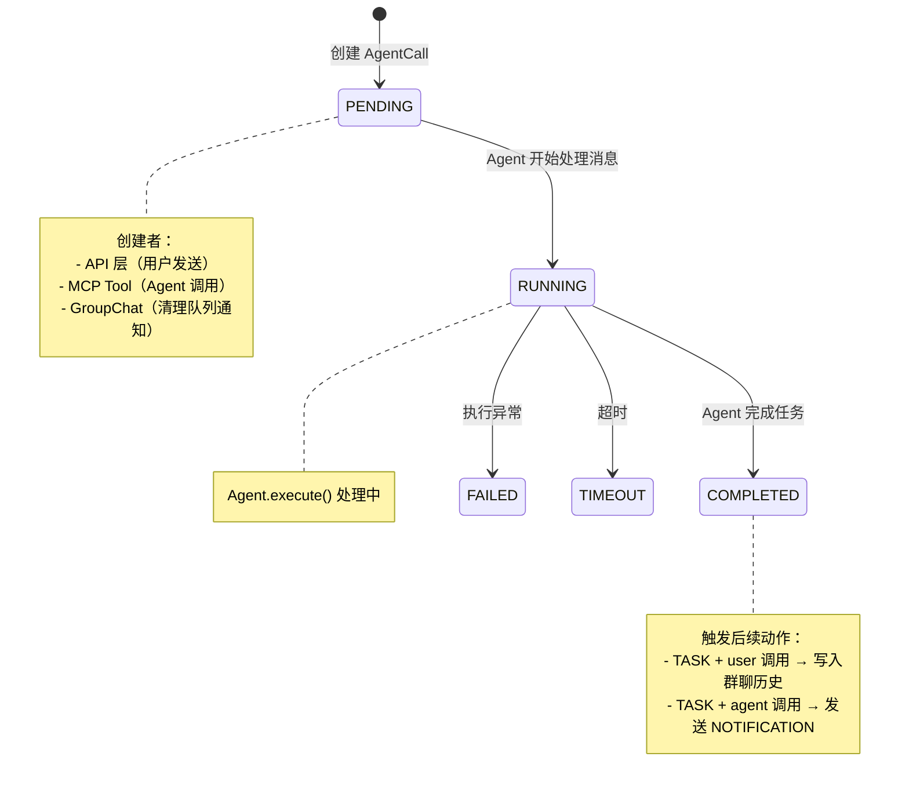

#  数据流：AgentCall 生命周期

**Flow 对象**：AgentCall

**对应 Spec**：docs/specs/2026-05-31-core-communication.md

## AgentCall 数据结构

```python
@dataclass
class AgentCall:
    # 基本信息
    send_from: str                      # 发送者（user 或 agent 名称）
    send_to: str                        # 接收者（agent 名称）
    content: str                        # 消息内容
    message_type: MessageType           # TASK（需回复）/ NOTIFICATION（通知）
    
    # 状态跟踪
    call_id: str                        # 调用唯一标识（8位UUID）
    status: CallStatus                  # PENDING/RUNNING/COMPLETED/FAILED/TIMEOUT
    created_at: datetime                # 创建时间
    started_at: datetime | None         # 开始执行时间
    completed_at: datetime | None       # 完成时间
    
    # 执行结果
    result: AgentResult | None          # 执行结果对象
    error: str | None                   # 错误信息
    has_agent_response: bool            # Agent 是否已通过显式工具回复闭环
    
    # 可选配置
    business_task_id: str | None        # 关联的业务任务 ID
    timeout_seconds: int | None         # 超时阈值（秒），None 表示无超时
```

**关键字段说明**：
- `status`：核心状态流转字段，影响整个生命周期
- `message_type`：决定完成后的后续动作（TASK 需要闭环通知，NOTIFICATION 不需要）
- `has_agent_response`：TASK 调用必须显式回复闭环后才能进入 COMPLETED
- `send_from`：决定任务完成后的分支逻辑（user → 写入群聊历史，agent → 发送 NOTIFICATION）

## 与其他数据流的耦合

### AgentCall ↔ Agent 状态

**Agent 状态字段**（`AgentMemberInfo.status`）：
- `idle`：空闲，等待消息
- `busy`：处理中
- `stopped`：已停止
- `error`：错误状态

**耦合关系**：

| AgentCall 状态变化 | Agent 状态影响 | 触发位置 |
|------------------|--------------|---------|
| 无 → PENDING | 无影响（消息在队列中等待） | `AgentCallManager.create_call()` |
| PENDING → RUNNING | Agent.status: idle → busy | `Agent._process_message()` 开始处理 |
| RUNNING → COMPLETED | Agent.status: busy → idle | `Agent._process_message()` 完成处理 |
| RUNNING → FAILED | Agent.status: busy → idle（正常失败）<br>或 busy → error（异常失败） | `Agent._process_message()` 异常处理 |
| * → FAILED（队列清理） | Agent.status: * → stopped | `GroupChat._cleanup_agent_queue()` 用户停止 Agent |

**说明**：
- AgentCall 是调用级别的状态，一个 Agent 可能同时有多个 PENDING 的 AgentCall
- Agent 状态反映 Agent 整体状态，只有一个值
- 当 Agent 从队列取出消息开始处理时，Agent 状态变为 busy，AgentCall 状态变为 RUNNING
- 处理完成后，Agent 状态回到 idle，AgentCall 状态进入终态（COMPLETED/FAILED）

<key_function last_update="2026-06-21T17:23:54+08:00">
- frontend/src/layouts/ChatArea/ChatArea.tsx
  - ChatArea.handleSend:377
- frontend/src/core/api/groupChatApi.ts
  - sendMessage:674
- agents_hub/api/services/group_chat_service.py
  - GroupChatService.send_message:482
- agents_hub/mcp/server.py
  - call_agent:281
- agents_hub/core/agent/base_agent.py
  - Agent._process_message:265
  - Agent._fallback_close_task:811
- agents_hub/core/orchestration/group_chat.py
  - GroupChat.send_message_to_agent:985
  - GroupChat._cleanup_agent_queue:1069
</key_function>


## 流程概览

## 数据流节点

**两条链路**：
```
链路 1: 用户发消息 → 前端 → API → 创建 AgentCall → Agent 处理 → 结果回显（WebSocket refresh）
链路 2: MCP Agent 发消息 → call_agent() → 创建 AgentCall → Agent 处理 → NOTIFICATION 通知调用方
```


## 链路 1：用户发消息给 Agent

```
1. ChatArea.handleSend()
   用户输入消息，调用 API 发送，乐观更新 UI
   步骤: 乐观更新消息列表 → 连接 WebSocket → 调用 sendMessage API → 失败则回滚

2. groupChatApi.sendMessage()
   前端 API 层，POST /group-chats/{id}/messages
   步骤: 构造请求体（content + members + files）→ 发送 HTTP POST

3. GroupChatService.send_message()
   后端 API 层，创建 TASK 类型 AgentCall（send_from="user"）
   状态: 无→PENDING | 持久化: ✅ | 跨模块: api→core
   步骤: 加载群聊 → 创建 AgentCall → 投递消息

4. GroupChat.send_message_to_agent()
   投递消息到目标 Agent 队列，保存发送方消息到群聊历史（@接收者 格式）
   状态: PENDING 不变 | 持久化: ✅ | 跨模块: ❌ core 内
   步骤: 路由投递消息 → 格式化为 @接收者 → 保存到群聊历史

5. Agent._process_message()
   从队列取出消息开始处理，调用 LLM 执行任务
   状态: PENDING→RUNNING | 持久化: ✅ | 跨模块: ❌ core 内
   步骤: 更新状态为 RUNNING → 调用 LLM 执行

6. Agent._process_message()
   完成任务，调用方是 user → 写入群聊历史
   状态: RUNNING→COMPLETED | 持久化: ✅ | 跨模块: ❌ core 内
   步骤: 更新状态为 COMPLETED → 写入群聊历史 → 前端 WebSocket refresh 获取
```


## 链路 2：MCP Agent 发消息给 Agent

```
1. mcp.server.call_agent()
   Agent 通过 MCP Tool 调用另一个 Agent，创建 TASK 类型 AgentCall（send_from=调用方 Agent 名）
   状态: 无→PENDING | 持久化: ✅ | 跨模块: mcp→core
   步骤: 加载群聊 → 创建 AgentCall → 投递消息到目标 Agent

2. GroupChat.send_message_to_agent()
   投递消息到目标 Agent 队列，保存发送方消息到群聊历史（@接收者 格式）
   状态: PENDING 不变 | 持久化: ✅ | 跨模块: ❌ core 内
   步骤: 路由投递消息 → 格式化为 @接收者 → 保存到群聊历史

3. Agent._process_message()
   从队列取出消息开始处理，调用 LLM 执行任务
   状态: PENDING→RUNNING | 持久化: ✅ | 跨模块: ❌ core 内
   步骤: 更新状态为 RUNNING → 调用 LLM 执行

4. Agent._process_message()
   完成任务，调用方是 agent → 创建 NOTIFICATION 通知调用方
   状态: RUNNING→COMPLETED | 持久化: ✅ | 跨模块: ❌ core 内
   步骤: 更新状态为 COMPLETED → _fallback_close_task() 通知调用方

5. Agent._fallback_close_task()
   创建 NOTIFICATION 类型 AgentCall 通知调用方任务完成（异步唤醒机制）
   状态: 创建新 NOTIFICATION AgentCall | 持久化: ✅ | 跨模块: ❌ core 内
```


## 异常与清理

```
1. Agent._process_message() [异常处理]
   执行异常时标记 AgentCall 为 FAILED，记录错误信息
   状态: RUNNING→FAILED | 持久化: ✅ | 跨模块: ❌ core 内

2. GroupChat._cleanup_agent_queue()
   用户停止 Agent，清空队列并闭环所有未完成 AgentCall
   状态: PENDING/RUNNING→FAILED | 持久化: ✅ | 跨模块: ❌ core 内
   步骤: 获取未完成 call → 标记 FAILED → 通知调用方 → 清空队列
```

## 反常设计说明

### has_agent_response 字段的实际使用

**设计意图**：TASK 调用应该通过显式 MCP 工具（`complete_task`）回复闭环后才能进入 COMPLETED 状态。

**当前实现**：
- MCP 工具 `complete_task` 已弃用
- 所有 TASK 调用统一在 `Agent._fallback_close_task()` 中将 `has_agent_response` 置为 True
- 实际效果：进入 `_fallback_close_task()` 之前，`has_agent_response` 都是 False；进入后统一置为 True

**为什么是反常的**：
- 字段名暗示 "Agent 是否已通过显式工具回复"，但实际上是自动置为 True，不是显式回复
- Spec 中定义了显式回复闭环语义，但代码中已退化为自动闭环

**影响范围**：
- 不影响正常流程（TASK 调用仍然能正常完成）
- 影响语义理解（看代码时容易误以为有显式回复机制）

**相关位置**：
- `Agent._fallback_close_task()` agents_hub/core/agent/base_agent.py:728

## 相关文档

### 架构文档
- **Core 架构概览**：`docs/specs/2026-05-31-core-overview.md`
  - Core 层级划分（foundation/communication/context/agent/orchestration）
- **Core Agent & Orchestration**：`docs/specs/2026-05-31-core-agent-orchestration.md`
  - Agent 执行逻辑
  - GroupChat 编排机制

### ADR
- **多 Agent 消息架构**：`docs/ADR/0005-multi-agent-message-architecture.md`
  - MessageRouter + 私有队列的点对点路由方案
  - 避免越权访问、按需提供上下文
- **显式群聊发言**：`docs/ADR/0006-explicit-group-chat-speech.md`
  - 群聊发言从隐式自动写入改为显式 MCP 工具调用
  - report_progress 和 complete_task 的语义分离
- **Agent Token 身份模型**：`docs/ADR/0007-agent-token-identity-model.md`
  - MCP Tool 调用者身份校验逻辑
  - Token 生命周期和注入方式
- **MCP 工具取消方案**：`docs/ADR/2026-06-16-mcp-tools-to-direct-output.md`
  - 取消 complete_task 和 report_progress
  - 改为直接使用 agentbridge 输出（解释 has_agent_response 退化原因）

[执行] 随机数: 340
[审查] 随机数: 822
[执行] 随机数: 585
[审查] 随机数: 590
