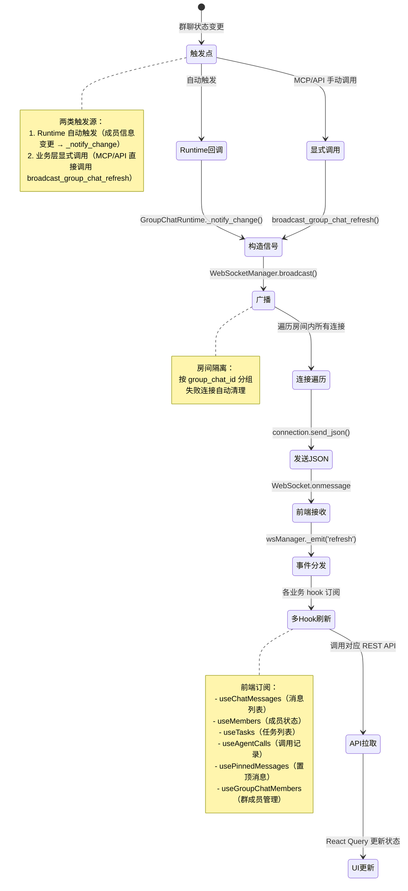

# 数据流：WebSocket RefreshSignal

**Flow 对象**：RefreshSignal

**对应 Spec**：docs/specs/2026-06-06-realtime.md, docs/specs/2026-06-03-websocket-backend.md

## RefreshSignal 数据结构

```python
class RefreshSignal:
    # 信号标识
    type: str                  # 信号类型，固定为 "refresh"
    group_chat_id: str         # 触发刷新的群聊 ID
    timestamp: datetime        # 信号生成时间戳（自动生成）
```

**关键字段说明**：
- `type`：固定值 "refresh"，前端通过此字段区分消息类型
- `group_chat_id`：决定广播的目标房间和前端刷新范围
- `timestamp`：用于调试和日志追踪，前端不依赖此字段

## 与其他数据流的耦合

### RefreshSignal ↔ 群聊状态变更

**触发场景**：

| 状态变更 | 触发位置 | 说明 |
|---------|---------|------|
| 消息保存到群聊历史 | MCP/API 层显式调用 | add_message() 后由调用方显式调用 broadcast_group_chat_refresh() |
| 成员信息变更 | GroupChatRuntime._notify_change() | set_agent_use_docker() / save_agent_members() → _save_agent_members() → _notify_change() |
| Pin 消息变更 | GroupChatService 各 pin 操作 | pin/unpin/delete_pinned_message 后显式调用 |
| 权限请求状态变更 | GroupChatService.update_permission_status() | 用户审批/拒绝权限请求 |
| Fork 群聊创建 | GroupChatService.fork_group_chat() | 新群聊创建完成 |
| 添加群成员 | GroupChatService.add_members() | 成员添加后显式调用 |

**耦合关系**：
- RefreshSignal 不依赖具体业务数据，只携带 group_chat_id
- 前端收到信号后自行决定刷新哪些数据（消息列表、成员列表、任务列表等）
- 采用"推送信号 + 拉取数据"模式，不直接推送完整数据

<key_function last_update="2026-06-20T14:08:10+08:00">
- agents_hub/realtime/dependencies.py
  - broadcast_group_chat_refresh:25
- agents_hub/realtime/events.py
  - make_refresh_signal:16
- agents_hub/realtime/manager.py
  - WebSocketManager.connect:18
  - WebSocketManager.disconnect:28
  - WebSocketManager.broadcast:46
- agents_hub/core/context/group_chat_runtime.py
  - GroupChatRuntime._notify_change:611
- agents_hub/core/orchestration/group_chat.py
  - GroupChat.__init__:49
- agents_hub/api/services/group_chat_service.py
  - GroupChatService.fork_group_chat:1011
  - GroupChatService.load_group_chat:186
  - GroupChatService.update_permission_status:1525
- agents_hub/mcp/server.py
  - call_agent:182
  - report_progress:501 ⚠️ 已弃用（见 ADR 2026-06-16-mcp-tools-to-direct-output）
  - complete_task:569 ⚠️ 已弃用（见 ADR 2026-06-16-mcp-tools-to-direct-output）
  - request_permission:773
- frontend/src/core/websocket/WebSocketManager.ts
  - WebSocketManager.connect:18
  - WebSocketManager._setupEventHandlers:192
  - WebSocketManager._emit:295
- frontend/src/features/chat/hooks/useChatMessages.ts
  - useChatMessages:119
- frontend/src/features/chat/hooks/useMembers.ts
  - useMembers:91
- frontend/src/features/chat/hooks/useTasks.ts
  - useTasks:41
- frontend/src/features/chat/hooks/useAgentCalls.ts
  - useAgentCalls:41
- frontend/src/features/chat/hooks/usePinnedMessages.ts
  - usePinnedMessages:63
- frontend/src/features/chat/hooks/useGroupChatMembers.ts
  - useGroupChatMembers:53
</key_function>

## 流程概览



## 数据流节点

**三条主链路**：
```
链路 1: Runtime 自动触发（成员信息变更）→ Core._notify_change → Realtime → WebSocket → Frontend
链路 2: MCP 显式调用（call_agent / report_progress⚠️ / complete_task⚠️ / request_permission）→ Realtime → WebSocket → Frontend
链路 3: API 显式调用（pin/permission/fork/add_members）→ Realtime → WebSocket → Frontend
```

## 链路 1：Runtime 自动触发（成员信息变更场景）

```
1. GroupChatRuntime._save_agent_members()
   持久化 agent 成员信息（agent_member.json）
   状态: 更新成员信息 | 持久化: ✅ | 跨模块: ❌ core 内
   触发方: set_agent_use_docker() / save_agent_members()
   步骤: 调用 repository.save_agent_member() → 调用 _notify_change()

2. GroupChatRuntime._notify_change()
   触发 on_change 回调，通知外部状态变更
   状态: 无状态变化 | 持久化: ❌ | 跨模块: ❌ core 内
   步骤: 检查 _on_change 是否存在 → 调用 _on_change(group_chat_id) → 异常吞掉

3. broadcast_group_chat_refresh()
   构造 RefreshSignal 并调用 WebSocketManager 广播
   状态: 创建 RefreshSignal | 持久化: ❌ | 跨模块: ✅ core → realtime
   步骤: 获取 realtime_manager 单例 → make_refresh_signal() → broadcast()

4. WebSocketManager.broadcast()
   向房间内所有连接发送 JSON 消息
   状态: 清理失败连接 | 持久化: ❌ | 跨模块: ❌ realtime 内
   步骤: 获取房间连接列表 → 遍历 send_json() → 收集失败连接 → 清理失败连接

5. WebSocket.onmessage (前端)
   接收 WebSocket 消息并解析 JSON
   状态: 无状态变化 | 持久化: ❌ | 跨模块: ✅ 后端 → 前端
   步骤: JSON.parse() → 根据 type 字段分发事件

6. WebSocketManager._emit('refresh')
   触发 refresh 事件（300ms 防抖）
   状态: 无状态变化 | 持久化: ❌ | 跨模块: ❌ 前端 core 内
   步骤: 清除旧防抖定时器 → 300ms 后调用 _emitImmediate() → 遍历 listeners

7. useChatMessages / useMembers / useTasks 等 hook
   各业务 hook 收到 refresh 事件，调用对应 API 拉取最新数据
   状态: 触发 API 请求 | 持久化: ❌ | 跨模块: ❌ 前端 features 内
   步骤: 检查 group_chat_id 匹配 → 调用对应 API → 更新组件状态
```

## 链路 2：MCP 显式调用

MCP server 中有 4 个工具在操作完成后显式调用 `broadcast_group_chat_refresh()`：

### 链路 2a：call_agent（Agent 间通信）

```
1. mcp.server.call_agent()
   MCP 工具调用另一个 Agent，创建 AgentCall 并投递消息
   状态: 创建 PENDING AgentCall | 持久化: ✅ | 跨模块: ✅ mcp → core
   步骤: 加载群聊 → 创建 AgentCall → 投递消息 → 显式调用 broadcast_group_chat_refresh()
```

### 链路 2b：report_progress（进度汇报）⚠️ 已弃用

> ⚠️ **已弃用**：见 [ADR 2026-06-16-mcp-tools-to-direct-output](../ADR/2026-06-16-mcp-tools-to-direct-output.md)，该工具已计划移除，Agent 输出改为直接回复。

```
1. mcp.server.report_progress()
   MCP 工具汇报 Agent 执行进度
   状态: 消息保存到历史 | 持久化: ✅ | 跨模块: ✅ mcp → core
   步骤: 加载群聊 → add_message() → 显式调用 broadcast_group_chat_refresh()
```

### 链路 2c：complete_task（任务完成）⚠️ 已弃用

> ⚠️ **已弃用**：见 [ADR 2026-06-16-mcp-tools-to-direct-output](../ADR/2026-06-16-mcp-tools-to-direct-output.md)，该工具已计划移除，Agent 输出改为直接回复。

```
1. mcp.server.complete_task()
   MCP 工具结束 AgentCall 并返回结果
   状态: 消息保存到历史 | 持久化: ✅ | 跨模块: ✅ mcp → core
   步骤: 加载群聊 → add_message() → 显式调用 broadcast_group_chat_refresh()
```

### 链路 2d：request_permission（权限请求）

```
1. mcp.server.request_permission()
   MCP 工具创建权限请求消息
   状态: 权限请求消息写入历史 | 持久化: ✅ | 跨模块: ✅ mcp → core
   步骤: 加载群聊 → 构建权限请求 → add_message() → 显式调用 broadcast_group_chat_refresh()
```

### 共同后续步骤

```
2. broadcast_group_chat_refresh()
   构造 RefreshSignal 并调用 WebSocketManager 广播
   状态: 创建 RefreshSignal | 持久化: ❌ | 跨模块: ✅ mcp → realtime
   步骤: 获取 realtime_manager 单例 → make_refresh_signal() → broadcast()

3-7. [同链路 1 的步骤 4-7]
```

## 链路 3：API 显式调用（Pin 消息场景）

```
1. GroupChatService.pin_message()
   将消息添加到置顶列表
   状态: 更新 group_metadata.json | 持久化: ✅ | 跨模块: ❌ api 内
   步骤: 加载群聊 → 调用 runtime.pin_message() → 显式调用 broadcast_group_chat_refresh()

2. broadcast_group_chat_refresh()
   构造 RefreshSignal 并调用 WebSocketManager 广播
   状态: 创建 RefreshSignal | 持久化: ❌ | 跨模块: ✅ api → realtime
   步骤: 获取 realtime_manager 单例 → make_refresh_signal() → broadcast()

3-7. [同链路 1 的步骤 4-7]
```

## 异常与清理

```
1. WebSocketManager.broadcast() [失败连接清理]
   发送失败的连接自动从房间移除
   状态: 移除失败连接 | 持久化: ❌ | 跨模块: ❌ realtime 内
   步骤: 收集 send_json() 失败的连接 → 从房间列表移除 → 空房间删除

2. GroupChatRuntime._notify_change() [异常吞掉]
   on_change 回调异常不影响主流程
   状态: 无状态变化 | 持久化: ❌ | 跨模块: ❌ core 内
   步骤: try/except 包裹 on_change() → 记录 WARNING 日志 → 继续执行

3. WebSocketManager.broadcast() [空房间静默跳过]
   向不存在或空房间广播时记录 DEBUG 日志并跳过
   状态: 无状态变化 | 持久化: ❌ | 跨模块: ❌ realtime 内
```

## 反常设计说明

### on_change 回调异常被吞掉

**设计意图**：群聊状态持久化成功后，WebSocket 通知失败不应影响主流程。

**当前实现**：
- `GroupChatRuntime._notify_change()` 中 `try/except` 包裹 `on_change()` 调用
- 异常只记录 WARNING 日志，不向上抛出
- 主流程（消息保存、状态变更）不会因 WebSocket 通知失败而回滚

**为什么是反常的**：
- 异常吞掉违反了"错误向上冒泡"的原则
- 但这是合理的防御性设计：WebSocket 是辅助通知机制，不应成为核心流程的阻塞点
- 前端有轮询兜底，即使 WebSocket 通知失败也能通过定期刷新获取最新数据

**影响范围**：
- WebSocket 服务异常时，前端实时性降低（依赖轮询或手动刷新）
- 核心业务逻辑不受影响（消息仍然保存成功）

**相关位置**：
- `GroupChatRuntime._notify_change()` agents_hub/core/context/group_chat_runtime.py:611

### 前端 refresh 事件 300ms 防抖

**设计意图**：避免短时间内多次状态变更导致的频繁 API 请求。

**当前实现**：
- `WebSocketManager._emit()` 对 refresh 事件做 300ms 防抖
- 300ms 内多次 refresh 信号合并为 1 次
- 其他事件（connected、disconnected、error）立即触发

**为什么是反常的**：
- 这不是反常设计，而是合理的性能优化
- 业务场景：Agent 执行过程中可能短时间内保存多条消息（思考过程、工具调用结果、最终回复）
- 防抖避免前端在这种场景下频繁刷新 UI，减少 API 请求和渲染次数

**影响范围**：
- 前端实时性延迟 300ms（可接受）
- 降低服务器 API 压力和前端渲染开销

**相关位置**：
- `WebSocketManager._emit()` frontend/src/core/websocket/WebSocketManager.ts:295

## 相关文档

### Spec 文档
- **Realtime 模块**：docs/specs/2026-06-06-realtime.md - WebSocket 连接管理、房间模型、广播机制
- **WebSocket 后端**：docs/specs/2026-06-03-websocket-backend.md - WebSocket endpoint、HTTP broadcast route
- **消息流与持久化**：docs/specs/2026-06-05-message-flow-and-persistence.md - 群聊消息的保存和查询

### 架构文档
- **Core 概览**：docs/specs/2026-05-31-core-overview.md - Core 层级划分
- **Core Context**：docs/specs/2026-05-31-core-context.md - GroupChatRuntime 职责和接口
- **Frontend Core**：docs/specs/2026-06-06-frontend-core.md - 前端 WebSocket 管理和事件订阅

### ADR
- **Realtime 边界设计**：docs/superpowers/specs/2026-06-04-realtime-boundary-design.md - realtime 模块从 api/websocket 抽离的设计决策
