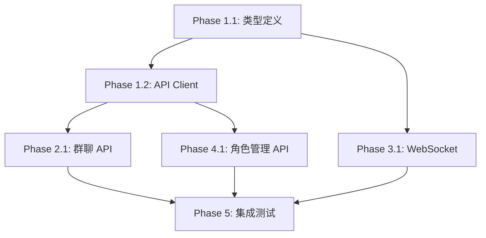

# 前端实现计划

> **创建时间**: 2026-06-03  
> **目标**: 完成前端核心基础设施和聊天功能的实现  
> **总工作量**: 约 5-6 小时

---

## 总体架构

```
frontend/src/
├── core/                          # 基础设施层
│   ├── api/                       # REST API 调用
│   └── websocket/                 # WebSocket 管理
│
├── shared/types/                  # 类型定义
│   ├── models.ts                  # 核心数据模型
│   ├── api.ts                     # API 请求/响应类型
│   └── websocket.ts               # WebSocket 事件类型
│
└── features/                      # 业务功能模块
    ├── chat/                      # 聊天功能
    ├── navigation/                # 导航栏
    ├── members/                   # 成员列表
    └── roles/                     # 角色管理
```

---

## Phase 1: 类型定义与基础设施 ⭐⭐⭐⭐⭐

**目标**: 建立前后端数据契约，搭建 API 调用基础

**预计时间**: 2 小时

### 1.1 核心类型定义 (任务 #1)

**文件**: `shared/types/models.ts`

**核心类型**:
- [ ] `Message` - 消息模型
  ```typescript
  interface Message {
    speaker: string;        // 发送者名称
    content: string;        // 消息内容
    timestamp: string;      // 时间戳
    platform: string;       // 来源平台
  }
  ```

- [ ] `Agent` - Agent 模型
  ```typescript
  interface Agent {
    name: string;
    platform: 'claude' | 'codex';
    avatar: string | null;
    abilities: string[];
    type: 'leader' | 'team_member' | null;
    description: string | null;
  }
  ```

- [ ] `GroupChat` - 群聊模型
  ```typescript
  interface GroupChat {
    group_chat_id: string;
    group_chat_name: string;
    project_path: string;
    created_at: string;
    group_type: GroupChatType;
    is_active: boolean;
  }
  ```

- [ ] `GroupChatMember` - 群聊成员运行时信息
  ```typescript
  interface GroupChatMember {
    name: string;
    main_session: string | null;
    btw_session: string[];
    cwd: string | null;
    use_docker: boolean;
  }
  ```

- [ ] `Role` - 角色模型（与 Agent 类型相同）
- [ ] `Skill` - Skill 模型
  ```typescript
  interface Skill {
    id: string;
    name: string;
    description: string;
  }
  ```

**文件**: `shared/types/api.ts`

**API 类型**:
- [ ] 群聊相关
  - `CreateGroupChatRequest`
  - `GroupChatInfoResponse`
  - `GroupChatSummaryResponse`
  - `SendMessageRequest`
  
- [ ] 角色相关
  - `CreateRoleRequest`
  - `UpdateRoleRequest`
  - `RoleResponse`
  - `AddSkillRequest`

**文件**: `shared/types/websocket.ts`

- [ ] `RefreshSignal` - WebSocket 刷新信号
  ```typescript
  interface RefreshSignal {
    group_chat_id: string;
    event_type: 'message' | 'member_update' | 'status_change';
    timestamp: string;
  }
  ```

**验收标准**:
- ✅ 所有类型定义与后端 Pydantic schemas 一致
- ✅ 导出的类型可以被 IDE 正确识别
- ✅ 没有 TypeScript 编译错误

---

### 1.2 API Client 基础设施 (任务 #2)

**文件**: `core/api/client.ts`

**实现内容**:
- [ ] Axios 实例创建
  - baseURL 配置: `http://localhost:8000/api/v1`
  - timeout 配置: 30000ms
  
- [ ] 请求拦截器
  - 添加 Content-Type: application/json
  - 添加认证 token (如有)
  
- [ ] 响应拦截器
  - 统一错误处理
  - 自动解析响应数据
  
- [ ] 错误处理类
  ```typescript
  class ApiError extends Error {
    code: string;
    status: number;
    data?: any;
  }
  ```

**验收标准**:
- ✅ 可以发起 GET/POST/PUT/DELETE 请求
- ✅ 错误能被正确捕获和转换
- ✅ TypeScript 类型推导正常

---

## Phase 2: 群聊功能 API ⭐⭐⭐⭐

**目标**: 实现聊天相关的所有 API 接口

**预计时间**: 1 小时

### 2.1 群聊 API 接口 (任务 #3)

**文件**: `core/api/groupChatApi.ts`

**实现接口**:
- [ ] `createGroupChat(data: CreateGroupChatRequest): Promise<GroupChatInfoResponse>`
  - POST /group_chats
  - 创建新群聊
  
- [ ] `getGroupChatInfo(chatId: string): Promise<GroupChatInfoResponse>`
  - GET /group_chats/{chatId}
  - 获取群聊详细信息
  
- [ ] `listGroupChats(): Promise<GroupChatSummaryResponse[]>`
  - GET /group_chats
  - 获取所有群聊列表
  
- [ ] `getMessages(chatId: string): Promise<Message[]>`
  - GET /group_chats/{chatId}/messages
  - 获取消息历史
  
- [ ] `getMembers(chatId: string): Promise<GroupChatMember[]>`
  - GET /group_chats/{chatId}/members
  - 获取成员列表
  
- [ ] `updateMemberDockerMode(chatId: string, memberName: string, useDocker: boolean): Promise<void>`
  - PATCH /group_chats/{chatId}/members/{memberName}/docker
  - 切换成员 Docker 模式

**Mock 数据支持**:
- [ ] 添加 `USE_MOCK` 环境变量控制
- [ ] 为每个接口提供 mock 数据

**验收标准**:
- ✅ 所有接口可以正常调用
- ✅ Mock 模式可以返回假数据
- ✅ 错误处理正常（404, 500 等）

---

## Phase 3: WebSocket 实时通信 ⭐⭐⭐⭐

**目标**: 实现 WebSocket 连接管理和消息收发

**预计时间**: 1.5 小时

### 3.1 WebSocket 管理器 (任务 #4)

**文件**: `core/websocket/WebSocketManager.ts`

**核心功能**:
- [ ] 单例模式实现
  ```typescript
  class WebSocketManager {
    private static instance: WebSocketManager;
    private ws: WebSocket | null = null;
    private listeners: Map<string, Set<Function>>;
    
    static getInstance(): WebSocketManager {
      if (!this.instance) {
        this.instance = new WebSocketManager();
      }
      return this.instance;
    }
  }
  ```

- [ ] 连接管理
  - `connect(chatId: string): void` - 连接到指定群聊
  - `disconnect(): void` - 断开连接
  - 连接状态: `CONNECTING | OPEN | CLOSING | CLOSED`
  
- [ ] 自动重连机制
  - 指数退避策略: 1s, 2s, 4s, 8s, 16s
  - 最大重连次数: 5 次
  - 重连失败后触发错误回调
  
- [ ] 消息发送
  - `sendMessage(message: SendMessageRequest): void`
  - 离线时消息入队列，连接恢复后自动发送
  - 消息队列最大长度: 100
  
- [ ] 事件订阅
  - `on(event: string, callback: Function): void`
  - `off(event: string, callback: Function): void`
  - 支持的事件:
    - `message` - 新消息到达
    - `refresh` - 刷新信号
    - `connected` - 连接成功
    - `disconnected` - 连接断开
    - `error` - 发生错误

**验收标准**:
- ✅ 可以连接到 WebSocket 服务器
- ✅ 可以发送和接收消息
- ✅ 断线后自动重连
- ✅ 事件订阅/取消订阅正常

---

## Phase 4: 角色管理 API ⭐⭐

**目标**: 实现角色管理相关的 API 接口

**预计时间**: 1 小时

### 4.1 角色管理 API 接口 (任务 #5)

**文件**: `core/api/roleApi.ts`

**实现接口**:
- [ ] `createRole(data: CreateRoleRequest): Promise<RoleResponse>`
  - POST /roles
  - 创建新角色
  
- [ ] `getRoleInfo(name: string): Promise<RoleResponse>`
  - GET /roles/{name}
  - 获取角色详情
  
- [ ] `listRoles(): Promise<RoleResponse[]>`
  - GET /roles
  - 获取所有角色列表
  
- [ ] `updateRole(name: string, data: UpdateRoleRequest): Promise<RoleResponse>`
  - PATCH /roles/{name}
  - 更新角色信息
  
- [ ] `deleteRole(name: string): Promise<void>`
  - DELETE /roles/{name}
  - 删除角色
  
- [ ] `getRoleSkills(name: string): Promise<Skill[]>`
  - GET /roles/{name}/skills
  - 获取角色关联的 skills
  
- [ ] `addSkillToRole(name: string, skillId: string): Promise<void>`
  - POST /roles/{name}/skills
  - 为角色添加 skill
  
- [ ] `removeSkillFromRole(name: string, skillId: string): Promise<void>`
  - DELETE /roles/{name}/skills/{skillId}
  - 移除角色的 skill
  
- [ ] `listAvatars(): Promise<string[]>`
  - GET /roles/avatars
  - 获取可用头像列表

**Mock 数据支持**:
- [ ] 为每个接口提供 mock 数据

**验收标准**:
- ✅ 所有接口可以正常调用
- ✅ Mock 模式可以返回假数据
- ✅ 错误处理正常

---

## Phase 5: 集成测试与优化 ⭐⭐

**目标**: 验证所有模块正常工作，优化性能

**预计时间**: 30 分钟

### 5.1 集成测试

- [ ] 创建测试文件 `core/api/__tests__/integration.test.ts`
- [ ] 测试场景:
  1. 创建群聊 → 获取群聊信息 → 发送消息
  2. 连接 WebSocket → 发送消息 → 接收消息
  3. 创建角色 → 添加 Skill → 删除角色

### 5.2 文档补充

- [ ] 在 `frontend/README.md` 添加:
  - API 使用示例
  - WebSocket 事件说明
  - Mock 数据切换方法

---

## 环境变量配置

**文件**: `frontend/.env.development`

```env
# API 配置
VITE_API_BASE_URL=http://localhost:8000/api/v1
VITE_WS_BASE_URL=ws://localhost:8000/ws

# Mock 开关
VITE_USE_MOCK=false

# 其他配置
VITE_DEBUG=true
```

---

## 依赖关系图



---

## 实施建议

### 第一天（今天）
1. **上午** (2-3 小时):
   - ✅ Phase 1: 类型定义 + API Client
   - ✅ Phase 2: 群聊 API
   
2. **下午** (1-2 小时):
   - ✅ Phase 3: WebSocket（至少完成基础连接）

### 第二天
1. **上午** (1-2 小时):
   - ✅ 完成 Phase 3: WebSocket（重连、队列等）
   - ✅ Phase 4: 角色管理 API
   
2. **下午**:
   - ✅ Phase 5: 集成测试
   - 🎉 **开始 UI 开发**

---

## 验收标准（整体）

- [ ] 所有 TypeScript 类型定义完整且正确
- [ ] 所有 API 接口可以正常调用（至少 Mock 模式可用）
- [ ] WebSocket 可以连接、发送、接收消息
- [ ] 自动重连机制正常工作
- [ ] 没有 TypeScript 编译错误
- [ ] 没有 ESLint 警告
- [ ] 代码符合 `frontend/CLAUDE.md` 规范

---

## 后续计划

完成本计划后，可以开始：
1. **UI 开发**:
   - MainLayout（三栏布局）
   - ChatWindow（聊天窗口）
   - NavigationBar（左侧导航）
   
2. **状态管理**:
   - chatStore（Zustand）
   - uiStore（Zustand）
   
3. **扩展功能**:
   - 预览功能
   - Diff 视图
   - 技能广场

---

**最后更新**: 2026-06-03
