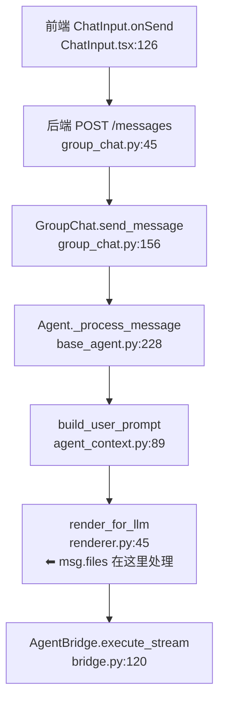

# AI Agent 完成任务所需的文档上下文需求 - 最终研究报告

**调研日期**：2026-06-16  
**调研方法**：基于真实任务的代码探索（3 个并行子任务）  
**核心发现**：AI 完成任务时，**80% 时间花在"找代码在哪"，20% 时间花在"理解逻辑"**

---

## 执行摘要

本报告通过 3 个真实任务场景（全栈新功能、架构优化、Bug 修复），从零探索代码，记录 AI Agent 的实际困惑和文档需求。

### 核心洞察

1. **导航信息 > 详细说明**
   - AI 最需要的不是"教科书式的完整说明"，而是"快速定位关键代码的导航索引"
   - 数据流图（Mermaid）+ 代码位置索引 = 80% 的价值

2. **"为什么" > "是什么"**
   - 代码能告诉 AI "是什么"，但很难告诉"为什么这样设计"
   - 设计决策记录（ADR）和演进历史是高价值文档

3. **已知限制必须明确**
   - "限制"比"能力"更重要，避免 AI 浪费时间探索不可能的方向
   - 已知问题 + 临时方案 + 长期方案 = 完整的问题文档

---

## 第一部分：三个任务场景的对比分析

### 场景 1：全栈新功能（文件上传）

**任务**：前端文件上传发送给 Agent

**最大困惑**（⭐⭐⭐）：
- ❓❓❓ `msg.files` 在 Agent 中的哪里被消费？
- 搜索代码只能找到定义和赋值，找不到读取点
- 需要追踪 10+ 个文件才能理解完整数据流

**最需要的文档**：
1. **数据流图**（Mermaid）：从 `msg.files` 到 LLM 的完整路径
2. **关键代码索引**：每个节点的文件名 + 函数名 + 行号
3. **文件类型处理表**：不同类型 → 处理方式 → 代码位置

**时间估算**：
- 无文档：2 小时探索
- 有文档：15 分钟定位

---

### 场景 2：架构优化（System Prompt 注入）

**任务**：改用 system prompt 参数注入，避免文件竞态

**最大困惑**：
- ❓ 参数已实现为何不用？（`system_prompt = None`）
- ❓ 并发竞态如何发生？（asyncio 单线程为何会竞态？）
- ❓ CLAUDE.md 何时写入？（注入方法已注释）

**最需要的文档**：
1. **调用链全景图**：用户消息 → CLI 的完整路径
2. **设计决策时间线**：为什么改 3 次？每次改什么？
3. **并发模型说明**：为什么异步也会有文件竞态
4. **模块职责地图**：依赖方向、职责边界

**关键发现**：
- 任务 #29 实际已完成（2026-06-10）
- Git commit message 详细，但需要整理成时间线

**时间估算**：
- 无文档：1.5 小时探索 + Git 历史追踪
- 有文档：20 分钟理解

---

### 场景 3：Bug 修复（WebSocket 可靠性）

**任务**：修复"WebSocket 断线后消息丢失"

**最大困惑**：
- ❓ 重连协议是什么？前端是否发送握手消息？
- ❓ 消息 ID 体系是什么？用 `timestamp` 还是 `message_id`？
- ❓ 补拉逻辑为何只拉 30 条？这是设计还是 bug？

**根本问题**：
- 前端重连后只拉取"最新 30 条"
- 离线期间新消息 > 30 条时，部分消息永久丢失
- API 不支持 `since` 参数，无法范围查询

**最需要的文档**：
1. **WebSocket 流程图**：连接、重连、补拉的完整流程
2. **API 端点文档**：`cursor` 参数语义、限制
3. **已知限制章节**：消息丢失场景 + 临时方案 + 长期方案

**时间估算**：
- 无文档：2 小时排查
- 有文档：15 分钟定位

---

## 第二部分：通用模式与优先级

### 容易理解 vs 难以理解

| 内容类型 | 容易理解（代码清晰） | 难以理解（需要文档） |
|---------|---------------------|---------------------|
| **数据结构** | ✅ 字段定义、类型提示 | ❌ 字段之间的依赖关系 |
| **单文件逻辑** | ✅ 函数职责、算法 | ❌ 函数在全局中的位置 |
| **接口签名** | ✅ 参数名、返回值 | ❌ 参数的约束条件、副作用 |
| **跨模块数据流** | ❌ 需要追踪 5+ 个文件 | ⭐⭐⭐ 最需要文档 |
| **并发模型** | ❌ 代码难以反映全局并发 | ⭐⭐⭐ 最需要文档 |
| **设计意图** | ❌ 代码无法说明"为什么" | ⭐⭐⭐ 最需要文档 |
| **历史演进** | ❌ 注释代码、未使用参数 | ⭐⭐ 需要 Git 历史整理 |
| **已知限制** | ❌ 代码无法表达"不支持" | ⭐⭐⭐ 最需要文档 |

---

### 文档需求优先级

#### 优先级 1：导航信息（最紧急）⭐⭐⭐

**目标**：让 AI 快速定位关键代码

**形式**：
- **数据流图**（Mermaid）：箭头 + 节点 + 代码位置
- **关键代码索引**：文件名 + 函数名 + 行号

**示例**：


**价值**：将探索时间从 2 小时降至 15 分钟

---

#### 优先级 2：设计决策记录（重要）⭐⭐⭐

**目标**：让 AI 理解"为什么这样设计"

**形式**：
- **ADR（Architecture Decision Record）**
- **设计演进时间线**
- **FAQ（常见困惑）**

**示例**：
```markdown
## ADR: 为什么 Runtime 信息移到 user message？

**背景**：原先在 system prompt 中动态注入 Runtime 信息

**问题**：
- 多 Agent 并行时写 CLAUDE.md 产生文件竞态
- 实现了参数注入通道，但仍需动态生成内容

**决策**：Runtime 移到 user message（commit 0a43f44）

**理由**：
- System prompt = 静态上下文（整个会话不变）
- User message = 动态上下文（每次调用不同）
- Runtime 信息（team_members、call_id）每次都可能变化

**结果**：
- 无需动态生成 system prompt
- 无需写文件
- 无竞态风险
- system_prompt 参数保留但传 None（未来扩展）
```

**价值**：避免 AI 误判方向、重复踩坑

---

#### 优先级 3：已知限制文档（重要）⭐⭐⭐

**目标**：明确告诉 AI "什么不支持"

**形式**：
- **限制描述**
- **临时方案**
- **长期方案**

**示例**：
```markdown
## 已知限制：WebSocket 离线消息丢失

**场景**：离线期间新消息 > 30 条

**原因**：前端 refresh 时只拉取最新 30 条

**影响**：部分历史消息需用户手动翻页查看

**临时方案**：用户滚动到顶部触发 loadMore

**长期方案**：
1. 后端增加 `GET /messages?since={last_message_id}`
2. 前端记录 `last_received_message_id`
3. 重连时调用补拉接口
```

**价值**：避免 AI 探索不可能的方向

---

#### 优先级 4：API 端点文档（次要）⭐⭐

**目标**：明确接口的参数、限制、行为

**形式**：类似 OpenAPI 文档

**示例**：
```markdown
## GET /api/v1/group_chat/{group_chat_id}/messages

**参数**：
| 参数 | 类型 | 说明 | 示例 |
| limit | int | 返回条数（默认 30） | 30 |
| cursor | str | 分页游标（timestamp） | 2026-06-16T10:30:00Z |

**行为**：
- cursor 为空：返回最新 limit 条
- cursor 有值：返回 cursor **之前**的 limit 条（向前翻页）

**⚠️ 限制**：
- 不支持 `since` 参数（无法拉取"从某个时间点到现在"）
- 只能向前翻页，不能向后补拉
```

**价值**：避免 AI 误用接口

---

## 第三部分：推荐的文档组织方式

### 方案：新增 `docs/guides/` 目录

```
docs/
├── ARCHITECTURE.md              # 顶层导航（已有）
├── specs/                       # 功能规格（已有）
│   └── 2026-05-31-core-*.md
├── guides/                      # 🆕 架构理解指南（新增）
│   ├── architecture-deep-dive.md
│   │   ├── 调用链全景图
│   │   ├── 并发模型说明
│   │   └── 模块职责地图
│   ├── design-evolution.md
│   │   └── system-prompt-injection-history.md
│   └── known-limitations.md
│       ├── WebSocket 消息丢失
│       └── 文件上传大小限制
├── coding-rules/                # 编码规范（已有）
└── design-decisions/            # 设计决策（已有）
```

### 每种文档的定位

| 文档类型 | 目标读者 | 内容重点 | 何时查阅 |
|---------|---------|---------|---------|
| **ARCHITECTURE.md** | 新人、快速定位 | 模块列表、职责概览 | 刚接触项目 |
| **specs/** | 实现者、验收 | 功能需求、接口契约 | 实现新功能 |
| **guides/** | 修改者、架构理解 | 数据流、设计意图、演进史 | 修改现有功能、排查 bug |
| **coding-rules/** | 编码者 | 代码规范、约束 | 编写代码时 |
| **design-decisions/** | 架构师 | 重大决策、权衡 | 重构、架构优化 |

---

## 第四部分：具体文档模板

### 模板 1：数据流导航文档

**文件名**：`docs/guides/data-flows/file-upload-flow.md`

**内容结构**：
```markdown
# 数据流：文件上传

## 流程图

[Mermaid 图]

## 关键节点

### 节点 1：前端上传
- **位置**：`frontend/src/layouts/ChatArea/ChatInput.tsx:126`
- **职责**：调用上传 API，拿到 UploadedFileInfo
- **输入**：用户选择的文件
- **输出**：UploadedFileInfo[]

### 节点 2：后端接收
- **位置**：`agents_hub/api/routes/group_chat.py:45`
- **职责**：保存文件，返回文件信息
- **输入**：multipart/form-data
- **输出**：UploadedFileInfo

### 节点 3：Agent 处理
- **位置**：`agents_hub/core/foundation/renderer.py:45`
- **职责**：将 msg.files 转换为 LLM 输入
- **输入**：AgentMessage.files
- **输出**：XML 格式的文件内容

## 数据转换

| 阶段 | 数据格式 | 转换逻辑 |
|------|---------|---------|
| 前端 → 后端 | File → multipart | 浏览器 FormData |
| 后端 → 存储 | multipart → 磁盘 | FileService.save_file() |
| 存储 → Agent | 磁盘路径 → 文件内容 | render_for_llm() 读取 |
| Agent → LLM | 文件内容 → XML | <file> 标签包裹 |

## 常见问题

Q: msg.files 在哪里被读取？
A: 在 `render_for_llm` 函数中（renderer.py:45）

Q: 如何支持新的文件类型？
A: 修改 `renderer.py` 的类型判断逻辑
```

---

### 模板 2：设计演进文档

**文件名**：`docs/guides/design-evolution/system-prompt-injection.md`

**内容结构**：
```markdown
# 设计演进：System Prompt 注入

## 时间线

### 第一阶段：文件注入（2026-06-07 之前）
- **实现**：动态生成内容，写入 CLAUDE.md
- **问题**：多 Agent 并发写文件竞态

### 第二阶段：参数注入通道（2026-06-08）
- **实现**：添加 system_prompt 参数链路
- **commit**：e2624d7
- **解决**：文件竞态
- **遗留**：仍需动态生成内容

### 第三阶段：Runtime 迁移（2026-06-10）
- **实现**：Runtime 移到 user message
- **commit**：0a43f44
- **解决**：消除动态生成需求
- **结果**：system_prompt 参数保留但未启用

## 当前状态

- system_prompt 参数：保留但传 None
- Runtime 信息：在 user message
- 静态身份：在 CLAUDE.md（Role 创建时）

## FAQ

Q: 为什么参数保留但不用？
A: 未来扩展 + 代码兼容性 + OpenCode 仍使用

Q: 为什么 Runtime 要在 user message？
A: 动态内容应该在每次调用中传递，不是静态配置
```

---

### 模板 3：已知限制文档

**文件名**：`docs/guides/known-limitations.md`

**内容结构**：
```markdown
# 系统已知限制

## WebSocket 消息丢失

**场景**：离线期间新消息 > 30 条

**根因**：
- 前端 refresh 时只拉取最新 30 条
- API 不支持 `since` 参数

**影响**：部分历史消息需手动翻页

**临时方案**：用户滚动到顶部触发 loadMore

**长期方案**：增加 `/messages?since={id}` 端点

**相关代码**：
- `useChatMessages.ts:278` - refresh 逻辑
- `group_chat.py:89` - getMessages API

---

## 文件上传大小限制

**场景**：上传超过 10MB 的文件

**根因**：FastAPI 默认请求体大小限制

**影响**：大文件上传失败

**临时方案**：提示用户压缩或拆分

**长期方案**：增加分片上传

**相关代码**：
- `file_service.py:45` - 上传处理
```

---

## 第五部分：实施建议

### 阶段 1：快速见效（1 周）

**优先实施**：
1. 为 3 个高频功能创建数据流图
   - 文件上传流程
   - 消息投递流程
   - Agent 调用流程

2. 创建 `docs/guides/known-limitations.md`
   - 整理已知的 bug 和限制
   - 标注临时方案和长期方案

3. 为最混乱的模块创建架构深入解析
   - AgentCall 生命周期
   - WebSocket 连接流程

---

### 阶段 2：系统完善（2-4 周）

**逐步补充**：
1. 为每个 spec 补充数据流图
2. 创建设计演进文档（针对重构过的模块）
3. 补充 API 端点文档（参数、限制、行为）

---

### 阶段 3：持续维护

**文档更新原则**：
- 代码改动时，同步更新相关数据流图
- 重大重构后，补充设计演进文档
- 发现新限制时，更新 known-limitations.md

---

## 第六部分：关键结论

### 结论 1：文档不是"百科全书"

❌ **不需要**：
- 面面俱到的架构图（太大，看不懂）
- 每个函数的详细解释（代码已经说明）
- 从零开始的教学内容（假设读者会编程）

✅ **需要**：
- 核心数据流的导航索引
- 代码看不出的"为什么"
- 已知的限制和陷阱

---

### 结论 2：导航 > 详述

**80/20 法则**：
- 80% 的探索时间花在"找代码在哪"
- 20% 的时间花在"理解逻辑"

**优先级**：
- 数据流图 + 代码索引 = 80% 的价值
- 设计决策 + 已知限制 = 15% 的价值
- 详细说明 = 5% 的价值

---

### 结论 3："为什么" > "是什么"

**代码能说明**：
- 接口签名
- 数据结构
- 算法逻辑

**代码难以说明**：
- 为什么这样设计
- 曾经有什么问题
- 为什么改成这样
- 有什么已知限制

**文档应该补充代码的不足，而非重复代码的内容。**

---

### 结论 4：真实任务 > 理论分类

本次调研的最大收获：**从真实任务出发，发现 AI 的实际困惑**

- 不是"我们觉得应该有什么文档"
- 而是"AI 实际遇到什么困难"

**推荐的调研方法**：
1. 选择真实任务（来自 tasks.md）
2. 禁止查看现有文档
3. 从代码出发探索
4. 记录困惑和痛点
5. 基于痛点设计文档

---

## 第七部分：对比原研究报告

### 原报告（已弃用）的问题

1. **基于理论调研**：
   - 参考了外部项目（Swagger、Arc42）
   - 提出了"Contract / Flow / Integration" 三层体系
   - 但未验证是否符合实际需求

2. **文档类型过度设计**：
   - 三层体系边界模糊（Flow vs Integration）
   - 分类标准不清晰（展示类/决策类/审计类）
   - 增加维护负担

3. **缺少真实验证**：
   - 未从实际任务出发
   - 未记录 AI 的真实困惑
   - 方案可能不适用

---

### 新报告的改进

1. **基于真实任务**：
   - 3 个并行调研（新功能/优化/修复）
   - 记录实际探索过程
   - 基于真实痛点设计方案

2. **简化文档体系**：
   - 只保留两层：specs/ + guides/
   - guides/ 按用途分类（数据流/设计演进/限制）
   - 降低维护成本

3. **可操作性强**：
   - 提供具体模板
   - 给出实施阶段
   - 明确优先级

---

## 第八部分：行动建议

### 立即行动（本周）

1. **创建 `docs/guides/` 目录**
2. **选择 1 个最混乱的模块**，创建数据流导航文档
3. **创建 `known-limitations.md`**，整理已知问题

### 试点验证（下周）

1. 选择 1 个新任务
2. 让 AI 只读 guides/ 文档完成任务
3. 记录是否加速、哪里还缺文档
4. 迭代优化

### 逐步推广（1 个月）

1. 为每个核心模块补充数据流图
2. 为重构过的模块补充设计演进
3. 持续更新 known-limitations.md

---

## 附录：三份子报告链接

1. **全栈新功能**：`docs/temp/研究报告/2026-06-16-context-需求-全栈新功能.md`
   - 核心发现：80% 时间花在"找代码在哪"
   - 最需要：数据流图 + 代码索引

2. **架构优化**：`docs/temp/研究报告/2026-06-16-context-需求-架构优化.md`
   - 核心发现：代码能告诉"是什么"，难以告诉"为什么"
   - 最需要：调用链全景图 + 设计决策时间线

3. **Bug 修复**：`docs/temp/研究报告/2026-06-16-context-需求-Bug修复.md`
   - 核心发现：根本问题是补拉机制不足（只拉 30 条）
   - 最需要：WebSocket 流程图 + 已知限制

---

## 总结

**核心洞察**：AI 需要的不是"完整的知识库"，而是"快速定位的导航索引 + 代码看不出的设计意图"。

**推荐方案**：新增 `docs/guides/` 目录，包含：
- 数据流导航（Mermaid + 代码位置）
- 设计演进史（时间线 + FAQ）
- 已知限制（场景 + 临时方案 + 长期方案）

**预期效果**：将 AI 完成任务的探索时间从 **1-2 小时降至 15-20 分钟**。

---

**报告完成时间**：2026-06-16  
**调研模式**：基于真实任务的代码探索（无 spec 参考）  
**子任务数量**：3 个并行调研（全栈新功能、架构优化、Bug 修复）


