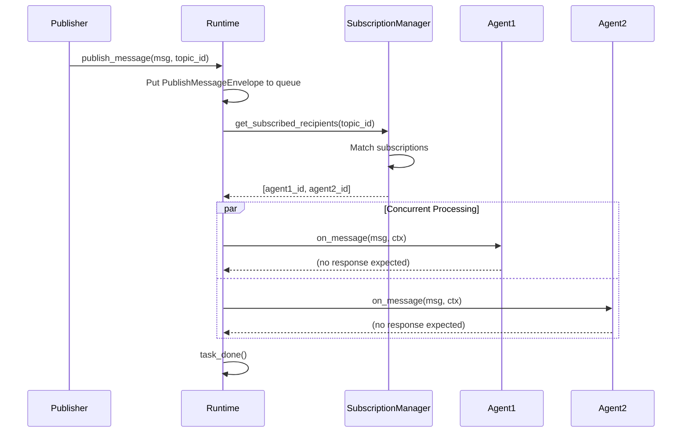
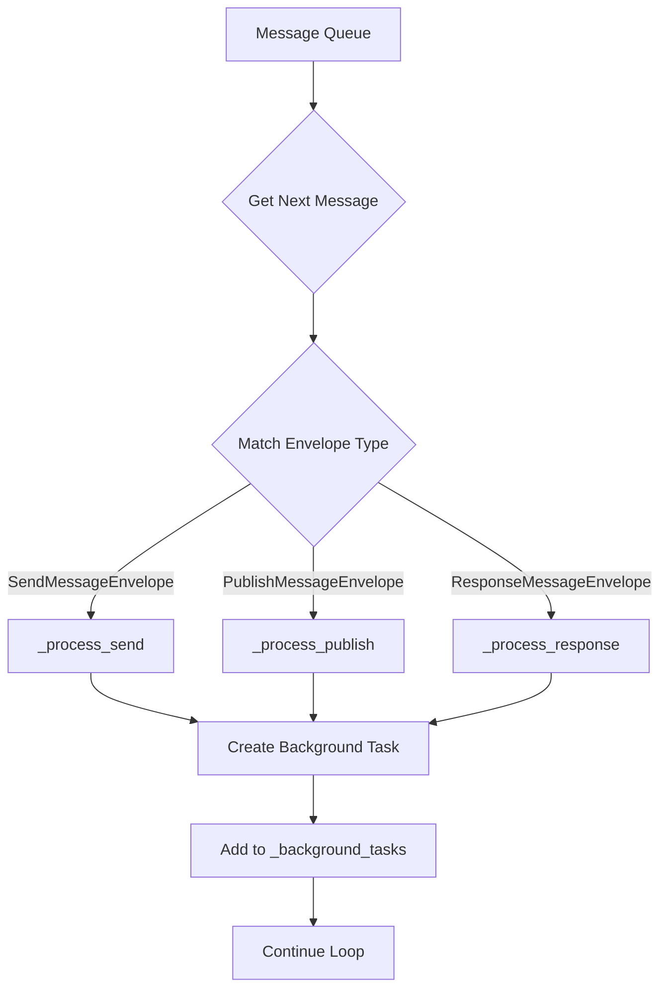
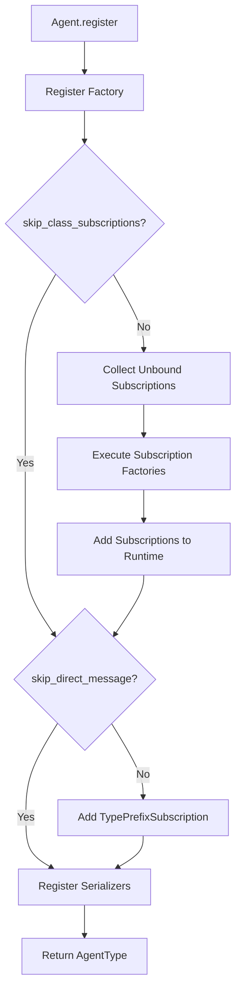
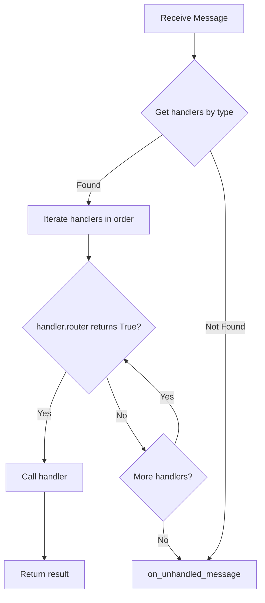
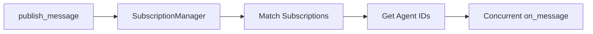
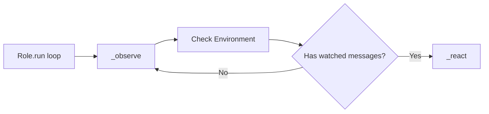

# AutoGen 发布-订阅机制深度分析

## 1. 核心架构概览

AutoGen 采用了**双模型消息传递架构**，将消息通信分为两种模式：

- **send_message (点对点 RPC)**：直接向指定 Agent 发送消息并等待响应
- **publish_message (发布-订阅)**：向 Topic 发布消息，所有订阅者并发处理

### 1.1 关键组件

```
┌─────────────────────────────────────────────────────────────┐
│                    AgentRuntime                              │
│  ┌──────────────────────────────────────────────────────┐   │
│  │           Message Queue (Single Queue)               │   │
│  │  PublishMessageEnvelope | SendMessageEnvelope |      │   │
│  │  ResponseMessageEnvelope                             │   │
│  └──────────────────────────────────────────────────────┘   │
│                           │                                  │
│                           ▼                                  │
│  ┌──────────────────────────────────────────────────────┐   │
│  │         SubscriptionManager                          │   │
│  │  - _subscriptions: List[Subscription]                │   │
│  │  - _seen_topics: Set[TopicId]                        │   │
│  │  - _subscribed_recipients: Dict[TopicId, List[AgentId]]│ │
│  └──────────────────────────────────────────────────────┘   │
└─────────────────────────────────────────────────────────────┘
                           │
                           ▼
        ┌──────────────────────────────────────┐
        │         Subscription Protocol         │
        │  - is_match(topic_id) → bool         │
        │  - map_to_agent(topic_id) → AgentId  │
        └──────────────────────────────────────┘
                           │
        ┌──────────────────┴──────────────────┐
        ▼                                     ▼
┌───────────────────┐            ┌──────────────────────┐
│ TypeSubscription  │            │TypePrefixSubscription│
│ 按 type 匹配      │            │ 前缀匹配             │
│ source → key      │            │ 直接消息路由         │
└───────────────────┘            └──────────────────────┘
```

## 2. 发布-订阅核心机制

### 2.1 TopicId 设计

TopicId 是一个不可变的二元组，遵循 CloudEvents 规范：

```python
@dataclass(eq=True, frozen=True)
class TopicId:
    type: str    # Event type (must match: ^[\w\-\.\:\=]+\Z)
    source: str  # Event context/source
    
    def __str__(self) -> str:
        return f"{self.type}/{self.source}"
```

**设计理念：**
- `type`：事件类型，定义"发生了什么"
- `source`：事件来源，定义"在哪个上下文中发生"
- 组合提供了灵活的订阅匹配机制

**示例：**
```python
# 用户会话事件
TopicId("user_message", "session_123")
TopicId("user_message", "session_456")

# 系统事件
TopicId("system_alert", "monitoring")
TopicId("default", "global")
```

### 2.2 Subscription 匹配机制

Subscription 是一个协议（Protocol），定义了订阅的核心行为：

```python
@runtime_checkable
class Subscription(Protocol):
    @property
    def id(self) -> str:
        """Unique subscription ID (usually UUID)"""
        ...
    
    def is_match(self, topic_id: TopicId) -> bool:
        """Check if topic_id matches this subscription"""
        ...
    
    def map_to_agent(self, topic_id: TopicId) -> AgentId:
        """Map topic_id to specific agent instance"""
        ...
```

**核心思想：**
1. `is_match`：判断是否订阅该 Topic
2. `map_to_agent`：将 Topic 映射到具体的 Agent 实例

### 2.3 TypeSubscription 实现

TypeSubscription 是最常用的订阅实现，按 type 匹配，用 source 作为 agent key：

```python
class TypeSubscription(Subscription):
    def __init__(self, topic_type: str, agent_type: str, id: str | None = None):
        self._topic_type = topic_type
        self._agent_type = agent_type
        self._id = id or str(uuid.uuid4())
    
    def is_match(self, topic_id: TopicId) -> bool:
        # Only match on type
        return topic_id.type == self._topic_type
    
    def map_to_agent(self, topic_id: TopicId) -> AgentId:
        # Use source as agent key
        return AgentId(type=self._agent_type, key=topic_id.source)
```

**关键特性：**
- **动态实例化**：每个不同的 source 会创建独立的 Agent 实例
- **隔离性**：不同 source 的消息由不同实例处理，天然隔离

**示例：**
```python
# 订阅 "user_message" 类型，由 "chat_agent" 处理
subscription = TypeSubscription(topic_type="user_message", agent_type="chat_agent")

# 发布消息
await runtime.publish_message(
    Message("Hello"),
    TopicId("user_message", "session_123")
)
# → 路由到 AgentId(type="chat_agent", key="session_123")

await runtime.publish_message(
    Message("Hi"),
    TopicId("user_message", "session_456")
)
# → 路由到 AgentId(type="chat_agent", key="session_456")
# 两个不同的 Agent 实例！
```

### 2.4 SubscriptionManager 路由逻辑

SubscriptionManager 负责管理所有订阅并执行路由：

```python
class SubscriptionManager:
    def __init__(self) -> None:
        self._subscriptions: List[Subscription] = []
        self._seen_topics: Set[TopicId] = set()
        # Cache: topic → list of agent IDs
        self._subscribed_recipients: DefaultDict[TopicId, List[AgentId]] = defaultdict(list)
    
    async def get_subscribed_recipients(self, topic: TopicId) -> List[AgentId]:
        # First time seeing this topic? Build subscriber list
        if topic not in self._seen_topics:
            self._build_for_new_topic(topic)
        return self._subscribed_recipients[topic]
    
    def _build_for_new_topic(self, topic: TopicId) -> None:
        self._seen_topics.add(topic)
        # Iterate all subscriptions
        for subscription in self._subscriptions:
            if subscription.is_match(topic):
                # Map to specific agent instance
                agent_id = subscription.map_to_agent(topic)
                self._subscribed_recipients[topic].append(agent_id)
```

**核心优化：**
- **延迟构建**：首次遇到 Topic 时才构建订阅者列表
- **缓存机制**：相同 Topic 的后续消息直接使用缓存
- **灵活匹配**：支持任意 Subscription 实现

### 2.5 消息处理流程

从 `_process_publish` 方法分析完整的发布-订阅流程：

```python
async def _process_publish(self, message_envelope: PublishMessageEnvelope) -> None:
    try:
        responses: List[Awaitable[Any]] = []
        
        # Step 1: Get all subscribed agents for this topic
        recipients = await self._subscription_manager.get_subscribed_recipients(
            message_envelope.topic_id
        )
        
        # Step 2: Iterate all recipients
        for agent_id in recipients:
            # Skip sender to avoid echo
            if message_envelope.sender is not None and agent_id == message_envelope.sender:
                continue
            
            # Step 3: Create MessageContext (is_rpc=False for publish)
            message_context = MessageContext(
                sender=message_envelope.sender,
                topic_id=message_envelope.topic_id,
                is_rpc=False,  # Key: publish is NOT RPC
                cancellation_token=message_envelope.cancellation_token,
                message_id=message_envelope.message_id,
            )
            
            # Step 4: Get agent instance
            agent = await self._get_agent(agent_id)
            
            # Step 5: Create async task for each subscriber
            async def _on_message(agent: Agent, message_context: MessageContext) -> Any:
                try:
                    return await agent.on_message(
                        message_envelope.message,
                        ctx=message_context,
                    )
                except BaseException as e:
                    logger.error(f"Error processing publish message for {agent.id}")
                    raise e
            
            future = _on_message(agent, message_context)
            responses.append(future)
        
        # Step 6: Concurrent execution with asyncio.gather
        await asyncio.gather(*responses)
    except BaseException as e:
        if not self._ignore_unhandled_handler_exceptions:
            self._background_exception = e
    finally:
        self._message_queue.task_done()
```

**关键流程图：**



**核心特性：**
1. **并发处理**：所有订阅者通过 `asyncio.gather` 并发执行
2. **无响应期待**：publish 不等待返回值
3. **回环避免**：自动过滤发送者自己
4. **错误隔离**：单个订阅者异常不影响其他订阅者

## 3. 消息队列架构

### 3.1 三种消息信封

AutoGen 使用单一队列处理所有消息类型：

```python
# 1. Publish message envelope
@dataclass(kw_only=True)
class PublishMessageEnvelope:
    message: Any
    cancellation_token: CancellationToken
    sender: AgentId | None
    topic_id: TopicId  # Key: has topic_id
    metadata: EnvelopeMetadata | None = None
    message_id: str

# 2. Send message envelope (RPC)
@dataclass(kw_only=True)
class SendMessageEnvelope:
    message: Any
    sender: AgentId | None
    recipient: AgentId  # Key: has specific recipient
    future: Future[Any]  # Key: expects response
    cancellation_token: CancellationToken
    metadata: EnvelopeMetadata | None = None
    message_id: str

# 3. Response message envelope
@dataclass(kw_only=True)
class ResponseMessageEnvelope:
    message: Any
    future: Future[Any]  # Key: resolves the future
    sender: AgentId
    recipient: AgentId | None
    metadata: EnvelopeMetadata | None = None
```

**设计对比：**

| 特性 | PublishMessageEnvelope | SendMessageEnvelope | ResponseMessageEnvelope |
|------|------------------------|---------------------|-------------------------|
| **目标** | topic_id (广播) | recipient (点对点) | recipient (响应) |
| **响应** | 无 | future (等待) | future (解决) |
| **用途** | 事件通知 | RPC 调用 | RPC 响应 |

### 3.2 消息处理循环

```python
class SingleThreadedAgentRuntime(AgentRuntime):
    def __init__(self):
        # Single queue for all message types
        self._message_queue: Queue[
            PublishMessageEnvelope | SendMessageEnvelope | ResponseMessageEnvelope
        ] = Queue()
        self._background_tasks: Set[Task[Any]] = set()
        self._subscription_manager = SubscriptionManager()
    
    async def _process_next(self) -> None:
        # Get next message from queue
        message_envelope = await self._message_queue.get()
        
        # Pattern matching on envelope type
        match message_envelope:
            case SendMessageEnvelope():
                # Create background task for RPC
                task = asyncio.create_task(self._process_send(message_envelope))
                self._background_tasks.add(task)
                task.add_done_callback(self._background_tasks.discard)
            
            case PublishMessageEnvelope():
                # Create background task for publish
                task = asyncio.create_task(self._process_publish(message_envelope))
                self._background_tasks.add(task)
                task.add_done_callback(self._background_tasks.discard)
            
            case ResponseMessageEnvelope():
                # Create background task for response
                task = asyncio.create_task(self._process_response(message_envelope))
                self._background_tasks.add(task)
                task.add_done_callback(self._background_tasks.discard)
        
        # Yield control to allow other tasks to run
        await asyncio.sleep(0)
```

**处理流程图：**



**核心特性：**
1. **单队列设计**：所有消息类型共享一个队列，简化调度
2. **异步处理**：每个消息创建独立的后台任务
3. **任务管理**：通过 `_background_tasks` 集合跟踪所有任务
4. **自动清理**：任务完成后自动从集合中移除

## 4. Agent 注册与订阅

### 4.1 BaseAgent.register 方法

```python
@classmethod
async def register(
    cls,
    runtime: AgentRuntime,
    type: str,
    factory: Callable[[], Self | Awaitable[Self]],
    *,
    skip_class_subscriptions: bool = False,
    skip_direct_message_subscription: bool = False,
) -> AgentType:
    # Step 1: Register agent factory
    agent_type = await runtime.register_factory(
        type=agent_type, 
        agent_factory=factory, 
        expected_class=cls
    )
    
    # Step 2: Add class-level subscriptions (from decorators)
    if not skip_class_subscriptions:
        with SubscriptionInstantiationContext.populate_context(agent_type):
            subscriptions: List[Subscription] = []
            # Execute all unbound subscription factories
            for unbound_subscription in cls._unbound_subscriptions():
                subscriptions_list_result = unbound_subscription()
                if inspect.isawaitable(subscriptions_list_result):
                    subscriptions_list = await subscriptions_list_result
                else:
                    subscriptions_list = subscriptions_list_result
                subscriptions.extend(subscriptions_list)
        
        # Add all subscriptions to runtime
        for subscription in subscriptions:
            await runtime.add_subscription(subscription)
    
    # Step 3: Add direct message subscription (TypePrefixSubscription)
    if not skip_direct_message_subscription:
        await runtime.add_subscription(
            TypePrefixSubscription(
                topic_type_prefix=agent_type.type + ":",  # e.g., "chat_agent:"
                agent_type=agent_type.type,
            )
        )
    
    # Step 4: Register message serializers
    for _message_type, serializer in cls._handles_types():
        runtime.add_message_serializer(serializer)
    
    return agent_type
```

**注册流程图：**



### 4.2 装饰器订阅机制

AutoGen 提供了多种装饰器来声明订阅：

```python
# 1. @default_subscription - 订阅 "default" topic
@default_subscription
class MyAgent(RoutedAgent):
    pass

# 2. @type_subscription - 订阅自定义 topic
@type_subscription("custom_topic")
class MyAgent(RoutedAgent):
    pass

# 3. subscription_factory - 自定义订阅逻辑
def my_subscription_factory() -> List[Subscription]:
    return [
        TypeSubscription(topic_type="event1", agent_type="my_agent"),
        TypeSubscription(topic_type="event2", agent_type="my_agent"),
    ]

@subscription_factory(my_subscription_factory)
class MyAgent(RoutedAgent):
    pass
```

**装饰器实现原理：**

```python
def subscription_factory(subscription: UnboundSubscription):
    def decorator(cls: Type[BaseAgentType]) -> Type[BaseAgentType]:
        # Add to class-level list
        cls.internal_unbound_subscriptions_list.append(subscription)
        return cls
    return decorator
```

**关键点：**
- 装饰器将订阅工厂函数添加到类变量 `internal_unbound_subscriptions_list`
- 注册时遍历该列表，执行所有工厂函数
- 支持异步工厂函数

## 5. RoutedAgent 消息路由

### 5.1 装饰器路由机制

RoutedAgent 提供了三种装饰器来定义消息处理器：

```python
class RoutedAgent(BaseAgent):
    def __init__(self, description: str) -> None:
        # Handler registry: message_type → list of handlers
        self._handlers: DefaultDict[Type[Any], List[MessageHandler]] = DefaultDict(list)
        
        # Discover all handlers from class methods
        handlers = self._discover_handlers()
        for message_handler in handlers:
            for target_type in message_handler.target_types:
                self._handlers[target_type].append(message_handler)
        
        super().__init__(description)
    
    async def on_message_impl(self, message: Any, ctx: MessageContext) -> Any | None:
        key_type: Type[Any] = type(message)
        handlers = self._handlers.get(key_type)
        
        if handlers is not None:
            # Iterate handlers in order, call first matching one
            for h in handlers:
                if h.router(message, ctx):  # Check match function
                    return await h(self, message, ctx)
        
        return await self.on_unhandled_message(message, ctx)
```

### 5.2 三种装饰器对比

```python
# 1. @message_handler - 处理所有消息（event + rpc）
class MyAgent(RoutedAgent):
    @message_handler
    async def handle_any(self, message: MyMessage, ctx: MessageContext) -> Response:
        # Can handle both publish and send
        return Response()

# 2. @event - 只处理 publish 消息 (is_rpc=False)
class MyAgent(RoutedAgent):
    @event
    async def handle_event(self, message: MyMessage, ctx: MessageContext) -> None:
        # Only called for publish_message
        # Must return None
        pass

# 3. @rpc - 只处理 send 消息 (is_rpc=True)
class MyAgent(RoutedAgent):
    @rpc
    async def handle_rpc(self, message: MyMessage, ctx: MessageContext) -> Response:
        # Only called for send_message
        return Response()
```

**装饰器实现对比：**

```python
# @event decorator
wrapper_handler.router = lambda _message, _ctx: (
    (not _ctx.is_rpc) and (match(_message, _ctx) if match else True)
)

# @rpc decorator
wrapper_handler.router = lambda _message, _ctx: (
    (_ctx.is_rpc) and (match(_message, _ctx) if match else True)
)

# @message_handler decorator
wrapper_handler.router = match or (lambda _message, _ctx: True)
```

**关键区别：**

| 装饰器 | is_rpc 检查 | 返回值 | 用途 |
|--------|-------------|--------|------|
| `@message_handler` | 无 | Any | 通用处理器 |
| `@event` | `not ctx.is_rpc` | None | 发布-订阅事件 |
| `@rpc` | `ctx.is_rpc` | Any | 点对点 RPC |

### 5.3 二次路由：match 函数

所有装饰器都支持 `match` 参数进行二次路由：

```python
class MyAgent(RoutedAgent):
    @event(match=lambda msg, ctx: msg.priority == "high")
    async def handle_high_priority(self, message: MyMessage, ctx: MessageContext) -> None:
        print("High priority event")
    
    @event(match=lambda msg, ctx: msg.priority == "low")
    async def handle_low_priority(self, message: MyMessage, ctx: MessageContext) -> None:
        print("Low priority event")
```

**路由顺序：**
1. 按消息类型匹配：`type(message)` → `_handlers[type]`
2. 按字母顺序遍历处理器
3. 调用第一个 `router` 返回 `True` 的处理器
4. 跳过其余处理器

**路由流程图：**



## 6. 与 MetaGPT 的对比

### 6.1 架构对比表

| 维度 | AutoGen | MetaGPT |
|------|---------|---------|
| **消息模型** | 双模型：`publish` (广播) + `send` (RPC) | 单模型：`publish` + 地址过滤 |
| **订阅机制** | `TopicId` (type+source) + `Subscription.is_match` | `cause_by` (Action类名) + `watch` (set) |
| **路由方式** | `SubscriptionManager` 集中管理 | `Environment.publish_message` 遍历 `member_addrs` |
| **消息队列** | 单一全局队列（3种信封类型） | 每个 Role 私有 `MessageQueue` |
| **Agent 激活** | 订阅匹配 → 并发调用 `on_message` | `watch` 匹配 → `_observe` 过滤 → `react` 循环 |
| **消息处理** | 装饰器路由（`@event`/`@rpc`） | `_think` 选择 Action → `_act` 执行 |
| **并发模型** | `asyncio.gather` 并发处理订阅者 | `asyncio.gather` 并发执行 `Role.run()` |
| **动态实例化** | `TypeSubscription` 用 source 作 key | 不支持，需手动创建 Role 实例 |
| **直接消息** | `TypePrefixSubscription` 支持点对点 | 通过 `send_to` 指定接收者地址 |

### 6.2 订阅机制对比

**AutoGen：**
```python
# 灵活的订阅协议
class TypeSubscription(Subscription):
    def is_match(self, topic_id: TopicId) -> bool:
        return topic_id.type == self._topic_type
    
    def map_to_agent(self, topic_id: TopicId) -> AgentId:
        return AgentId(type=self._agent_type, key=topic_id.source)

# 使用
subscription = TypeSubscription(topic_type="user_message", agent_type="chat_agent")
await runtime.add_subscription(subscription)

# 发布
await runtime.publish_message(
    Message("Hello"),
    TopicId("user_message", "session_123")
)
# → 自动路由到 AgentId("chat_agent", "session_123")
```

**MetaGPT：**
```python
# 基于 Action 类名的订阅
class Engineer(Role):
    def __init__(self):
        super().__init__()
        self.set_actions([WriteCode])
        self.watch([WritePRD, WriteDesign])  # 订阅这些 Action

# 使用
env = Environment()
env.add_role(engineer)

# 发布
await env.publish_message(Message(content="...", cause_by=WritePRD))
# → Environment 遍历所有 Role，检查 WritePRD in role.watch
```

### 6.3 消息队列对比

**AutoGen：单一全局队列**
```python
class SingleThreadedAgentRuntime:
    def __init__(self):
        # All agents share one queue
        self._message_queue: Queue[
            PublishMessageEnvelope | SendMessageEnvelope | ResponseMessageEnvelope
        ] = Queue()
    
    async def _process_next(self):
        envelope = await self._message_queue.get()
        # Dispatch based on envelope type
```

**优势：**
- 简化调度逻辑
- 保证全局消息顺序
- 统一的背压机制

**MetaGPT：每个 Role 私有队列**
```python
class Role:
    def __init__(self):
        self.rc.msg_buffer = MessageQueue()  # Private queue
    
    async def _observe(self):
        # Check environment for new messages
        news = self.rc.env.memory.get_by_actions(self.rc.watch)
        self.rc.msg_buffer.push(news)
```

**优势：**
- Role 独立处理消息
- 支持不同的消费速率
- 更好的隔离性

### 6.4 Agent 激活对比

**AutoGen：订阅驱动**


**特点：**
- 订阅匹配后立即激活
- 并发处理所有订阅者
- 无需轮询

**MetaGPT：轮询驱动**


**特点：**
- Role 主动轮询环境
- 通过 `_observe` 过滤消息
- 支持复杂的状态机逻辑

## 7. 核心优势与设计理念

### 7.1 解耦性

**TopicId 抽象层：**
- 发布者只需知道 `TopicId`，无需知道订阅者
- 订阅者通过 `Subscription` 声明兴趣，无需知道发布者
- 运行时负责匹配和路由

**示例：**
```python
# Publisher
await runtime.publish_message(
    UserMessage("Hello"),
    TopicId("chat", "session_123")
)
# 不知道谁会处理这条消息

# Subscriber
@type_subscription("chat")
class ChatAgent(RoutedAgent):
    @event
    async def handle_message(self, msg: UserMessage, ctx: MessageContext) -> None:
        # 不知道谁发送的消息
        pass
```

### 7.2 灵活性

**多种订阅策略：**

1. **TypeSubscription**：按 type 匹配，source 作 key
   ```python
   TypeSubscription(topic_type="event", agent_type="handler")
   # TopicId("event", "A") → AgentId("handler", "A")
   # TopicId("event", "B") → AgentId("handler", "B")
   ```

2. **TypePrefixSubscription**：前缀匹配，用于直接消息
   ```python
   TypePrefixSubscription(topic_type_prefix="agent:", agent_type="agent")
   # TopicId("agent:123", "any") → AgentId("agent", "123")
   ```

3. **自定义 Subscription**：实现 `is_match` 和 `map_to_agent`
   ```python
   class CustomSubscription(Subscription):
       def is_match(self, topic_id: TopicId) -> bool:
           # Custom matching logic
           return topic_id.type.startswith("custom_")
       
       def map_to_agent(self, topic_id: TopicId) -> AgentId:
           # Custom mapping logic
           return AgentId("handler", topic_id.source)
   ```

### 7.3 双模型设计

**publish vs send：**

```python
# publish: 事件广播，无响应
await runtime.publish_message(
    Event("user_joined"),
    TopicId("user_events", "lobby")
)
# → 所有订阅者并发处理，无返回值

# send: RPC 调用，等待响应
response = await runtime.send_message(
    Query("get_user_info"),
    recipient=AgentId("user_service", "default")
)
# → 点对点调用，等待返回值
```

**优势：**
- 语义清晰：publish 用于通知，send 用于请求
- 性能优化：publish 无需等待响应
- 错误处理：send 可以捕获异常，publish 异常隔离

### 7.4 类型安全

**基于 Python 类型提示的路由：**

```python
class MyAgent(RoutedAgent):
    @event
    async def handle_message(self, message: UserMessage, ctx: MessageContext) -> None:
        # Type hint: UserMessage
        pass
    
    @rpc
    async def handle_query(self, message: Query, ctx: MessageContext) -> Response:
        # Type hint: Query → Response
        pass
```

**装饰器自动提取类型：**
```python
def message_handler(func):
    type_hints = get_type_hints(func)
    target_types = get_types(type_hints["message"])  # Extract message type
    return_types = get_types(type_hints["return"])   # Extract return type
    
    wrapper.target_types = list(target_types)
    wrapper.produces_types = list(return_types)
```

**运行时类型检查：**
```python
async def wrapper(self, message, ctx):
    if type(message) not in target_types:
        if strict:
            raise CantHandleException(f"Message type {type(message)} not in {target_types}")
    
    return_value = await func(self, message, ctx)
    
    if type(return_value) not in return_types:
        if strict:
            raise ValueError(f"Return type {type(return_value)} not in {return_types}")
```

### 7.5 可扩展性

**Subscription 协议允许自定义匹配逻辑：**

```python
# Example: Regex-based subscription
class RegexSubscription(Subscription):
    def __init__(self, pattern: str, agent_type: str):
        self._pattern = re.compile(pattern)
        self._agent_type = agent_type
        self._id = str(uuid.uuid4())
    
    def is_match(self, topic_id: TopicId) -> bool:
        return self._pattern.match(topic_id.type) is not None
    
    def map_to_agent(self, topic_id: TopicId) -> AgentId:
        return AgentId(self._agent_type, topic_id.source)

# Usage
await runtime.add_subscription(
    RegexSubscription(pattern=r"user_.*", agent_type="user_handler")
)
```

## 8. 关键代码片段

### 8.1 SubscriptionManager.get_subscribed_recipients

```python
class SubscriptionManager:
    def __init__(self) -> None:
        self._subscriptions: List[Subscription] = []
        self._seen_topics: Set[TopicId] = set()
        # Cache: topic → list of agent IDs
        self._subscribed_recipients: DefaultDict[TopicId, List[AgentId]] = defaultdict(list)
    
    async def get_subscribed_recipients(self, topic: TopicId) -> List[AgentId]:
        """Get all agents subscribed to a topic.
        
        First time seeing a topic: build subscriber list by iterating all subscriptions.
        Subsequent calls: return cached list.
        """
        if topic not in self._seen_topics:
            self._build_for_new_topic(topic)
        return self._subscribed_recipients[topic]
    
    def _build_for_new_topic(self, topic: TopicId) -> None:
        """Build subscriber list for a new topic."""
        self._seen_topics.add(topic)
        
        # Iterate all subscriptions
        for subscription in self._subscriptions:
            # Check if subscription matches this topic
            if subscription.is_match(topic):
                # Map topic to specific agent instance
                agent_id = subscription.map_to_agent(topic)
                self._subscribed_recipients[topic].append(agent_id)
```

### 8.2 SingleThreadedAgentRuntime._process_publish

```python
async def _process_publish(self, message_envelope: PublishMessageEnvelope) -> None:
    """Process a publish message by delivering it to all subscribed agents concurrently."""
    try:
        responses: List[Awaitable[Any]] = []
        
        # Step 1: Get all subscribed agents for this topic
        recipients = await self._subscription_manager.get_subscribed_recipients(
            message_envelope.topic_id
        )
        
        # Step 2: Create async tasks for each recipient
        for agent_id in recipients:
            # Avoid sending message back to sender (prevent echo)
            if message_envelope.sender is not None and agent_id == message_envelope.sender:
                continue
            
            # Create message context with is_rpc=False
            message_context = MessageContext(
                sender=message_envelope.sender,
                topic_id=message_envelope.topic_id,
                is_rpc=False,  # Key: publish is NOT RPC
                cancellation_token=message_envelope.cancellation_token,
                message_id=message_envelope.message_id,
            )
            
            # Get agent instance (lazy instantiation)
            agent = await self._get_agent(agent_id)
            
            # Create async task for this agent
            async def _on_message(agent: Agent, message_context: MessageContext) -> Any:
                try:
                    return await agent.on_message(
                        message_envelope.message,
                        ctx=message_context,
                    )
                except BaseException as e:
                    logger.error(f"Error processing publish message for {agent.id}")
                    raise e
            
            future = _on_message(agent, message_context)
            responses.append(future)
        
        # Step 3: Execute all tasks concurrently
        await asyncio.gather(*responses)
    except BaseException as e:
        if not self._ignore_unhandled_handler_exceptions:
            self._background_exception = e
    finally:
        self._message_queue.task_done()
```

### 8.3 TypeSubscription.is_match 和 map_to_agent

```python
class TypeSubscription(Subscription):
    """Subscription that matches on topic type and maps to agents using source as key."""
    
    def __init__(self, topic_type: str, agent_type: str, id: str | None = None):
        self._topic_type = topic_type
        self._agent_type = agent_type
        self._id = id or str(uuid.uuid4())
    
    def is_match(self, topic_id: TopicId) -> bool:
        """Match only on topic type, ignore source."""
        return topic_id.type == self._topic_type
    
    def map_to_agent(self, topic_id: TopicId) -> AgentId:
        """Map topic to agent using source as agent key.
        
        This creates separate agent instances for different sources:
        - TopicId("chat", "session_1") → AgentId("chat_agent", "session_1")
        - TopicId("chat", "session_2") → AgentId("chat_agent", "session_2")
        """
        if not self.is_match(topic_id):
            raise CantHandleException("TopicId does not match the subscription")
        
        return AgentId(type=self._agent_type, key=topic_id.source)
```

### 8.4 BaseAgent.register 订阅注册流程

```python
@classmethod
async def register(
    cls,
    runtime: AgentRuntime,
    type: str,
    factory: Callable[[], Self | Awaitable[Self]],
    *,
    skip_class_subscriptions: bool = False,
    skip_direct_message_subscription: bool = False,
) -> AgentType:
    """Register an agent type with the runtime and add subscriptions."""
    
    # Step 1: Register agent factory
    agent_type = await runtime.register_factory(
        type=agent_type, 
        agent_factory=factory, 
        expected_class=cls
    )
    
    # Step 2: Add class-level subscriptions (from decorators like @default_subscription)
    if not skip_class_subscriptions:
        with SubscriptionInstantiationContext.populate_context(agent_type):
            subscriptions: List[Subscription] = []
            
            # Execute all unbound subscription factories
            for unbound_subscription in cls._unbound_subscriptions():
                subscriptions_list_result = unbound_subscription()
                if inspect.isawaitable(subscriptions_list_result):
                    subscriptions_list = await subscriptions_list_result
                else:
                    subscriptions_list = subscriptions_list_result
                subscriptions.extend(subscriptions_list)
        
        # Add all subscriptions to runtime
        for subscription in subscriptions:
            await runtime.add_subscription(subscription)
    
    # Step 3: Add direct message subscription (TypePrefixSubscription)
    # This allows sending messages directly to this agent type
    if not skip_direct_message_subscription:
        await runtime.add_subscription(
            TypePrefixSubscription(
                topic_type_prefix=agent_type.type + ":",  # e.g., "chat_agent:"
                agent_type=agent_type.type,
            )
        )
    
    # Step 4: Register message serializers for handled types
    for _message_type, serializer in cls._handles_types():
        runtime.add_message_serializer(serializer)
    
    return agent_type
```

### 8.5 RoutedAgent.on_message_impl 消息路由

```python
class RoutedAgent(BaseAgent):
    def __init__(self, description: str) -> None:
        # Handler registry: message_type → list of handlers
        self._handlers: DefaultDict[Type[Any], List[MessageHandler]] = DefaultDict(list)
        
        # Discover all handlers from class methods decorated with @event/@rpc/@message_handler
        handlers = self._discover_handlers()
        for message_handler in handlers:
            for target_type in message_handler.target_types:
                self._handlers[target_type].append(message_handler)
        
        super().__init__(description)
    
    async def on_message_impl(self, message: Any, ctx: MessageContext) -> Any | None:
        """Route message to appropriate handler based on type and match function.
        
        Routing logic:
        1. Get handlers for message type
        2. Iterate handlers in order (alphabetical by method name)
        3. Call first handler whose router function returns True
        4. Skip remaining handlers
        """
        key_type: Type[Any] = type(message)
        handlers = self._handlers.get(key_type)
        
        if handlers is not None:
            # Iterate handlers in order
            for h in handlers:
                # Check router function (includes is_rpc check for @event/@rpc)
                if h.router(message, ctx):
                    return await h(self, message, ctx)
        
        # No matching handler found
        return await self.on_unhandled_message(message, ctx)
    
    @classmethod
    def _discover_handlers(cls) -> Sequence[MessageHandler]:
        """Discover all message handlers from class methods."""
        handlers: List[MessageHandler] = []
        for attr in dir(cls):
            if callable(getattr(cls, attr, None)):
                handler = getattr(cls, attr)
                # Check if method has is_message_handler attribute (set by decorators)
                if hasattr(handler, "is_message_handler"):
                    handlers.append(handler)
        return handlers
```

## 9. 总结

AutoGen 的发布-订阅机制展现了以下核心特点：

1. **双模型架构**：`publish` 和 `send` 分离，语义清晰
2. **灵活订阅**：`Subscription` 协议支持多种匹配策略
3. **动态实例化**：`TypeSubscription` 用 source 作 key，自动创建实例
4. **类型安全**：基于 Python 类型提示的消息路由
5. **并发处理**：`asyncio.gather` 并发执行所有订阅者
6. **装饰器路由**：`@event`/`@rpc` 提供清晰的消息处理接口

相比 MetaGPT 的轮询模型，AutoGen 的订阅驱动模型更加高效和解耦，适合构建大规模、松耦合的多智能体系统。
