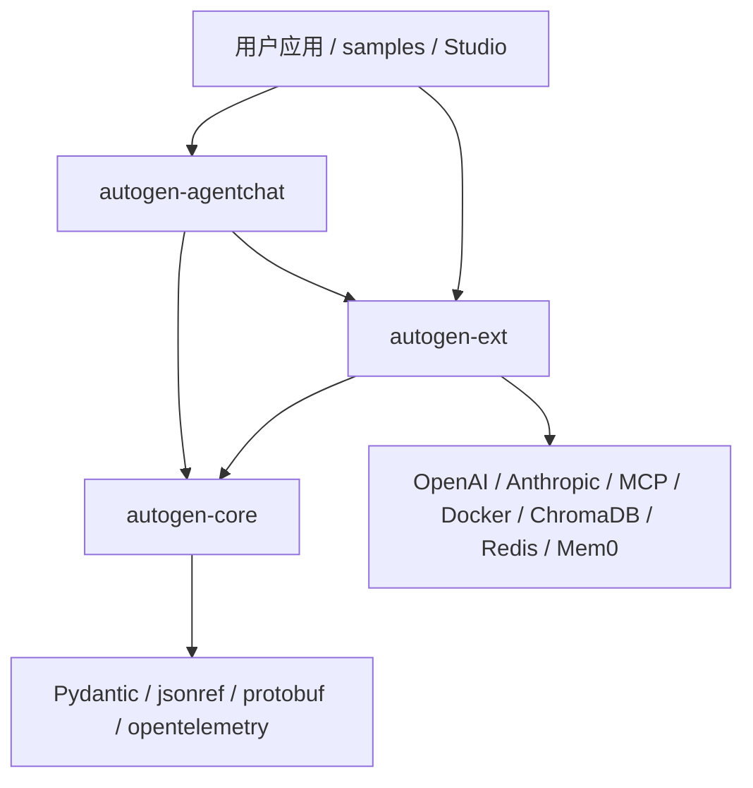
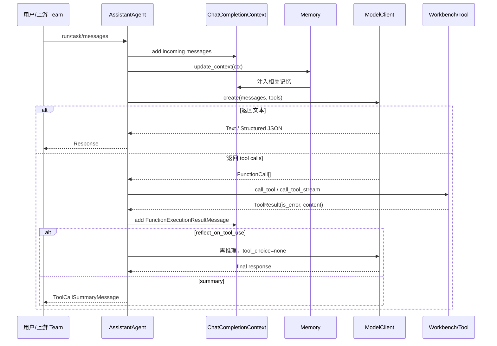
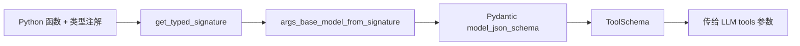
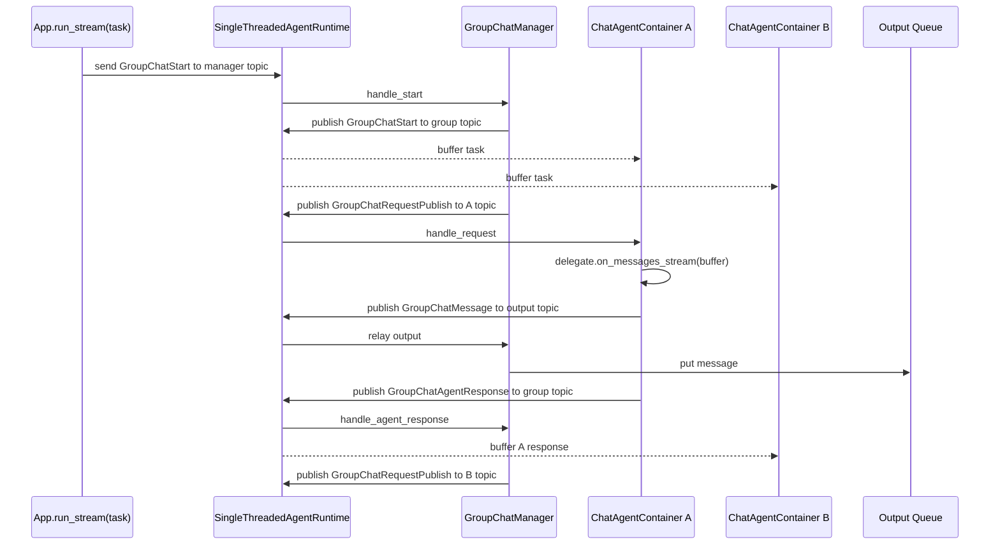
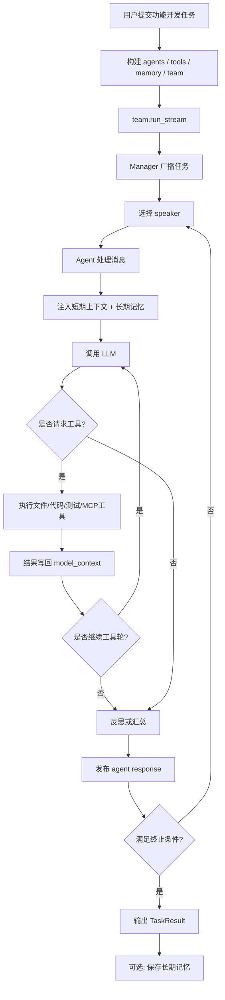
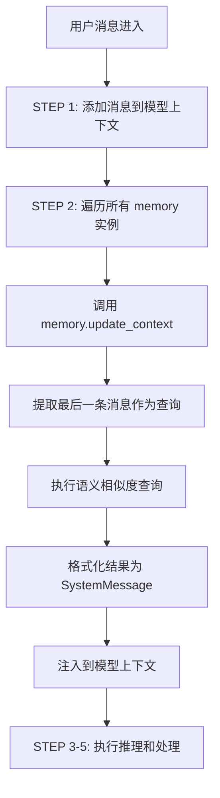
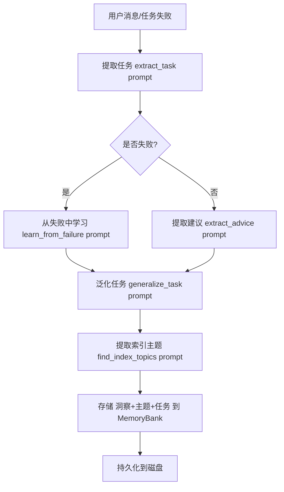
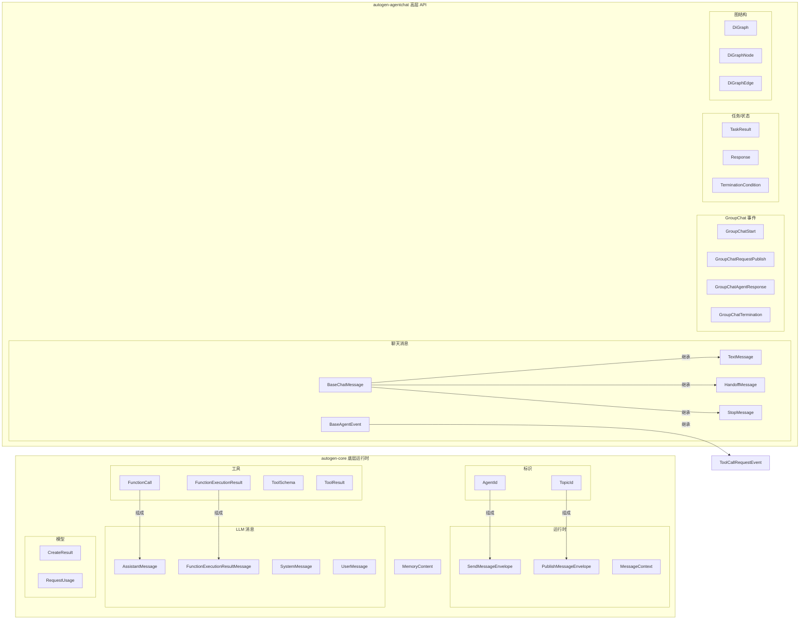

# AutoGen 知识图谱

**调研时间**: 2026-05-25
**研究对象**: `other/autogen`（本地源码）
**信息来源**: 本地源码、README、包配置、示例代码。

---

## 知识框架（主体）

### 1. 定位

AutoGen 是 Microsoft 的多智能体 AI 应用框架，用于创建可自主执行或与人协作的 agent 应用。当前仓库 README 明确说明 AutoGen 已进入 maintenance mode，新项目推荐迁移到 Microsoft Agent Framework；但其 Python 0.7.5 代码仍完整展示了一个分层多 agent 框架的设计。

核心价值有三点：

- 用 `autogen-core` 提供消息运行时、agent 生命周期、工具、模型客户端、短期上下文和记忆接口。
- 用 `autogen-agentchat` 提供更易用的 `AssistantAgent`、团队编排、群聊、终止条件和消息类型。
- 用 `autogen-ext` 提供 OpenAI、Anthropic、MCP、代码执行、ChromaDB、Redis、Mem0 等外部集成。

### 2. 仓库结构

| 模块/目录 | 职责 | 关键文件 |
| --- | --- | --- |
| `other/autogen/README.md` | 顶层定位、安装、Quickstart、维护状态说明 | `README.md` |
| `python/packages/autogen-core` | 核心抽象：运行时、消息投递、工具、模型、短期上下文、记忆接口 | `_single_threaded_agent_runtime.py`, `tools/_base.py`, `memory/_base_memory.py`, `model_context/*` |
| `python/packages/autogen-agentchat` | 面向应用的 agent 和 team API | `agents/_assistant_agent.py`, `teams/_group_chat/*`, `messages.py`, `tools/_agent.py`, `tools/_team.py` |
| `python/packages/autogen-ext` | 模型、工具、记忆、代码执行、MCP 等扩展 | `models/openai/_openai_client.py`, `tools/mcp/_workbench.py`, `memory/chromadb/_chromadb.py`, `memory/redis/_redis_memory.py`, `memory/mem0/_mem0.py` |
| `python/packages/autogen-studio` | 低代码/无代码 GUI 原型工具 | `autogenstudio/*` |
| `python/packages/autogen-magentic-one`, `magentic-one-cli` | 更完整的多 agent 团队示例/应用 | Magentic-One 相关包 |
| `python/samples` | 使用样例 | `agentchat_fastapi`, `task_centric_memory`, `core_streaming_handoffs_fastapi`, `gitty` |
| `dotnet` | .NET 版本实现 | `dotnet/src/*` |

### 3. Python 包依赖关系



`autogen-agentchat` 只硬依赖 `autogen-core`。`autogen-ext` 也只硬依赖 `autogen-core`，其余能力通过 optional extras 打开，例如 `openai`、`mcp`、`chromadb`、`redis`、`mem0`、`docker`、`task-centric-memory`。

---

## 关系层（补充）

### 1. 单个 Agent 的设计

#### 1.1 `AssistantAgent` 的组成

`AssistantAgent` 是 AgentChat 层的核心单 agent。它不是一个裸 LLM wrapper，而是一个有状态的执行单元：

- `name` / `description`: 在团队中标识 agent 和能力。
- `system_message`: 给模型的角色、边界和任务策略。
- `model_client`: 具体模型客户端，例如 `OpenAIChatCompletionClient`。
- `model_context`: 短期上下文，默认 `UnboundedChatCompletionContext`。
- `memory`: 长期/外部记忆列表，实现 `Memory` 接口。
- `tools` 或 `workbench`: 工具来源，二者互斥。
- `handoffs`: 把控制权交给其他 agent 的特殊工具。
- `max_tool_iterations`: 一次 run 中允许的工具调用轮数。
- `reflect_on_tool_use`: 工具执行后是否再让模型基于工具结果生成最终答复。

核心执行入口是 `on_messages_stream()`：

1. 把新输入消息加入 `model_context`。
2. 逐个调用 `Memory.update_context()`，把相关记忆写入上下文。
3. 调用模型，传入 `system_messages + model_context.get_messages()` 和工具 schema。
4. 若模型返回文本，直接生成 `TextMessage` 或 `StructuredMessage`。
5. 若模型返回工具调用，执行工具并写回 `FunctionExecutionResultMessage`。
6. 如果仍在 `max_tool_iterations` 内，继续让模型基于工具结果决定下一步。
7. 最后根据配置执行反思输出或工具结果摘要。



#### 1.2 工具调用与 schema

工具抽象在 `autogen_core.tools`：

- `ToolSchema`: `{name, description, parameters, strict}`。
- `ParametersSchema`: JSON Schema 风格对象，包含 `type=object`、`properties`、`required`、`additionalProperties`。
- `BaseTool`: 持有 `args_type`、`return_type`、`name`、`description`，通过 Pydantic 生成 schema。
- `FunctionTool`: 把普通 Python 函数封装成工具，要求函数参数和返回值有类型注解。
- `Workbench`: 工具集合接口；`StaticWorkbench` 包装普通工具，`McpWorkbench` 连接 MCP server。

schema 生成路径：



重要约束：

- `FunctionTool` 默认使用函数名作为工具名，docstring 或显式参数作为描述。
- `strict=True` 时，所有参数都必须是 required，且不允许 `additionalProperties`；结构化输出模式下通常需要 strict。
- `AssistantAgent` 会检查工具名唯一性，handoff 工具名也不能和普通工具名冲突。
- 使用 `AgentTool` 或 `TeamTool` 时必须禁用模型的并行工具调用，因为 agent/team 内部有状态，不能并发运行同一个实例。

#### 1.3 工具调用出错怎么办

AutoGen 的错误处理分层：

| 错误类型 | 处理方式 | 结果 |
| --- | --- | --- |
| 工具参数不是合法 JSON | `_execute_tool_call()` 捕获 `json.JSONDecodeError` | 返回 `FunctionExecutionResult(is_error=True, content="Error: ...")` |
| 工具名找不到 | 遍历所有 workbench 后未命中 | 返回 `is_error=True`，内容为 `Error: tool 'x' not found in any workbench` |
| 工具内部返回 `ToolResult(is_error=True)` | workbench 正常返回错误结果 | 错误标记写入 `FunctionExecutionResult.is_error`，模型可继续处理 |
| 工具执行抛异常 | 普通路径没有在 `_execute_tool_call()` 完整吞掉异常 | 异常向上冒泡；在 team 容器里会被包装成 `GroupChatError` 并终止团队 |
| group chat manager/agent 容器异常 | 捕获异常并发布 `GroupChatError` 或 `GroupChatTermination(error=...)` | `run_stream()` 最终抛 `RuntimeError` |

所以框架把"模型可理解的工具失败"和"运行时异常"区分开：前者回灌到 LLM 上下文，后者终止当前 team/run。

### 2. 记忆机制

#### 2.1 短期记忆：`ChatCompletionContext`

短期记忆就是 agent 内部的 LLM 消息历史。`AssistantAgent` 默认使用 `UnboundedChatCompletionContext`，也可以换成：

- `BufferedChatCompletionContext`: 只保留最近 N 条。
- `TokenLimitedChatCompletionContext`: 按 token 限制保留上下文。
- `HeadAndTailChatCompletionContext`: 保留头部和尾部。

短期记忆的职责不是"抽取知识"，而是提供当前会话的历史消息窗口。`AssistantAgent.save_state()` 保存的是 `model_context` 状态；`on_reset()` 会清空它。

#### 2.2 长期/外部记忆：`Memory`

`Memory` 是可插拔接口，核心方法：

- `add(MemoryContent)`: 写入记忆。
- `query(query) -> MemoryQueryResult`: 检索相关记忆。
- `update_context(model_context) -> UpdateContextResult`: 根据当前上下文检索记忆，并把内容注入 `model_context`。
- `clear()` / `close()`: 清理资源。

`MemoryContent` 的字段是：

- `content`: 字符串、bytes、dict 或图片。
- `mime_type`: 文本、Markdown、JSON 等 MIME 类型。
- `metadata`: 分类、分数、来源、用户 ID 等扩展信息。

典型实现：

| 实现 | 存储方式 | 检索方式 | 适用场景 |
| --- | --- | --- | --- |
| `ListMemory` | 进程内列表 | 不做语义检索，按时间顺序全部返回 | 小样例、固定用户偏好 |
| `ChromaDBVectorMemory` | ChromaDB collection | 用最后一条上下文消息做 query，按向量相似度和阈值返回 | 本地持久化语义记忆 |
| `RedisMemory` | RedisVL index | 顺序或向量检索，支持 distance threshold | 服务化、共享存储 |
| `Mem0Memory` | Mem0 客户端 | 按 user_id 搜索，返回 score、created_at、categories 等 | 用户级长期记忆 |
| `Task-Centric Memory` | MemoryBank + vector DB + LLM 过滤 | 任务泛化、主题抽取、相似检索、LLM 验证 | 从建议、演示、失败经验中学习任务策略 |

#### 2.3 长期记忆需要提取什么

框架本身不强制"必须记什么"，但从 `task_centric_memory` 和 `Teachability` 可归纳出适合长期保存的内容：

- 用户稳定偏好：语言、格式、禁忌、单位、风格。
- 可复用事实：项目约定、业务规则、账号/环境的非敏感上下文。
- 任务洞察：某类任务的解决策略、坑点、检查清单。
- 失败经验：失败原因、修复建议、验证方法。
- 演示样例：任务与解法配对，供相似任务检索。

不适合长期保存的内容：一次性中间状态、敏感凭据、未经确认的推测、过细的临时输出。

#### 2.4 记忆如何保存与检索

保存路径取决于实现：

- `ListMemory`: Python 对象内存；可通过 component config 序列化。
- `ChromaDBVectorMemory`: 本地或远程 ChromaDB collection，写入 document、metadata、UUID。
- `RedisMemory`: Redis 索引，写入 content、metadata 和向量。
- `Mem0Memory`: Mem0 存储，按 `user_id` 分区。
- `Task-Centric Memory`: 把 insight/task-solution pair 变成 memo，并为其生成多词主题索引。

检索通常发生在 `AssistantAgent` 调用模型前：`Memory.update_context()` 用最新用户消息或任务作为 query，取回相关记忆，然后追加为 `SystemMessage` 或 `UserMessage`，让模型在本轮推理中可见。

### 3. 多 Agent 消息传递

AutoGen 有两层消息机制：

#### 3.1 Core Runtime 层

`SingleThreadedAgentRuntime` 提供两类投递：

- `send_message(message, recipient=AgentId(...))`: 点对点 RPC，有 future 返回值。
- `publish_message(message, topic_id=TopicId(...))`: 发布订阅，无直接返回值。

内部通过 `_message_queue` 存放 `SendMessageEnvelope`、`PublishMessageEnvelope`、`ResponseMessageEnvelope`。订阅关系由 `SubscriptionManager` 管理。运行时处理队列时会创建后台 task 调用具体 agent handler，并在异常时按 `ignore_unhandled_exceptions` 决定是否在后续 `process_next/stop_when_idle` 抛出。

#### 3.2 AgentChat Team 层

`BaseGroupChat` 把高层 `ChatAgent`/`Team` 映射到 Core Runtime：

- 每个 team 实例生成一个 UUID，避免 topic 冲突。
- 为每个参与者生成 participant topic。
- 生成一个 group topic，用于广播群聊消息。
- 生成一个 manager topic，用于向 group chat manager 发送控制消息。
- 生成一个 output topic，把可观察事件和聊天消息送到 `run_stream()`。

参与者会被包进 `ChatAgentContainer`。容器负责：

1. 缓存从 group topic 收到的消息。
2. 收到 `GroupChatRequestPublish` 后，把缓存传给真实 agent 的 `on_messages_stream()`。
3. 把 agent 的 inner events 和最终 chat message 发布到 output topic。
4. 把 `GroupChatAgentResponse` 发布回 group topic，让 manager 和其他参与者收到。

`BaseGroupChatManager` 负责：

1. 接收 `GroupChatStart`。
2. 广播初始任务给参与者。
3. 维护 `_message_thread`。
4. 应用 termination condition 和 max turns。
5. 调用 `select_speaker()` 选择下一位或多位发言者。
6. 向对应 participant topic 发布 `GroupChatRequestPublish`。
7. 在异常时发出 `GroupChatTermination(error=...)`。

常见 team 类型：

- `RoundRobinGroupChat`: 按参与者顺序轮流发言。
- `SelectorGroupChat`: 用模型、selector function、candidate function 选择下一位 speaker。
- `Swarm`: 通过 `HandoffMessage` 决定当前 speaker。
- `MagenticOneGroupChat`: 更强的 orchestrator 模式，用于复杂任务规划和协作。

#### 3.3 四种发言模式详解

##### RoundRobinGroupChat：固定轮转

```python
class RoundRobinGroupChatManager(BaseGroupChatManager):
    def __init__(self, ...):
        self._current_index = 0  # 当前发言者索引

    async def select_speaker(self, thread):
        speaker = self._participant_names[self._current_index]
        self._current_index = (self._current_index + 1) % len(self._participant_names)
        return [speaker]
```

**顺序决定**：由参与者列表顺序决定，用户创建 Team 时指定。

```python
team = RoundRobinGroupChat(
    participants=[agent_a, agent_b, agent_c],  # 顺序: A → B → C → A → B → C ...
    ...
)
```

**类比**：像圆桌会议，每个人按座位顺序发言。

**适用场景**：流程明确、不需要动态决策的任务。

##### SelectorGroupChat：LLM 选择

```python
async def select_speaker(self, thread):
    # 方式1: 自定义函数优先
    if self._selector_func is not None:
        speaker = self._selector_func(thread)
        if speaker is not None:
            return [speaker]

    # 方式2: 候选过滤
    if self._candidate_func is not None:
        participants = self._candidate_func(thread)
    else:
        # 默认：排除上一个发言者
        participants = [p for p in self._participant_names if p != self._previous_speaker]

    # 方式3: LLM 选择
    agent_name = await self._select_speaker(roles, participants, max_attempts)
    return [agent_name]
```

**顺序决定**：由 LLM 根据对话历史和 Agent 描述动态决定。

**默认 Selector Prompt**：
```
You are in a role play game. The following roles are available:
{roles}.
Read the following conversation. Then select the next role from {participants} to play.
Only return the role.

{history}

Read the above conversation. Then select the next role from {participants} to play.
Only return the role.
```

**类比**：像有主持人的研讨会，主持人根据讨论内容决定下一个谁发言。

**适用场景**：需要根据上下文动态决策的任务。

##### Swarm：Handoff 决定

```python
class HandoffMessage(BaseTextChatMessage):
    target: str  # 目标 Agent 名称
```

**顺序决定**：由当前发言的 Agent 通过 `HandoffMessage` 主动决定移交给谁。

**类比**：像接力赛，当前跑者决定把接力棒交给谁。

**适用场景**：Agent 之间有明确的职责边界，需要主动移交控制权。

##### MagenticOneGroupChat：Orchestrator 规划

**顺序决定**：由专门的 Orchestrator Agent 进行任务规划和调度。

**类比**：像项目经理，规划任务分配给谁、什么时候做。

**适用场景**：复杂任务需要全局规划和协调。

#### 3.4 公共 Buffer 机制详解

##### 核心概念：独立但同步的 Buffer

每个 `ChatAgentContainer` 维护自己的 `_message_buffer`，但因为所有消息都通过 `group_topic` 广播，**所有 Worker 的 buffer 内容是同步的**。

```
┌─────────────────────────────────────────────────────────────┐
│                    group_topic (广播频道)                      │
│   所有消息都发布到这里，所有参与者都能收到                         │
└─────────────────────────────────────────────────────────────┘
         │              │              │
         ▼              ▼              ▼
┌─────────────┐  ┌─────────────┐  ┌─────────────┐
│ Container A │  │ Container B │  │ Container C │
│  buffer:    │  │  buffer:    │  │  buffer:    │
│  [msg1]     │  │  [msg1]     │  │  [msg1]     │
│  [msg2]     │  │  [msg2]     │  │  [msg2]     │
│  [msg3]     │  │  [msg3]     │  │  [msg3]     │
└─────────────┘  └─────────────┘  └─────────────┘
```

##### Buffer 的更新机制

```python
class ChatAgentContainer:
    def __init__(self, ...):
        self._message_buffer: List[BaseAgentEvent | BaseChatMessage] = []

    @event  # 订阅 group_topic
    async def handle_start(self, message: GroupChatStart, ctx: MessageContext):
        """收到 GroupChatStart，存入 buffer"""
        if message.messages:
            self._message_buffer.extend(message.messages)

    @event  # 订阅 group_topic
    async def handle_agent_response(self, message: GroupChatAgentResponse, ctx: MessageContext):
        """收到其他 Agent 的响应，也存入 buffer"""
        self._message_buffer.append(message.response.chat_message)
```

**更新时机**：
1. `GroupChatStart`：用户初始消息，所有 Container 都收到
2. `GroupChatAgentResponse`：某个 Agent 发言后，所有 Container 都收到

##### Buffer 的内容：群聊聊天记录

Buffer 记录了群聊中所有人的发言，**不包含中间过程**（如工具调用、思考过程）。

```python
# Buffer 内容示例
message_buffer = [
    TextMessage(content="订一个3天的纽约旅行", source="user"),           # 用户消息
    TextMessage(content="我来帮你规划，先查一下酒店...", source="Travel_Advisor"),  # TA 发言
    TextMessage(content="我查到这些酒店...", source="Hotel_Agent"),       # HA 发言
    TextMessage(content="我查到这些航班...", source="Flight_Agent"),      # FA 发言
]
```

**关键**：Agent 的中间工具调用和思考过程**不会写入 buffer**，只有最终结果发布到 group_topic。

##### Manager 的触发机制：空信号

Manager 发送的触发信号是**空消息**，Worker 从自己的 buffer 找上下文。

```python
# Manager 发送的触发信号
GroupChatRequestPublish()  # 空消息！没有任何内容！

# Worker 从 buffer 取上下文
async def handle_request(self, message: GroupChatRequestPublish, ctx: MessageContext):
    async for msg in self._agent.on_messages_stream(
        self._message_buffer,  # 传递整个 buffer
        ctx.cancellation_token
    ):
        ...
```

**类比**：主持人说"请你发言"，被点名的人翻开笔记本（buffer）看看之前说了什么，然后发言。

##### 为什么 Buffer 要独立？

| 原因 | 说明 |
|------|------|
| **组件化设计** | 每个 Container 是独立的组件，可以单独测试、替换 |
| **状态隔离** | 每个 Container 有自己的状态（buffer、Agent 实例） |
| **并发安全** | 多个 Container 可以并发处理消息，互不干扰 |
| **可扩展性** | 可以动态添加/移除 Container |

**类比**：像微信群聊，每个人的手机上都有独立的聊天记录，但因为大家都在同一个群里，看到的消息是一样的。

##### 完整流程示例

```
[1] 用户: "订一个3天的纽约旅行"
    ↓
[2] Manager: publish(GroupChatStart) 到 group_topic
    ↓
[3] 所有 Container 的 buffer: [用户消息]
    ↓
[4] Manager: select_speaker() → 选择 Travel_Advisor
    ↓
[5] Manager: publish(GroupChatRequestPublish()) 到 Travel_Advisor topic
    ↓
[6] Travel_Advisor: 从 buffer 取 [用户消息]，调用 Agent
    ↓
[7] Travel_Advisor Agent: 输出 "我来帮你规划..."
    ↓
[8] Travel_Advisor: publish(GroupChatAgentResponse) 到 group_topic
    ↓
[9] 所有 Container 的 buffer: [用户消息, TA 发言]
    ↓
[10] Manager: select_speaker() → 选择 Hotel_Agent
    ↓
[11] Manager: publish(GroupChatRequestPublish()) 到 Hotel_Agent topic
    ↓
[12] Hotel_Agent: 从 buffer 取 [用户消息, TA 发言]，调用 Agent
    ↓
[13] Hotel_Agent Agent: 知道用户要订旅行，TA 说要查酒店
    ↓
[14] Hotel_Agent Agent: 输出 "我查到这些酒店..."
```



### 4. 功能开发场景下的动态执行过程

以"开发一个功能"的多 agent 团队为例，可以映射为：

- `planner`: 拆解需求，输出实施计划。
- `developer`: 根据计划改代码，可带文件、shell、MCP、代码执行工具。
- `reviewer`: 审查结果，指出 bug 和测试缺口。
- `tester`: 运行测试并归纳失败。
- `memory`: 保存项目规则、用户偏好、历史 bug、已验证经验。

一个典型执行链路：

1. 应用创建 model clients、tools/workbenches、memory stores。
2. 创建多个 `AssistantAgent`，每个有不同 system message、description、tools、memory。
3. 用 `RoundRobinGroupChat` 或 `SelectorGroupChat` 包装成 team，并设置 `TextMentionTermination`、`SourceMatchTermination` 或 `MaxMessageTermination`。
4. 用户调用 `team.run_stream(task="实现 X 功能")`。
5. `BaseGroupChat` 初始化 runtime、注册 participants、建立 topic subscriptions。
6. manager 接收 `GroupChatStart`，把任务广播给所有参与者并选择第一个 speaker。
7. speaker 容器把缓存消息传入 agent。
8. agent 注入短期上下文和长期记忆，调用 LLM。
9. 如果 LLM 请求工具，agent 执行工具，将结果写回上下文，必要时继续工具循环。
10. agent 返回最终消息；容器发布到 group topic 和 output topic。
11. manager 更新 message thread，检查终止条件，选择下一位 speaker。
12. reviewer/tester 可能触发测试工具；失败作为工具结果或 chat message 进入下一轮。
13. 达成终止条件后，manager 发 `GroupChatTermination`，`run_stream()` 输出 `TaskResult`。
14. 应用层可把稳定偏好、修复经验、任务解法写入长期 memory，供后续任务检索。



---

## 深度调研：Memory 机制详情

### 1. 写入机制

#### 1.1 写入时机

**关键发现：AutoGen 的标准 Memory 接口没有自动写入机制！**

从 `AssistantAgent` 的代码分析，agent 的处理流程是：

```
STEP 1: 添加新消息到模型上下文
STEP 2: 使用 memory.update_context() 更新上下文（读取）
STEP 3: 生成消息 ID
STEP 4: 运行推理
STEP 5: 处理模型输出
```

**没有自动的 memory.add() 调用**。写入必须由外部显式调用。

#### 1.2 写入方式

**方式一：手动预加载（最常见）**
```python
memory = ListMemory()
await memory.add(MemoryContent(content="User likes pizza.", mime_type="text/plain"))
await memory.add(MemoryContent(content="User dislikes cheese.", mime_type="text/plain"))
```

**方式二：通过 Task-Centric Memory 的学习机制**

`MemoryController` 提供了更智能的写入时机：

```python
# 时机1：从失败中学习
async def train_on_task(self, task: str, expected_answer: str):
    _, insight = await self._iterate_on_task(task, expected_answer)
    if insight is not None:
        await self.add_memo(insight, task)

# 时机2：从用户消息中提取建议
async def consider_memo_storage(self, text: str) -> str | None:
    advice = await self.prompter.extract_advice(text)
    if advice is not None:
        await self.add_memo(insight=advice)

# 时机3：处理用户消息时自动检查
async def handle_user_message(self, text: str, should_await: bool = True) -> str:
    advice = await self.consider_memo_storage(text)
    response = await self.assign_task(text, use_memory=(advice is None), should_await=should_await)
```

#### 1.3 写入的重点内容

**Task-Centric Memory 的写入策略**:

1. **任务泛化**：将具体任务重写为更通用的形式
2. **主题提取**：从任务和洞察中提取索引主题
3. **洞察存储**：存储任务-洞察对（task-insight pairs）

**写入流程**:
```
原始任务 → 泛化任务 → 提取主题 → 存储 (洞察, 主题, 任务)
```

#### 1.4 写入相关的 Prompt（核心！）

**Prompt 1: 从失败中学习 (`learn_from_failure`)**

```python
sys_message = """- You are a patient and thorough teacher.
- Your job is to review work done by students and help them learn how to do better."""

# 步骤1: 分析错误
user_message = [
    "# A team of students made a mistake on the following task:\n",
    task_description,
    memory_section,  # 已有的记忆
    "# Here's the expected answer, which would have been correct:\n",
    expected_answer,
    "# Here is the students' answer, which was INCORRECT:\n",
    final_response,
    "# Please review the students' work which follows:\n",
    "**-----  START OF STUDENTS' WORK  -----**\n\n",
    work_history,
    "\n**-----  END OF STUDENTS' WORK  -----**\n\n",
    "# Now carefully review the students' work above, explaining in detail what the students did right and what they did wrong.\n"
]

# 步骤2: 识别误解
user_message = ["Now put yourself in the mind of the students. What misconception led them to their incorrect answer?"]

# 步骤3: 提炼洞察（关键！）
user_message = [
    "Please express your key insights in the form of short, general advice that will be given to the students. Just one or two sentences, or they won't bother to read it."
]
```

**Prompt 2: 提取建议 (`extract_advice`)**

```python
sys_message = """You are a helpful and thoughtful assistant."""

user_message = [
    """Does the following text contain any information or advice that might be useful later?
- If so, please copy the information or advice, adding no extra commentary or formatting.
- If there is no potentially useful information or advice at all, simply write "None" with no punctuation.""",
    "\n# Text to analyze",
    text
]
```

**Prompt 3: 任务泛化 (`generalize_task`)**

```python
# 步骤1: 重述任务
user_message = [
    "We have been given a task description. Our job is not to complete the task, but merely rephrase the task in simpler, more general terms, if possible. Please reach through the following task description, then explain your understanding of the task in detail, as a single, flat list of all the important points.",
    "\n# Task description",
    task_description
]

# 步骤2: 识别无关点
user_message = ["Do you see any parts of this list that are irrelevant to actually solving the task? If so, explain which items are irrelevant."]

# 步骤3: 精简列表
user_message = [
    "Revise your original list to include only the most general terms, those that are critical to solving the task, removing any themes or descriptions that are not essential to the solution."
]
```

**Prompt 4: 提取索引主题 (`find_index_topics`)**

```python
user_message = [
    """- My job is to create a thorough index for a book called Task Completion, and I need your help.
- Every paragraph in the book needs to be indexed by all the topics related to various kinds of tasks and strategies for completing them.
- Your job is to read the text below and extract the task-completion topics that are covered.
- The number of topics depends on the length and content of the text. But you should list at least one topic, and potentially many more.
- Each topic you list should be a meaningful phrase composed of a few words. Don't use whole sentences as topics.
- List each topic on a separate line, without any extra text like numbering, or bullets.""",
    "\n# Text to be indexed\n",
    input_string
]
```

**Prompt 5: 验证洞察 (`validate_insight`)**

```python
user_message = [
    """We have been given a potential insight that may or may not be useful for solving a given task.
- First review the following task.
- Then review the insight that follows, and consider whether it might help solve the given task.
- Reply with a single character, '1' if the insight may be useful, or '0' if it is not.""",
    "\n# Task description",
    task_description,
    "\n# Possibly useful insight",
    insight
]
```

### 2. 读取机制

#### 2.1 读取时机

**在 AssistantAgent 中，读取发生在 STEP 2**（每次推理前自动执行）：

```python
# STEP 2: Update model context with any relevant memory
inner_messages: List[BaseAgentEvent | BaseChatMessage] = []
for event_msg in await self._update_model_context_with_memory(
    memory=memory,
    model_context=model_context,
    agent_name=agent_name,
):
    inner_messages.append(event_msg)
    yield event_msg
```

#### 2.2 读取流程

```python
@staticmethod
async def _update_model_context_with_memory(
    memory: Optional[Sequence[Memory]],
    model_context: ChatCompletionContext,
    agent_name: str,
) -> List[MemoryQueryEvent]:
    events: List[MemoryQueryEvent] = []
    if memory:
        for mem in memory:
            # 调用每个 memory 的 update_context
            update_context_result = await mem.update_context(model_context)
            if update_context_result and len(update_context_result.memories.results) > 0:
                memory_query_event_msg = MemoryQueryEvent(
                    content=update_context_result.memories.results,
                    source=agent_name,
                )
                events.append(memory_query_event_msg)
    return events
```

#### 2.3 不同实现的读取策略

**策略一：ListMemory - 全量注入**
```python
async def update_context(self, model_context: ChatCompletionContext) -> UpdateContextResult:
    memory_strings = [f"{i}. {str(memory.content)}" for i, memory in enumerate(self._contents, 1)]
    memory_context = "\nRelevant memory content (in chronological order):\n" + "\n".join(memory_strings) + "\n"
    await model_context.add_message(SystemMessage(content=memory_context))
```

**策略二：ChromaDB/Redis/Mem0 - 语义相似度查询**
```python
async def update_context(self, model_context: ChatCompletionContext) -> UpdateContextResult:
    messages = await model_context.get_messages()
    last_message = messages[-1]
    query_text = last_message.content  # 使用最后一条消息作为查询
    query_results = await self.query(query_text)

    if query_results.results:
        memory_strings = [f"{i}. {str(memory.content)}" for i, memory in enumerate(query_results.results, 1)]
        memory_context = "\nRelevant memory content:\n" + "\n".join(memory_strings)
        await model_context.add_message(SystemMessage(content=memory_context))
```

**策略三：Task-Centric Memory - 任务相关检索**
```python
async def retrieve_relevant_memos(self, task: str) -> List[Memo]:
    # 1. 泛化任务
    generalized_task = await self.prompter.generalize_task(task, revise=self.revise_generalized_task)
    # 2. 提取主题
    task_topics = await self.prompter.find_index_topics(generalized_task)
    # 3. 从记忆库检索相关记忆
    memo_list = self.memory_bank.get_relevant_memos(topics=task_topics)
    # 4. 验证记忆相关性
    validated_memos: List[Memo] = []
    for memo in memo_list:
        if len(validated_memos) >= self.max_memos_to_retrieve:
            break
        if (not self.validate_memos) or await self.prompter.validate_insight(memo.insight, task):
            validated_memos.append(memo)
    return validated_memos
```

#### 2.4 读取与写入的区别

| 维度 | 读取（Read） | 写入（Write） |
|------|-------------|--------------|
| **时机** | 每次推理前自动执行 | 需要显式调用或特定条件触发 |
| **触发方** | AssistantAgent 框架自动调用 | 外部代码或 Task-Centric Memory 学习机制 |
| **内容来源** | 基于当前上下文（最后一条消息）查询 | 从对话/任务结果中提取 |
| **处理方式** | 注入为 SystemMessage | 存储到向量数据库或内存列表 |
| **Prompt 使用** | 查询时使用泛化和主题提取 | 学习时使用失败分析和洞察提炼 |

#### 2.5 Memory 读取流程图



#### 2.6 Task-Centric Memory 写入流程图



---

## 深度调研：工具调用机制详情

### 1. Tool Schema 格式详解

#### 1.1 数据结构定义

```python
class ParametersSchema(TypedDict):
    type: str                                    # 固定为 "object"
    properties: Dict[str, Any]                   # 参数属性定义
    required: NotRequired[Sequence[str]]         # 必填参数列表
    additionalProperties: NotRequired[bool]      # 是否允许额外参数

class ToolSchema(TypedDict):
    parameters: NotRequired[ParametersSchema]    # 参数定义
    name: str                                    # 工具名称
    description: NotRequired[str]                # 工具描述
    strict: NotRequired[bool]                    # 严格模式
```

#### 1.2 实际 Schema JSON 示例

假设定义如下函数：

```python
async def get_stock_price(
    ticker: str,
    date: Annotated[str, "Date in YYYY/MM/DD"]
) -> float:
    return random.uniform(10, 200)

tool = FunctionTool(get_stock_price, description="Fetch the stock price for a given ticker.")
```

生成的 `ToolSchema` 约为：

```json
{
    "name": "get_stock_price",
    "description": "Fetch the stock price for a given ticker.",
    "parameters": {
        "type": "object",
        "properties": {
            "ticker": {
                "type": "string",
                "description": "ticker"
            },
            "date": {
                "type": "string",
                "description": "Date in YYYY/MM/DD"
            }
        },
        "required": ["ticker", "date"],
        "additionalProperties": false
    },
    "strict": false
}
```

#### 1.3 字段含义

| 字段 | 类型 | 含义 |
|------|------|------|
| `name` | str | 工具函数名称，用于 LLM 识别调用哪个工具 |
| `description` | str | 工具描述，告知 LLM 工具的用途和调用场景 |
| `parameters.type` | str | 固定为 "object"，表示参数是一个对象 |
| `parameters.properties` | dict | 每个参数的类型和描述定义 |
| `parameters.required` | list | 必填参数名称列表 |
| `parameters.additionalProperties` | bool | 是否允许传入 schema 之外的参数 |
| `strict` | bool | 严格模式，用于 structured output 场景 |

### 2. 从函数到 Schema 的转换流程

```
Python 函数
  -> get_typed_signature() 获取类型签名
  -> args_base_model_from_signature() 动态创建 Pydantic 模型
  -> model_json_schema() 生成 JSON Schema
  -> jsonref.replace_refs() 解析引用
  -> 组装为 ToolSchema
```

### 3. 工具错误处理机制

#### 3.1 第一层：Workbench 层（StaticWorkbench.call_tool）

```python
async def call_tool(self, name, arguments=None, cancellation_token=None, call_id=None) -> ToolResult:
    # 错误1: 工具不存在
    tool = next((tool for tool in self._tools if tool.name == original_name), None)
    if tool is None:
        return ToolResult(
            name=name,
            result=[TextResultContent(content=f"Tool {name} not found.")],
            is_error=True,
        )
    try:
        actual_tool_output = await tool.run_json(arguments, cancellation_token, call_id=call_id)
        result_str = tool.return_value_as_string(actual_tool_output)
        is_error = False
    except Exception as e:
        # 错误2: 执行过程中的任何异常
        result_str = self._format_errors(e)
        is_error = True
    return ToolResult(name=name, result=[TextResultContent(content=result_str)], is_error=is_error)
```

#### 3.2 第二层：AssistantAgent 层（_execute_tool_call）

```python
@staticmethod
async def _execute_tool_call(tool_call, workbench, handoff_tools, agent_name,
                              cancellation_token, stream) -> Tuple[FunctionCall, FunctionExecutionResult]:
    # 错误1: JSON 解析失败
    try:
        arguments = json.loads(tool_call.arguments)
    except json.JSONDecodeError as e:
        return (tool_call, FunctionExecutionResult(
            content=f"Error: {e}",
            call_id=tool_call.id,
            is_error=True,
            name=tool_call.name,
        ))

    # 错误2: 在所有 workbench 中找不到工具
    for wb in workbench:
        tools = await wb.list_tools()
        if any(t["name"] == tool_call.name for t in tools):
            # 执行工具并返回结果
            ...
    return (tool_call, FunctionExecutionResult(
        content=f"Error: tool '{tool_call.name}' not found in any workbench",
        call_id=tool_call.id,
        is_error=True,
        name=tool_call.name,
    ))
```

#### 3.3 第三层：LLM 反馈层

错误结果通过 `FunctionExecutionResult` 传递回 LLM：

```python
class FunctionExecutionResult(BaseModel):
    content: str          # 错误信息或正常输出
    name: str             # 工具名称
    call_id: str          # 调用 ID
    is_error: bool | None  # 是否为错误
```

#### 3.4 错误类型总结

| 错误类型 | 处理位置 | 错误信息格式 | is_error |
|---------|---------|-------------|----------|
| JSON 解析失败 | AssistantAgent | `"Error: {json_error}"` | True |
| 工具不存在 | StaticWorkbench | `"Tool {name} not found."` | True |
| 参数验证失败 | BaseTool.run_json | Pydantic ValidationError | True |
| 执行异常 | StaticWorkbench | `"{exception_message}"` | True |
| 超时/取消 | CancellationToken | 通过 future 取消 | True |

#### 3.5 工具调用数据流

```
用户消息
  -> AssistantAgent.on_messages_stream()
  -> _call_llm() 传递 tools=[tool.schema for tool in workbench]
  -> LLM 返回 FunctionCall(id, name, arguments)
  -> _execute_tool_call()
     -> json.loads(arguments) 解析参数
     -> workbench.call_tool(name, arguments)
        -> tool.run_json(args, cancellation_token)
           -> args_type.model_validate(args) Pydantic 验证
           -> self.run(args, cancellation_token) 执行
        -> ToolResult(name, result, is_error)
     -> FunctionExecutionResult(content, call_id, is_error, name)
  -> model_context.add_message(FunctionExecutionResultMessage)
  -> 下一轮 LLM 推理或总结
```

---

## 深度调研：Agent 间通信机制详情

### 1. Manager → Worker 消息格式

#### 1.1 核心消息类型

```python
class GroupChatStart(BaseModel):
    """启动群聊的请求"""
    messages: List[BaseChatMessage] | None = None  # 初始任务消息
    output_task_messages: bool = True

class GroupChatRequestPublish(BaseModel):
    """请求发布消息到群聊"""
    ...  # 空模型，仅作为触发信号

class GroupChatAgentResponse(BaseModel):
    """Agent 的响应"""
    response: Response  # 包含 chat_message 和 inner_messages
    name: str  # 产生响应的 Agent 名称
```

#### 1.2 Manager 发送给 Worker 的消息流程

**关键发现：Manager 不直接"发送"任务内容给 Worker，而是通过以下机制：**

1. **消息广播机制**：所有消息通过 `GroupChatStart` 和 `GroupChatAgentResponse` 广播到群聊主题（group_topic_type）
2. **Worker 自主缓存**：每个 Worker（ChatAgentContainer）维护 `_message_buffer`，自动缓存所有广播消息
3. **触发信号**：Manager 仅发送 `GroupChatRequestPublish`（空消息）触发 Worker 执行
4. **Worker 自主处理**：Worker 从自己的 buffer 中获取完整上下文并调用底层 Agent

```python
# Manager 选择 Speaker 并触发
async def _transition_to_next_speakers(self, cancellation_token):
    speaker_names = await self.select_speaker(self._message_thread)
    for speaker_name in speaker_names:
        speaker_topic_type = self._participant_name_to_topic_type[speaker_name]
        await self.publish_message(
            GroupChatRequestPublish(),  # 空消息，仅作为触发信号
            topic_id=DefaultTopicId(type=speaker_topic_type),
        )
```

### 2. Selector Prompt 结构

#### 2.1 默认 Selector Prompt

```python
selector_prompt = """You are in a role play game. The following roles are available:
{roles}.
Read the following conversation. Then select the next role from {participants} to play. Only return the role.

{history}

Read the above conversation. Then select the next role from {participants} to play. Only return the role.
"""
```

**变量说明：**
- `{roles}`：每个 Agent 的名称和描述，格式为 `"AgentName: Description"`
- `{participants}`：候选 Agent 名称列表
- `{history}`：对话历史，格式为 `"source: content"`

#### 2.2 实际填充示例

```
You are in a role play game. The following roles are available:
Travel_Advisor: Helps with travel planning.
Hotel_Agent: Helps with hotel booking.
Flight_Agent: Helps with flight booking.

Read the following conversation. Then select the next role from ["Travel_Advisor", "Hotel_Agent", "Flight_Agent"] to play. Only return the role.

user: Book a 3-day trip to new york.

Travel_Advisor: I'd be happy to help you plan a 3-day trip to New York! Let me gather some information for you.

Read the above conversation. Then select the next role from ["Travel_Advisor", "Hotel_Agent", "Flight_Agent"] to play. Only return the role.
```

### 3. SubAgent 的 Context 组成

#### 3.1 Context 组装流程

```python
async def on_messages_stream(self, messages, cancellation_token):
    # STEP 1: 将新消息添加到 model_context
    await self._add_messages_to_context(model_context, messages)

    # STEP 2: 更新 memory 到 model_context
    for event in await self._update_model_context_with_memory(memory, model_context, agent_name):
        yield event

    # STEP 3: 调用 LLM
    model_result = await self._call_llm(
        model_client=model_client,
        system_messages=system_messages,
        model_context=model_context,
        workbench=workbench,
        handoff_tools=handoff_tools,
        ...
    )
```

#### 3.2 Context 组成顺序

```
1. SystemMessage（系统消息）
   ├── 来自 agent 初始化时的 system_message 参数
   └── 例如："You are a helpful AI assistant. Solve tasks using your tools."

2. Model Context 中的历史消息（通过 model_context.get_messages()）
   ├── 之前的所有对话历史
   ├── 包括 UserMessage、AssistantMessage、FunctionExecutionResultMessage 等
   └── 如果使用 BufferedChatCompletionContext，只会保留最近 N 条消息

3. 新传入的消息（通过 _add_messages_to_context 添加）
   ├── 来自 GroupChat 的其他 Agent 的消息
   ├── 如果是 HandoffMessage，还会包含其 context 中的 LLMMessage
   └── 每条消息通过 to_model_message() 转换为 UserMessage

4. Memory 内容（可选）
   ├── 通过 memory.update_context(model_context) 添加
   └── 会被插入到 model_context 中
```

#### 3.3 具体示例：SubAgent 的 Context 组成

**场景：Hotel_Agent 处理酒店查询请求**

```
[最终发送给 LLM 的消息列表]

1. SystemMessage:
   content="You are a helpful AI assistant. Solve tasks using your tools. Reply with TERMINATE when the task has been completed."

2. UserMessage (历史消息):
   source="user"
   content="Book a 3-day trip to new york."

3. UserMessage (历史消息，来自 Travel_Advisor):
   source="Travel_Advisor"
   content="I'd be happy to help you plan a 3-day trip to New York! Let me check hotel availability."

4. AssistantMessage (Hotel_Agent 自己的上一轮响应，如果有):
   source="Hotel_Agent"
   content=[FunctionCall(name="lookup_hotel", arguments='{"location": "new york"}')]

5. FunctionExecutionResultMessage (工具执行结果):
   content=[FunctionExecutionResult(content="Here are some hotels in new york: hotel1, hotel2, hotel3.")]

[可用工具列表]
tools=[
    FunctionTool(name="lookup_hotel", description="Lookup hotels in a location"),
    # ... 其他工具
]
```

### 4. Worker 接收并处理请求的核心逻辑

```python
@event
async def handle_request(self, message: GroupChatRequestPublish, ctx: MessageContext):
    if isinstance(self._agent, Team):
        # 如果是 Team，调用 run_stream
        stream = self._agent.run_stream(
            task=self._message_buffer,  # 传递 buffer 中的所有消息
            cancellation_token=ctx.cancellation_token,
            output_task_messages=False,
        )
        async for team_event in stream:
            if isinstance(team_event, TaskResult):
                result = team_event
        await self.publish_message(
            GroupChatTeamResponse(result=result, name=self._agent.name),
            topic_id=DefaultTopicId(type=self._parent_topic_type),
        )
    else:
        # 如果是单个 Agent，调用 on_messages_stream
        async for msg in self._agent.on_messages_stream(
            self._message_buffer,  # 传递 buffer 中的所有消息
            ctx.cancellation_token
        ):
            if isinstance(msg, Response):
                response = msg
        await self.publish_message(
            GroupChatAgentResponse(response=response, name=self._agent.name),
            topic_id=DefaultTopicId(type=self._parent_topic_type),
        )
```

---

## 深度调研：消息机制详情

### 1. 外部用户指令到内部消息的转换流程

#### 1.1 入口点：`team.run_stream(task="...")`

```python
# Step 1: task 参数标准化
if isinstance(task, str):
    messages = [TextMessage(content=task, source="user")]
elif isinstance(task, BaseChatMessage):
    messages = [task]
elif isinstance(task, list):
    messages = [msg for msg in task]

# Step 2: 发送 GroupChatStart 消息到 GroupChatManager
await self._runtime.send_message(
    GroupChatStart(messages=messages, output_task_messages=output_task_messages),
    recipient=AgentId(type=self._group_chat_manager_topic_type, key=self._team_id),
    cancellation_token=cancellation_token,
)
```

#### 1.2 完整的转换链路

```
用户: team.run_stream(task="Hello")
  --> TextMessage(content="Hello", source="user")
    --> GroupChatStart(messages=[TextMessage(...)])
      --> SendMessageEnvelope(message=GroupChatStart, recipient=ManagerAgentId)
        --> asyncio.Queue (消息队列)
          --> _process_send() 分发到 GroupChatManager
```

### 2. 内部消息机制：基于 asyncio.Queue 的发布-订阅模型

AutoGen 的消息机制**不是**传统的消息中间件式发布-订阅，而是一个**单线程 asyncio 事件循环 + 统一消息队列**的架构。

#### 2.1 三种消息信封类型

| 类型 | 用途 | 关键字段 |
|------|------|---------|
| `SendMessageEnvelope` | 点对点 RPC | `message`, `recipient: AgentId`, `future` |
| `PublishMessageEnvelope` | 广播到 topic | `message`, `topic_id: TopicId` |
| `ResponseMessageEnvelope` | RPC 响应 | `message`, `future`, `sender`, `recipient` |

#### 2.2 两种消息投递模式

**模式一：Direct Send（点对点，RPC 模式）**
```python
await runtime.send_message(message, recipient=AgentId(...))
# 消息发送给特定的一个 agent，发送者通过 await future 等待响应
```

**模式二：Publish（广播到 Topic）**
```python
await runtime.publish_message(message, topic_id=TopicId(...))
# 消息广播给订阅了该 topic 的所有 agent，无返回值
```

### 3. Topic 和 Subscription 机制

#### 3.1 TopicId 定义

```python
@dataclass(eq=True, frozen=True)
class TopicId:
    type: str     # 事件类型
    source: str   # 事件来源上下文
```

#### 3.2 TypeSubscription 实现

```python
class TypeSubscription(Subscription):
    def __init__(self, topic_type: str, agent_type: str):
        self._topic_type = topic_type
        self._agent_type = agent_type

    def is_match(self, topic_id: TopicId) -> bool:
        return topic_id.type == self._topic_type   # 按 type 匹配

    def map_to_agent(self, topic_id: TopicId) -> AgentId:
        return AgentId(type=self._agent_type, key=topic_id.source)  # source 作为 key
```

#### 3.3 Group Chat 中的 Topic 注册

| Topic Type | 订阅者 | 用途 |
|-----------|--------|------|
| `group_topic_{team_id}` | 所有 participant + manager | 广播通信 |
| `{participant_name}_{team_id}` | 对应的 participant agent | 点对点通信 |
| `{manager_name}_{team_id}` | manager agent | 点对点通信 |
| `output_topic_{team_id}` | manager agent | 输出消息中转 |

### 4. 消息流转的完整链路

```
[1] 用户调用 team.run_stream(task="Hello")
    |
    v
[2] task 被包装为 TextMessage(content="Hello", source="user")
    |
    v
[3] runtime.send_message(GroupChatStart(messages=[TextMessage]), recipient=ManagerAgentId)
    |
    v
[4] SendMessageEnvelope 放入 asyncio.Queue
    |
    v
[5] _process_next() 从队列取出，match SendMessageEnvelope
    |
    v
[6] _process_send(): 构建 MessageContext(is_rpc=True)，调用 manager.on_message(GroupChatStart)
    |
    v
[7] BaseGroupChatManager.handle_start()
    |
    v
[8] manager 将初始消息 publish 到 group_topic (广播给所有 participant)
    |
    v
[9] _process_publish(): SubscriptionManager 查找所有订阅者，逐一调用 agent.on_message()
    |
    v
[10] ChatAgentContainer.handle_start(): 将消息存入 self._message_buffer
    |
    v
[11] manager 调用 select_speaker() 选择下一个发言者
    |
    v
[12] manager.publish_message(GroupChatRequestPublish(), topic_id=speaker_topic)
    |
    v
[13] ChatAgentContainer.handle_request(): 调用 agent.on_messages_stream(buffer)
    |
    v
[14] Agent 处理完成，publish GroupChatAgentResponse 到 group_topic
    |
    v
[15] 其他 Container 和 Manager 收到响应，更新 buffer/thread
    |
    v
[16] Manager 检查终止条件，如未终止则选择下一个 speaker
    |
    v
[17] 重复 [12]-[16] 直到终止条件满足
    |
    v
[18] manager 发出 GroupChatTermination 到 output_queue
    |
    v
[19] run_stream() yield TaskResult 给用户
```

### 5. 关键设计要点

1. **单队列单线程**：所有消息共用一个 `asyncio.Queue`，由 `_process_next()` 循环处理
2. **发布-订阅是构建在 Direct Send 之上的抽象**：`publish_message()` 本质上是遍历所有匹配的 subscription，然后逐一调用 agent 的 `on_message()`
3. **Topic-Subscription 是 Type 级别的路由**：按 `topic_id.type` 匹配，将 `topic_id.source` 作为 agent 的 key
4. **GroupChatManager 是消息调度中枢**：通过 `select_speaker()` 选择发言者，通过 `GroupChatRequestPublish` 触发发言
5. **输出通过独立的 asyncio.Queue 传递**：`run_stream()` 的 while 循环从 `output_message_queue` 消费并 yield 给调用者

---

## 关键数据结构参考

AutoGen 的数据结构分为两层：`autogen-core` 定义底层运行时抽象（Agent、消息、工具、模型客户端），`autogen-agentchat` 定义面向应用的高层结构（聊天消息、Team、GroupChat）。以下按功能域整理所有关键数据结构。

### 1. Core 层 LLM 消息类型

**文件**: `autogen-core/src/autogen_core/models/_types.py`

LLM 交互使用四种消息类型，通过 `type` 字段区分：

```python
class SystemMessage(BaseModel):
    content: str
    type: Literal["SystemMessage"] = "SystemMessage"

class UserMessage(BaseModel):
    content: Union[str, List[Union[str, Image]]]  # 支持文本或多模态
    source: str
    type: Literal["UserMessage"] = "UserMessage"

class AssistantMessage(BaseModel):
    content: Union[str, List[FunctionCall]]  # 文本回复或工具调用
    thought: str | None = None               # 推理思考内容
    source: str
    type: Literal["AssistantMessage"] = "AssistantMessage"

class FunctionExecutionResultMessage(BaseModel):
    content: List[FunctionExecutionResult]
    type: Literal["FunctionExecutionResultMessage"] = "FunctionExecutionResultMessage"
```

联合类型：`LLMMessage = Union[SystemMessage, UserMessage, AssistantMessage, FunctionExecutionResultMessage]`

### 2. AgentChat 层消息类型

**文件**: `autogen-agentchat/src/autogen_agentchat/messages.py`

Agent 间通信使用的消息类型继承自两个抽象基类：

```python
class BaseChatMessage(BaseModel, ABC):
    """Agent 间通信的聊天消息基类"""
    id: str                          # 消息唯一 ID
    source: str                      # 消息来源 Agent 名称
    models_usage: RequestUsage | None  # Token 使用统计
    metadata: Dict[str, str]         # 扩展元数据
    created_at: datetime             # 创建时间

class BaseAgentEvent(BaseModel, ABC):
    """Agent 事件信号，用于通知，不用于 Agent 间通信"""
    id: str
    source: str
    models_usage: RequestUsage | None
    metadata: Dict[str, str]
```

具体消息类型：

| 类型 | 基类 | 用途 | 关键字段 |
| --- | --- | --- | --- |
| `TextMessage` | BaseChatMessage | 纯文本消息 | `content: str` |
| `MultiModalMessage` | BaseChatMessage | 多模态消息 | `content: List[str \| Image]` |
| `StopMessage` | BaseChatMessage | 请求停止对话 | `content: str` |
| `HandoffMessage` | BaseChatMessage | 移交给其他 Agent | `target: str`, `context: List[LLMMessage]` |
| `ToolCallSummaryMessage` | BaseChatMessage | 工具调用结果摘要 | `tool_calls`, `results` |
| `StructuredMessage[T]` | BaseChatMessage | 结构化消息（泛型） | `content: T`, `format_string` |
| `ToolCallRequestEvent` | BaseAgentEvent | 请求使用工具 | `content: List[FunctionCall]` |
| `ToolCallExecutionEvent` | BaseAgentEvent | 工具执行结果事件 | `content: List[FunctionExecutionResult]` |
| `ModelClientStreamingChunkEvent` | BaseAgentEvent | 流式输出文本块 | `content: str`, `full_message_id` |
| `ThoughtEvent` | BaseAgentEvent | 模型思考过程 | `content: str` |
| `MemoryQueryEvent` | BaseAgentEvent | 记忆检索结果 | `content: List[MemoryContent]` |

### 3. GroupChat 事件类型

**文件**: `autogen-agentchat/src/autogen_agentchat/teams/_group_chat/_events.py`

GroupChat 内部通信使用以下事件类型：

```python
class GroupChatStart(BaseModel):
    """启动群聊"""
    messages: List[BaseChatMessage] | None = None
    output_task_messages: bool = True

class GroupChatRequestPublish(BaseModel):
    """Manager 触发 Worker 发言的空信号"""
    pass  # 空消息，Worker 从 buffer 获取上下文

class GroupChatAgentResponse(BaseModel):
    """Agent 发布到群聊的响应"""
    response: Response   # 包含 chat_message 和 inner_messages
    name: str            # Agent 名称

class GroupChatTeamResponse(BaseModel):
    """Team 子团队发布到群聊的响应"""
    result: TaskResult
    name: str

class GroupChatMessage(BaseModel):
    """群聊中的消息包装"""
    message: BaseAgentEvent | BaseChatMessage

class GroupChatTermination(BaseModel):
    """群聊终止信号"""
    message: StopMessage
    error: SerializableException | None = None

class GroupChatError(BaseModel):
    """群聊错误"""
    error: SerializableException

class SerializableException(BaseModel):
    """可序列化的异常"""
    error_type: str
    error_message: str
    traceback: str | None = None
```

### 4. 工具调用数据结构

**文件**: `autogen-core/src/autogen_core/_types.py`, `tools/_base.py`, `tools/_workbench.py`

```python
@dataclass
class FunctionCall:
    """LLM 返回的函数调用请求"""
    id: str           # 调用唯一 ID
    arguments: str    # JSON 格式的参数
    name: str         # 工具名称

@dataclass
class FunctionExecutionResult:
    """工具执行结果，回传给 LLM"""
    content: str           # 执行输出或错误信息
    name: str              # 工具名称
    call_id: str           # 对应 FunctionCall 的 ID
    is_error: bool | None  # 是否为错误

class ToolSchema(TypedDict):
    """工具的 JSON Schema 定义"""
    name: str
    description: str
    parameters: ParametersSchema
    strict: bool

class ParametersSchema(TypedDict):
    """工具参数的 Schema"""
    type: str                              # 固定 "object"
    properties: Dict[str, Any]             # 参数属性定义
    required: Sequence[str]                # 必填参数
    additionalProperties: bool             # 是否允许额外参数

class ToolResult(BaseModel):
    """工具执行结果（Workbench 层）"""
    name: str
    result: List[ResultContent]    # TextResultContent 或 ImageResultContent
    is_error: bool
```

工具类型层次：

| 类型 | 位置 | 用途 |
| --- | --- | --- |
| `Tool` (Protocol) | `tools/_base.py` | 工具协议，定义 `run_json()` 接口 |
| `BaseTool` (ABC) | `tools/_base.py` | 工具抽象基类，持有 args/return 类型 |
| `FunctionTool` | `tools/_function_tool.py` | 将 Python 函数包装为工具 |
| `BaseStreamTool` | `tools/_base.py` | 支持流式输出的工具 |
| `BaseToolWithState` | `tools/_base.py` | 带状态的工具 |
| `Workbench` (ABC) | `tools/_workbench.py` | 工具集合管理接口 |
| `StaticWorkbench` | `tools/_workbench.py` | 包装普通工具列表 |
| `McpWorkbench` | `autogen-ext` | 连接 MCP server |

### 5. Agent 与 Runtime 标识结构

**文件**: `autogen-core/src/autogen_core/_agent_id.py`, `_topic.py`, `_subscription.py`

```python
@dataclass(frozen=True)
class AgentId:
    """Agent 实例的唯一标识"""
    type: str   # Agent 类型（如 "ChatAgentContainer"）
    key: str    # 实例标识（如 team UUID）

@dataclass(frozen=True)
class TopicId:
    """主题标识，定义广播消息的范围"""
    type: str    # 事件类型（如 "group_topic_{team_id}"）
    source: str  # 来源上下文

class AgentMetadata(TypedDict):
    """Agent 元数据"""
    type: str
    key: str
    description: str
```

Subscription 机制：

```python
class Subscription(Protocol):
    """订阅协议"""
    def is_match(self, topic_id: TopicId) -> bool: ...
    def map_to_agent(self, topic_id: TopicId) -> AgentId: ...

class TypeSubscription:
    """基于类型的订阅：topic_type → agent_type"""
    _topic_type: str
    _agent_type: str
```

### 6. 消息上下文与运行时信封

**文件**: `autogen-core/src/autogen_core/_message_context.py`, `_single_threaded_agent_runtime.py`

```python
@dataclass
class MessageContext:
    """消息处理上下文，传给 Agent 的 on_message 方法"""
    sender: AgentId | None
    topic_id: TopicId | None
    is_rpc: bool                    # 是否为点对点 RPC
    cancellation_token: CancellationToken
    message_id: str

class SendMessageEnvelope:
    """点对点消息信封"""
    message: Any
    recipient: AgentId
    future: asyncio.Future

class PublishMessageEnvelope:
    """广播消息信封"""
    message: Any
    topic_id: TopicId

class ResponseMessageEnvelope:
    """RPC 响应信封"""
    message: Any
    future: asyncio.Future
    sender: AgentId
    recipient: AgentId
```

### 7. 模型客户端数据结构

**文件**: `autogen-core/src/autogen_core/models/_model_client.py`, `_types.py`

```python
class CreateResult(BaseModel):
    """模型补全结果"""
    finish_reason: FinishReasons           # "stop", "length", "function_call" 等
    content: Union[str, List[FunctionCall]] # 文本或工具调用
    usage: RequestUsage                    # Token 使用统计
    cached: bool = False                   # 是否来自缓存
    thought: str | None = None             # 推理思考内容

@dataclass
class RequestUsage:
    """Token 使用统计"""
    prompt_tokens: int
    completion_tokens: int

class ModelInfo(TypedDict):
    """模型能力信息"""
    vision: bool
    function_calling: bool
    json_output: bool
    family: str
    structured_output: bool
```

### 8. 任务与状态管理结构

**文件**: `autogen-agentchat/src/autogen_agentchat/base/_task.py`, `state/_states.py`

```python
class TaskResult(BaseModel):
    """任务执行结果"""
    messages: Sequence[BaseAgentEvent | BaseChatMessage]
    stop_reason: str | None

class Response(dataclass):
    """Agent 响应封装"""
    chat_message: BaseChatMessage
    inner_messages: Sequence[BaseAgentEvent | BaseChatMessage] | None = None

class BaseState(BaseModel):
    """状态基类"""
    type: str
    version: str
```

各 Manager 的状态类：

| 状态类 | 管理器 | 关键字段 |
| --- | --- | --- |
| `BaseGroupChatManagerState` | 所有 Manager | `message_thread`, `current_turn` |
| `RoundRobinManagerState` | RoundRobinGroupChat | `next_speaker_index: int` |
| `SelectorManagerState` | SelectorGroupChat | `previous_speaker: str \| None` |
| `SwarmManagerState` | Swarm | `current_speaker: str` |
| `MagenticOneOrchestratorState` | MagenticOne | `task`, `facts`, `plan`, `n_rounds`, `n_stalls` |
| `AssistantAgentState` | AssistantAgent | `llm_context: Mapping[str, Any]` |
| `ChatAgentContainerState` | ChatAgentContainer | `agent_state`, `message_buffer` |
| `TeamState` | Team | `agent_states: Mapping[str, Any]` |

### 9. 记忆数据结构

**文件**: `autogen-core/src/autogen_core/memory/_base_memory.py`

```python
class MemoryContent(BaseModel):
    """记忆内容项"""
    content: ContentType            # str, bytes, dict 或 Image
    mime_type: MemoryMimeType | str # MIME 类型
    metadata: Dict[str, Any]        # 分类、分数、来源等

class MemoryQueryResult(BaseModel):
    """记忆查询结果"""
    results: List[MemoryContent]

class UpdateContextResult(BaseModel):
    """更新上下文的结果"""
    memories: MemoryQueryResult
```

### 10. 终止条件

**文件**: `autogen-agentchat/src/autogen_agentchat/base/_termination.py`

```python
class TerminationCondition(ABC):
    """终止条件基类，支持 & 和 | 组合"""
    @property
    def terminated(self) -> bool: ...
    def __call__(self, messages: Sequence[BaseAgentEvent | BaseChatMessage]) -> StopMessage | None: ...
    def reset(self) -> None: ...
```

内置终止条件：`TextMentionTermination`、`StopMessageTermination`、`MaxMessageTermination`、`SourceMatchTermination`、`TokenUsageTermination`、`HandoffTermination`、`TimeoutTermination`。

### 11. 图结构 GroupChat（GraphFlow）

**文件**: `autogen-agentchat/src/autogen_agentchat/teams/_group_chat/_graph/digraph_group_chat.py`

```python
class DiGraphEdge(BaseModel):
    target: str
    condition: Union[str, Callable, None] = None
    activation_group: str = ""
    activation_condition: Literal["all", "any"] = "all"

class DiGraphNode(BaseModel):
    name: str
    edges: List[DiGraphEdge]
    activation: Literal["all", "any"] = "all"

class DiGraph(BaseModel):
    nodes: Dict[str, DiGraphNode]
    default_start_node: str | None = None
```

### 12. 数据结构层次总览



---

## 思考层（补充）

### 设计视角

AutoGen 的核心设计不是"一个超级 agent"，而是把能力拆成四个正交面：运行时消息、模型推理、工具执行、上下文/记忆。这样 `AssistantAgent` 可以保持简单，而复杂协作放在 team manager 和 runtime 上。

主要权衡：

- `AgentChat` 易用，但隐藏了 runtime 的 topic/subscription 细节。
- `Core` 灵活，但开发者需要自己设计消息类型和 handler。
- 工具错误可被模型消费，但运行时异常会终止团队，这要求工具实现方清楚区分"业务失败"和"程序异常"。
- `Memory` 接口很薄，长期记忆质量依赖应用层抽取策略；框架只提供注入和检索机制。

### 应用视角

如果用 AutoGen 思路设计自己的多 agent 开发系统，建议关注这些稳定接口：

- agent 的 `description` 要写成 manager 可判断的能力描述。
- 工具 schema 要严格、短、类型明确，错误返回要让 LLM 能理解。
- 短期上下文要限长，避免开发任务中测试日志和源码片段无限膨胀。
- 长期记忆只保存可复用经验，不保存所有对话。
- team 终止条件必须明确，否则群聊会无限进行。
- 需要并发工具调用时，不要把有状态 agent/team 包成可并发工具。

### 演化视角

AutoGen 已进入维护模式，说明其设计经验比框架本身更值得复用：

- 分层：core runtime 与高层 chat API 分离。
- 可观察：事件、inner messages、output queue、trace span 都是调试多 agent 的关键。
- 可恢复：agent、team、runtime 都提供 save/load state 的入口，但 subscription 状态尚未完整保存。
- 可插拔：模型、工具、记忆都通过接口扩展。

---

## 主题锚点（深入展开）

### 主题 1：工具 schema 编写原则

1. 函数参数必须有类型注解，返回值也应有类型注解。
2. 参数名使用业务语义，不使用 `data`、`payload` 这类泛名。
3. 描述要说明何时调用，而不只是说明函数做什么。
4. 对结构化输出或严格模型，使用 `FunctionTool(..., strict=True)`，并去掉默认参数。
5. 工具错误优先返回业务可读结果；只有不可恢复的程序错误才抛异常。

### 主题 2：记忆抽取策略

AutoGen 的 `Memory` 只负责存取，不负责决定"什么值得记"。如果做功能开发 agent，长期记忆可以按以下结构保存：

| 类型 | 示例 | 检索关键词 |
| --- | --- | --- |
| 用户偏好 | "用户要求最小改动，不做无关重构" | 用户、偏好、编码风格 |
| 项目规则 | "docs/temp 是临时文档，不需要 frontmatter" | docs、frontmatter、临时文档 |
| 历史 bug | "工具 JSON 解析失败时要返回 is_error，不要直接终止" | 工具调用、JSON、错误处理 |
| 验证经验 | "修改 agent bridge 后运行 unit/agent_bridge 测试" | 测试、模块名、验证 |
| 任务演示 | "如何新增一个 agent tool 并禁用并行调用" | agent tool、parallel_tool_calls |

### 主题 3：功能开发多 agent 的推荐编排

对于代码开发场景，`SelectorGroupChat` 通常比纯 `RoundRobinGroupChat` 更合适，因为开发流程不是固定轮转，而是由当前状态决定下一位发言者。但 selector 自身也会消耗模型调用，简单任务可以用固定顺序：planner -> developer -> tester -> reviewer。

推荐终止条件：

- `SourceMatchTermination(["reviewer"])`: reviewer 输出最终结论后结束。
- `TextMentionTermination("TERMINATE")`: 参与者显式结束。
- `MaxMessageTermination` 或 `max_turns`: 防止异常循环。

### 主题 4：Task-Centric Memory 的学习范式

Task-Centric Memory 是 AutoGen 中最智能的记忆系统，其核心设计：

1. **教师-学生隐喻**：用 "patient and thorough teacher" 角色分析学生（agent）的错误
2. **多轮提炼**：分析错误 → 识别误解 → 提炼洞察，每步使用不同 prompt
3. **泛化存储**：将具体任务泛化，提取主题索引，便于后续检索
4. **验证机制**：存储前验证洞察的相关性，避免噪音

---
# 消息传递机制寓言
AutoGen 消息传递机制寓言
寓言故事
在一个繁忙的图书馆里,有一位馆长(Manager)和几位专业图书管理员(Workers)。这个图书馆有一个特别的规矩:所有的对话都要写在公共留言板(group_topic)上,每个人都能看到。

有一天,一位读者走进图书馆,在留言板上写下:"我想找一本关于纽约旅行的书。"馆长看到后,立即在留言板上贴出这条消息,所有管理员都拿出自己的笔记本(message_buffer),把这条消息抄了下来。

馆长环顾四周,决定让旅行书籍专员(Travel_Advisor)来处理。但馆长并没有把任务内容再说一遍,而是走到旅行专员面前,轻轻拍了拍他的肩膀(GroupChatRequestPublish空信号)。旅行专员心领神会,翻开自己的笔记本,看到了读者的需求,然后开始工作。

旅行专员查阅资料后,在公共留言板上写道:"我建议先查一下纽约的酒店。"所有管理员又在自己的笔记本上记下了这条消息。

馆长再次环顾,这次选择了酒店专员(Hotel_Agent)。同样,只是拍了拍肩膀。酒店专员翻开笔记本,看到了读者的原始需求和旅行专员的建议,然后开始查找酒店信息。

这个过程一直持续,直到读者的需求被完全满足。每个人的笔记本上都记录着完整的对话历史,但他们只在被馆长"点名"时才发言。

有趣的是,馆长选择下一个发言者的方式有四种:

轮流制(RoundRobinGroupChat):按座位顺序,A→B→C→A循环
智能推荐(SelectorGroupChat):馆长根据对话内容,用智慧(LLM)判断该找谁
接力棒(Swarm):当前发言者说完后,主动指定下一个人
项目经理模式(MagenticOneGroupChat):馆长制定完整计划,统筹安排谁先谁后
寓言与技术的对应关系
寓言元素	技术概念	说明
图书馆馆长	GroupChatManager	负责选择发言者、维护对话流程、检查终止条件
图书管理员	ChatAgentContainer + Agent	实际处理任务的工作单元
公共留言板	group_topic	所有消息广播的频道,所有参与者都能看到
个人笔记本	_message_buffer	每个 Container 独立维护的消息缓存
拍肩膀	GroupChatRequestPublish	Manager 发送的空触发信号
在留言板写消息	publish_message	广播消息到 group_topic
读者的请求	GroupChatStart	用户的初始任务消息
管理员的回复	GroupChatAgentResponse	Agent 处理后的响应消息
抄写到笔记本	handle_start/handle_agent_response	Container 接收广播消息并存入 buffer
翻开笔记本查看	on_messages_stream(buffer)	Agent 从 buffer 获取完整上下文
关键流程对照
场景1:读者提出需求,旅行专员响应
寓言场景:

读者在留言板写:"我想找纽约旅行的书"
馆长把消息贴到留言板上
所有管理员在笔记本上记录
馆长拍旅行专员的肩膀
旅行专员翻开笔记本,看到需求,开始工作
旅行专员在留言板写下回复
所有管理员更新笔记本
对应技术流程:

team.run_stream(task="我想找纽约旅行的书")
runtime.send_message(GroupChatStart(messages=[TextMessage]), recipient=ManagerAgentId)
manager.publish_message(GroupChatStart, topic_id=group_topic)
所有 ChatAgentContainer.handle_start() 将消息存入 _message_buffer
manager.select_speaker() 返回 "Travel_Advisor"
manager.publish_message(GroupChatRequestPublish(), topic_id=Travel_Advisor_topic)
Travel_Advisor Container.handle_request() 调用 agent.on_messages_stream(buffer)
Agent 处理完成,publish_message(GroupChatAgentResponse, topic_id=group_topic)
所有 Container 的 handle_agent_response() 更新 buffer
场景2:馆长选择下一个发言者(智能推荐模式)
寓言场景:

馆长翻看留言板上的对话历史
馆长思考:"现在讨论到酒店了,该找谁呢?"
馆长查看每个管理员的专长说明
馆长用智慧判断:应该找酒店专员
馆长走向酒店专员,拍肩膀
对应技术流程:

SelectorGroupChat.select_speaker(thread) 被调用
构建 selector prompt,包含:
{roles}: 所有 Agent 的名称和描述
{participants}: 候选 Agent 列表(排除上一个发言者)
{history}: 对话历史
调用 LLM 进行选择:await self._select_speaker(roles, participants, max_attempts)
LLM 返回选中的 Agent 名称
publish_message(GroupChatRequestPublish(), topic_id=selected_agent_topic)
场景3:管理员查看笔记本获取完整上下文
寓言场景:

酒店专员被拍肩膀后,翻开笔记本
笔记本上记录着:
第1页:读者说"我想找纽约旅行的书"
第2页:旅行专员说"我建议先查酒店"
酒店专员看完所有记录,理解了完整背景
酒店专员开始查找酒店信息
对应技术流程:

ChatAgentContainer.handle_request() 接收到 GroupChatRequestPublish
调用 agent.on_messages_stream(self._message_buffer, ...)
Agent 内部组装 context:
SystemMessage(系统提示)
历史消息(从 model_context)
新消息(从 buffer)
Memory 内容(可选)
调用 LLM:model_client.create(..., messages=context, tools=tools)
返回响应
寓言的启示
这个寓言揭示了 AutoGen 消息机制的三个核心设计理念:

1. 公共透明的信息共享:所有消息都通过公共留言板(group_topic)广播,确保每个参与者都能看到完整的对话历史。这种设计避免了信息孤岛,让每个 Agent 都能基于完整上下文做出决策。

2. 轻量级的触发机制:Manager 不需要重复传递任务内容,只需发送一个空信号(拍肩膀)来触发 Worker。Worker 自己从 buffer 中获取上下文,这种设计减少了消息传递的开销,同时保持了组件的独立性和可测试性。每个 Container 维护独立的 buffer,虽然内容同步,但状态隔离,支持并发处理和动态扩展。

## 源码索引

| 主题 | 文件 |
| --- | --- |
| 单 agent 主循环 | `other/autogen/python/packages/autogen-agentchat/src/autogen_agentchat/agents/_assistant_agent.py` |
| 工具 schema 和执行 | `other/autogen/python/packages/autogen-core/src/autogen_core/tools/_base.py`, `_function_tool.py` |
| 短期上下文 | `other/autogen/python/packages/autogen-core/src/autogen_core/model_context/*` |
| 记忆接口 | `other/autogen/python/packages/autogen-core/src/autogen_core/memory/_base_memory.py` |
| ListMemory | `other/autogen/python/packages/autogen-core/src/autogen_core/memory/_list_memory.py` |
| ChromaDB/Redis/Mem0 记忆 | `other/autogen/python/packages/autogen-ext/src/autogen_ext/memory/*` |
| Task-Centric Memory | `other/autogen/python/packages/autogen-ext/src/autogen_ext/experimental/task_centric_memory/*` |
| MemoryController | `other/autogen/python/packages/autogen-ext/src/autogen_ext/experimental/task_centric_memory/memory_controller.py` |
| Prompter (所有 prompt) | `other/autogen/python/packages/autogen-ext/src/autogen_ext/experimental/task_centric_memory/_prompter.py` |
| Team 基类 | `other/autogen/python/packages/autogen-agentchat/src/autogen_agentchat/teams/_group_chat/_base_group_chat.py` |
| GroupChatManager | `other/autogen/python/packages/autogen-agentchat/src/autogen_agentchat/teams/_group_chat/_base_group_chat_manager.py` |
| Agent 容器 | `other/autogen/python/packages/autogen-agentchat/src/autogen_agentchat/teams/_group_chat/_chat_agent_container.py` |
| 运行时消息队列 | `other/autogen/python/packages/autogen-core/src/autogen_core/_single_threaded_agent_runtime.py` |
| Topic 定义 | `other/autogen/python/packages/autogen-core/src/autogen_core/_topic.py` |
| Subscription 定义 | `other/autogen/python/packages/autogen-core/src/autogen_core/_subscription.py` |
| 消息事件定义 | `other/autogen/python/packages/autogen-agentchat/src/autogen_agentchat/teams/_group_chat/_events.py` |
| 消息类型定义 | `other/autogen/python/packages/autogen-agentchat/src/autogen_agentchat/messages.py` |
| SelectorGroupChat | `other/autogen/python/packages/autogen-agentchat/src/autogen_agentchat/teams/_group_chat/_selector_group_chat.py` |
| Agent/Team 作为工具 | `other/autogen/python/packages/autogen-agentchat/src/autogen_agentchat/tools/_agent.py`, `_team.py` |
