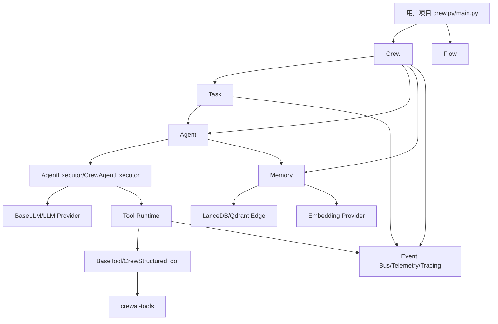
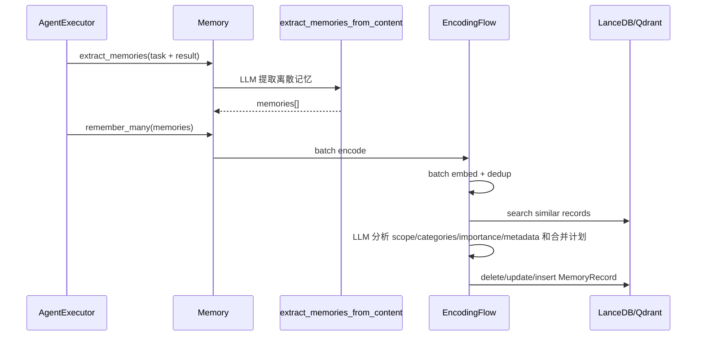
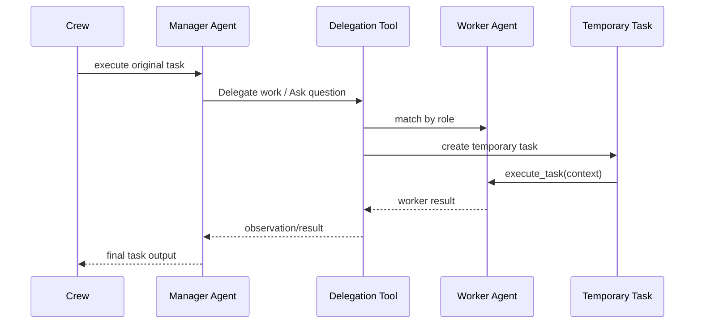
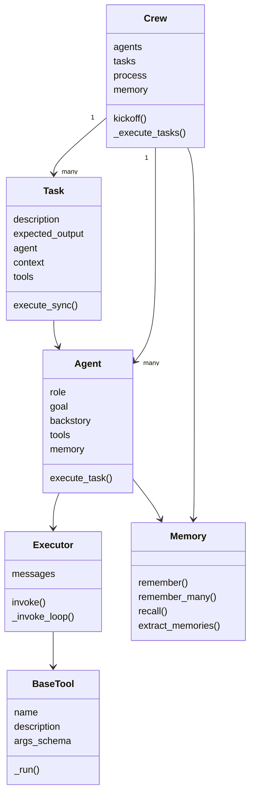
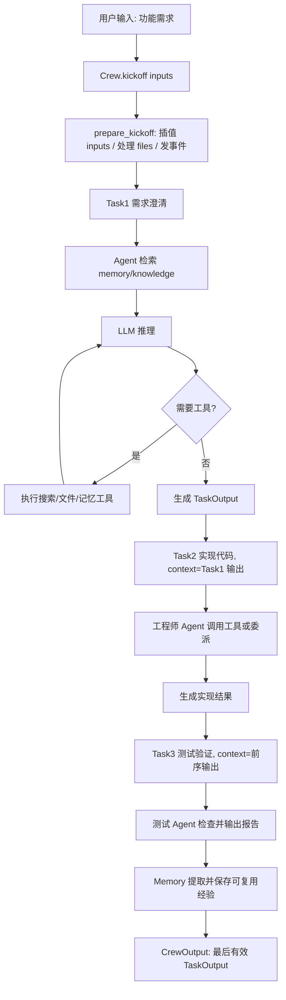

# CrewAI 知识图谱

**调研时间**: 2026-05-25  
**研究对象**: `other/crewAI` 本地仓库  
**信息来源**: 本地源码、README、pyproject 配置  

---

## 知识框架（主体）

### 1. 定位

CrewAI 是一个 Python 多智能体编排框架，核心定位是把“自主 Agent 团队”和“确定性 Flow 工作流”组合起来，用较少样板代码完成复杂任务自动化。仓库 README 明确强调它是从零构建的独立框架，不依赖 LangChain，并提供两条主线：`Crews` 负责多 Agent 自主协作，`Flows` 负责生产级事件驱动编排。

它解决的问题不是单次 LLM 调用，而是多步任务中的角色分工、工具调用、上下文传递、记忆、文件输入、结构化输出、人工反馈、事件追踪和断点恢复。

如果完全没有看过这个仓库，可以先把 CrewAI 理解成四层：

1. **用户建模层**：用户用 `Agent` 描述“谁来做”，用 `Task` 描述“做什么、交付什么”，用 `Crew` 描述“这些任务如何被执行”。
2. **执行器层**：Agent 不直接和 LLM 裸聊，而是通过 executor 维护 messages、调用 LLM、识别工具调用、把工具结果回写给 LLM。
3. **能力扩展层**：工具、记忆、知识库、MCP、文件输入、平台集成都是可插拔能力，执行前被合并进 Agent 可用上下文或工具列表。
4. **运行治理层**：事件总线、telemetry、tracing、checkpoint、guardrail、callbacks 负责可观测性、恢复、校验和工程化控制。

### 1.1 第一次阅读源码的建议路线

| 阅读顺序 | 先看什么 | 为什么 |
| --- | --- | --- |
| 1 | `README.md` 的 YAML crew 示例 | 先理解用户如何声明 Agent、Task、Crew。 |
| 2 | `lib/crewai/src/crewai/crew.py` | Crew 是入口，`kickoff()` 展示整个系统如何启动。 |
| 3 | `lib/crewai/src/crewai/task.py` | Task 是流程节点，负责把 context、agent、tools 组合成一次执行。 |
| 4 | `lib/crewai/src/crewai/agent/core.py` | Agent 是角色和能力容器，定义 role/goal/backstory/tools/memory 等字段。 |
| 5 | `lib/crewai/src/crewai/agents/crew_agent_executor.py` | 这里能看到 LLM 循环、工具调用、消息维护、错误处理的细节。 |
| 6 | `lib/crewai/src/crewai/tools/` | 理解工具 schema、调用、缓存、失败反馈、delegation tools。 |
| 7 | `lib/crewai/src/crewai/memory/` | 理解记忆如何提取、保存、检索，以及为什么不是简单聊天历史存储。 |
| 8 | `lib/crewai/src/crewai/flow/` | 如果关注生产工作流，再看 Flow 的事件驱动和状态机制。 |

这条路线的好处是先从“用户怎么用”进入，再逐步下沉到“框架怎么执行”。不要从 `tools` 或 `memory` 开始读，否则容易被大量扩展能力淹没，看不清主流程。

### 2. 仓库结构

CrewAI 仓库是一个 `uv` workspace，顶层按“核心运行时、工具生态、CLI、平台基础能力、文件处理、开发工具”拆包。运行时核心在 `lib/crewai`，其余包围绕它提供工具、文件、脚手架和平台支撑。

| 模块/目录 | 职责 | 关键文件 |
| --- | --- | --- |
| `lib/crewai` | 核心运行时包。定义用户直接使用的 `Agent`、`Crew`、`Task`、`Flow`、`LLM`、`Tool`、`Memory` 等抽象，并负责执行循环、任务编排、事件、追踪、记忆和 checkpoint。 | `src/crewai/crew.py`, `src/crewai/agent/core.py`, `src/crewai/task.py` |
| `lib/crewai-tools` | 官方工具集合和工具适配层。提供搜索、网页抓取、文件/文档、数据库、云存储、浏览器、Bedrock、CrewAI Platform、MCP/RAG 相关工具；这些工具最终以 `BaseTool`/`CrewStructuredTool` 形式接入核心运行时。 | `src/crewai_tools/tools/**`, `src/crewai_tools/adapters/**` |
| `lib/cli` | 用户项目命令行。负责创建 crew 项目、运行、安装依赖、部署、模板生成等开发者入口，把用户命令转成 CrewAI 项目结构和运行动作。 | `src/crewai_cli/**` |
| `lib/crewai-core` | 跨包共享的基础能力。包括 settings、paths、project、plus_api、telemetry、token_manager、tool_credentials 等，不直接表达 Agent 协作语义。 | `src/crewai_core/**` |
| `lib/crewai-files` | 文件输入处理层。负责文件 URL、解析、格式校验、上传到 OpenAI/Gemini/Anthropic/Bedrock 等 provider，并为 task/agent 的 multimodal 或文件工具提供统一文件对象。 | `src/crewai_files/**` |
| `lib/devtools` | 仓库维护工具。用于文档检查、TOML 更新、开发辅助 CLI，不参与运行时 Agent 编排。 | `src/crewai_devtools/**` |
| `docs` | 官方文档和工具说明。包含概念文档、工具文档、MCP 文档、观测性文档、多语言版本和站点脚本。 | `docs/**/*.mdx` |

`lib/crewai/src/crewai` 是真正的核心运行时，内部子模块职责如下：

| 子模块 | 作用 | 关键点 |
| --- | --- | --- |
| `crew.py`, `crews/` | Crew 编排入口和 Crew 输出模型。负责 `kickoff()`、sequential/hierarchical process、task 执行顺序、async task 收束、manager agent 创建、最终 `CrewOutput` 生成。 | 多 Agent 的主协调层 |
| `agent/`, `agents/` | Agent 模型和执行器。`agent/core.py` 定义 Agent 配置；`agents/crew_agent_executor.py`、`experimental/agent_executor.py` 负责 LLM 调用循环、工具调用、消息维护、step callback。 | 单 Agent 推理闭环 |
| `task.py`, `tasks/` | Task 定义、执行、结构化输出、guardrail、conditional task、task output。Task 是 Agent 间传递结果和验收标准的基本单位。 | 流程与上下文边界 |
| `tools/` | 工具抽象和内置协调工具。定义 `BaseTool`、`CrewStructuredTool`、tool calling schema、tool usage、memory tools、delegation tools、file tools。 | 外部能力接入层 |
| `memory/` | 统一记忆系统。提供 `Memory`、scope/slice、encoding/recall flow、存储 backend，对 task/result 提取可复用记忆并支持检索。 | 长期/共享上下文能力 |
| `flow/` | 确定性事件驱动工作流。提供 `Flow`、`@start`、`@listen`、`@router`、状态持久化和可视化，用于比 Crew 更明确的业务流程控制。 | 生产工作流层 |
| `llms/`, `llm.py` | LLM 抽象和 provider 适配。封装 OpenAI、Anthropic、Gemini、Bedrock、OpenAI-compatible 等调用能力，以及 function calling/multimodal 支持判断。 | 模型适配层 |
| `events/`, `telemetry/` | 事件总线、事件类型、监听器、tracing、usage metrics。记录 crew/task/agent/tool/memory/LLM 生命周期事件。 | 可观测性和追踪 |
| `knowledge/`, `rag/` | 知识源和 RAG 基础能力。把外部文档、知识源、向量存储和 embedding 接入 Agent/Crew 的知识检索。 | 知识上下文 |
| `project/` | 装饰器和项目配置加载。支持 `@CrewBase`、`@agent`、`@task`、`@crew`，把 YAML 配置和 Python 方法装配成 Crew。 | 用户项目 DSL |
| `mcp/` | MCP 客户端、transport、tool resolver。把 MCP server 暴露的工具接入 Agent 工具列表。 | 外部工具协议 |
| `a2a/` | Agent-to-Agent 远程协作相关配置、类型、认证、更新和 wrapper。用于远程 Agent 委派/服务化，而非本地 Crew 默认消息传递。 | 远程 Agent 能力 |
| `state/`, `security/` | checkpoint/runtime state 和安全 fingerprint。支持运行状态恢复、分支、事件记录和安全上下文。 | 恢复与安全 |
| `skills/` | CrewAI skill 加载、解析、注册和校验。把可复用能力说明注入 Agent/Crew。 | 能力扩展 |
| `auth/`, `core/` | 认证 provider、OAuth、人类输入 provider、content processor 等支撑能力。 | 平台/交互支撑 |
| `translations/`, `types/`, `utilities/` | i18n prompt、类型定义、序列化、日志、路径、prompt、训练、规划、上下文窗口处理等通用工具。 | 横切辅助层 |

### 3. 依赖关系

这张依赖图表达的是运行时调用方向，不是 Python import 的完整图。主链路是：用户项目创建 `Crew`，Crew 持有多个 `Task` 和 `Agent`；执行某个 Task 时，Task 找到 Agent；Agent 通过 executor 调 LLM；LLM 可能触发 Tool；Tool 可能读写外部系统；执行结果再回到 Task 和 Crew。

Memory、Knowledge、Events 不是主流程节点，而是横切能力：

- `Memory` 在执行前检索相关经验，执行后保存可复用记忆。
- `Knowledge/RAG` 把文档型知识注入 Agent/Crew。
- `Events/Telemetry` 记录每一次 crew、task、agent、tool、memory、LLM 的生命周期事件。



### 4. 单个 Agent 设计

Agent 的主数据模型在 `lib/crewai/src/crewai/agent/core.py`。一个 Agent 由 `role`、`goal`、`backstory`、`llm`、`tools`、`memory`、`knowledge_sources`、`guardrail`、`planning_config`、`allow_delegation` 等字段组成。初始化后会创建 LLM、设置 executor、绑定 cache handler，并加载 skill、knowledge、MCP、平台工具等扩展。

CrewAI 没有内置固定的一组业务角色。`role`、`goal`、`backstory` 都由使用者在代码或 YAML 配置中自定义，框架只规定这些字段如何进入 prompt、任务执行、工具委派和日志。也就是说，CrewAI 预设的是“用角色描述 Agent”的建模方式，而不是预设“产品经理、工程师、测试、审查者”这类具体岗位。

例外是 `Process.hierarchical`：该模式需要一个 manager agent。如果用户传入 `manager_agent`，就使用用户自定义 manager；如果只传 `manager_llm`，框架会用内置 i18n prompt 创建默认 manager。这个 manager 是协调者角色，负责通过 delegation tools 调用其他 Agent。

执行上，Agent 不是直接调用工具，而是通过 executor 循环完成：构造 prompt 和 message，调用 LLM，解析出最终答案或工具调用，执行工具，把工具结果追加回 messages，再继续下一轮，直到得到 `AgentFinish`。

#### 4.1 Agent 不是“进程”，而是“角色 + 能力 + 执行配置”

CrewAI 里的 Agent 不等同于一个长期运行的 worker 进程。更准确地说，它是一次或多次任务执行时使用的角色配置对象。这个对象描述：

- **这个 Agent 应该以什么身份说话**：`role`、`goal`、`backstory` 会进入 prompt。
- **它能调用什么能力**：`tools`、`apps`、`mcps`、`knowledge_sources`、`memory` 会变成工具或上下文。
- **它如何执行**：`llm`、`max_iter`、`max_retry_limit`、`respect_context_window`、`planning_config` 控制推理循环。
- **它能不能协调别人**：`allow_delegation` 决定是否注入 “Delegate work to coworker” 和 “Ask question to coworker” 工具。

这意味着 CrewAI 不是默认的 Agent Teams 模式。Agent 可以多次执行，但框架的主抽象仍然是 task invocation，而不是一组长期在线、持续消费任务队列的智能体。

#### 4.2 Agent 的关键字段

| 字段 | 初学者理解 | 影响范围 |
| --- | --- | --- |
| `role` | Agent 的身份标签，也是日志、委派匹配和 prompt 的核心语义。 | prompt、delegation、事件日志 |
| `goal` | Agent 当前长期目标，告诉模型“你要优化什么”。 | prompt |
| `backstory` | 背景设定，用于补充行为风格和专业上下文。 | prompt |
| `tools` | Agent 可用工具列表。Task 也可以覆盖或限制工具。 | 工具调用 |
| `llm` | 这个 Agent 使用的模型。没有显式设置时会走默认创建逻辑。 | LLM 调用 |
| `function_calling_llm` | 旧式/兼容字段，用于工具调用模型，源码中已标记 deprecated。 | 工具调用兼容 |
| `memory` | Agent 独有记忆；如果为空，Crew 级 memory 可能被使用。 | 记忆检索/保存 |
| `knowledge_sources` | Agent 专属知识源，会构建 `Knowledge` 对象。 | 知识检索 |
| `allow_delegation` | 是否允许 Agent 通过工具调用其他 Agent。 | 多 Agent 协作 |
| `guardrail` | 对 Agent 输出做校验或修正。 | 输出质量控制 |
| `planning_config` / `planning` | 是否先规划再执行。 | 执行策略 |

#### 4.3 单 Agent 执行时发生什么

一次 Agent 执行可以拆成七步：

1. Task 调用 `agent.execute_task(task, context, tools)`。
2. Agent 把 task description、expected output、context、memory、knowledge、tools 组合成 prompt。
3. executor 初始化 messages，并把工具说明或 native tool schema 交给 LLM。
4. LLM 返回两类结果之一：最终答案，或工具调用。
5. 如果是工具调用，executor 校验参数、执行工具、把结果作为 observation/tool message 追加回 messages。
6. executor 继续调用 LLM，直到得到 final answer 或达到迭代/错误上限。
7. Agent 把结果返回 Task，并尝试把 task + result 提取成长期记忆。

所以，Agent 内部维护的是自己的 LLM 对话上下文；Agent 与 Agent 之间默认不会共享这份 messages。

### 5. 工具调用机制

CrewAI 支持两种工具调用路线：

| 路线 | 触发条件 | 调用形态 | 关键实现 |
| --- | --- | --- | --- |
| 原生 function calling | LLM 声明 `supports_function_calling()` 且存在工具 | LLM 返回结构化 tool calls | `CrewAgentExecutor._invoke_loop_native_tools`, `_execute_single_native_tool_call` |
| ReAct 文本解析 | 不支持原生 tool calls 或回退路径 | LLM 输出 `Action` / `Action Input` 文本 | `CrewAgentExecutor._invoke_loop_react`, `ToolUsage.use` |

工具定义统一收敛到 `BaseTool` 和 `CrewStructuredTool`：

- `BaseTool.args_schema` 是 Pydantic model。若用户未显式提供，框架会从 `_run` 或 `_arun` 的函数签名自动生成 schema。
- `BaseTool._generate_description()` 会把工具名、参数 JSON schema 和工具说明拼进 description，供文本模式提示词使用。
- `CrewStructuredTool.from_function()` 可以从普通函数推断 schema。
- `BaseTool.to_structured_tool()` 会把用户工具转成 executor 使用的结构化工具，并保留原始工具引用。

工具调用错误处理分三层：

1. 参数解析或 schema 校验失败：返回带 schema hint 的错误文本，让 Agent 能修正参数。
2. 工具执行抛异常：ReAct 路线在 `ToolUsage._use/_ause` 中递增 `tools_errors`，在重试上限内递归重试；超过上限后返回 “Moving on then...” 类 observation。原生路线在 `_execute_single_native_tool_call` 中把异常转成 `Error executing tool: ...` 并发出 `ToolUsageErrorEvent`。
3. 工具不存在或名字不准：`ToolUsage._select_tool()` 用 sanitize 后的名称和相似度匹配，无法匹配时返回包含可用工具列表的错误。

此外工具层还有 cache、max usage、before/after hook、`result_as_answer`、事件追踪和 telemetry。

#### 5.1 工具在 CrewAI 里解决什么问题

LLM 本身只能生成文本或结构化输出，不能直接访问搜索引擎、数据库、文件系统、浏览器、API 或其他 Agent。工具就是把这些外部能力包装成模型可选择、框架可校验、执行器可追踪的调用单元。

一个工具需要回答四个问题：

1. **它叫什么**：`name`，模型用这个名字选择工具。
2. **什么时候用它**：`description`，告诉模型用途和边界。
3. **输入长什么样**：`args_schema`，用 Pydantic 描述参数和校验规则。
4. **真正怎么执行**：`_run()` 或 `_arun()`，连接外部系统或本地逻辑。

#### 5.2 为什么 schema 很重要

工具 schema 是 CrewAI 避免“模型随便编参数”的主要约束。`BaseTool` 会从显式 `args_schema` 或 `_run` 函数签名推断字段，再把 JSON schema 拼进工具描述。执行时，`BaseTool._validate_kwargs()` 和 `CrewStructuredTool._parse_args()` 会用 Pydantic 校验参数。

如果 schema 不清晰，会出现三类问题：

- LLM 不知道该传什么字段，导致参数缺失。
- LLM 传入多余字段，框架需要过滤或报错。
- 工具报错变成 observation，Agent 可能反复重试，浪费 token。

因此自定义工具时，推荐显式写 `args_schema`，并给每个字段写清楚 description。

#### 5.3 两条工具调用路线的差异

| 维度 | 原生 function calling | ReAct 文本解析 |
| --- | --- | --- |
| LLM 输出 | 结构化 tool call 对象 | 文本中的 Action/Action Input |
| 参数解析 | 从 provider 返回的工具调用结构里解析 | 从模型文本中解析 JSON/字符串 |
| 稳定性 | 通常更稳定，依赖模型/provider 支持 | 兼容性更广，但更容易格式错误 |
| 错误反馈 | 工具结果作为 `role=tool` message 回写 | 工具结果作为 observation 文本回写 |
| 源码入口 | `_invoke_loop_native_tools()` | `_invoke_loop_react()` |

这也是排查工具问题的第一步：先确认当前模型是否支持 native function calling。不同路线的错误栈和 message 结构不一样。

#### 5.4 工具调用失败时系统如何处理

CrewAI 的默认策略偏“把错误反馈给 Agent，让 Agent 继续推理”，而不是立刻中断整个 Crew。这对探索型任务友好，但对强业务流程要谨慎。

常见失败路径：

- **工具名不匹配**：会尝试 sanitize 和相似度匹配；失败时返回可用工具列表。
- **参数 JSON 解析失败**：返回解析错误和 schema hint。
- **Pydantic 校验失败**：返回字段级错误和 schema hint。
- **工具内部异常**：记录 `ToolUsageErrorEvent`，增加 task 的 `tools_errors`，再把错误文本回写给 Agent。
- **达到使用次数上限**：返回“tool reached usage limit”的文本结果。
- **重复调用同一工具同一参数**：会返回重复使用提示，避免 Agent 卡在同一个工具调用上。

如果你的业务希望工具失败就终止，需要在 task callback、guardrail、工具内部返回结构或上层业务代码里显式处理，不要只依赖默认 observation 机制。

### 6. 记忆机制

当前源码中的记忆已统一到 `Memory` 模型，路径是 `lib/crewai/src/crewai/memory/unified_memory.py`。它不是旧式分散的 short-term、long-term、entity memory 类，而是用统一记录结构承载短期/长期/实体/偏好等不同语义，再通过 scope、category、metadata 和检索策略区分。

初学者容易把 memory 理解成“把聊天历史都存进向量库”。CrewAI 当前实现不是这样。它会先用 LLM 从 task 输入、执行结果或对话内容中提取离散的、可复用的记忆 statement，再保存成 `MemoryRecord`。也就是说，Memory 保存的目标不是完整过程，而是以后可能有用的事实、偏好、决策、经验或观察。

`MemoryRecord` 字段包括：

| 字段 | 含义 |
| --- | --- |
| `content` | 可复用的记忆文本 |
| `scope` | 层级命名空间，例如 `/crew/research` |
| `categories` | 分类标签 |
| `metadata` | 任意结构化元数据 |
| `importance` | 0 到 1 的重要性分数，参与排序 |
| `created_at`, `last_accessed` | 时间信息，用于 recency |
| `embedding` | 语义向量，序列化时排除 |
| `source`, `private` | 来源和隐私过滤 |

记忆写入链路：



记忆提取要求来自 `translations/en.json`：提取决策、事实、结果、偏好、经验、观察；对用户一手陈述的姓名、地点、数量、日期、物品等高优先级保留；避免空泛总结和重复表达。

记忆检索链路：

- Agent 执行 task 前，`Agent._retrieve_memory_context()` 用 task description 查询记忆，最多取 5 条并追加到 task prompt。
- 独立 Agent kickoff 时，会用输入 messages 查询 agent memory，最多取 20 条。
- Crew 在 `_prepare_tools()` 中为有 memory 的 Agent 注入 `Search memory` 和 `Save to memory` 工具，Agent 可主动搜索或保存。
- `Memory.recall(depth="shallow")` 是直接 embedding + vector search；`depth="deep"` 会走 `RecallFlow`，做查询分析、并行搜索和置信度路由。

#### 6.1 Crew 级 memory 与 Agent 级 memory

CrewAI 有两种常见 memory 位置：

| 位置 | 含义 | 使用方式 |
| --- | --- | --- |
| Crew 级 memory | 多个 Agent 在同一个 Crew 下共享的记忆根。`Crew(memory=True)` 会创建默认 `Memory`，root scope 类似 `/crew/<crew_name>`。 | 适合团队共享经验、任务结果、跨 Agent 可复用事实。 |
| Agent 级 memory | 某个 Agent 自己的记忆。Agent 执行时优先使用自己的 memory。 | 适合角色专属偏好、专属经验或隔离上下文。 |

执行时，Crew 会在 `_prepare_tools()` 中判断 `agent.memory` 或 `crew._memory` 是否存在。如果存在，就注入 `Search memory` 和 `Save to memory` 工具。Agent 也会在执行前自动做一次 memory recall，把相关记忆追加进 prompt。

#### 6.2 记忆保存分成两类

| 保存方式 | 触发者 | 特点 |
| --- | --- | --- |
| 自动保存 | Agent 执行结束后 `_save_to_memory()` | 从 task + result 提取可复用记忆，适合沉淀经验。 |
| 主动保存 | Agent 调用 `Save to memory` 工具 | Agent 在执行中主动决定什么值得保存。 |

自动保存不是简单保存 final answer。它会调用 `extract_memories_from_content()`，根据提示词提取“事实、决策、偏好、结果、经验、观察”。如果没有值得保存的内容，应返回空列表。

#### 6.3 记忆写入为什么这么复杂

`EncodingFlow` 看起来比普通向量写入复杂，是因为它不只是 insert：

1. 对一批记忆做一次 batch embedding。
2. 在批内去重，避免同一批保存重复内容。
3. 到存储里搜索相似旧记忆。
4. 用 LLM 分析 scope、categories、importance、metadata。
5. 如果与旧记忆相似，生成合并计划：插入、更新或删除。
6. 批量写入存储，并维护 `created_at`、`last_accessed`、importance 等字段。

这说明 CrewAI 把 memory 当成长期知识库维护，而不是一次性日志。

#### 6.4 记忆检索如何排序

`Memory.recall()` 的结果不是只看向量相似度。最终 score 由三类信号组合：

- **semantic**：查询和记忆内容的向量相似度。
- **recency**：越新的记忆越容易被召回，按 half-life 衰减。
- **importance**：保存时推断或用户指定的重要性。

这也是 `MemoryRecord.importance` 存在的原因：不是所有相似内容都同等重要。

### 7. Crew -> Task -> Agent 完整执行链路

以 `crew.kickoff()` 为起点，完整链路如下：

```
crew.kickoff(inputs)
  │
  ├─ 1. prepare_kickoff(): 插值 inputs、处理文件、发事件
  │
  ├─ 2. 根据 process 分派：
  │     ├─ sequential → _run_sequential_process()
  │     └─ hierarchical → _run_hierarchical_process() (创建 manager agent)
  │
  └─ 3. _execute_tasks(tasks)  ← 核心循环
        │
        │  对每个 task：
        ├─ prepare_task_execution(): 确定 agent、tools、条件跳过
        ├─ _get_context(): 聚合前序 task 输出作为 context
        │
        └─ task.execute_sync(agent, context, tools)
              │
              └─ task._execute_core()
                    │
                    ├─ 发出 TaskStartedEvent
                    ├─ agent.execute_task(task, context, tools)  ← 进入 Agent
                    │     │
                    │     ├─ _prepare_task_execution(): 构建 prompt
                    │     │    ├─ task.prompt() → 任务描述 + expected_output
                    │     │    ├─ _retrieve_memory_context() → 检索相关记忆
                    │     │    └─ handle_knowledge_retrieval() → 检索知识库
                    │     │
                    │     ├─ _finalize_task_prompt(): 注入工具、训练数据
                    │     │
                    │     └─ agent_executor.invoke(prompt)  ← 进入 LLM 循环
                    │           │
                    │           │  循环直到得到最终答案：
                    │           ├─ 调用 LLM
                    │           ├─ LLM 返回 → 工具调用 or 最终答案
                    │           ├─ 如果工具调用 → 执行工具 → 结果写回 messages → 继续循环
                    │           └─ 如果最终答案 → 返回 output
                    │
                    ├─ 构建 TaskOutput(raw, pydantic, json)
                    ├─ 执行 guardrail 校验
                    ├─ 执行 callback
                    ├─ 保存到文件（如果 output_file 配置了）
                    └─ 发出 TaskCompletedEvent
        │
        └─ _create_crew_output(task_outputs) → CrewOutput
```

#### 7.1 三层各自的职责

**Crew 层：编排 + 上下文传递**

核心代码：`crew.py:1496-1565` (`_execute_tasks`)

| 职责 | 实现 |
|------|------|
| 任务排序 | 按 tasks 列表顺序遍历 |
| 上下文聚合 | `_get_context()` 把前序 TaskOutput 聚合成字符串 |
| 工具注入 | `_prepare_tools()` 根据 agent 配置注入 delegation/memory/mcp 工具 |
| 条件跳过 | `ConditionalTask` 根据前序输出决定是否执行 |
| 异步管理 | `async_execution=True` 的 task 用 Future 并行执行 |
| 结果聚合 | 最后一个有效 TaskOutput 变成 `CrewOutput.raw` |

上下文传递的关键在 `_get_context()` (`crew.py:1813-1821`)：

```python
@staticmethod
def _get_context(task: Task, task_outputs: list[TaskOutput]) -> str:
    if not task.context:
        return ""
    # NOT_SPECIFIED = 默认取所有前序输出
    # 否则只取 task.context 显式指定的任务输出
    return (
        aggregate_raw_outputs_from_task_outputs(task_outputs)
        if task.context is NOT_SPECIFIED
        else aggregate_raw_outputs_from_tasks(task.context)
    )
```

这就是 Agent 之间传递信息的方式——不是共享聊天历史，而是传递 TaskOutput 的 raw 文本。

**Task 层：执行边界 + 输出契约**

核心代码：`task.py:769-893` (`_execute_core`)

Task 是一个执行单元，它回答三个问题：

| 问题 | 字段 | 作用 |
|------|------|------|
| 做什么 | `description` | 告诉 Agent 任务描述 |
| 交付什么 | `expected_output` | 告诉 Agent 输出标准 |
| 谁来做 | `agent` | 指定执行者 |

Task 还控制：`context`（接收哪些前序任务的输出）、`tools`（覆盖/限制 Agent 可用的工具）、`output_pydantic / output_json`（结构化输出格式）、`guardrail`（输出校验）、`callback`（执行后回调）、`async_execution`（是否异步执行）。

Task `_execute_core` 的核心就一行：`agent.execute_task(task, context, tools)`，其余都是前置准备和后置处理。

**Agent 层：推理闭环**

核心代码：`agent/core.py:751-820` (`execute_task`)

Agent 是真正的 LLM 交互者。一次执行拆成：

1. **组装 prompt**：task description + expected_output + context + memory + knowledge
2. **进入 executor 循环**：调 LLM → 解析结果 → 工具调用 or 最终答案
3. **返回结果** + 保存记忆

Agent 内部维护自己的 `messages`（executor 的对话历史），Agent 之间不共享 messages。

#### 7.2 两种 Process 模式详解

**Sequential（顺序执行）**

```
Task1(Agent_A) → TaskOutput1
                  ↓ context
Task2(Agent_B) → TaskOutput2
                  ↓ context
Task3(Agent_C) → TaskOutput3 → CrewOutput
```

每个 Task 按顺序执行，前序输出自动变成后续 Task 的 context。

**Hierarchical（层级协调）**

```
Crew → 创建 Manager Agent（带 delegation tools）
     → Manager 执行所有 tasks
     → Manager 通过 "Delegate work to coworker" 工具调用 Worker Agent
     → Worker 执行临时 Task → 结果返回 Manager
     → Manager 继续推理 → 最终输出
```

Manager 不按 `task.agent` 直接执行，而是自己决定什么时候委派给谁。

Hierarchical 模式下，`_get_agent_to_use(task)` 永远返回 `self.manager_agent`（`crew.py:1656-1659`），所有 task 都由 manager 执行。

#### 7.3 Hierarchical 模式下 Worker 能否委派

**不能。Worker 之间不能互相委派。** 这是一个重要的设计约束。

源码证据在 `_prepare_tools()` (`crew.py:1583-1599`)：

```python
def _prepare_tools(self, agent, task, tools):
    if hasattr(agent, "allow_delegation") and getattr(agent, "allow_delegation", False):
        if self.process == Process.hierarchical:
            if self.manager_agent:
                tools = self._update_manager_tools(task, tools)  # 只给 manager 委派工具
            else:
                raise ValueError(...)
        elif agent:
            tools = self._add_delegation_tools(task, tools)  # sequential 才给 agent 委派工具
```

当 manager 委派给 worker 时，调用链是：

```
DelegateWorkTool._execute()
  → selected_agent.execute_task(temp_task, context)  ← 直接调用 Agent
```

这里绕过了 `Crew._prepare_tools()`，worker 只带着自己配置的 tools 执行，不会被注入委派工具。

两种模式的委派能力对比：

| 模式 | 谁执行 task | 谁有委派工具 | Worker 能否委派 |
|------|------------|-------------|----------------|
| Sequential | `task.agent`（每个 task 自己的 agent） | 每个 `allow_delegation=True` 的 agent 都有 | 能（如果配置了 `allow_delegation=True`） |
| Hierarchical | 永远是 `manager_agent` | 只有 manager 有 | **不能** |

所以 hierarchical 模式是严格的星型拓扑：manager 是中心节点，worker 是叶子节点，worker 之间没有直接通信能力。

#### 7.4 Manager → Worker 通信详解

##### 7.4.1 数据结构：Manager 发送给 Worker 的信息格式

Manager 通过 `DelegateWorkTool` 发送信息，工具调用时传入三个参数：

```python
# delegate_work_tool.py
class DelegateWorkToolSchema(BaseModel):
    task: str = Field(..., description="The task to delegate")
    context: str = Field(..., description="The context for the task")
    coworker: str = Field(..., description="The role/name of the coworker to delegate to")
```

工具内部构造一个临时 Task 对象，然后直接调用 worker：

```python
# base_agent_tools.py:117-125
task_with_assigned_agent = Task(
    description=task,           # manager 写的任务描述
    agent=selected_agent,       # 被委派的 worker
    expected_output="Your best answer to your coworker asking you this, accounting for the context shared."
)
return selected_agent.execute_task(task_with_assigned_agent, context)
```

##### 7.4.2 Manager 的 Prompt：如何指导 Manager 委派

Manager 的系统 prompt 由三部分组成：

**1. 角色设定（role_playing）**

```
You are Crew Manager. You are a seasoned manager with a knack for getting
the best out of your team. You are also known for your ability to delegate
work to the right people, and to ask the right questions to get the best
out of your team. Even though you don't perform tasks by yourself, you have
a lot of experience in the field, which allows you to properly evaluate the
work of your team members.
Your personal goal is: Manage the team to complete the task in the best way possible.
```

**2. 工具说明（tools）** — 告诉 Manager 有哪些工具可用，包括委派工具：

```
You ONLY have access to the following tools, and should NEVER make up tools
that are not listed here:

Delegate work to coworker: Delegate a specific task to one of the following
coworkers: [worker_a, worker_b, ...]
The input to this tool should be the coworker, the task you want them to do,
and ALL necessary context to execute the task, they know nothing about the
task, so share absolutely everything you know, don't reference things but
instead explain them.

Ask question to coworker: Ask a specific question to one of the following
coworkers: [worker_a, worker_b, ...]
The input to this tool should be the coworker, the question you have for
them, and ALL necessary context to ask the question properly, they know
nothing about the question, so share absolutely everything you know, don't
reference things but instead explain them.
```

**3. 当前任务（task）**

```
Current Task: {manager 的 task description}

This is the expected criteria for your final answer: {expected_output}
you MUST return the actual complete content as the final answer, not a summary.
```

##### 7.4.3 Manager 编写委派内容的实际例子

当 Manager 调用 `Delegate work to coworker` 时，它填的参数类似：

```
coworker: "research_analyst"
task: "分析 Python 多智能体框架的市场趋势"
context: "我们需要一份报告，比较 CrewAI、AutoGen、LangGraph 三个框架的
         GitHub stars、最近 6 个月的增长率、主要企业用户。报告格式要求：
         每个框架一段，包含数据表格和简要分析。最终输出为 Markdown 格式。
         注意：数据来源需要标注，如果找不到确切数据请注明估算。"
```

这个 `task` + `context` 就是 Manager 发送给 Worker 的全部信息。

##### 7.4.4 SubAgent 的 Context 组成

Worker 收到委派后，`Agent.execute_task()` 构建 prompt 的完整链路：

```
_prepare_task_execution(task, context)
  │
  ├─ 1. task.prompt()
  │     ├─ description: manager 写的 task
  │     └─ expected_output: "Your best answer to your coworker asking you this..."
  │
  ├─ 2. build_task_prompt_with_schema()
  │     └─ 如果有 output_pydantic/json，追加 schema 指令
  │
  ├─ 3. format_task_with_context(task_prompt, context)
  │     └─ 追加 manager 写的 context
  │
  └─ 4. _retrieve_memory_context()
        └─ 从 memory 检索相关记忆，追加到 prompt

_finalize_task_prompt(task_prompt, tools, task)
  │
  ├─ 5. prepare_tools(): 注入工具说明
  │
  └─ 6. apply_training_data(): 追加训练数据

executor.invoke(inputs)
  │
  └─ _setup_messages(inputs)
        ├─ system message: role_playing + tools 指令
        └─ user message: task prompt（包含以上所有内容）
```

##### 7.4.5 Worker 的完整 Context 示例

假设 Worker 是一个 "research_analyst" Agent，收到 Manager 的委派后，它看到的完整 prompt 结构：

```
╔══════════════════════════════════════════════════════════════╗
║                     SYSTEM MESSAGE                           ║
╠══════════════════════════════════════════════════════════════╣
║                                                              ║
║  # 角色设定 (role_playing)                                   ║
║  You are Research Analyst. You are an expert in market        ║
║  research with deep knowledge of technology trends...         ║
║  Your personal goal is: Provide accurate and actionable       ║
║  market insights.                                             ║
║                                                              ║
║  # 工具说明 (tools)                                          ║
║  You ONLY have access to the following tools:                 ║
║                                                              ║
║  search: Search the web for information                       ║
║  read_file: Read content from a file                          ║
║  Search memory: Search through the team's shared memory...    ║
║  Save to memory: Store important facts in memory...           ║
║                                                              ║
║  IMPORTANT: Use the following format in your response:        ║
║  Thought: you should always think about what to do            ║
║  Action: the action to take                                   ║
║  Action Input: the input to the action                        ║
║  Observation: the result of the action                        ║
║                                                              ║
╚══════════════════════════════════════════════════════════════╝

╔══════════════════════════════════════════════════════════════╗
║                      USER MESSAGE                            ║
╠══════════════════════════════════════════════════════════════╣
║                                                              ║
║  # 任务描述 (task.description)                               ║
║  Current Task: 分析 Python 多智能体框架的市场趋势            ║
║                                                              ║
║  # 输出标准 (expected_output)                                ║
║  This is the expected criteria for your final answer:         ║
║  Your best answer to your coworker asking you this,           ║
║  accounting for the context shared.                           ║
║  you MUST return the actual complete content as the           ║
║  final answer, not a summary.                                 ║
║                                                              ║
║  # Manager 提供的上下文 (context)                            ║
║  This is the context you're working with:                     ║
║  我们需要一份报告，比较 CrewAI、AutoGen、LangGraph 三个框架  ║
║  的 GitHub stars、最近 6 个月的增长率、主要企业用户。报告格  ║
║  式要求：每个框架一段，包含数据表格和简要分析。最终输出为    ║
║  Markdown 格式。注意：数据来源需要标注...                     ║
║                                                              ║
║  # 记忆上下文 (memory)                                       ║
║  # Memories from past conversations:                          ║
║  - CrewAI 在 2025 年 Q3 获得了 1800 万美元融资               ║
║  - AutoGen 由微软研究院维护，主要用户是企业客户              ║
║  - LangGraph 与 LangChain 生态深度集成                       ║
║                                                              ║
║  # 知识上下文 (knowledge)                                    ║
║  [如果配置了 knowledge_sources，会追加检索到的知识片段]       ║
║                                                              ║
║  # 训练数据 (training data)                                  ║
║  [如果有训练数据，会追加相关指令]                             ║
║                                                              ║
╚══════════════════════════════════════════════════════════════╝
```

##### 7.4.6 Context 组成总结

| 组成部分 | 来源 | 内容 |
|---------|------|------|
| 角色设定 | Agent 配置 | `role` + `backstory` + `goal` |
| 工具说明 | Agent + Crew 注入 | Agent 自身工具 + memory tools + delegation tools（如果有） |
| 任务描述 | Manager 的 `task` 参数 | Manager 写的委派任务 |
| 输出标准 | 固定模板 | `"Your best answer to your coworker asking you this..."` |
| 上下文 | Manager 的 `context` 参数 | Manager 写的详细说明 |
| 记忆 | Memory 系统 | 从 memory 检索的相关记忆（最多 5 条） |
| 知识 | Knowledge 系统 | 从 knowledge_sources 检索的知识片段 |
| 训练数据 | Training 系统 | 历史训练数据中的指令 |

**Worker 看不到**：Manager 的完整对话历史、Manager 的推理过程、其他 Worker 的执行结果。它只看到 Manager 在委派工具调用中显式写的内容。

#### 7.5 一句话总结

**Crew 是编排器（决定顺序和上下文传递），Task 是执行单元（定义做什么和交付什么），Agent 是推理引擎（调 LLM、用工具、产出结果）**。三者的关系是：Crew 遍历 Tasks，每个 Task 找到自己的 Agent 执行，Agent 通过 executor 循环完成推理后把结果返回 Task，Task 包装成 TaskOutput 返回 Crew，Crew 聚合所有输出为 CrewOutput。

### 8. 多 Agent 消息传递

CrewAI 的多 Agent 之间默认不共享同一条聊天消息流。消息传递主要有三种形式：

| 形式 | 机制 | 适用流程 |
| --- | --- | --- |
| Task output context | 前序任务的 `TaskOutput.raw` 聚合后作为后续 task 的 `context` | Sequential |
| Delegation tools | Agent 调用 “Delegate work to coworker” 或 “Ask question to coworker” 工具，内部创建临时 Task 调用目标 Agent | Sequential 中允许 delegation，Hierarchical 中 manager 常用 |
| Shared memory/knowledge | Agent 通过 memory recall 或 knowledge retrieval 读取共享背景 | Crew/Agent 均可 |

顺序流程中，`Crew._execute_tasks()` 遍历 tasks。同步 task 执行完后把 `TaskOutput` 放进 `task_outputs`，后续 task 的 `_get_context()` 根据 `task.context` 决定聚合全部前序输出，或只聚合显式依赖任务输出。

层级流程中，`Crew._run_hierarchical_process()` 创建或使用 manager agent。manager agent 的工具是 `AgentTools(agents=self.agents).tools()`，包含委派和提问工具。工具实现会按 coworker role 找到目标 Agent，构造一个临时 `Task(description=..., expected_output=manager_request)`，然后调用 `selected_agent.execute_task(task_with_assigned_agent, context)`。

因此，CrewAI 的多 Agent 设计更偏“任务流程 + 用户自定义角色”组合：用户先定义若干角色化 Agent，再把 Task 指派给这些 Agent，或者让 manager 在 hierarchical 模式下按角色委派。它具备上下文隔离能力，但并不强制用户按上下文边界拆分 Agent。

#### 8.1 Sequential：按任务列表执行

Sequential 是最容易理解的模式。用户提前定义一个 task 列表，每个 task 通常指定一个 agent。Crew 按顺序执行：

1. 第一个 task 执行，生成 `TaskOutput`。
2. 第二个 task 执行前，Crew 根据 `task.context` 决定取哪些前序输出。
3. 这些输出被聚合成字符串 context，传给第二个 task 的 Agent。
4. 如此循环，最后一个有效 task output 变成 `CrewOutput` 的主要内容。

这里的“消息传递”本质是任务产物传递，不是 Agent A 的完整聊天历史传给 Agent B。这样更可审计，也减少上下文污染，但会丢失一些中间推理细节。

#### 8.2 Hierarchical：manager 通过工具委派

Hierarchical 模式不是简单按 task.agent 执行，而是让 manager agent 负责协调。manager 的关键能力来自两个内置工具：

- `Delegate work to coworker`：把一段任务交给某个 coworker。
- `Ask question to coworker`：向某个 coworker 提问。

这两个工具的实现都在 `tools/agent_tools/` 下。它们会根据 coworker role 匹配目标 Agent，然后创建一个临时 `Task`，调用目标 Agent 的 `execute_task()`，再把结果返回给 manager。manager 看到的是工具返回结果，不是 worker 的完整 messages。

#### 8.3 Shared memory 不是消息总线

Memory 可以让多个 Agent 读写同一套记忆，但它不是实时消息总线。区别如下：

| 机制 | 传递什么 | 是否实时路由 | 是否默认主通道 |
| --- | --- | --- | --- |
| Task context | 前序 task 的输出文本 | 否，按 task 顺序传递 | 是 |
| Delegation tool | worker 临时 task 的结果 | 否，由 manager/Agent 主动调用 | hierarchical 中常用 |
| Memory | 被提取后的长期记忆 | 否，按 recall 查询 | 辅助通道 |
| Event bus | 生命周期事件 | 是，但面向观测和追踪 | 不是业务消息通道 |

所以不能把 CrewAI 理解成“Agent 通过 event bus 互相发消息”。源码中的 event bus 更像运行时观测系统。

#### 8.4 这套设计的上下文含义

CrewAI 做了上下文隔离：每个 Agent 执行时有自己的 executor messages，Agent 之间通过输出摘要、工具结果或 memory recall 间接共享信息。但它没有强制用户按上下文边界拆分任务。用户完全可以按岗位拆出“分析师、工程师、测试、审查者”，这在功能开发场景里可能造成上下文接力损耗。

更稳妥的用法是：同一个强耦合 feature 尽量让一个主 Agent 保持完整上下文；把独立搜索、黑盒验证、外部资料调研、安全扫描这类上下文可隔离任务拆出去。



---

## 关系层（补充）

### 核心对象关系



### 一次功能开发场景的动态执行过程

以“开发一个功能”为例，可以建模为三个 Agent：`需求分析师`、`工程师`、`测试工程师`；三个 Task：澄清需求、实现代码、验证测试。

但这个例子只是为了说明动态执行过程，不代表推荐总是这样拆。按照上下文中心原则，同一个功能的需求澄清、实现和局部测试通常共享大量上下文；如果拆给多个 Agent，后续 Agent 只能看到前序输出摘要，可能丢失设计权衡和中间探索过程。更合理的拆法通常是：主 Agent 负责强耦合开发闭环，额外 Agent 负责可隔离的代码库搜索、黑盒验证或安全检查。



动态过程要点：

1. `Crew.kickoff()` 准备输入、文件和事件上下文，然后根据 `Process.sequential` 或 `Process.hierarchical` 分派执行。
2. `Crew._execute_tasks()` 控制 task 顺序、异步 task 等待、条件 task 跳过、context 聚合和最终 `CrewOutput` 生成。
3. `Task._execute_core()` 设置当前 task id，发出 task started event，调用 `agent.execute_task()`，再做结构化输出导出、guardrail、callback、文件输出和 task completed event。
4. `Agent.execute_task()` 组装 task prompt，检索 memory/knowledge，准备工具，进入 executor 循环。
5. executor 调用 LLM；如果返回工具调用，就执行工具并把结果作为 observation/tool message 写回；如果返回最终答案，就结束循环。
6. Agent 完成后调用 `_save_to_memory()`，从 task + result 中提取可复用记忆，写入统一 memory。
7. Crew 等待后台 memory 写入 drain，清理文件上下文，返回最终输出和 usage metrics。

#### 功能开发场景里的两种拆法对比

| 拆法 | 示例 | 优点 | 风险 |
| --- | --- | --- | --- |
| 按岗位/流程拆 | 需求 Agent -> 编码 Agent -> 测试 Agent -> Review Agent | 看起来清晰，符合组织分工直觉。 | 每次交接都会损失上下文，容易把 token 花在解释和同步上。 |
| 按上下文边界拆 | 主开发 Agent + 搜索 Agent + 验证 Agent + 安全扫描 Agent | 主线保留完整上下文，子 Agent 只处理可隔离任务。 | 需要先判断哪些任务真的独立，设计门槛更高。 |

CrewAI 的 API 更容易表达第一种，因为它天然让用户声明多个 role 和 task。但从多 Agent 设计原则看，第二种通常更稳。

---

## 思考层（补充）

### 设计视角

CrewAI 的核心设计取舍是：用 `Crew/Task/Agent` 提供高层语义，用 `Tool/Memory/Event` 提供横切能力，用 `Flow` 提供确定性编排。这样用户可以先用 YAML/装饰器快速搭出多 Agent，再逐步下探到工具 schema、LLM、guardrail、memory scope、checkpoint 等细节。

它的多 Agent 通信偏“任务产物传递”，不是“群聊式消息总线”。这种设计更适合工程自动化和业务流程，因为每一步都有明确 task、expected output、agent、context 和输出记录。

从模式分类看，CrewAI 主要属于任务编排型的 Orchestrator-Subagent 框架。它做了 Agent 级别的上下文隔离，但抽象入口是 `Agent(role/goal/backstory)` 和 `Task(description/expected_output/agent/context)`，所以天然更容易被使用者按岗位、职责或任务流程拆分，而不是严格按 context-centric decomposition 拆分。

记忆机制的设计也在向统一模型收敛：不再把 short-term、long-term、entity 分成多个完全独立存储，而是用统一 `MemoryRecord` 加 scope/category/importance/source/private 表达不同语义，检索时再用 semantic、recency、importance 综合排序。

### 应用视角

如果要借鉴 CrewAI 做自己的多智能体系统，最值得复用的模式是：

- Agent 配置只描述角色、目标、工具和约束，不承载流程状态。
- CrewAI 不预置业务角色；角色名、目标和背景应当按真实上下文边界谨慎设计，而不是机械映射组织岗位。
- Task 是消息传递和验收的基本单位，必须有 description 和 expected_output。
- Tool 必须有结构化 schema，错误返回给 Agent 而不是直接终止整个系统。
- 多 Agent 协作通过任务上下文、委派工具和共享记忆实现，不需要默认共享所有聊天历史。
- Memory 写入要先提取“可复用事实/经验”，不能把完整对话无差别塞进向量库。

### 风险和注意点

- 工具失败在很多情况下会转成文本 observation，业务层如果需要强失败语义，需要额外 guardrail 或 callback。
- 原生 function calling 和 ReAct 两条路径并存，排查问题时要先确认当前 LLM 是否支持 native tools。
- Memory 默认依赖 LLM 和 embedder；如果没有 API key 或本地 embedder 配置，记忆提取/检索会失败。
- 层级流程中的 manager agent 不应自带普通工具，源码中会警告并抛异常；manager 主要通过 delegation tools 协调。

---

## 主题锚点（深入展开）

### A. 工具 schema 怎么写

最稳妥写法是继承 `BaseTool` 并显式给 `args_schema`：

```python
from pydantic import BaseModel, Field
from crewai.tools import BaseTool

class SearchInput(BaseModel):
    query: str = Field(..., description="Search query")

class SearchTool(BaseTool):
    name: str = "Search"
    description: str = "Search external information."
    args_schema: type[BaseModel] = SearchInput

    def _run(self, query: str) -> str:
        return "..."
```

也可以省略 `args_schema`，框架会从 `_run` 签名推断，但显式 schema 更利于给 LLM 清晰参数说明，也更方便控制字段描述、默认值和校验。

### B. 长期记忆需要提取什么

源码提示词要求提取“离散、可复用的记忆陈述”，优先包括：

- 用户明确表达的事实、偏好、决策、约束。
- 任务执行产生的稳定结论、经验、错误教训和可复用观察。
- 精确名称、数量、日期、地点、对象，不要泛化。

不应保存：空泛总结、任务描述复述、重复表述、临时中间噪声、没有复用价值的完整输出。

### C. 消息传递的最小心智模型

CrewAI 中“消息”有两个层次：

- Agent 内部 message：executor 与 LLM 的对话历史，包含 user/assistant/tool messages。
- Agent 之间的 message：不是直接共享内部 messages，而是以 `TaskOutput.raw`、delegation task result、memory recall result 的形式进入另一个 Agent 的 prompt。

这个区分很关键。前者服务单 Agent 推理闭环，后者服务流程级协作和可审计输出。

---

## 深度调研补充：Memory 读写与 Tool Schema/错误处理

> 以下内容为源码级深度调研补充，聚焦 memory 写入 prompt、读取路径差异、tool schema 生成 pipeline 和两条工具调用路线的错误处理差异。

### D. Memory 写入机制详情

#### D.1 写入时机（三个触发点）

| 触发点 | 时机 | 代码位置 | 条件 |
|--------|------|----------|------|
| **Agent 完成 Task 后自动写入** | executor invoke/ainvoke 循环结束后立即调用 | `base_agent_executor.py:_save_to_memory()` | output 不含 "Delegate work to coworker" |
| LiteAgent kickoff 完成后 | LiteAgent 执行结束 | `lite_agent.py:_save_kickoff_to_memory()` | 已废弃路径 |
| Agent 主动调用 "Save to memory" 工具 | Agent 在 ReAct 循环中自行决定 | `tools/memory_tools.py:RememberTool._run()` | Agent 判断有值得保存的内容 |

核心路径是触发点 A。调用链：`crew_agent_executor.invoke()` → LLM 循环结束得到 AgentFinish → `_save_to_memory(formatted_answer)` → 拼接原始文本 → `memory.extract_memories(raw)` → `memory.remember_many(extracted)`。

#### D.2 写入依据的内容（不是完整对话历史）

`_save_to_memory` 传给 `extract_memories` 的原始文本是四段拼接：

```
Task: {task.description}
Agent: {agent.role}
Expected result: {task.expected_output}
Result: {output.text}
```

**关键设计**：写入依据是 Task 描述 + Agent 角色 + 预期输出标准 + 实际执行结果，**不是完整的工具调用链或对话历史**。这避免了把中间噪声存入长期记忆。

对于 Agent 主动保存（RememberTool），内容完全由 Agent 自行决定，可以是任意字符串列表。

#### D.3 写入的 Prompt（完整内容）

所有 prompt 存放在 `translations/en.json` 的 `"memory"` 字段下，通过 `I18N_DEFAULT.memory(key)` 加载。

**记忆提取 prompt（extract_memories_system）**：

```
You extract discrete, reusable memory statements from raw content
(e.g. a task description and its result, or a conversation between a user and an assistant).

For the given content, output a list of memory statements. Each memory must:
- Be one clear sentence or short statement
- Be understandable without the original context
- Capture a decision, fact, outcome, preference, lesson, or observation worth remembering
- NOT be a vague summary or a restatement of the task description
- NOT duplicate the same idea in different words

When the content is a conversation, pay special attention to facts stated by the user
(first-person statements). These personal facts are HIGH PRIORITY and must always be extracted:
- What the user did, bought, made, visited, attended, or completed
- Names of people, pets, places, brands, and specific items the user mentions
- Quantities, durations, dates, and measurements the user states
- Subordinate clauses and casual asides often contain important personal details

Preserve exact names and numbers -- never generalize.

Additional extraction rules:
- Presupposed facts: When the user reveals a fact indirectly in a question, extract that fact as a separate memory.
- Date precision: Always preserve the full date including day-of-month when stated.
- Life events in passing: When the user mentions a life event while discussing something else,
  extract the life event as its own memory.

If there is nothing worth remembering, return an empty list.
Output a JSON object with a single key "memories" whose value is a list of strings.
```

User prompt: `Content:\n{content}\n\nExtract memory statements as described. Return structured output.`

**保存分析 prompt（save_system）** — 决定 scope、categories、importance：

```
You analyze content to be stored in a hierarchical memory system.
Given the content and the existing scopes and categories, output:
1. suggested_scope: The best matching existing scope path, or a new path if none fit (use / for root).
2. categories: A list of categories (reuse existing when relevant, add new ones if needed).
3. importance: A number from 0.0 to 1.0 indicating how significant this memory is.
4. extracted_metadata: A JSON object with any entities, dates, or topics you can extract.
```

**合并/去重 prompt（consolidation_system）**：

```
You are comparing new content against existing memories to decide how to consolidate them.

For each existing memory, choose one action:
- 'keep': The existing memory is still accurate and not redundant with the new content.
- 'update': The existing memory should be updated with new information. Provide the updated content.
- 'delete': The existing memory is outdated, superseded, or contradicted by the new content.

Also decide whether the new content should be inserted as a separate memory:
- insert_new=true: The new content adds information not fully captured by existing memories (even after updates).
- insert_new=false: The new content is fully captured by the existing memories (after any updates).

Be conservative: prefer 'keep' when unsure. Only 'update' or 'delete' when there is a
clear contradiction, supersession, or redundancy.
```

#### D.4 写入流程完整链路（EncodingFlow 5 步 Pipeline）

1. **batch_embed**：一次 embedder 调用，批量生成所有条目的向量
2. **intra_batch_dedup**：计算 batch 内余弦相似度矩阵，丢弃近乎重复的条目（阈值 `batch_dedup_threshold`）
3. **parallel_find_similar**：并发搜索 storage 中的相似记录（最多 8 线程），为每个条目找到 top-N 相似记录
4. **parallel_analyze**：根据字段是否已提供 + 是否有相似记录，将条目分为 4 组：
   - **Group A**：字段齐全 + 无相似 → 直接插入，0 次 LLM 调用
   - **Group B**：字段齐全 + 有相似 → 1 次合并分析 LLM 调用
   - **Group C**：字段缺失 + 无相似 → 1 次字段推断 LLM 调用（scope/categories/importance）
   - **Group D**：字段缺失 + 有相似 → 2 次并发 LLM 调用（字段推断 + 合并分析）
   所有 LLM 调用通过 ThreadPoolExecutor(max_workers=10) 并发执行
5. **execute_plans**：执行合并计划——批量 delete、update（含重新 embed）、bulk insert

最后通过 `self._storage.save(records)` 写入 LanceDB（默认）或 Qdrant-edge 存储。Crew 的 `kickoff()` 方法 finally 块中调用 `self._memory.drain_writes()` 确保所有后台写入在返回前完成。

### E. Memory 读取机制详情

#### E.1 读取时机（两条路径）

**路径 A：主动读取（自动注入 prompt）**

| 场景 | 调用位置 | query 来源 | limit | depth |
|------|----------|-----------|-------|-------|
| Crew task 执行 | `Agent._retrieve_memory_context()` | task.description | 5 | deep |
| Agent 独立 kickoff | `Agent._prepare_kickoff()` | formatted_messages（全部用户消息） | 20 | deep |

主动读取发生在 Agent 执行 task 之前，结果直接拼接到 task_prompt 中，Agent 无法控制这个过程。

注入的 prompt 模板：

```
# Memories from past conversations:
{memory}

IMPORTANT: The memories above are an automatic selection and may be INCOMPLETE.
If the task involves counting, listing, or summing items (e.g. 'how many', 'total', 'list all'),
you MUST use the Search memory tool with several different queries before answering —
do NOT rely solely on the memories shown above.
```

**路径 B：工具调用读取（Agent 主动搜索）**

| 维度 | 详情 |
|------|------|
| 工具名 | `Search memory` |
| 参数 | `queries: list[str]`（支持多 query 批量搜索） |
| limit | 20 per query |
| depth | deep |
| 去重 | 跨 query 的 seen_ids 去重 |
| 注入条件 | Agent 有 memory（agent 级或 crew 级） |

#### E.2 两条路径对比

| 维度 | 主动读取 | 工具调用读取 |
|------|---------|------------|
| 触发方式 | Agent 执行 task/kickoff 前自动调用 | Agent 在 ReAct 循环中决定调用 |
| query 来源 | task.description 或 formatted_messages | Agent 自己构造的搜索查询 |
| limit | 5（Crew）或 20（kickoff） | 20 |
| depth | deep（RecallFlow） | deep（RecallFlow） |
| 结果注入方式 | 追加到 task_prompt 文本中 | 作为工具返回值 |
| 结果格式 | "Relevant memories:..." | "Found memories:..." |
| Agent 感知 | 被动接收，不知道来源 | 主动搜索，可多次用不同 query |
| 检索逻辑 | 完全相同（同一个 Memory.recall） | 完全相同 |

**核心区别**：主动读取是"框架帮你搜"，工具调用是"Agent 自己搜"。两者调用同一个 `Memory.recall()` 管道，检索逻辑完全一致。prompt 中的 IMPORTANT 段落明确告诉 Agent：自动注入的记忆可能不完整，涉及计数/列举时**必须**用 Search memory 工具多次搜索。

#### E.3 Memory.recall() 实现

```python
def recall(self, query, scope=None, categories=None, limit=10,
           depth="deep", source=None, include_private=False):
```

**shallow recall**：对 query 做 embedding → 直接调 storage.search() → 计算 composite score → 降序排列。速度快，无 LLM 调用。

**deep recall（RecallFlow）**：LLM 分析 query → 蒸馏出 1-3 个子查询 → LLM 选择候选 scope → 并行搜索（embedding x scope）→ confidence 路由（低时深度探索）→ 去重 + composite score 排序 + 附加 evidence_gaps。短查询（<200 字符）跳过 LLM 分析，直接 embedding 原始 query。

#### E.4 排序算法：composite score

```python
composite = (
    0.5 * semantic_score        # 向量相似度（余弦）
  + 0.3 * recency_decay         # 0.5^(age_days / 30)，30天衰减到0.5
  + 0.2 * importance             # 存储时 LLM 推断的 0-1 分数
)
```

### F. Tool Schema 生成详情

#### F.1 args_schema 的三种来源

| 方式 | 说明 | 代码位置 |
|------|------|----------|
| 用户显式提供 | 继承 BaseTool，设置 `args_schema = MyModel` | 用户代码 |
| 从 `_run` 签名自动推断 | 用 `create_model()` 动态创建 Pydantic model | `base_tool.py:_default_args_schema` L188-234 |
| `from_function(infer_schema=True)` | 从普通函数推断 | `structured_tool.py:from_function()` L99-157 |

自动推断逻辑：遍历 `_run` 方法签名的参数，从类型注解和默认值推断字段，用 `create_model()` 动态创建 Pydantic model。

#### F.2 Schema 转换 Pipeline（generate_model_description）

`pydantic_schema_utils.py` L638-681，执行 7 步 strict pipeline：

1. `model.model_json_schema()` — 获取原始 JSON Schema
2. `force_additional_properties_false` — 所有 object 强制 `additionalProperties: false`
3. `strip_unsupported_formats` — 移除 OpenAI 不支持的 format（uri/email/uuid 等）
4. `ensure_type_in_schemas` — 确保 anyOf/oneOf 中每个 variant 都有 `type`
5. `resolve_refs` — 内联所有 `$ref` 引用
6. `convert_oneof_to_anyof` — oneOf 转 anyOf
7. `ensure_all_properties_required` — 所有 properties 加入 required 数组

#### F.3 两种路线的 Schema 格式

**ReAct 路线**：schema 嵌入 description 文本，格式为 `Tool Name: {name}\nTool Arguments: {json_schema}\nTool Description: {description}`。LLM 看到自然语言描述 + JSON Schema 文本。

**Native Function Calling 路线**：`agent_utils.py:convert_tools_to_openai_schema` 生成 OpenAI function calling 格式：
```python
{
    "type": "function",
    "function": {
        "name": sanitized_name,
        "description": description,      # 原始工具描述
        "parameters": parameters,         # generate_model_description 输出
        "strict": True,                   # OpenAI strict mode
    },
}
```
关键细节：`parameters` 调用时 `strip_null_types=False`（允许 optional 字段传 null）；生成后移除顶层 `title` 和 `description`（冗余）；重名工具通过追加 `_2`, `_3` 后缀去重。

#### F.4 参数校验对比

| 校验层 | 位置 | 行为 |
|--------|------|------|
| Pydantic model_validate | `CrewStructuredTool._parse_args()` | 严格校验，失败附带 schema hint |
| 参数过滤 | ReAct `_use()` | 只传 args_schema 中定义的参数，过滤多余字段 |
| Native 路线 | `_execute_single_native_tool_call` | **无 Pydantic 校验**，直接 `**args_dict` 调用 |

### G. Tool 错误处理详情

#### G.1 Native Function Calling 路线

代码位置：`crew_agent_executor.py:_execute_single_native_tool_call` L844-1040

| 失败类型 | 处理方式 | 错误消息格式 | 重试 |
|----------|----------|-------------|------|
| JSON 解析失败 | 返回 tool result | `"Error: Failed to parse tool arguments as JSON: {e}"` | 无 |
| 工具执行异常 | `try/except` 捕获 | `"Error executing tool: {e}"` | 无 |
| 工具不存在 | 返回默认值 | `"Tool not found"` | 无 |
| 使用次数超限 | 检查计数 | `"Tool '{name}' has reached its usage limit"` | 无 |
| Hook 拦截 | before hook 返回 False | `"Tool execution blocked by hook"` | 无 |

错误回写方式：作为 `role: "tool"` 消息追加到 messages，带 `tool_call_id`。LLM 看到错误后自行决定下一步。**无重试机制**。

#### G.2 ReAct 文本解析路线

代码位置：`tools/tool_usage.py` 的 `_use` 方法 L454-685

| 失败类型 | 处理方式 | 重试 |
|----------|----------|------|
| 工具名不匹配 | `SequenceMatcher` 模糊匹配（阈值 0.85） | 匹配失败抛异常 |
| 参数解析失败 | 四层容错：json.loads → ast.literal_eval → json5.loads → repair_json | 递归重试 |
| 工具执行异常 | `_run_attempts++`，超限返回 "Moving on then." | 递归重试 |
| 重复调用 | `_check_tool_repeated_usage` 检测相同 tool_name + arguments | 返回错误 |
| 使用次数超限 | `_check_usage_limit` 返回错误字符串 | 无 |

重试机制：`_max_parsing_attempts` 默认 3，OpenAI 大模型（gpt-4/o1/o3）设为 2。超过上限后返回 `"Moving on then."` + 工具列表格式提示。重试通过递归调用 `self.use(calling, tool_string)` 实现。

#### G.3 两条路线错误处理全面对比

| 维度 | Native Function Calling | ReAct 文本解析 |
|------|------------------------|---------------|
| 工具选择 | LLM 结构化 tool_call，无需匹配 | SequenceMatcher 模糊匹配 > 0.85 |
| 参数解析 | 只做 JSON parse | 四层容错（json/ast/json5/repair） |
| **参数校验** | **无 Pydantic 校验**，直接透传 | Pydantic model_validate 严格校验 |
| 异常处理 | `"Error executing tool: {e}"` 作为 tool result | 递归重试，超限返回 "Moving on then." |
| **重试机制** | **无重试** | 最多 3 次递归重试（大模型 2 次） |
| 错误消息角色 | `role: "tool"` 带 `tool_call_id` | assistant 消息文本内容 |
| 重复调用检查 | 无检查 | 有检查 |
| Hook 支持 | before/after tool_call hooks | 无 |

核心差异总结：
1. Native 路线更"宽容" — 错误直接反馈给 LLM，让 LLM 自行决定下一步，无重试
2. ReAct 路线更"积极" — 有自动重试机制，包括解析失败的递归重试和工具执行失败的重试
3. Native 路线不校验参数 schema（直接透传给函数），ReAct 路线通过 Pydantic 严格校验

工程权衡：Native 路线不做重试，因为原生 function calling 的参数由 LLM 直接生成，格式通常正确；重试没有意义。ReAct 路线的参数从文本中解析，格式错误概率更高，重试有实际价值。Native 路线不做 Pydantic 校验可能是有意简化——provider 返回的参数通常符合 schema。
