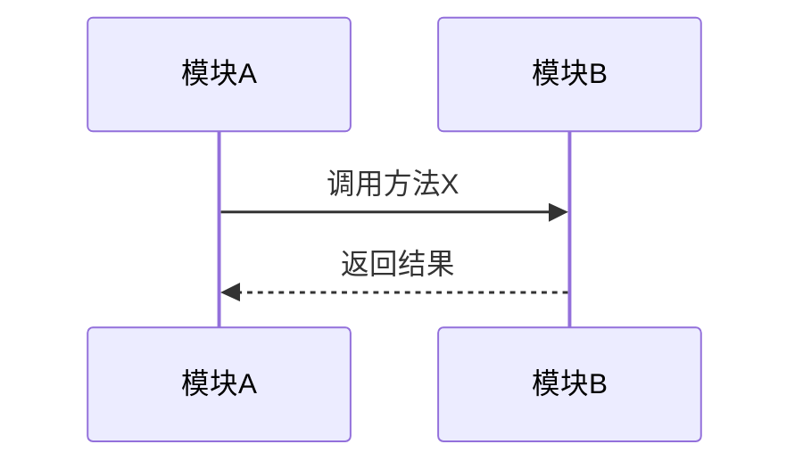

# 知识图谱结构模板

## MD文档结构

```markdown
# {研究对象} 知识图谱

**调研时间**: {日期}
**研究对象**: {研究对象描述}
**信息来源**: {来源类型}

---

## 知识框架（主体）

### 1. 定位
- 属于什么领域/范畴
- 解决什么问题
- 核心价值是什么

### 2. 结构
{根据研究对象类型动态生成}

#### 2.1 如果是代码仓库
| 模块/目录 | 职责 | 关键文件 |
|-----------|------|----------|
| module1 | 职责描述 | file1.py, file2.py |
| module2 | 职责描述 | file3.py, file4.py |

#### 2.2 如果是书籍/文档
| 章节 | 主题 | 核心概念 |
|------|------|----------|
| 第1章 | 主题描述 | 概念1, 概念2 |
| 第2章 | 主题描述 | 概念3, 概念4 |

#### 2.3 如果是概念/技术
| 概念 | 定义 | 关键特征 |
|------|------|----------|
| 概念1 | 定义描述 | 特征1, 特征2 |
| 概念2 | 定义描述 | 特征3, 特征4 |

### 3. 核心要素
{每个模块/章节/概念的核心要素}

---

## 关系层（补充）

### 模块间关系
{按需填充：依赖、调用、数据流等}

#### 依赖关系


#### 调用关系


### 概念间关系
{按需填充：对比、演化、层次等}

#### 概念对比
| 维度 | 概念A | 概念B |
|------|-------|-------|
| 定义 | ... | ... |
| 优点 | ... | ... |
| 缺点 | ... | ... |

---

## 思考层（补充）

### 设计视角
{按需填充：为什么这样设计}

- 设计原则1：...
- 设计原则2：...
- 权衡取舍：...

### 应用视角
{按需填充：怎么用、解决什么问题}

- 使用场景1：...
- 使用场景2：...
- 最佳实践：...

### 演化视角
{按需填充：历史、趋势、替代方案}

- 历史背景：...
- 发展趋势：...
- 替代方案：...

---

## 主题锚点（深入展开）

{用户感兴趣的特定主题的深入内容}

### 主题1：{主题名称}
{深入内容}

### 主题2：{主题名称}
{深入内容}
```

## 内容归类逻辑

当用户提问时，根据问题类型判断落入哪一层：

| 问题类型 | 落入层次 | 示例问题 |
|----------|----------|----------|
| "XX是什么？" | 知识框架 | "DeerFlow是什么？" |
| "XX的结构是什么？" | 知识框架 | "DeerFlow的架构是什么？" |
| "XX和YY有什么关系？" | 关系层 | "DeerFlow和LangGraph有什么关系？" |
| "XX怎么用？" | 思考层（应用视角） | "DeerFlow怎么用？" |
| "为什么这样设计？" | 思考层（设计视角） | "为什么DeerFlow这样设计？" |
| "深入讲讲XX" | 主题锚点 | "深入讲讲DeerFlow的消息机制" |
