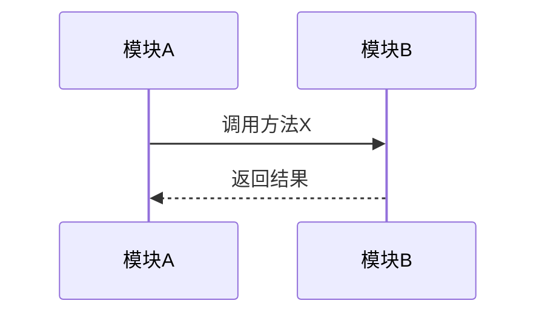

# 知识图谱结构模板

## MD文档结构

```markdown
# {研究对象} 知识图谱

**调研时间**: {日期}
**研究对象**: {研究对象描述}
**信息来源**: {来源类型}

---

## 知识框架（主体）

### 1. 定位
- 属于什么领域/范畴
- 解决什么问题
- 核心价值是什么

### 2. 核心概念解释
{必须先解释所有核心概念，再进入结构分析}

#### 2.1 如果是代码仓库
{解释所有核心类、接口、关键变量}

**格式示例**：
```markdown
#### MessageBus
**定义**：消息总线类，系统中唯一的消息路由中心（单例模式）
**职责**：负责接收、路由和分发消息
**关键字段**：
- `router: Router` - 路由器实例，负责根据消息类型决定目标
- `agents: Dict[str, Agent]` - 已注册的 Agent 字典，key 是 Agent ID

#### Message
**定义**：消息数据类，封装了消息的所有信息
**关键字段**：
- `type: str` - 消息类型（如 "command", "query", "event"）
- `payload: dict` - 消息内容
- `sender: str` - 发送者 Agent ID
```

#### 2.2 如果是书籍/文档
{解释所有关键词、关键句、核心概念}

**格式示例**：
```markdown
#### CQRS（命令查询职责分离）
**定义**：Command Query Responsibility Segregation，一种架构模式，将数据的读操作和写操作分离到不同的模型中
**核心思想**：读模型优化查询性能，写模型保证数据一致性
**重要性**：解决了传统 CRUD 模式在高并发场景下的性能瓶颈
**示例**：电商系统中，商品查询使用缓存（读模型），订单创建使用事务（写模型）
```

#### 2.3 如果是概念/技术
{清晰定义每个概念，包括技术术语的解释}

**格式示例**：
```markdown
#### 微服务架构
**定义**：一种将单一应用程序拆分为一组小型服务的架构风格，每个服务运行在独立进程中，通过轻量级机制（通常是 HTTP API）通信
**核心特征**：
- 服务独立部署和扩展
- 每个服务有独立的数据库
- 服务间松耦合
**与单体架构的区别**：单体架构所有功能在一个进程中，微服务架构每个功能是独立服务
```

### 3. 结构
{根据研究对象类型动态生成，引用已解释的概念}

#### 3.1 如果是代码仓库
| 模块/目录 | 职责 | 关键文件 | 核心类/接口 |
|-----------|------|----------|-------------|
| module1 | 职责描述 | file1.py, file2.py | MessageBus, Router |
| module2 | 职责描述 | file3.py, file4.py | Agent, Message |

#### 3.2 如果是书籍/文档
| 章节 | 主题 | 核心概念 | 关键要点 |
|------|------|----------|----------|
| 第1章 | 主题描述 | CQRS, 事件溯源 | 要点1, 要点2 |
| 第2章 | 主题描述 | 微服务, API网关 | 要点3, 要点4 |

#### 3.3 如果是概念/技术
| 概念 | 定义 | 关键特征 | 应用场景 |
|------|------|----------|----------|
| 概念1 | 定义描述 | 特征1, 特征2 | 场景1, 场景2 |
| 概念2 | 定义描述 | 特征3, 特征4 | 场景3, 场景4 |

### 4. 核心要素
{每个模块/章节/概念的核心要素，引用已解释的概念}

---

## 关系层（补充）

### 模块间关系
{按需填充：依赖、调用、数据流等}

#### 依赖关系


#### 调用关系


### 概念间关系
{按需填充：对比、演化、层次等}

#### 概念对比
| 维度 | 概念A | 概念B |
|------|-------|-------|
| 定义 | ... | ... |
| 优点 | ... | ... |
| 缺点 | ... | ... |

---

## 思考层（补充）

### 设计视角
{按需填充：为什么这样设计}

- 设计原则1：...
- 设计原则2：...
- 权衡取舍：...

### 应用视角
{按需填充：怎么用、解决什么问题}

- 使用场景1：...
- 使用场景2：...
- 最佳实践：...

### 演化视角
{按需填充：历史、趋势、替代方案}

- 历史背景：...
- 发展趋势：...
- 替代方案：...

---

## 主题锚点（深入展开）

{用户感兴趣的特定主题的深入内容}

### 主题1：{主题名称}
{深入内容}

### 主题2：{主题名称}
{深入内容}
```

## 内容归类逻辑

当用户提问时，根据问题类型判断落入哪一层：

| 问题类型 | 落入层次 | 示例问题 |
|----------|----------|----------|
| "XX是什么？" | 知识框架 | "DeerFlow是什么？" |
| "XX的结构是什么？" | 知识框架 | "DeerFlow的架构是什么？" |
| "XX和YY有什么关系？" | 关系层 | "DeerFlow和LangGraph有什么关系？" |
| "XX怎么用？" | 思考层（应用视角） | "DeerFlow怎么用？" |
| "为什么这样设计？" | 思考层（设计视角） | "为什么DeerFlow这样设计？" |
| "深入讲讲XX" | 主题锚点 | "深入讲讲DeerFlow的消息机制" |
