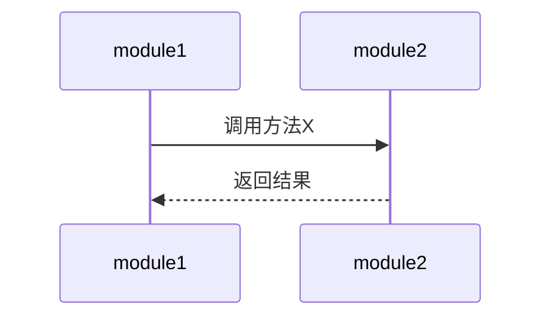
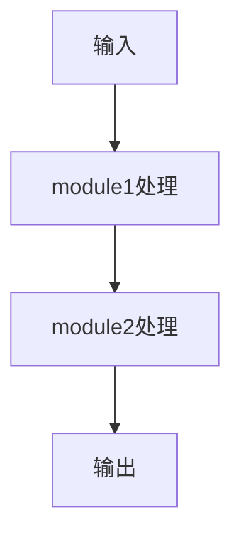

# 调研详细程度参考

## 三级详细程度定义

### 简略级（Quick Overview）

**目标**：快速了解研究对象的核心概念和主要结构

**内容标准**：
- **知识框架**：
  - 定位：简要说明是什么、属于什么领域
  - 结构：主要模块/章节列表（3-5个核心）
  - 核心要素：每个模块的核心功能（1-2句话）

- **关系层**：不包含或仅列出主要依赖关系

- **思考层**：不包含

- **主题锚点**：不包含

**输出特点**：
- MD文档：500-1000 tokens
- HTML：简洁展示，无复杂图表
- 适合快速浏览和初步探索

**示例**：
```markdown
## 知识框架（主体）

### 1. 定位
- 属于什么领域/范畴
- 解决什么问题

### 2. 结构
| 模块 | 职责 |
|------|------|
| module1 | 核心功能描述 |
| module2 | 核心功能描述 |

### 3. 核心要素
- module1：主要做什么
- module2：主要做什么
```

---

### 适中级（Standard Research）

**目标**：全面了解研究对象的结构、要素和基本关系

**内容标准**：
- **知识框架**：
  - 定位：详细说明领域、问题、价值
  - 结构：完整模块/章节列表（5-10个）
  - 核心要素：每个模块的详细职责和关键文件

- **关系层**：
  - 模块间关系：主要依赖和调用关系
  - 概念间关系：基本对比和层次关系

- **思考层**：包含设计视角或应用视角（选择1个）

- **主题锚点**：不包含或仅列出可能的深入方向

**输出特点**：
- MD文档：2000-4000 tokens
- HTML：包含基本图表（Mermaid流程图）
- 适合日常学习和项目了解

**示例**：
```markdown
## 知识框架（主体）

### 1. 定位
- 属于什么领域/范畴
- 解决什么问题
- 核心价值是什么

### 2. 结构
| 模块/目录 | 职责 | 关键文件 |
|-----------|------|----------|
| module1 | 详细职责描述 | file1.py, file2.py |
| module2 | 详细职责描述 | file3.py, file4.py |

### 3. 核心要素
#### module1
- 核心功能：详细描述
- 关键类/函数：列表
- 设计特点：简要说明

## 关系层（补充）

### 模块间关系


## 思考层（补充）

### 设计视角
- 设计原则1：说明
- 设计原则2：说明
```

---

### 详细级（Deep Analysis）

**目标**：深度分析研究对象的各个方面，形成完整的知识图谱

**内容标准**：
- **知识框架**：
  - 定位：全面说明领域、问题、价值、背景
  - 结构：完整模块/章节列表（10+个）
  - 核心要素：每个模块的详细职责、关键文件、内部结构

- **关系层**：
  - 模块间关系：完整的依赖、调用、数据流
  - 概念间关系：详细的对比、演化、层次关系

- **思考层**：
  - 设计视角：为什么这样设计、权衡取舍
  - 应用视角：怎么用、解决什么问题、最佳实践
  - 演化视角：历史、趋势、替代方案

- **主题锚点**：包含1-2个深入展开的主题

**输出特点**：
- MD文档：5000+ tokens
- HTML：包含复杂图表（流程图、序列图、类图）
- 适合深度研究和教学材料

**示例**：
```markdown
## 知识框架（主体）

### 1. 定位
- 属于什么领域/范畴
- 解决什么问题
- 核心价值是什么
- 历史背景

### 2. 结构
| 模块/目录 | 职责 | 关键文件 | 内部结构 |
|-----------|------|----------|----------|
| module1 | 详细职责 | file1.py, file2.py | 子模块列表 |
| module2 | 详细职责 | file3.py, file4.py | 子模块列表 |

### 3. 核心要素
#### module1
- 核心功能：详细描述
- 关键类/函数：详细说明
- 设计特点：深入分析
- 内部架构：子模块关系

## 关系层（补充）

### 模块间关系
#### 依赖关系


#### 调用关系


#### 数据流


### 概念间关系
#### 概念对比
| 维度 | 概念A | 概念B |
|------|-------|-------|
| 定义 | ... | ... |
| 优点 | ... | ... |
| 缺点 | ... | ... |

## 思考层（补充）

### 设计视角
- 设计原则1：详细说明和权衡
- 设计原则2：详细说明和权衡
- 架构决策：为什么选择这种方案

### 应用视角
- 使用场景1：详细说明
- 使用场景2：详细说明
- 最佳实践：具体建议

### 演化视角
- 历史背景：发展历程
- 发展趋势：未来方向
- 替代方案：其他选择

## 主题锚点（深入展开）

### 主题1：{主题名称}
{深入内容，包含示例、代码、图表等}
```

## 详细程度选择指南

| 场景 | 推荐等级 | 原因 |
|------|----------|------|
| 快速了解一个新项目 | 简略 | 节省时间，快速决策 |
| 日常学习和技术调研 | 适中 | 平衡深度和效率 |
| 深度研究和教学准备 | 详细 | 全面分析，形成完整知识体系 |
| 项目交接和文档编写 | 适中-详细 | 需要足够细节 |
| 技术选型和对比分析 | 适中 | 需要结构化信息 |
| 学术研究和论文写作 | 详细 | 需要深入分析和引用 |

## 动态调整建议

**从简略开始**：
- 如果用户不确定需要什么详细程度，建议从简略开始
- 在迭代过程中，根据用户需求逐步加深

**根据反馈调整**：
- 如果用户觉得太简略，升级到适中或详细
- 如果用户觉得太详细，降级到简略或适中

**考虑调研对象**：
- 小型项目：简略或适中
- 大型项目：适中或详细
- 复杂系统：详细
